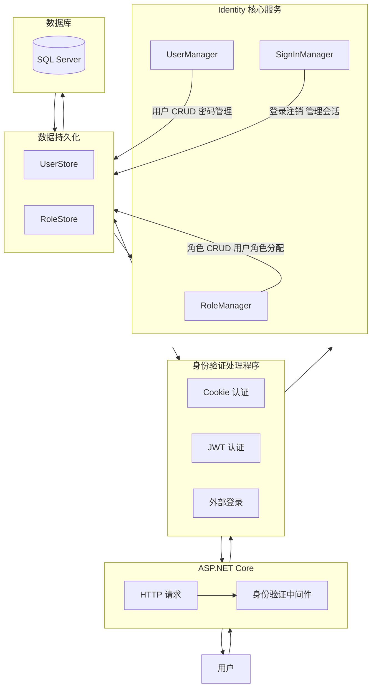

## 一、概述

### 1.1 什么是 ASP.NET Core Identity

ASP.NET Core Identity 是微软官方提供的会员系统框架，用于处理用户认证、授权、密码管理、角色管理、外部登录等功能。它提供了一套完整的 API，支持 Cookie 认证、JWT Bearer 认证、双因素认证、社交账号登录等。

### 1.2 核心能力

| 能力 | 说明 |
| --- | --- |
| 用户管理 | 注册、登录、密码修改、邮箱确认 |
| 角色管理 | 基于角色的授权（RBAC） |
| 声明管理 | 基于声明的授权（Claims-Based） |
| 策略授权 | 基于策略的灵活授权 |
| 外部登录 | Google、Facebook、Microsoft 等第三方登录 |
| 双因素认证 | TOTP 时间码、短信验证码 |
| 密码策略 | 密码复杂度、锁定、过期策略 |
| 令牌管理 | 邮箱确认令牌、密码重置令牌 |
| 数据保护 | 自动加密敏感数据（如双因素密钥） |

### 1.3 架构概览



## 二、快速上手

### 2.1 安装与配置

```xml name="csproj"
<PackageReference Include="Microsoft.AspNetCore.Identity.EntityFrameworkCore" Version="8.0.0" />
```

### 2.2 数据模型

```csharp name="ApplicationUser.cs"
public class ApplicationUser : IdentityUser<Guid>
{
    // 自定义属性
    public string? DisplayName { get; set; }
    public DateTime? LastLoginTime { get; set; }
    public bool IsActive { get; set; } = true;
}
```

### 2.3 数据库上下文

```csharp name="AppDbContext.cs"
public class AppDbContext : IdentityDbContext<ApplicationUser, IdentityRole<Guid>, Guid>
{
    public AppDbContext(DbContextOptions<AppDbContext> options)
        : base(options)
    {
    }

    protected override void OnModelCreating(ModelBuilder builder)
    {
        base.OnModelCreating(builder);

        // 自定义表名（可选）
        builder.Entity<ApplicationUser>().ToTable("Users");
        builder.Entity<IdentityRole<Guid>>().ToTable("Roles");
        builder.Entity<IdentityUserRole<Guid>>().ToTable("UserRoles");
        builder.Entity<IdentityUserClaim<Guid>>().ToTable("UserClaims");
        builder.Entity<IdentityUserLogin<Guid>>().ToTable("UserLogins");
        builder.Entity<IdentityRoleClaim<Guid>>().ToTable("RoleClaims");
        builder.Entity<IdentityUserToken<Guid>>().ToTable("UserTokens");
    }
}
```

### 2.4 服务注册

```csharp name="Program.cs"
builder.Services.AddIdentity<ApplicationUser, IdentityRole<Guid>>(options =>
{
    // === 密码策略 ===
    options.Password.RequireDigit = true;
    options.Password.RequiredLength = 8;
    options.Password.RequireNonAlphanumeric = true;
    options.Password.RequireUppercase = true;
    options.Password.RequireLowercase = true;
    options.Password.RequiredUniqueChars = 2;

    // === 锁定策略 ===
    options.Lockout.DefaultLockoutTimeSpan = TimeSpan.FromMinutes(15);
    options.Lockout.MaxFailedAccessAttempts = 5;
    options.Lockout.AllowedForNewUsers = true;

    // === 用户配置 ===
    options.User.RequireUniqueEmail = true;
    options.User.AllowedUserNameCharacters =
        "abcdefghijklmnopqrstuvwxyzABCDEFGHIJKLMNOPQRSTUVWXYZ0123456789-._@+";

    // === 登录配置 ===
    options.SignIn.RequireConfirmedEmail = true;
    options.SignIn.RequireConfirmedAccount = true;

    // === 令牌生成器 ===
    options.Tokens.EmailConfirmationTokenProvider = "emailconf";
    options.Tokens.PasswordResetTokenProvider = "emailconf";
})
.AddEntityFrameworkStores<AppDbContext>()
.AddDefaultTokenProviders()
.AddTokenProvider<EmailConfirmationTokenProvider<ApplicationUser>>("emailconf");

// 自定义令牌有效期
builder.Services.Configure<EmailConfirmationTokenProviderOptions>(options =>
    options.TokenLifespan = TimeSpan.FromHours(24));
```

## 三、UserManager 核心 API

### 3.1 用户管理

```csharp name="UserManager API"
public class UserService
{
    private readonly UserManager<ApplicationUser> _userManager;

    public UserService(UserManager<ApplicationUser> userManager)
    {
        _userManager = userManager;
    }

    // 创建用户
    public async Task<IdentityResult> CreateUserAsync(string email, string password)
    {
        var user = new ApplicationUser
        {
            UserName = email,
            Email = email,
            DisplayName = email.Split('@')[0],
            CreatedAt = DateTime.UtcNow
        };

        var result = await _userManager.CreateAsync(user, password);
        if (result.Succeeded)
        {
            // 自动分配默认角色
            await _userManager.AddToRoleAsync(user, "User");
        }
        return result;
    }

    // 查找用户（支持多种方式）
    public async Task<ApplicationUser?> FindUserAsync(string identifier)
    {
        // 按 ID 查找
        var byId = await _userManager.FindByIdAsync(identifier);
        if (byId != null) return byId;

        // 按邮箱查找
        var byEmail = await _userManager.FindByEmailAsync(identifier);
        if (byEmail != null) return byEmail;

        // 按用户名查找
        return await _userManager.FindByNameAsync(identifier);
    }

    // 更新用户
    public async Task<IdentityResult> UpdateUserAsync(ApplicationUser user)
    {
        return await _userManager.UpdateAsync(user);
    }

    // 删除用户
    public async Task<IdentityResult> DeleteUserAsync(ApplicationUser user)
    {
        user.IsActive = false; // 软删除
        return await _userManager.UpdateAsync(user);
    }

    // 修改密码
    public async Task<IdentityResult> ChangePasswordAsync(
        ApplicationUser user, string currentPassword, string newPassword)
    {
        return await _userManager.ChangePasswordAsync(user, currentPassword, newPassword);
    }

    // 重置密码（管理员操作）
    public async Task<IdentityResult> ResetPasswordAsync(
        ApplicationUser user, string token, string newPassword)
    {
        return await _userManager.ResetPasswordAsync(user, token, newPassword);
    }

    // 检查密码
    public async Task<bool> CheckPasswordAsync(ApplicationUser user, string password)
    {
        return await _userManager.CheckPasswordAsync(user, password);
    }
}
```

### 3.2 密码哈希

```csharp name="PasswordHasher 详解"
// Identity 默认使用 PBKDF2 + HMAC-SHA256（或 SHA512）
// 密码哈希格式：{版本}{迭代次数}{盐值}{哈希值}

var hasher = new PasswordHasher<ApplicationUser>();

// 哈希密码
string hashed = hasher.HashPassword(user, "MyPassword123!");

// 验证密码
PasswordVerificationResult result = hasher.VerifyHashedPassword(user, hashed, "MyPassword123!");
// 返回: Success / SuccessRehashNeeded / Failed

// 自定义哈希算法
public class CustomPasswordHasher : IPasswordHasher<ApplicationUser>
{
    public string HashPassword(ApplicationUser user, string password)
    {
        // 使用 Argon2id 替代 PBKDF2
        using var argon2 = new Argon2id(Encoding.UTF8.GetBytes(password));
        argon2.Salt = RandomNumberGenerator.GetBytes(16);
        argon2.DegreeOfParallelism = 8;
        argon2.MemorySize = 65536;
        argon2.Iterations = 4;
        return Convert.ToBase64String(argon2.GetBytes(32));
    }

    public PasswordVerificationResult VerifyHashedPassword(
        ApplicationUser user, string hashedPassword, string providedPassword)
    {
        // 实现验证逻辑
        throw new NotImplementedException();
    }
}
```

## 四、SignInManager 认证流程

### 4.1 密码登录

```csharp name="SignInManager API"
public class AuthService
{
    private readonly SignInManager<ApplicationUser> _signInManager;
    private readonly UserManager<ApplicationUser> _userManager;

    public AuthService(
        SignInManager<ApplicationUser> signInManager,
        UserManager<ApplicationUser> userManager)
    {
        _signInManager = signInManager;
        _userManager = userManager;
    }

    public async Task<SignInResult> PasswordSignInAsync(
        string email, string password, bool rememberMe)
    {
        var user = await _userManager.FindByEmailAsync(email);
        if (user == null)
            return SignInResult.Failed;

        // 检查用户是否激活
        if (!user.IsActive)
            return SignInResult.NotAllowed;

        var result = await _signInManager.PasswordSignInAsync(
            user, password, rememberMe, lockoutOnFailure: true);

        if (result.Succeeded)
        {
            user.LastLoginTime = DateTime.UtcNow;
            await _userManager.UpdateAsync(user);
        }

        return result;
    }
}
```

### 4.2 SignInResult 状态码

| 属性 | 含义 | 处理建议 |
| --- | --- | --- |
| `Succeeded` | 登录成功 | 跳转到目标页面 |
| `Failed` | 密码错误或用户不存在 | 提示"用户名或密码错误" |
| `LockedOut` | 账号被锁定 | 显示锁定时间 |
| `NotAllowed` | 不允许登录 | 邮箱未确认 / 账号被禁用 |
| `TwoFactorRequired` | 需要双因素认证 | 跳转到双因素验证页面 |
| `IsNotAllowed` | 账号被禁用 | 联系管理员 |

### 4.3 外部登录（OAuth 2.0）

```csharp name="OAuth 配置"
// 配置外部登录（Microsoft 示例）
builder.Services.AddAuthentication()
    .AddMicrosoftAccount(options =>
    {
        options.ClientId = builder.Configuration["OAuth:Microsoft:ClientId"]!;
        options.ClientSecret = builder.Configuration["OAuth:Microsoft:ClientSecret"]!;
        options.SaveTokens = true;
    })
    .AddGoogle(options =>
    {
        options.ClientId = builder.Configuration["OAuth:Google:ClientId"]!;
        options.ClientSecret = builder.Configuration["OAuth:Google:ClientSecret"]!;
    })
    .AddGitHub(options =>
    {
        options.ClientId = builder.Configuration["OAuth:GitHub:ClientId"]!;
        options.ClientSecret = builder.Configuration["OAuth:GitHub:ClientSecret"]!;
    });
```

```csharp name="外部登录回调"
public async Task<IActionResult> ExternalLoginCallback(string returnUrl = "/")
{
    var info = await _signInManager.GetExternalLoginInfoAsync();
    if (info == null)
        return RedirectToAction("Login");

    // 尝试用外部登录信息直接登录
    var result = await _signInManager.ExternalLoginSignInAsync(
        info.LoginProvider, info.ProviderKey, isPersistent: false);

    if (result.Succeeded)
        return LocalRedirect(returnUrl);

    // 首次登录：创建本地账户并关联
    var email = info.Principal.FindFirstValue(ClaimTypes.Email);
    var user = await _userManager.FindByEmailAsync(email);

    if (user == null)
    {
        user = new ApplicationUser
        {
            UserName = email,
            Email = email,
            EmailConfirmed = true // 外部登录默认已验证
        };
        await _userManager.CreateAsync(user);
    }

    await _userManager.AddLoginAsync(user, info);
    await _signInManager.SignInAsync(user, isPersistent: false);
    return LocalRedirect(returnUrl);
}
```

## 五、角色与权限

### 5.1 角色管理

```csharp name="RoleManager API"
public class RoleService
{
    private readonly RoleManager<IdentityRole<Guid>> _roleManager;
    private readonly UserManager<ApplicationUser> _userManager;

    public RoleService(
        RoleManager<IdentityRole<Guid>> roleManager,
        UserManager<ApplicationUser> userManager)
    {
        _roleManager = roleManager;
        _userManager = userManager;
    }

    // 创建角色
    public async Task<IdentityResult> CreateRoleAsync(string roleName)
    {
        if (!await _roleManager.RoleExistsAsync(roleName))
        {
            return await _roleManager.CreateAsync(new IdentityRole<Guid>(roleName));
        }
        return IdentityResult.Success;
    }

    // 为用户分配角色
    public async Task AssignRoleAsync(Guid userId, string roleName)
    {
        var user = await _userManager.FindByIdAsync(userId.ToString());
        if (user != null && !await _userManager.IsInRoleAsync(user, roleName))
        {
            await _userManager.AddToRoleAsync(user, roleName);
        }
    }

    // 获取用户所有角色
    public async Task<IList<string>> GetUserRolesAsync(Guid userId)
    {
        var user = await _userManager.FindByIdAsync(userId.ToString());
        return user != null ? await _userManager.GetRolesAsync(user) : new List<string>();
    }

    // 获取角色下所有用户
    public async Task<IList<ApplicationUser>> GetUsersInRoleAsync(string roleName)
    {
        return await _userManager.GetUsersInRoleAsync(roleName);
    }
}
```

### 5.2 声明（Claims）

```csharp name="Claims 管理"
public class ClaimsService
{
    private readonly UserManager<ApplicationUser> _userManager;

    public async Task AddClaimsAsync(ApplicationUser user)
    {
        var claims = new List<Claim>
        {
            new("DisplayName", user.DisplayName ?? ""),
            new("Email", user.Email ?? ""),
            new("Permission", "article.read"),
            new("Permission", "article.write"),
            new("Permission", "article.delete"),
            new("Department", "Engineering"),
            new("Level", "Senior")
        };

        await _userManager.AddClaimsAsync(user, claims);
    }

    public async Task<bool> HasPermissionAsync(
        ApplicationUser user, string permission)
    {
        var claims = await _userManager.GetClaimsAsync(user);
        return claims.Any(c => c.Type == "Permission" && c.Value == permission);
    }
}
```

### 5.3 策略授权

```csharp name="策略配置"
// 注册策略
builder.Services.AddAuthorization(options =>
{
    // 基于角色的策略
    options.AddPolicy("RequireAdmin", policy =>
        policy.RequireRole("Admin"));

    // 基于声明的策略
    options.AddPolicy("CanWriteArticle", policy =>
        policy.RequireClaim("Permission", "article.write"));

    // 基于邮箱域名的策略
    options.AddPolicy("CompanyEmail", policy =>
        policy.RequireAssertion(context =>
            context.User.HasClaim(c =>
                c.Type == ClaimTypes.Email &&
                c.Value.EndsWith("@company.com"))));

    // 组合策略
    options.AddPolicy("SeniorWriter", policy =>
    {
        policy.RequireClaim("Permission", "article.write");
        policy.RequireClaim("Level", "Senior");
    });

    // 自定义授权处理器
    options.AddPolicy("AtLeast18", policy =>
        policy.Requirements.Add(new MinimumAgeRequirement(18)));
});
```

```csharp name="授权使用"
[Authorize(Roles = "Admin")]
public class AdminController : Controller
{
    // 只有 Admin 角色能访问
}

[Authorize(Policy = "CanWriteArticle")]
public class ArticleController : Controller
{
    [Authorize(Policy = "SeniorWriter")]
    public IActionResult Publish()
    {
        // 需要 Senior 级别的写作者
    }

    // 在代码中手动检查
    public async Task<IActionResult> Edit(int id)
    {
        var authResult = await _authorizationService
            .AuthorizeAsync(User, "CanWriteArticle");
        if (!authResult.Succeeded)
            return Forbid();
        // ...
    }
}
```

## 六、JWT 认证

### 6.1 配置 JWT

```csharp name="JWT 配置"
builder.Services.AddAuthentication(options =>
{
    options.DefaultAuthenticateScheme = JwtBearerDefaults.AuthenticationScheme;
    options.DefaultChallengeScheme = JwtBearerDefaults.AuthenticationScheme;
})
.AddJwtBearer(options =>
{
    options.TokenValidationParameters = new TokenValidationParameters
    {
        ValidateIssuer = true,
        ValidateAudience = true,
        ValidateLifetime = true,
        ValidateIssuerSigningKey = true,
        ValidIssuer = builder.Configuration["Jwt:Issuer"],
        ValidAudience = builder.Configuration["Jwt:Audience"],
        IssuerSigningKey = new SymmetricSecurityKey(
            Encoding.UTF8.GetBytes(builder.Configuration["Jwt:Key"]!))
    };

    // 从 Cookie 中提取 JWT（可选）
    options.Events = new JwtBearerEvents
    {
        OnMessageReceived = context =>
        {
            context.Token = context.Request.Cookies["access_token"];
            return Task.CompletedTask;
        }
    };
});
```

### 6.2 生成 Token

```csharp name="Token 生成"
public class TokenService
{
    private readonly IConfiguration _config;
    private readonly UserManager<ApplicationUser> _userManager;

    public async Task<string> GenerateJwtTokenAsync(ApplicationUser user)
    {
        var claims = new List<Claim>
        {
            new(ClaimTypes.NameIdentifier, user.Id.ToString()),
            new(ClaimTypes.Name, user.UserName ?? ""),
            new(ClaimTypes.Email, user.Email ?? ""),
            new(JwtRegisteredClaimNames.Jti, Guid.NewGuid().ToString()),
            new(JwtRegisteredClaimNames.Iat,
                DateTimeOffset.UtcNow.ToUnixTimeSeconds().ToString())
        };

        // 添加角色
        var roles = await _userManager.GetRolesAsync(user);
        claims.AddRange(roles.Select(r => new Claim(ClaimTypes.Role, r)));

        // 添加自定义声明
        var userClaims = await _userManager.GetClaimsAsync(user);
        claims.AddRange(userClaims);

        var key = new SymmetricSecurityKey(
            Encoding.UTF8.GetBytes(_config["Jwt:Key"]!));
        var credentials = new SigningCredentials(key, SecurityAlgorithms.HmacSha256);

        var token = new JwtSecurityToken(
            issuer: _config["Jwt:Issuer"],
            audience: _config["Jwt:Audience"],
            claims: claims,
            expires: DateTime.UtcNow.AddHours(1),
            signingCredentials: credentials
        );

        return new JwtSecurityTokenHandler().WriteToken(token);
    }

    // 生成 Refresh Token
    public string GenerateRefreshToken()
    {
        var randomBytes = RandomNumberGenerator.GetBytes(64);
        return Convert.ToBase64String(randomBytes);
    }
}
```

### 6.3 双 Token 刷新机制

```csharp name="Token 刷新"
[HttpPost("refresh")]
public async Task<IActionResult> RefreshToken([FromBody] RefreshRequest request)
{
    // 验证过期 Access Token
    var principal = GetPrincipalFromExpiredToken(request.AccessToken);
    if (principal == null)
        return Unauthorized("Invalid access token");

    var userId = principal.FindFirstValue(ClaimTypes.NameIdentifier);
    var user = await _userManager.FindByIdAsync(userId!);
    if (user == null)
        return Unauthorized("User not found");

    // 验证 Refresh Token
    var storedToken = await _userManager.GetAuthenticationTokenAsync(
        user, "MyApp", "RefreshToken");

    if (storedToken != request.RefreshToken)
        return Unauthorized("Invalid refresh token");

    // 生成新 Token
    var newAccessToken = await _tokenService.GenerateJwtTokenAsync(user);
    var newRefreshToken = _tokenService.GenerateRefreshToken();

    // 更新 Refresh Token
    await _userManager.SetAuthenticationTokenAsync(
        user, "MyApp", "RefreshToken", newRefreshToken);

    return Ok(new
    {
        accessToken = newAccessToken,
        refreshToken = newRefreshToken
    });
}
```

## 七、双因素认证（2FA）

### 7.1 启用 TOTP

```csharp name="TOTP 配置"
public class TwoFactorService
{
    private readonly UserManager<ApplicationUser> _userManager;

    // 生成密钥和二维码 URI
    public async Task<string> GenerateTOTPUriAsync(ApplicationUser user)
    {
        var key = await _userManager.GetAuthenticatorKeyAsync(user);
        if (string.IsNullOrEmpty(key))
        {
            await _userManager.ResetAuthenticatorKeyAsync(user);
            key = await _userManager.GetAuthenticatorKeyAsync(user);
        }

        return $"otpauth://totp/MyApp:{user.Email}?secret={key}&issuer=MyApp";
    }

    // 验证 TOTP 码
    public async Task<bool> VerifyTOTPAsync(ApplicationUser user, string code)
    {
        return await _userManager.VerifyTwoFactorTokenAsync(
            user, TokenOptions.DefaultAuthenticatorProvider, code);
    }

    // 启用 2FA
    public async Task<IdentityResult> EnableTwoFactorAsync(ApplicationUser user, string code)
    {
        var isValid = await VerifyTOTPAsync(user, code);
        if (!isValid)
            return IdentityResult.Failed(
                new IdentityError { Description = "验证码无效" });

        return await _userManager.SetTwoFactorEnabledAsync(user, true);
    }
}
```

### 7.2 恢复码

```csharp name="生成恢复码"
public async Task<IEnumerable<string>> GenerateRecoveryCodesAsync(ApplicationUser user)
{
    var codes = await _userManager.GenerateNewTwoFactorRecoveryCodesAsync(user, 10);
    return codes ?? Enumerable.Empty<string>();
}

// 使用恢复码登录
public async Task<SignInResult> TwoFactorRecoveryCodeSignInAsync(string recoveryCode)
{
    return await _signInManager.TwoFactorRecoveryCodeSignInAsync(recoveryCode);
}
```

## 八、邮箱确认与密码重置

### 8.1 邮箱确认流程

```csharp name="邮箱确认"
public class EmailConfirmationService
{
    private readonly UserManager<ApplicationUser> _userManager;
    private readonly IEmailSender _emailSender;

    public async Task SendConfirmationEmailAsync(ApplicationUser user)
    {
        var token = await _userManager.GenerateEmailConfirmationTokenAsync(user);
        var encodedToken = WebEncoders.Base64UrlEncode(Encoding.UTF8.GetBytes(token));
        var callbackUrl = $"https://example.com/confirm-email?userId={user.Id}&token={encodedToken}";

        await _emailSender.SendEmailAsync(user.Email!, "确认邮箱",
            $"请点击链接确认您的邮箱：<a href='{callbackUrl}'>确认邮箱</a>");
    }

    public async Task<IdentityResult> ConfirmEmailAsync(Guid userId, string encodedToken)
    {
        var user = await _userManager.FindByIdAsync(userId.ToString());
        if (user == null)
            return IdentityResult.Failed(
                new IdentityError { Description = "用户不存在" });

        var token = Encoding.UTF8.GetString(WebEncoders.Base64UrlDecode(encodedToken));
        return await _userManager.ConfirmEmailAsync(user, token);
    }
}
```

### 8.2 密码重置流程

```csharp name="密码重置"
public async Task SendPasswordResetEmailAsync(string email)
{
    var user = await _userManager.FindByEmailAsync(email);

    // 安全提示：无论用户是否存在，都返回相同信息
    if (user == null || !await _userManager.IsEmailConfirmedAsync(user))
        return;

    var token = await _userManager.GeneratePasswordResetTokenAsync(user);
    var encodedToken = WebEncoders.Base64UrlEncode(Encoding.UTF8.GetBytes(token));
    var resetUrl = $"https://example.com/reset-password?userId={user.Id}&token={encodedToken}";

    await _emailSender.SendEmailAsync(email, "重置密码",
        $"请点击链接重置密码：<a href='{resetUrl}'>重置密码</a>");
}
```

## 九、自定义存储提供程序

### 9.1 不使用 EF Core

```csharp name="自定义 UserStore"
public class CustomUserStore :
    IUserStore<ApplicationUser>,
    IUserPasswordStore<ApplicationUser>,
    IUserEmailStore<ApplicationUser>,
    IUserRoleStore<ApplicationUser>,
    IUserClaimStore<ApplicationUser>
{
    private readonly IDbConnection _db;

    public CustomUserStore(IDbConnection db)
    {
        _db = db;
    }

    public async Task<ApplicationUser?> FindByIdAsync(string userId, CancellationToken ct)
    {
        return await _db.QuerySingleOrDefaultAsync<ApplicationUser>(
            "SELECT * FROM Users WHERE Id = @Id", new { Id = userId });
    }

    public async Task<ApplicationUser?> FindByNameAsync(string normalizedUserName, CancellationToken ct)
    {
        return await _db.QuerySingleOrDefaultAsync<ApplicationUser>(
            "SELECT * FROM Users WHERE NormalizedUserName = @Name",
            new { Name = normalizedUserName });
    }

    public async Task<IdentityResult> CreateAsync(ApplicationUser user, CancellationToken ct)
    {
        await _db.ExecuteAsync(
            @"INSERT INTO Users (Id, UserName, NormalizedUserName, Email, NormalizedEmail,
              PasswordHash, SecurityStamp, ConcurrencyStamp)
              VALUES (@Id, @UserName, @NormalizedUserName, @Email, @NormalizedEmail,
              @PasswordHash, @SecurityStamp, @ConcurrencyStamp)", user);
        return IdentityResult.Success;
    }

    // 需要实现 IUserStore、IUserPasswordStore、IUserEmailStore 等接口的所有方法
    // 此处省略其他方法实现...
}
```

```csharp name="注册自定义存储"
builder.Services.AddIdentity<ApplicationUser, IdentityRole<Guid>>()
    .AddUserStore<CustomUserStore>()
    .AddRoleStore<CustomRoleStore>()
    .AddDefaultTokenProviders();
```

## 十、安全最佳实践

### 10.1 密码策略

| 策略 | 推荐值 | 说明 |
| --- | --- | --- |
| 最小长度 | 8-12 字符 | 越长越安全 |
| 必须包含数字 | ✓ | 提高复杂度 |
| 必须包含大小写 | ✓ | 提高复杂度 |
| 必须包含特殊字符 | ✓ | 提高复杂度 |
| 唯一字符数 | ≥ 2 | 防止重复字符 |
| 锁定次数 | 5 次 | 防止暴力破解 |
| 锁定时间 | 15-30 分钟 | 平衡安全与体验 |
| 密码历史 | 3-5 个 | 防止重复使用 |

### 10.2 Token 安全

```csharp name="安全配置"
builder.Services.Configure<DataProtectionTokenProviderOptions>(options =>
{
    // 令牌有效期（默认 1 天）
    options.TokenLifespan = TimeSpan.FromHours(2);
});

// Cookie 安全配置
builder.Services.ConfigureApplicationCookie(options =>
{
    options.Cookie.HttpOnly = true;           // 防止 XSS 读取 Cookie
    options.Cookie.SecurePolicy = CookieSecurePolicy.Always; // 仅 HTTPS
    options.Cookie.SameSite = SameSiteMode.Strict; // 防止 CSRF
    options.ExpireTimeSpan = TimeSpan.FromHours(1); // 过期时间
    options.SlidingExpiration = true;          // 滑动过期
    options.LoginPath = "/Account/Login";
    options.AccessDeniedPath = "/Account/AccessDenied";
});
```

### 10.3 防暴力破解

```csharp name="限流中间件"
public class RateLimitingMiddleware
{
    private static readonly ConcurrentDictionary<string, RateLimitEntry> _cache = new();

    public async Task InvokeAsync(HttpContext context)
    {
        var clientIp = context.Connection.RemoteIpAddress?.ToString() ?? "unknown";
        var key = $"{clientIp}:{context.Request.Path}";

        var entry = _cache.GetOrAdd(key, _ => new RateLimitEntry
        {
            Count = 0,
            WindowStart = DateTime.UtcNow
        });

        if (DateTime.UtcNow - entry.WindowStart > TimeSpan.FromMinutes(1))
        {
            entry.Count = 0;
            entry.WindowStart = DateTime.UtcNow;
        }

        entry.Count++;

        if (entry.Count > 10) // 每分钟最多 10 次请求
        {
            context.Response.StatusCode = 429;
            await context.Response.WriteAsync("Too many requests");
            return;
        }

        await _next(context);
    }
}
```

### 10.4 安全清单

```text
Identity 安全清单

✓ 使用 HTTPS 传输（生产环境强制）
✓ 设置 Cookie 为 HttpOnly + Secure + SameSite
✓ 密码哈希使用 PBKDF2（不可逆）
✓ 限制登录失败次数（锁定机制）
✓ 邮箱确认后才允许登录
✓ 密码重置令牌短期有效（1-2小时）
✓ Refresh Token 可撤销（存数据库）
✓ JWT 有效期短（15-60分钟）
✓ 双因素认证用于敏感操作
✓ 定期轮换签名密钥
✓ 日志记录所有认证事件
✓ 不使用默认密码
✓ 敏感数据加密存储（Data Protection API）
```

## 十一、常见问题

### 11.1 迁移现有用户

```csharp
// 从旧系统迁移用户（密码使用 MD5 或 SHA1）
public async Task MigrateUserAsync(string email, string oldPasswordHash)
{
    var user = new ApplicationUser
    {
        UserName = email,
        Email = email,
        // 使用自定义迁移标记
        SecurityStamp = "MIGRATED:" + oldPasswordHash
    };

    // 先用随机密码创建
    await _userManager.CreateAsync(user, Guid.NewGuid().ToString());

    // 直接更新 PasswordHash 字段
    user.PasswordHash = "MIGRATED:" + oldPasswordHash;
    await _userManager.UpdateAsync(user);
}

// 登录时检查是否需要升级哈希
public async Task<bool> CheckAndUpgradePasswordAsync(
    ApplicationUser user, string password)
{
    if (user.PasswordHash?.StartsWith("MIGRATED:") == true)
    {
        var oldHash = user.PasswordHash[9..];
        if (VerifyOldHash(password, oldHash))
        {
            // 升级到 Identity 标准哈希
            var newHash = _passwordHasher.HashPassword(user, password);
            user.PasswordHash = newHash;
            await _userManager.UpdateAsync(user);
            return true;
        }
        return false;
    }

    return await _userManager.CheckPasswordAsync(user, password);
}
```

### 11.2 多租户扩展

```csharp
public class MultiTenantUser : IdentityUser<Guid>
{
    public Guid TenantId { get; set; }
    public bool IsTenantAdmin { get; set; }
}

// 多租户过滤器
public class TenantFilter : IAsyncActionFilter
{
    public async Task OnActionExecutionAsync(
        ActionExecutingContext context, ActionExecutionDelegate next)
    {
        var tenantId = context.HttpContext.User
            .FindFirstValue("TenantId");

        if (string.IsNullOrEmpty(tenantId))
        {
            context.Result = new UnauthorizedResult();
            return;
        }

        context.HttpContext.Items["TenantId"] = tenantId;
        await next();
    }
}
```

## 总结

ASP.NET Core Identity 是一个功能完备的认证授权框架，核心要点：

1. **UserManager** 负责用户 CRUD 操作，**SignInManager** 负责认证流程
2. 默认使用 **EF Core** 存储，但可完全替换为自定义存储
3. 支持 **Cookie + JWT** 双认证方案，适用于前后端分离和传统 MVC
4. **角色 + 声明 + 策略** 三级授权，满足从简单到复杂的权限需求
5. 内置 **双因素认证**、**外部登录**、**邮箱确认** 等完整安全机制
6. 生产环境务必遵循安全最佳实践，特别是 HTTPS、Cookie 保护和令牌管理