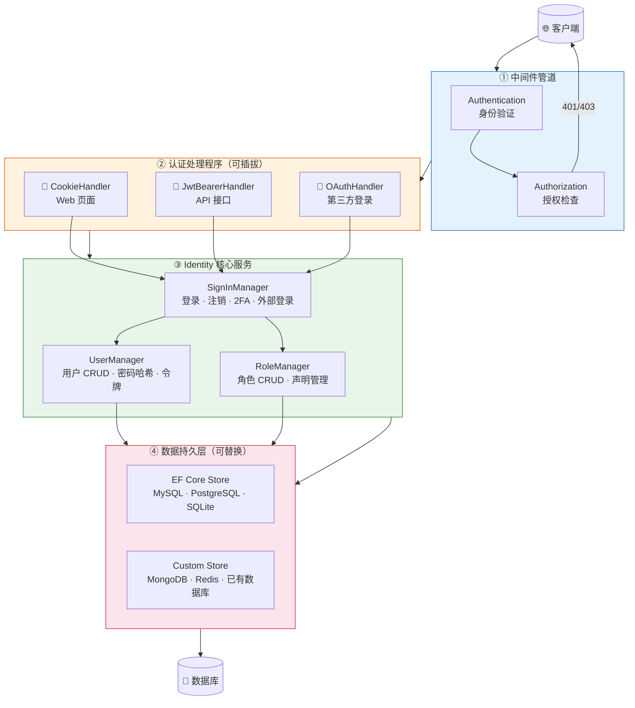
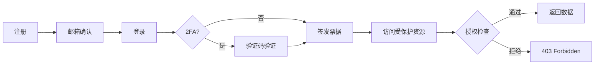

## 一、概述

### 1.1 什么是 ASP.NET Core Identity

ASP.NET Core Identity 是微软官方的会员系统框架，处理用户认证、授权、密码管理、角色、外部登录等。它不是简单的登录组件，而是一套**可扩展的身份基础设施**——从默认的 Entity Framework 存储到完全自定义的 UserStore，从 Cookie 认证到 JWT 无状态令牌，都能灵活组合。

### 1.2 核心能力

| 能力 | 说明 |
| --- | --- |
| 用户管理 | 注册、登录、密码修改、邮箱确认、手机验证 |
| 角色管理 | 基于角色的授权（RBAC） |
| 声明管理 | 基于声明的授权（Claims-Based） |
| 策略授权 | 基于策略的灵活授权（Policy-Based） |
| 外部登录 | Google、GitHub、Microsoft 等第三方登录 |
| 双因素认证 | TOTP 验证器、短信验证码 |
| 密码策略 | 复杂度、锁定、过期、历史记录 |
| 令牌管理 | 邮箱确认令牌、密码重置令牌、2FA 恢复码 |
| 数据保护 | 自动加密敏感数据（如双因素密钥） |

### 1.3 架构概览



**关键理解**：Identity 的核心不是某个 Manager，而是**中间件 → 处理程序 → 服务 → 存储**这条链路。中间件负责拦截请求，处理程序负责读写认证票据，服务层封装业务逻辑，存储层负责持久化。每一层都可以替换。

## 二、快速上手

### 2.1 安装

```xml name="csproj 依赖"
<PackageReference Include="Microsoft.AspNetCore.Identity.EntityFrameworkCore" Version="8.0.0" />
<PackageReference Include="Pomelo.EntityFrameworkCore.MySql" Version="8.0.0" />
```

### 2.2 数据模型

```csharp name="ApplicationUser.cs"
public class ApplicationUser : IdentityUser<Guid>
{
    public string? DisplayName { get; set; }
    public DateTime CreatedAt { get; set; } = DateTime.UtcNow;
    public DateTime? LastLoginTime { get; set; }
    public bool IsActive { get; set; } = true;
}
```

> **为什么用 `Guid` 而不是默认的 `string`？** 默认的 `IdentityUser` 主键是 `string`（存的是 GUID 的字符串形式），用 `Guid` 类型可以减少存储空间、提高索引性能，且在 API 中更自然。

### 2.3 数据库上下文

```csharp name="AppDbContext.cs"
public class AppDbContext : IdentityDbContext<ApplicationUser, IdentityRole<Guid>, Guid>
{
    public AppDbContext(DbContextOptions<AppDbContext> options) : base(options) { }

    protected override void OnModelCreating(ModelBuilder builder)
    {
        base.OnModelCreating(builder);

        // 自定义表名，去掉默认的 AspNet 前缀
        builder.Entity<ApplicationUser>().ToTable("Users");
        builder.Entity<IdentityRole<Guid>>().ToTable("Roles");
        builder.Entity<IdentityUserRole<Guid>>().ToTable("UserRoles");
        builder.Entity<IdentityUserClaim<Guid>>().ToTable("UserClaims");
        builder.Entity<IdentityUserLogin<Guid>>().ToTable("UserLogins");
        builder.Entity<IdentityRoleClaim<Guid>>().ToTable("RoleClaims");
        builder.Entity<IdentityUserToken<Guid>>().ToTable("UserTokens");
    }
}
```

### 2.4 服务注册

```csharp name="Program.cs"
builder.Services.AddDbContext<AppDbContext>(options =>
    options.UseMySql(builder.Configuration.GetConnectionString("Default"),
        ServerVersion.AutoDetect(builder.Configuration.GetConnectionString("Default"))));

builder.Services.AddIdentity<ApplicationUser, IdentityRole<Guid>>(options =>
{
    // 密码策略
    options.Password.RequireDigit = true;
    options.Password.RequiredLength = 8;
    options.Password.RequireNonAlphanumeric = true;
    options.Password.RequireUppercase = true;
    options.Password.RequireLowercase = true;

    // 锁定策略
    options.Lockout.DefaultLockoutTimeSpan = TimeSpan.FromMinutes(15);
    options.Lockout.MaxFailedAccessAttempts = 5;
    options.Lockout.AllowedForNewUsers = true;

    // 用户配置
    options.User.RequireUniqueEmail = true;

    // 登录配置
    options.SignIn.RequireConfirmedEmail = true;
    options.SignIn.RequireConfirmedAccount = true;
})
.AddEntityFrameworkStores<AppDbContext>()
.AddDefaultTokenProviders();
```

### 2.5 数据库迁移

```bash name="迁移命令"
# 创建迁移
dotnet ef migrations add InitialIdentity

# 更新数据库
dotnet ef database update

# 回滚到指定迁移
dotnet ef database update InitialCreate

# 删除最后一次迁移（未应用到数据库时）
dotnet ef migrations remove
```

> **踩坑提醒**：如果自定义了 `Guid` 主键，迁移生成的表结构与默认 `string` 主键不同。已有项目切换主键类型需要**新建迁移**，不能直接修改。

## 三、端到端实战：从注册到授权

这是理解 Identity 最重要的一节——把零散的 API 串成一条完整的用户生命周期。



### 3.1 注册流程

```csharp name="注册接口"
[HttpPost("register")]
public async Task<IActionResult> Register(RegisterRequest request)
{
    var user = new ApplicationUser
    {
        UserName = request.Email,
        Email = request.Email,
        DisplayName = request.DisplayName
    };

    var result = await _userManager.CreateAsync(user, request.Password);
    if (!result.Succeeded)
        return BadRequest(result.Errors.ToDictionary(e => e.Code, e => e.Description));

    // 生成邮箱确认令牌
    var token = await _userManager.GenerateEmailConfirmationTokenAsync(user);
    var callbackUrl = Url.Action("ConfirmEmail", "Account",
        new { userId = user.Id, token }, Request.Scheme);

    // 发送确认邮件（实际项目中用后台任务）
    await _emailService.SendConfirmationAsync(user.Email, callbackUrl!);

    // 分配默认角色
    await _userManager.AddToRoleAsync(user, "User");

    return Ok(new { message = "注册成功，请查收确认邮件" });
}
```

### 3.2 邮箱确认

```csharp name="邮箱确认"
[HttpGet("confirm-email")]
public async Task<IActionResult> ConfirmEmail(string userId, string token)
{
    var user = await _userManager.FindByIdAsync(userId);
    if (user == null) return NotFound("用户不存在");

    var result = await _userManager.ConfirmEmailAsync(user, token);
    if (!result.Succeeded)
        return BadRequest("确认失败，令牌可能已过期");

    return Ok("邮箱确认成功");
}
```

> **令牌有效期**：默认的邮箱确认令牌有效期为 1 天。可以通过自定义 `TokenProvider` 调整：

```csharp name="自定义令牌有效期"
// 注册时添加自定义令牌提供器
.AddTokenProvider<DataProtectorTokenProvider<ApplicationUser>>("emailconf");

// 配置有效期
builder.Services.Configure<DataProtectorTokenProviderOptions>(options =>
    options.TokenLifespan = TimeSpan.FromHours(24));
```

### 3.3 登录与签发票据

```csharp name="登录接口"
[HttpPost("login")]
public async Task<IActionResult> Login(LoginRequest request)
{
    var user = await _userManager.FindByEmailAsync(request.Email);
    if (user == null || !user.IsActive)
        return Unauthorized("用户名或密码错误"); // 不要透露具体原因

    var result = await _signInManager.PasswordSignInAsync(
        user, request.Password, request.RememberMe, lockoutOnFailure: true);

    if (result.IsLockedOut)
        return StatusCode(423, $"账号已锁定，解锁时间：{user.LockoutEnd:yyyy-MM-dd HH:mm}");

    if (result.IsNotAllowed)
        return Unauthorized("请先确认邮箱");

    if (result.RequiresTwoFactor)
        return Ok(new { requires2FA = true, userId = user.Id });

    if (!result.Succeeded)
        return Unauthorized("用户名或密码错误");

    return Ok(new { message = "登录成功" });
}
```

## 四、UserManager 核心 API

### 4.1 用户 CRUD

```csharp name="UserService.cs"
public class UserService
{
    private readonly UserManager<ApplicationUser> _userManager;

    public UserService(UserManager<ApplicationUser> userManager)
        => _userManager = userManager;

    // 创建用户
    public async Task<IdentityResult> CreateAsync(string email, string password)
    {
        var user = new ApplicationUser
        {
            UserName = email,
            Email = email,
            DisplayName = email.Split('@')[0]
        };
        return await _userManager.CreateAsync(user, password);
    }

    // 多方式查找
    public async Task<ApplicationUser?> FindAsync(string identifier)
    {
        return await _userManager.FindByIdAsync(identifier)
            ?? await _userManager.FindByEmailAsync(identifier)
            ?? await _userManager.FindByNameAsync(identifier);
    }

    // 更新用户
    public async Task<IdentityResult> UpdateAsync(ApplicationUser user)
        => await _userManager.UpdateAsync(user);

    // 软删除
    public async Task<IdentityResult> SoftDeleteAsync(ApplicationUser user)
    {
        user.IsActive = false;
        return await _userManager.UpdateAsync(user);
    }
}
```

### 4.2 密码管理

```csharp name="密码操作"
// 修改密码（用户自己操作，需要旧密码）
await _userManager.ChangePasswordAsync(user, oldPassword, newPassword);

// 重置密码（忘记密码场景，需要令牌）
var token = await _userManager.GeneratePasswordResetTokenAsync(user);
await _userManager.ResetPasswordAsync(user, token, newPassword);

// 验证密码（不触发登录）
await _userManager.CheckPasswordAsync(user, password);

// 检查是否有过密码（首次登录可能需要强制修改）
await _userManager.HasPasswordAsync(user);
```

### 4.3 密码哈希原理

Identity 默认使用 **PBKDF2 + HMAC-SHA256**，格式为 `{版本号}{迭代次数}{盐值}{哈希值}`。

```csharp name="自定义密码哈希（Argon2id）"
public class Argon2PasswordHasher : IPasswordHasher<ApplicationUser>
{
    public string HashPassword(ApplicationUser user, string password)
    {
        using var argon2 = new Argon2id(Encoding.UTF8.GetBytes(password));
        argon2.Salt = RandomNumberGenerator.GetBytes(16);
        argon2.DegreeOfParallelism = 8;
        argon2.MemorySize = 65536; // 64 MB
        argon2.Iterations = 4;
        var hash = argon2.GetBytes(32);
        return $"ARGON2ID${Convert.ToBase64String(argon2.Salt)}${Convert.ToBase64String(hash)}";
    }

    public PasswordVerificationResult VerifyHashedPassword(
        ApplicationUser user, string hashedPassword, string providedPassword)
    {
        var parts = hashedPassword.Split('$');
        if (parts.Length != 3 || parts[0] != "ARGON2ID")
            return PasswordVerificationResult.Failed;

        var salt = Convert.FromBase64String(parts[1]);
        var expectedHash = Convert.FromBase64String(parts[2]);

        using var argon2 = new Argon2id(Encoding.UTF8.GetBytes(providedPassword));
        argon2.Salt = salt;
        argon2.DegreeOfParallelism = 8;
        argon2.MemorySize = 65536;
        argon2.Iterations = 4;
        var actualHash = argon2.GetBytes(32);

        return actualHash.SequenceEqual(expectedHash)
            ? PasswordVerificationResult.Success
            : PasswordVerificationResult.Failed;
    }
}

// 注册替换
builder.Services.AddScoped<IPasswordHasher<ApplicationUser>, Argon2PasswordHasher>();
```

> **注意**：切换哈希算法后，旧密码无法验证。生产环境需要**渐进式迁移**——先用旧算法验证，通过后用新算法重新哈希。

## 五、SignInManager 认证流程

### 5.1 SignInResult 状态

| 状态 | 含义 | 典型处理 |
| --- | --- | --- |
| `Succeeded` | 登录成功 | 跳转目标页 |
| `Failed` | 密码错误 | 提示"用户名或密码错误" |
| `LockedOut` | 账号锁定 | 显示解锁时间 |
| `NotAllowed` | 不允许登录 | 提示确认邮箱 |
| `RequiresTwoFactor` | 需要 2FA | 跳转验证页 |

### 5.2 外部登录（OAuth）

```csharp name="OAuth 配置"
builder.Services.AddAuthentication()
    .AddGoogle(options =>
    {
        options.ClientId = config["OAuth:Google:ClientId"]!;
        options.ClientSecret = config["OAuth:Google:ClientSecret"]!;
    })
    .AddGitHub(options =>
    {
        options.ClientId = config["OAuth:GitHub:ClientId"]!;
        options.ClientSecret = config["OAuth:GitHub:ClientSecret"]!;
    });
```

```csharp name="外部登录回调"
[HttpGet("external-login-callback")]
public async Task<IActionResult> ExternalLoginCallback(string? returnUrl = null)
{
    var info = await _signInManager.GetExternalLoginInfoAsync();
    if (info == null) return RedirectToAction("Login");

    // 尝试直接登录（已关联的账号）
    var result = await _signInManager.ExternalLoginSignInAsync(
        info.LoginProvider, info.ProviderKey, isPersistent: false);

    if (result.Succeeded) return LocalRedirect(returnUrl ?? "/");

    // 首次登录：创建本地账号并关联
    var email = info.Principal.FindFirstValue(ClaimTypes.Email)!;
    var user = await _userManager.FindByEmailAsync(email);

    if (user == null)
    {
        user = new ApplicationUser
        {
            UserName = email,
            Email = email,
            EmailConfirmed = true // 第三方已验证
        };
        await _userManager.CreateAsync(user);
    }

    await _userManager.AddLoginAsync(user, info);
    await _signInManager.SignInAsync(user, isPersistent: false);
    return LocalRedirect(returnUrl ?? "/");
}
```

## 六、角色与权限

### 6.1 角色管理（RBAC）

```csharp name="RoleService.cs"
public class RoleService
{
    private readonly RoleManager<IdentityRole<Guid>> _roleManager;
    private readonly UserManager<ApplicationUser> _userManager;

    // 创建角色
    public async Task<IdentityResult> CreateAsync(string name)
    {
        if (await _roleManager.RoleExistsAsync(name))
            return IdentityResult.Failed(new IdentityError { Description = "角色已存在" });

        return await _roleManager.CreateAsync(new IdentityRole<Guid>(name));
    }

    // 分配角色
    public async Task<IdentityResult> AssignAsync(Guid userId, string role)
    {
        var user = await _userManager.FindByIdAsync(userId.ToString())
            ?? throw new NotFoundException("用户不存在");
        return await _userManager.AddToRoleAsync(user, role);
    }

    // 移除角色
    public async Task<IdentityResult> RemoveAsync(Guid userId, string role)
    {
        var user = await _userManager.FindByIdAsync(userId.ToString())!;
        return await _userManager.RemoveFromRoleAsync(user, role);
    }

    // 获取用户角色
    public async Task<IList<string>> GetUserRolesAsync(Guid userId)
    {
        var user = await _userManager.FindByIdAsync(userId.ToString())!;
        return await _userManager.GetRolesAsync(user);
    }
}
```

### 6.2 声明（Claims）

声明是比角色更细粒度的授权单元。一个用户可以有多个声明，声明由类型和值组成。

```csharp name="Claims 管理"
// 添加声明
await _userManager.AddClaimAsync(user, new Claim("Permission", "article.write"));
await _userManager.AddClaimAsync(user, new Claim("Department", "Engineering"));
await _userManager.AddClaimAsync(user, new Claim("Level", "Senior"));

// 查询声明
var claims = await _userManager.GetClaimsAsync(user);
var hasPermission = claims.Any(c =>
    c.Type == "Permission" && c.Value == "article.write");

// 移除声明
await _userManager.RemoveClaimAsync(user, new Claim("Permission", "article.write"));
```

### 6.3 策略授权（Policy-Based）

策略是 ASP.NET Core 推荐的授权方式，比 `[Authorize(Roles = "xxx")]` 更灵活。

```csharp name="策略注册"
builder.Services.AddAuthorization(options =>
{
    // 基于角色
    options.AddPolicy("RequireAdmin", policy =>
        policy.RequireRole("Admin"));

    // 基于声明
    options.AddPolicy("CanWriteArticle", policy =>
        policy.RequireClaim("Permission", "article.write"));

    // 组合条件
    options.AddPolicy("SeniorWriter", policy =>
    {
        policy.RequireClaim("Permission", "article.write");
        policy.RequireClaim("Level", "Senior");
    });

    // 自定义逻辑
    options.AddPolicy("CompanyEmail", policy =>
        policy.RequireAssertion(ctx =>
            ctx.User.HasClaim(c =>
                c.Type == ClaimTypes.Email &&
                c.Value.EndsWith("@company.com"))));

    // 自定义 Requirement
    options.AddPolicy("AtLeast18", policy =>
        policy.Requirements.Add(new MinimumAgeRequirement(18)));
});
```

```csharp name="自定义授权处理器"
public class MinimumAgeRequirement : IAuthorizationRequirement
{
    public int MinimumAge { get; }
    public MinimumAgeRequirement(int minimumAge) => MinimumAge = minimumAge;
}

public class MinimumAgeHandler : AuthorizationHandler<MinimumAgeRequirement>
{
    protected override Task HandleRequirementAsync(
        AuthorizationHandlerContext context,
        MinimumAgeRequirement requirement)
    {
        var birthDateClaim = context.User.FindFirst("BirthDate");
        if (birthDateClaim != null)
        {
            var birthDate = DateTime.Parse(birthDateClaim.Value);
            if (DateTime.UtcNow.Year - birthDate.Year >= requirement.MinimumAge)
                context.Succeed(requirement);
        }
        return Task.CompletedTask;
    }
}

// 注册处理器
builder.Services.AddScoped<IAuthorizationHandler, MinimumAgeHandler>();
```

```csharp name="策略使用"
[Authorize(Policy = "CanWriteArticle")]
public class ArticleController : Controller
{
    [Authorize(Policy = "SeniorWriter")]
    public IActionResult Publish() => View();

    // 代码中手动检查
    public async Task<IActionResult> Edit(int id)
    {
        var result = await _authorizationService.AuthorizeAsync(User, "CanWriteArticle");
        if (!result.Succeeded) return Forbid();
        // ...
    }
}
```

## 七、JWT 认证

### 7.1 配置

```csharp name="JWT 配置"
builder.Services.AddAuthentication(options =>
{
    options.DefaultAuthenticateScheme = JwtBearerDefaults.AuthenticationScheme;
    options.DefaultChallengeScheme = JwtBearerDefaults.AuthenticationScheme;
})
.AddJwtBearer(options =>
{
    options.TokenValidationParameters = new TokenValidationParameters
    {
        ValidateIssuer = true,
        ValidateAudience = true,
        ValidateLifetime = true,
        ValidateIssuerSigningKey = true,
        ValidIssuer = builder.Configuration["Jwt:Issuer"],
        ValidAudience = builder.Configuration["Jwt:Audience"],
        IssuerSigningKey = new SymmetricSecurityKey(
            Encoding.UTF8.GetBytes(builder.Configuration["Jwt:Key"]!)),
        ClockSkew = TimeSpan.FromSeconds(30) // 时钟偏移容忍
    };
});
```

### 7.2 生成 Token

```csharp name="TokenService.cs"
public class TokenService
{
    private readonly IConfiguration _config;
    private readonly UserManager<ApplicationUser> _userManager;

    public async Task<TokenResult> GenerateAsync(ApplicationUser user)
    {
        var claims = new List<Claim>
        {
            new(ClaimTypes.NameIdentifier, user.Id.ToString()),
            new(ClaimTypes.Name, user.UserName ?? ""),
            new(ClaimTypes.Email, user.Email ?? ""),
            new(JwtRegisteredClaimNames.Jti, Guid.NewGuid().ToString())
        };

        // 注入角色和声明到 Token
        var roles = await _userManager.GetRolesAsync(user);
        claims.AddRange(roles.Select(r => new Claim(ClaimTypes.Role, r)));

        var userClaims = await _userManager.GetClaimsAsync(user);
        claims.AddRange(userClaims);

        var key = new SymmetricSecurityKey(
            Encoding.UTF8.GetBytes(_config["Jwt:Key"]!));
        var credentials = new SigningCredentials(key, SecurityAlgorithms.HmacSha256);

        var accessToken = new JwtSecurityToken(
            issuer: _config["Jwt:Issuer"],
            audience: _config["Jwt:Audience"],
            claims: claims,
            expires: DateTime.UtcNow.AddMinutes(15),
            signingCredentials: credentials
        );

        var refreshToken = Convert.ToBase64String(RandomNumberGenerator.GetBytes(64));

        return new TokenResult
        {
            AccessToken = new JwtSecurityTokenHandler().WriteToken(accessToken),
            RefreshToken = refreshToken,
            ExpiresIn = 900 // 15 分钟
        };
    }
}
```

### 7.3 双 Token 刷新

```csharp name="Token 刷新"
[HttpPost("refresh")]
public async Task<IActionResult> Refresh(RefreshRequest request)
{
    // 1. 从过期 AccessToken 中提取用户信息
    var principal = GetPrincipalFromExpiredToken(request.AccessToken);
    if (principal == null) return Unauthorized("无效的访问令牌");

    var userId = principal.FindFirstValue(ClaimTypes.NameIdentifier);
    var user = await _userManager.FindByIdAsync(userId!);
    if (user == null) return Unauthorized("用户不存在");

    // 2. 验证 RefreshToken
    var storedToken = await _userManager.GetAuthenticationTokenAsync(
        user, "MyApp", "RefreshToken");
    if (storedToken != request.RefreshToken)
        return Unauthorized("刷新令牌无效");

    // 3. 生成新令牌
    var newTokens = await _tokenService.GenerateAsync(user);
    await _userManager.SetAuthenticationTokenAsync(
        user, "MyApp", "RefreshToken", newTokens.RefreshToken);

    return Ok(newTokens);
}

private ClaimsPrincipal? GetPrincipalFromExpiredToken(string token)
{
    var validation = new TokenValidationParameters
    {
        ValidateIssuerSigningKey = true,
        IssuerSigningKey = new SymmetricSecurityKey(
            Encoding.UTF8.GetBytes(_config["Jwt:Key"]!)),
        ValidateLifetime = false, // 关键：忽略过期
        ValidIssuer = _config["Jwt:Issuer"],
        ValidAudience = _config["Jwt:Audience"]
    };

    return new JwtSecurityTokenHandler().ValidateToken(token, validation, out _);
}
```

## 八、Cookie + JWT 并存

实际项目中常见需求：Web 页面用 Cookie，API 用 JWT。

```csharp name="双认证方案"
builder.Services.AddAuthentication()
    .AddCookie(options =>
    {
        options.LoginPath = "/Account/Login";
        options.AccessDeniedPath = "/Account/AccessDenied";
        options.ExpireTimeSpan = TimeSpan.FromDays(7);
        options.SlidingExpiration = true;
    })
    .AddJwtBearer(options =>
    {
        options.TokenValidationParameters = new TokenValidationParameters { /* ... */ };
    });

// Controller 中指定方案
[Authorize(AuthenticationSchemes = CookieAuthenticationDefaults.AuthenticationScheme)]
public class WebController : Controller { }

[Authorize(AuthenticationSchemes = JwtBearerDefaults.AuthenticationScheme)]
public class ApiController : ControllerBase { }
```

> **踩坑**：同时注册两个方案时，`DefaultScheme` 只能选一个。如果不指定，Controller 默认使用 `DefaultScheme`。建议**不设 DefaultScheme**，在每个 Controller 上显式指定。

## 九、双因素认证（2FA）

### 9.1 TOTP 验证器

```csharp name="启用 2FA"
// 1. 生成密钥
var key = await _userManager.GetAuthenticatorKeyAsync(user);
if (string.IsNullOrEmpty(key))
{
    await _userManager.ResetAuthenticatorKeyAsync(user);
    key = await _userManager.GetAuthenticatorKeyAsync(user);
}

// 2. 生成二维码 URI（供 Google Authenticator 等扫描）
var uri = $"otpauth://totp/{_appName}:{user.Email}?secret={key}&issuer={_appName}";

// 3. 验证验证码
var result = await _userManager.VerifyTwoFactorTokenAsync(
    user, _userManager.Options.Tokens.AuthenticatorTokenProvider, code);

// 4. 启用 2FA
await _userManager.SetTwoFactorEnabledAsync(user, true);

// 5. 生成恢复码（丢了手机时用）
var recoveryCodes = await _userManager.GenerateNewTwoFactorRecoveryCodesAsync(user, 10);
```

### 9.2 2FA 登录流程

```csharp name="2FA 登录"
[HttpPost("login-2fa")]
public async Task<IActionResult> LoginWith2FA(TwoFactorRequest request)
{
    var user = await _signInManager.GetTwoFactorAuthenticationUserAsync();
    if (user == null) return Unauthorized();

    var result = await _signInManager.TwoFactorAuthenticatorSignInAsync(
        request.Code, request.RememberMe, request.RememberMachine);

    if (!result.Succeeded)
        return Unauthorized("验证码错误");

    return Ok(new { message = "登录成功" });
}
```

## 十、自定义存储

当默认的 Entity Framework 存储不满足需求时（比如用 MongoDB、Redis 或已有数据库），可以实现自定义 UserStore。

### 10.1 实现 IUserStore

```csharp name="CustomUserStore.cs"
public class CustomUserStore : IUserStore<ApplicationUser>,
    IUserPasswordStore<ApplicationUser>,
    IUserEmailStore<ApplicationUser>,
    IUserRoleStore<ApplicationUser>,
    IUserClaimStore<ApplicationUser>
{
    private readonly IDatabase _db; // 你的数据库访问层

    public async Task<IdentityResult> CreateAsync(
        ApplicationUser user, CancellationToken ct)
    {
        ct.ThrowIfCancellationRequested();
        await _db.Users.InsertOneAsync(user, cancellationToken: ct);
        return IdentityResult.Success;
    }

    public async Task<ApplicationUser?> FindByIdAsync(
        string userId, CancellationToken ct)
    {
        return await _db.Users
            .Find(u => u.Id == Guid.Parse(userId))
            .FirstOrDefaultAsync(ct);
    }

    public async Task<ApplicationUser?> FindByNameAsync(
        string normalizedUserName, CancellationToken ct)
    {
        return await _db.Users
            .Find(u => u.NormalizedUserName == normalizedUserName)
            .FirstOrDefaultAsync(ct);
    }

    // ... 其他接口方法实现
}
```

### 10.2 注册自定义存储

```csharp name="注册自定义存储"
// 不调用 AddEntityFrameworkStores，改为添加自定义存储
builder.Services.AddIdentity<ApplicationUser, IdentityRole<Guid>>()
    .AddUserStore<CustomUserStore>()
    .AddRoleStore<CustomRoleStore>();
```

> **注意**：自定义存储需要实现你用到的所有接口。如果只用了密码登录，实现 `IUserStore` + `IUserPasswordStore` + `IUserEmailStore` 即可。

## 十一、常见踩坑与解决方案

### 11.1 SecurityStamp 验证导致登出

**问题**：修改密码、移除角色后，用户仍然保持登录状态，或者用户被意外登出。

**原因**：`SecurityStampValidator` 默认每 30 分钟验证一次，如果用户的 `SecurityStamp` 变化（改密码、改角色等），下次验证时 Cookie 会失效。

```csharp name="调整 SecurityStamp 验证间隔"
builder.Services.Configure<SecurityStampValidatorOptions>(options =>
{
    options.ValidationInterval = TimeSpan.FromMinutes(5); // 默认 30 分钟
});
```

### 11.2 并发编辑冲突

**问题**：两个请求同时修改同一个用户，后一个覆盖前一个。

**解决**：Identity 内置了并发令牌机制。

```csharp name="并发处理"
var result = await _userManager.UpdateAsync(user);
if (!result.Succeeded)
{
    var concurrencyError = result.Errors.FirstOrDefault(e =>
        e.Code == "ConcurrencyFailure");
    if (concurrencyError != null)
    {
        // 重新加载用户数据，让用户手动合并
        user = await _userManager.FindByIdAsync(user.Id.ToString());
        return Conflict("数据已被修改，请刷新后重试");
    }
}
```

### 11.3 令牌 URL 编码问题

**问题**：邮箱确认令牌包含 `+`、`/`、`=` 等 Base64 字符，通过 URL 传递时被破坏。

```csharp name="令牌编码处理"
// 生成时编码
var encodedToken = WebEncoders.Base64UrlEncode(Encoding.UTF8.GetBytes(token));

// 验证时解码
var decodedToken = Encoding.UTF8.GetString(WebEncoders.Base64UrlDecode(encodedToken));
var result = await _userManager.ConfirmEmailAsync(user, decodedToken);
```

### 11.4 角色变更后 JWT 不更新

**问题**：管理员修改了用户角色，但 JWT 中的角色声明不变，直到 Token 过期。

**解决方案**：

| 方案 | 优点 | 缺点 |
| --- | --- | --- |
| 缩短 Access Token 有效期 | 简单 | 刷新频繁 |
| 角色变更时强制刷新 Token | 实时 | 需要额外存储 |
| 每次请求从数据库读取角色 | 最实时 | 性能差 |
| 使用短 Token + 角色缓存 | 平衡 | 实现复杂 |

推荐**方案 1 + 方案 2 组合**：Access Token 15 分钟过期，角色变更时将用户加入"待刷新"列表，下次刷新时重新生成含新角色的 Token。

### 11.5 `IClaimsTransformation` 动态注入声明

```csharp name="动态声明注入"
public class AppClaimsTransformation : IClaimsTransformation
{
    private readonly UserManager<ApplicationUser> _userManager;

    public async Task<ClaimsPrincipal> TransformAsync(ClaimsPrincipal principal)
    {
        var identity = principal.Identity as ClaimsIdentity;
        if (identity == null || !identity.IsAuthenticated) return principal;

        var user = await _userManager.GetUserAsync(principal);
        if (user == null) return principal;

        // 每次请求时动态注入最新角色和声明
        if (!identity.HasClaim(c => c.Type == "DynamicRole"))
        {
            var roles = await _userManager.GetRolesAsync(user);
            foreach (var role in roles)
                identity.AddClaim(new Claim("DynamicRole", role));
        }

        return principal;
    }
}

builder.Services.AddScoped<IClaimsTransformation, AppClaimsTransformation>();
```

> **性能警告**：`IClaimsTransformation` 每次请求都会执行，务必做好缓存。

## 十二、性能优化

### 12.1 缓存角色与声明

```csharp name="角色缓存"
public class CachedRoleService
{
    private readonly IMemoryCache _cache;
    private readonly UserManager<ApplicationUser> _userManager;

    public async Task<IList<string>> GetRolesAsync(Guid userId)
    {
        var key = $"user_roles_{userId}";
        return await _cache.GetOrCreateAsync(key, async entry =>
        {
            var user = await _userManager.FindByIdAsync(userId.ToString())!;
            var roles = await _userManager.GetRolesAsync(user);
            entry.AbsoluteExpirationRelativeToNow = TimeSpan.FromMinutes(10);
            return roles;
        });
    }

    // 角色变更时清除缓存
    public void InvalidateCache(Guid userId)
        => _cache.Remove($"user_roles_{userId}");
}
```

### 12.2 批量操作

```csharp name="批量操作"
// 批量添加角色（避免逐条查询）
var users = await _userManager.GetUsersInRoleAsync("OldRole");
foreach (var user in users)
{
    await _userManager.RemoveFromRoleAsync(user, "OldRole");
    await _userManager.AddToRoleAsync(user, "NewRole");
}

// 更高效：直接操作数据库
await _dbContext.UserRoles
    .Where(ur => ur.RoleId == oldRoleId)
    .ExecuteUpdateAsync(setter => setter.SetProperty(ur => ur.RoleId, newRoleId));
```

### 12.3 索引优化

```csharp name="自定义索引"
protected override void OnModelCreating(ModelBuilder builder)
{
    base.OnModelCreating(builder);

    // 为常用查询添加索引
    builder.Entity<ApplicationUser>(entity =>
    {
        entity.HasIndex(e => e.NormalizedEmail).IsUnique();
        entity.HasIndex(e => e.NormalizedUserName).IsUnique();
        entity.HasIndex(e => e.IsActive);
    });

    builder.Entity<IdentityUserRole<Guid>>(entity =>
    {
        entity.HasIndex(e => new { e.UserId, e.RoleId }).IsUnique();
    });
}
```

## 十三、单元测试

### 13.1 测试 UserManager

```csharp name="UserServiceTest.cs"
public class UserServiceTest
{
    private readonly UserManager<ApplicationUser> _userManager;

    public UserServiceTest()
    {
        // 使用 InMemory 数据库
        var store = new Mock<IUserStore<ApplicationUser>>();
        _userManager = new UserManager<ApplicationUser>(
            store.Object, null!, new PasswordHasher<ApplicationUser>(),
            null!, null!, null!, null!, null!, null!);
    }

    [Fact]
    public async Task CreateAsync_ValidInput_ReturnsSuccess()
    {
        // Arrange
        var service = new UserService(_userManager);
        var mockStore = new Mock<IUserStore<ApplicationUser>>();
        mockStore.Setup(s => s.CreateAsync(It.IsAny<ApplicationUser>(), It.IsAny<CancellationToken>()))
            .ReturnsAsync(IdentityResult.Success);
        mockStore.Setup(s => s.GetUserNameAsync(It.IsAny<ApplicationUser>(), It.IsAny<CancellationToken>()))
            .ReturnsAsync("test@test.com");

        // Act & Assert - 根据实际逻辑编写
    }
}
```

### 13.2 测试授权策略

```csharp name="AuthorizationTest.cs"
[Fact]
public void SeniorWriterPolicy_RequiresWritePermissionAndSeniorLevel()
{
    var services = new ServiceCollection();
    services.AddAuthorization(options =>
    {
        options.AddPolicy("SeniorWriter", policy =>
        {
            policy.RequireClaim("Permission", "article.write");
            policy.RequireClaim("Level", "Senior");
        });
    });

    var provider = services.BuildServiceProvider();
    var authService = provider.GetRequiredService<IAuthorizationService>();

    var user = new ClaimsPrincipal(new ClaimsIdentity(
    [
        new Claim("Permission", "article.write"),
        new Claim("Level", "Senior")
    ], "TestAuth"));

    var result = authService.AuthorizeAsync(user, "SeniorWriter").Result;
    Assert.True(result.Succeeded);
}
```

## 十四、安全最佳实践

| 实践 | 说明 |
| --- | --- |
| 始终使用 HTTPS | Cookie 和 JWT 都在传输层加密 |
| 设置 Cookie `HttpOnly` | 防止 XSS 窃取 Cookie |
| 设置 Cookie `SameSite=Strict` | 防止 CSRF 攻击 |
| 密码用强哈希 | PBKDF2 至少 10000 次迭代，或用 Argon2id |
| 令牌短有效期 | Access Token 15 分钟，Refresh Token 7 天 |
| 不要在 JWT 中存敏感数据 | JWT 只编码不加密，任何人都能解码 |
| 登录失败不透露原因 | 统一返回"用户名或密码错误" |
| 限制登录尝试 | 启用 Lockout，5 次失败锁定 15 分钟 |
| 验证邮箱后才能登录 | `RequireConfirmedEmail = true` |
| 定期轮换签名密钥 | JWT 的 `IssuerSigningKey` 应支持热更新 |
| 记录安全审计日志 | 登录、密码修改、角色变更等操作留痕 |

```csharp name="安全配置汇总"
builder.Services.AddIdentity<ApplicationUser, IdentityRole<Guid>>(options =>
{
    options.Password.RequiredLength = 12; // 至少 12 位
    options.Password.RequiredUniqueChars = 4;
    options.Lockout.MaxFailedAccessAttempts = 5;
    options.Lockout.DefaultLockoutTimeSpan = TimeSpan.FromMinutes(15);
    options.User.RequireUniqueEmail = true;
    options.SignIn.RequireConfirmedEmail = true;
});

builder.Services.ConfigureApplicationCookie(options =>
{
    options.Cookie.HttpOnly = true;
    options.Cookie.SameSite = SameSiteMode.Strict;
    options.Cookie.SecurePolicy = CookieSecurePolicy.Always;
    options.ExpireTimeSpan = TimeSpan.FromDays(7);
    options.SlidingExpiration = true;
});
```

## 十五、总结

ASP.NET Core Identity 的核心设计理念是**分层可替换**：

1. **中间件层**：`UseAuthentication()` / `UseAuthorization()` 拦截请求
2. **处理程序层**：Cookie、JWT、OAuth 等认证方案可组合
3. **服务层**：UserManager、SignInManager、RoleManager 封装业务
4. **存储层**：Entity Framework、MongoDB、Redis 等可替换

掌握这四层的关系，就能在遇到问题时快速定位——是认证配置问题、授权策略问题、还是存储层的数据问题。
