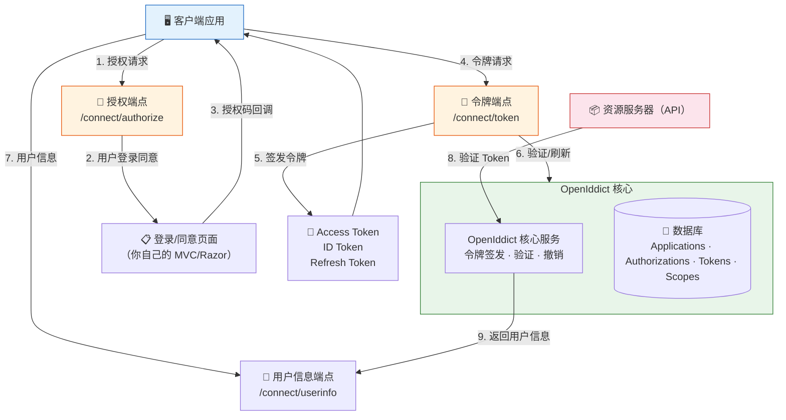
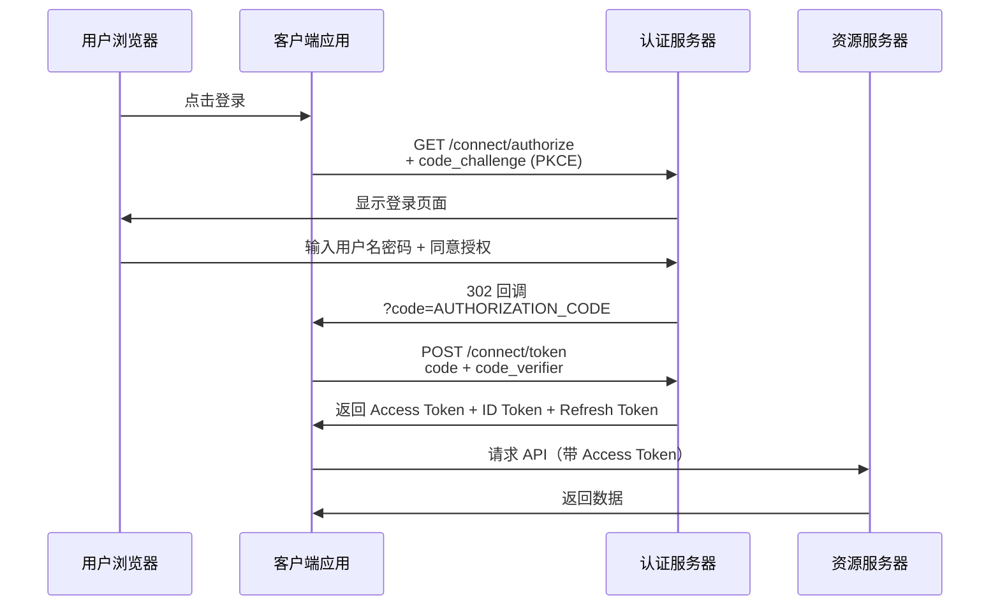
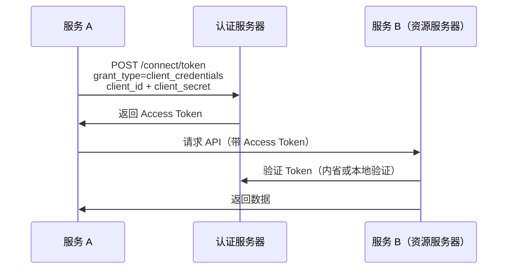
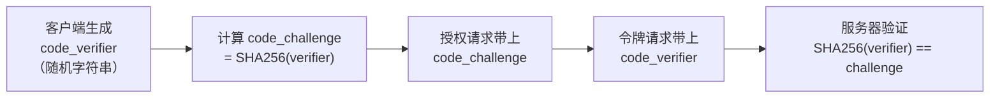
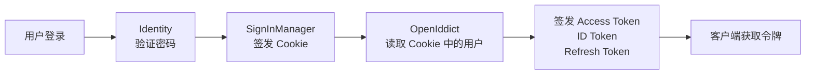

## 一、概述

### 1.1 什么是 OpenIddict

OpenIddict 是 .NET 生态中最主流的 OpenID Connect 服务器框架，用于在 ASP.NET Core 中搭建自己的 OAuth2/OpenID Connect 认证中心。它不是 IdentityServer 的替代品——它是一个**更轻量、更灵活、更新更快**的选择。

### 1.2 OAuth2 vs OpenID Connect

| 概念 | 解决的问题 | 核心协议 |
| --- | --- | --- |
| OAuth2 | 授权：让第三方应用访问你的资源 | RFC 6749 |
| OpenID Connect | 认证：让第三方应用知道你是谁 | 建立在 OAuth2 之上，增加 ID Token |

简单理解：**OAuth2 是门禁卡，OpenID Connect 是门禁卡+身份证**。

### 1.3 为什么选 OpenIddict 而不是 IdentityServer

| 对比项 | OpenIddict | IdentityServer |
| --- | --- | --- |
| 开源协议 | Apache 2.0（完全免费） | 商业许可（企业版收费） |
| 维护状态 | 活跃更新 | Duende 接手后商业运营 |
| 学习曲线 | 中等 | 较陡 |
| 默认存储 | EF Core / MongoDB | EF Core |
| 协议支持 | OAuth2 + OIDC 全流程 | OAuth2 + OIDC 全流程 |
| .NET 版本 | .NET 6+ | .NET 6+ |
| 社区生态 | 快速增长 | 成熟但转向商业 |

### 1.4 架构概览



**关键理解**：OpenIddict 只负责协议层（令牌签发、验证、撤销），**不负责用户登录界面**。你需要自己实现登录页面和同意页面，这是设计上的刻意选择——让你完全掌控用户体验。

## 二、快速上手

### 2.1 安装

```xml name="csproj 依赖"
<PackageReference Include="OpenIddict.AspNetCore" Version="5.8.0" />
<PackageReference Include="OpenIddict.EntityFrameworkCore" Version="5.8.0" />
<PackageReference Include="Pomelo.EntityFrameworkCore.MySql" Version="8.0.0" />
```

### 2.2 服务注册

```csharp name="Program.cs - 认证服务器"
builder.Services.AddOpenIddict()

    // 核心服务：使用 EF Core 存储
    .AddCore(options =>
    {
        options.UseEntityFrameworkCore()
            .UseDbContext<AppDbContext>()
            .ReplaceDefaultEntities<
                OpenIddictApplication,
                OpenIddictAuthorization,
                OpenIddictScope,
                OpenIddictToken>();
    })

    // 服务器功能：启用授权码和刷新令牌流程
    .AddServer(options =>
    {
        // 启用令牌端点
        options.SetTokenEndpointUris("/connect/token");

        // 启用授权端点
        options.SetAuthorizationEndpointUris("/connect/authorize");

        // 启用注销端点
        options.SetLogoutEndpointUris("/connect/logout");

        // 启用用户信息端点
        options.SetUserinfoEndpointUris("/connect/userinfo");

        // 启用授权码流程
        options.AllowAuthorizationCodeFlow();

        // 启用客户端凭证流程
        options.AllowClientCredentialsFlow();

        // 启用刷新令牌
        options.AllowRefreshTokenFlow();

        // 注册签名凭据（开发环境用临时证书）
        options.AddDevelopmentEncryptionCertificate()
              .AddDevelopmentSigningCertificate();

        // 注册作用域
        options.RegisterScopes("api", "profile", "email");

        // 注册声明
        options.RegisterClaims("name", "email", "role");
    })

    // 验证功能（资源服务器用）
    .AddValidation(options =>
    {
        options.UseAspNetCore();
    });
```

> **生产环境证书**：开发证书仅用于开发，生产环境必须使用真实证书。

```csharp name="生产环境证书"
if (builder.Environment.IsProduction())
{
    options.AddEncryptionCertificate(
        LoadCertificate(builder.Configuration["Certificates:Encryption"]!));
    options.AddSigningCertificate(
        LoadCertificate(builder.Configuration["Certificates:Signing"]!));
}

// 从文件或 Store 加载证书
static X509Certificate2 LoadCertificate(string path)
{
    if (File.Exists(path))
        return new X509Certificate2(path);
    throw new FileNotFoundException($"证书文件不存在: {path}");
}
```

### 2.3 数据库上下文

```csharp name="AppDbContext.cs"
public class AppDbContext : IdentityDbContext<ApplicationUser, IdentityRole<Guid>, Guid>
{
    public AppDbContext(DbContextOptions<AppDbContext> options) : base(options) { }

    protected override void OnModelCreating(ModelBuilder builder)
    {
        base.OnModelCreating(builder);

        // 自定义表名
        builder.Entity<ApplicationUser>().ToTable("Users");
        builder.Entity<IdentityRole<Guid>>().ToTable("Roles");

        // OpenIddict 实体配置（必须在 base.OnModelCreating 之后）
        builder.UseOpenIddict();
    }
}
```

### 2.4 数据库迁移与种子数据

```bash name="迁移命令"
dotnet ef migrations add AddOpenIddict
dotnet ef database update
```

```csharp name="种子数据 - 注册客户端应用"
public static class SeedData
{
    public static async Task InitializeAsync(IServiceProvider provider)
    {
        using var scope = provider.CreateScope();
        var manager = scope.ServiceProvider.GetRequiredService<IOpenIddictApplicationManager>();

        // Web 前端客户端（授权码流程）
        if (await manager.FindByClientIdAsync("web_app") == null)
        {
            await manager.CreateAsync(new OpenIddictApplicationDescriptor
            {
                ClientId = "web_app",
                ClientSecret = "901564A5-E7FE-42CB-B14D-61BB296E1C3A", // 生产环境用强密码
                DisplayName = "Web 前端应用",
                RedirectUris =
                {
                    new Uri("https://localhost:5001/callback"),
                    new Uri("https://localhost:5001/signin-oidc")
                },
                PostLogoutRedirectUris =
                {
                    new Uri("https://localhost:5001/signout-callback-oidc")
                },
                Permissions =
                {
                    OpenIddictConstants.Permissions.Endpoints.Authorization,
                    OpenIddictConstants.Permissions.Endpoints.Logout,
                    OpenIddictConstants.Permissions.Endpoints.Token,
                    OpenIddictConstants.Permissions.GrantTypes.AuthorizationCode,
                    OpenIddictConstants.Permissions.GrantTypes.RefreshToken,
                    OpenIddictConstants.Permissions.ResponseTypes.Code,
                    OpenIddictConstants.Permissions.Scopes.Profile,
                    OpenIddictConstants.Permissions.Scopes.Email,
                    OpenIddictConstants.Permissions.Prefixes.Scope + "api"
                },
                Requirements =
                {
                    OpenIddictConstants.Requirements.Features.ProofKeyForCodeExchange
                }
            });
        }

        // API 服务客户端（客户端凭证流程）
        if (await manager.FindByClientIdAsync("service_client") == null)
        {
            await manager.CreateAsync(new OpenIddictApplicationDescriptor
            {
                ClientId = "service_client",
                ClientSecret = "B676E22A-4E0E-4B8A-8C2E-3F9A1D5E7B2C",
                DisplayName = "后端服务间调用",
                Permissions =
                {
                    OpenIddictConstants.Permissions.Endpoints.Token,
                    OpenIddictConstants.Permissions.GrantTypes.ClientCredentials,
                    OpenIddictConstants.Permissions.Prefixes.Scope + "api"
                }
            });
        }
    }
}
```

## 三、授权码流程（Authorization Code Flow）

这是最安全、最常用的流程，适用于有后端的 Web 应用。



### 3.1 授权端点

```csharp name="AuthorizationController.cs"
public class AuthorizationController : Controller
{
    private readonly IOpenIddictApplicationManager _applicationManager;
    private readonly IOpenIddictAuthorizationManager _authorizationManager;
    private readonly IOpenIddictScopeManager _scopeManager;
    private readonly SignInManager<ApplicationUser> _signInManager;
    private readonly UserManager<ApplicationUser> _userManager;

    [HttpGet("~/connect/authorize")]
    [HttpPost("~/connect/authorize")]
    [IgnoreAntiforgeryToken]
    public async Task<IActionResult> Authorize()
    {
        var request = HttpContext.GetOpenIddictServerRequest() ??
            throw new InvalidOperationException("无效的 OpenID Connect 请求");

        // 检查用户是否已登录
        var result = await HttpContext.AuthenticateAsync(IdentityConstants.ApplicationScheme);

        // 未登录：跳转到登录页面
        if (result?.Succeeded != true)
        {
            // 把当前请求参数存起来，登录后回来
            return Challenge(
                new AuthenticationProperties
                {
                    RedirectUri = Request.Path + Request.QueryString
                },
                IdentityConstants.ApplicationScheme);
        }

        var user = await _userManager.GetUserAsync(result.Principal) ??
            throw new InvalidOperationException("用户不存在");

        // 创建新的 ClaimsPrincipal
        var principal = await CreateClaimsPrincipalAsync(user, request.GetScopes());

        // 自动批准授权（也可以实现同意页面让用户手动确认）
        return SignIn(principal, OpenIddictServerAspNetCoreDefaults.AuthenticationScheme);
    }

    // 创建包含声明的 ClaimsPrincipal
    private async Task<ClaimsPrincipal> CreateClaimsPrincipalAsync(
        ApplicationUser user, IEnumerable<string> scopes)
    {
        var principal = await _signInManager.CreateUserPrincipalAsync(user);
        var identity = (ClaimsIdentity)principal.Identity!;

        // 添加 OpenID Connect 标准声明
        identity.SetClaim(ClaimTypes.NameIdentifier, user.Id.ToString());
        identity.SetClaim(ClaimTypes.Name, user.DisplayName);
        identity.SetClaim(ClaimTypes.Email, user.Email);

        // 添加角色声明
        var roles = await _userManager.GetRolesAsync(user);
        foreach (var role in roles)
            identity.AddClaim(new Claim(ClaimTypes.Role, role));

        // 设置作用域限制的声明（只在请求了对应 scope 时才添加）
        identity.SetScopes(scopes);

        // 设置资源（令牌的受众）
        identity.SetResources(await _scopeManager.ListResourcesAsync(identity.GetScopes())
            .ToListAsync());

        return principal;
    }
}
```

### 3.2 令牌端点

```csharp name="TokenController.cs"
public class TokenController : Controller
{
    private readonly IOpenIddictApplicationManager _applicationManager;
    private readonly SignInManager<ApplicationUser> _signInManager;
    private readonly UserManager<ApplicationUser> _userManager;

    [HttpPost("~/connect/token")]
    [IgnoreAntiforgeryToken]
    [Produces("application/json")]
    public async Task<IActionResult> Exchange()
    {
        var request = HttpContext.GetOpenIddictServerRequest() ??
            throw new InvalidOperationException("无效的令牌请求");

        if (request.IsAuthorizationCodeGrantType() || request.IsRefreshTokenGrantType())
        {
            // 从授权码或刷新令牌中恢复 ClaimsPrincipal
            var result = await HttpContext.AuthenticateAsync(
                OpenIddictServerAspNetCoreDefaults.AuthenticationScheme);

            // 刷新令牌时检查用户是否仍然有效
            if (request.IsRefreshTokenGrantType())
            {
                var userId = result.Principal?.GetClaim(ClaimTypes.NameIdentifier);
                if (userId != null)
                {
                    var user = await _userManager.FindByIdAsync(userId);
                    if (user == null || !user.IsActive)
                        return Forbid(OpenIddictServerAspNetCoreDefaults.AuthenticationScheme);
                }
            }

            return SignIn(result.Principal!,
                OpenIddictServerAspNetCoreDefaults.AuthenticationScheme);
        }

        if (request.IsClientCredentialsGrantType())
        {
            // 客户端凭证流程：无用户参与
            var application = await _applicationManager.FindByClientIdAsync(request.ClientId!) ??
                throw new InvalidOperationException("客户端不存在");

            var identity = new ClaimsIdentity(
                TokenValidationParameters.DefaultAuthenticationType,
                OpenIddictConstants.Claims.Name,
                OpenIddictConstants.Claims.Role);

            identity.SetClaim(OpenIddictConstants.Claims.Name,
                await _applicationManager.GetDisplayNameAsync(application));
            identity.SetScopes(request.GetScopes());

            return SignIn(new ClaimsPrincipal(identity),
                OpenIddictServerAspNetCoreDefaults.AuthenticationScheme);
        }

        throw new InvalidOperationException("不支持的授权类型");
    }
}
```

### 3.3 用户信息端点

```csharp name="UserInfoController.cs"
[HttpGet("~/connect/userinfo")]
[HttpPost("~/connect/userinfo")]
[Produces("application/json")]
public async Task<IActionResult> Userinfo()
{
    var result = await HttpContext.AuthenticateAsync(
        OpenIddictServerAspNetCoreDefaults.AuthenticationScheme);

    if (result.Principal == null)
        return Challenge(OpenIddictServerAspNetCoreDefaults.AuthenticationScheme);

    var userId = result.Principal.GetClaim(ClaimTypes.NameIdentifier);
    var user = await _userManager.FindByIdAsync(userId!);

    if (user == null)
        return Challenge(OpenIddictServerAspNetCoreDefaults.AuthenticationScheme);

    var claims = new Dictionary<string, object>(StringComparer.Ordinal)
    {
        [OpenIddictConstants.Claims.Subject] = user.Id.ToString(),
        [OpenIddictConstants.Claims.Name] = user.DisplayName ?? ""
    };

    // 只返回请求的 scope 对应的声明
    if (result.Principal.HasScope(OpenIddictConstants.Scopes.Email))
        claims[OpenIddictConstants.Claims.Email] = user.Email ?? "";

    if (result.Principal.HasScope(OpenIddictConstants.Scopes.Profile))
        claims["created_at"] = user.CreatedAt.ToString("o");

    return Ok(claims);
}
```

## 四、客户端凭证流程（Client Credentials Flow）

适用于服务间通信，没有用户参与。



### 4.1 客户端请求示例

```csharp name="服务间调用"
public class ServiceClient
{
    private readonly HttpClient _httpClient;
    private readonly string _tokenEndpoint;
    private readonly string _clientId;
    private readonly string _clientSecret;

    public async Task<string> GetAccessTokenAsync()
    {
        var request = new HttpRequestMessage(HttpMethod.Post, _tokenEndpoint);
        request.Content = new FormUrlEncodedContent(new Dictionary<string, string>
        {
            ["grant_type"] = "client_credentials",
            ["client_id"] = _clientId,
            ["client_secret"] = _clientSecret,
            ["scope"] = "api"
        });

        var response = await _httpClient.SendAsync(request);
        response.EnsureSuccessStatusCode();

        var payload = JsonDocument.Parse(await response.Content.ReadAsStringAsync());
        return payload.RootElement.GetProperty("access_token").GetString()!;
    }
}
```

## 五、资源服务器（API）配置

资源服务器是接受 Access Token 的 API 服务，它不需要完整的 OpenIddict 服务器，只需要验证功能。

### 5.1 独立部署的资源服务器

```csharp name="资源服务器 Program.cs"
builder.Services.AddAuthentication(options =>
{
    options.DefaultScheme = JwtBearerDefaults.AuthenticationScheme;
})
.AddJwtBearer(options =>
{
    // 方式一：从认证服务器获取 OIDC 配置（推荐）
    options.Authority = "https://auth.myapp.com";
    options.Audience = "api";
    options.TokenValidationParameters = new TokenValidationParameters
    {
        ValidateIssuer = true,
        ValidIssuer = "https://auth.myapp.com",
        ValidateAudience = true,
        ValidateLifetime = true,
        ClockSkew = TimeSpan.FromSeconds(30)
    };
});

builder.Services.AddAuthorization();
```

### 5.2 使用 OpenIddict 验证

```csharp name="使用 OpenIddict 验证（同项目部署）"
builder.Services.AddOpenIddict()
    .AddValidation(options =>
    {
        // 使用 ASP.NET Core 集成
        options.UseAspNetCore();

        // 如果认证服务器和资源服务器在同一个项目
        options.UseLocalServer();

        // 如果使用引用令牌（Reference Token），需要内省端点
        // options.UseIntrospection();
    });
```

### 5.3 保护 API 端点

```csharp name="API 授权"
[ApiController]
[Route("api/[controller]")]
[Authorize(AuthenticationSchemes = JwtBearerDefaults.AuthenticationScheme)]
public class ProductsController : ControllerBase
{
    // 任何已认证用户
    [HttpGet]
    public IActionResult GetAll() => Ok(/* ... */);

    // 需要 api 作用域
    [HttpGet("admin")]
    [Authorize(Policy = "RequireApiScope")]
    public IActionResult GetAdminData() => Ok(/* ... */);
}

// 注册策略
builder.Services.AddAuthorization(options =>
{
    options.AddPolicy("RequireApiScope", policy =>
        policy.RequireAssertion(ctx =>
            ctx.User.HasClaim("scope", "api")));
});
```

## 六、刷新令牌

### 6.1 工作原理

Access Token 有效期短（15 分钟），Refresh Token 有效期长（7 天）。客户端用 Refresh Token 换取新的 Access Token，无需用户重新登录。

```csharp name="配置刷新令牌"
.AddServer(options =>
{
    // 启用刷新令牌流程
    options.AllowRefreshTokenFlow();

    // 设置刷新令牌有效期
    options.SetRefreshTokenLifetime(TimeSpan.FromDays(7));

    // 设置 Access Token 有效期
    options.SetAccessTokenLifetime(TimeSpan.FromMinutes(15));

    // 启用滑动过期（每次刷新都延长 Refresh Token 有效期）
    options.EnableSlidingRefreshTokenExpiration();

    // 设置刷新令牌重用策略
    // Reuse：返回相同的 Refresh Token（默认）
    // Rotate：每次刷新签发新的 Refresh Token，旧的失效
    options.SetRefreshTokenReusePolicy(OpenIddictConstants.RefreshTokenReusePolicies.Rotate);
})
```

### 6.2 客户端刷新流程

```csharp name="客户端刷新令牌"
public class TokenRefresher
{
    private readonly HttpClient _httpClient;
    private readonly string _tokenEndpoint;

    public async Task<TokenResult> RefreshAsync(string refreshToken)
    {
        var request = new HttpRequestMessage(HttpMethod.Post, _tokenEndpoint);
        request.Content = new FormUrlEncodedContent(new Dictionary<string, string>
        {
            ["grant_type"] = "refresh_token",
            ["refresh_token"] = refreshToken,
            ["client_id"] = "web_app",
            ["client_secret"] = "901564A5-E7FE-42CB-B14D-61BB296E1C3A"
        });

        var response = await _httpClient.SendAsync(request);

        if (response.StatusCode == HttpStatusCode.BadRequest)
        {
            // Refresh Token 已失效，需要重新登录
            return TokenResult.Expired;
        }

        response.EnsureSuccessStatusCode();
        var payload = JsonDocument.Parse(await response.Content.ReadAsStringAsync());

        return new TokenResult
        {
            AccessToken = payload.RootElement.GetProperty("access_token").GetString()!,
            RefreshToken = payload.RootElement.GetProperty("refresh_token").GetString()!,
            ExpiresIn = payload.RootElement.GetProperty("expires_in").GetInt32()
        };
    }
}
```

## 七、PKCE（Proof Key for Code Exchange）

PKCE 是授权码流程的安全增强，防止授权码被截获后滥用。**所有公开客户端（SPA、移动端）必须使用 PKCE**。



### 7.1 客户端 PKCE 实现

```csharp name="PKCE 生成"
public static class PkceHelper
{
    // 生成 code_verifier（43-128 个字符的随机字符串）
    public static string GenerateCodeVerifier()
    {
        var bytes = RandomNumberGenerator.GetBytes(32);
        return Base64Url.EncodeToString(bytes);
    }

    // 从 code_verifier 计算 code_challenge
    public static string ComputeCodeChallenge(string codeVerifier)
    {
        var bytes = SHA256.HashData(Encoding.ASCII.GetBytes(codeVerifier));
        return Base64Url.EncodeToString(bytes);
    }
}
```

### 7.2 服务端强制 PKCE

```csharp name="强制 PKCE"
// 在客户端注册时添加要求
new OpenIddictApplicationDescriptor
{
    ClientId = "spa_app",
    // 公开客户端不需要 ClientSecret
    Requirements =
    {
        OpenIddictConstants.Requirements.Features.ProofKeyForCodeExchange
    }
}
```

## 八、自定义实体模型

默认的 OpenIddict 实体是 `OpenIddictApplication`、`OpenIddictAuthorization`、`OpenIddictScope`、`OpenIddictToken`。如果需要添加自定义字段，可以继承这些类。

### 8.1 自定义 Application

```csharp name="自定义 Application 实体"
public class OpenIddictApplication : OpenIddictEntityFrameworkCoreApplication
{
    // 添加自定义字段
    public string? Description { get; set; }
    public string? CreatedBy { get; set; }
    public DateTime CreatedAt { get; set; } = DateTime.UtcNow;
    public bool IsEnabled { get; set; } = true;
}
```

### 8.2 自定义 Token

```csharp name="自定义 Token 实体"
public class OpenIddictToken : OpenIddictEntityFrameworkCoreToken
{
    // 记录令牌的使用情况
    public DateTime? LastUsedAt { get; set; }
    public string? IpAddress { get; set; }
    public string? UserAgent { get; set; }
}
```

### 8.3 注册自定义实体

```csharp name="注册自定义实体"
.AddCore(options =>
{
    options.UseEntityFrameworkCore()
        .UseDbContext<AppDbContext>()
        .ReplaceDefaultEntities<
            OpenIddictApplication,    // 自定义 Application
            OpenIddictAuthorization,  // 自定义 Authorization
            OpenIddictScope,          // 自定义 Scope
            OpenIddictToken>();       // 自定义 Token
})
```

### 8.4 自定义 Store

当 EF Core 不满足需求时（比如用 MongoDB），可以实现自定义 Store。

```csharp name="自定义 Application Store"
public class MongoApplicationStore : IOpenIddictApplicationStore<OpenIddictApplication>
{
    private readonly IMongoCollection<OpenIddictApplication> _collection;

    public async ValueTask<OpenIddictApplication?> FindByClientIdAsync(
        string identifier, CancellationToken ct)
    {
        return await _collection
            .Find(a => a.ClientId == identifier)
            .FirstOrDefaultAsync(ct);
    }

    public async ValueTask CreateAsync(
        OpenIddictApplication application, CancellationToken ct)
    {
        await _collection.InsertOneAsync(application, cancellationToken: ct);
    }

    // ... 实现其他接口方法
}

// 注册
.AddCore(options =>
{
    options.ReplaceApplicationStoreResolver<IServiceProvider>((provider, _) =>
        new OpenIddictApplicationStoreResolver(
            new OpenIddictApplicationStore<OpenIddictApplication,
                OpenIddictAuthorization, OpenIddictScope, OpenIddictToken>(
                provider.GetRequiredService<MongoApplicationStore>())));
})
```

## 九、令牌撤销与安全

### 9.1 令牌撤销端点

```csharp name="撤销端点"
[HttpPost("~/connect/revoke")]
[IgnoreAntiforgeryToken]
[Produces("application/json")]
public async Task<IActionResult> Revoke()
{
    var request = HttpContext.GetOpenIddictServerRequest() ??
        throw new InvalidOperationException("无效的撤销请求");

    // OpenIddict 自动处理撤销逻辑
    return SignOut(OpenIddictServerAspNetCoreDefaults.AuthenticationScheme);
}

// 注册撤销端点
.AddServer(options =>
{
    options.SetRevocationEndpointUris("/connect/revoke");
    options.AllowRevocationEndpoint();
})
```

### 9.2 用户注销

```csharp name="注销逻辑"
[HttpGet("~/connect/logout")]
[HttpPost("~/connect/logout")]
[IgnoreAntiforgeryToken]
public async Task<IActionResult> Logout()
{
    var request = HttpContext.GetOpenIddictServerRequest();

    // 注销本地 Cookie
    await _signInManager.SignOutAsync();

    // 注销 OpenIddict 会话
    return SignOut(
        new AuthenticationProperties
        {
            RedirectUri = request?.PostLogoutRedirectUri ?? "/"
        },
        OpenIddictServerAspNetCoreDefaults.AuthenticationScheme,
        IdentityConstants.ApplicationScheme);
}
```

### 9.3 引用令牌（Reference Token）

默认情况下 OpenIddict 签发自包含的 JWT 令牌。如果需要服务端实时撤销令牌，可以使用引用令牌——令牌只是一个随机字符串，每次验证都需要查询数据库或调用内省端点。

```csharp name="启用引用令牌"
.AddServer(options =>
{
    // 禁用 Access Token 自包含，使用引用令牌
    options.DisableAccessTokenEncryption();

    // 启用内省端点
    options.SetIntrospectionEndpointUris("/connect/introspect");
    options.AllowIntrospectionEndpoint();
})
```

> **性能取舍**：引用令牌可以即时撤销，但每次 API 调用都需要查库或内省。JWT 令牌无需查库，但无法即时撤销（只能等过期）。生产中常用**短有效期 JWT + 黑名单**折中。

### 9.4 令牌加密

OpenIddict 支持对令牌内容加密，即使 JWT 被解码也无法读取声明。

```csharp name="令牌加密"
.AddServer(options =>
{
    // 启用 Access Token 加密
    options.UseReferenceAccessTokens(); // 引用令牌自动加密

    // 或者对自包含令牌加密
    options.EncryptAccessToken = true;
})
```

## 十、常见踩坑与解决方案

### 10.1 证书问题

**问题**：开发环境正常，部署到生产后报 `The signing certificate is not valid`。

**原因**：`AddDevelopmentSigningCertificate()` 只在开发环境有效。

```csharp name="证书处理"
if (builder.Environment.IsDevelopment())
{
    options.AddDevelopmentEncryptionCertificate()
          .AddDevelopmentSigningCertificate();
}
else
{
    // 生产环境：从文件加载
    var signingCert = new X509Certificate2(
        builder.Configuration["Certificates:Signing:Path"]!,
        builder.Configuration["Certificates:Signing:Password"]);

    var encryptionCert = new X509Certificate2(
        builder.Configuration["Certificates:Encryption:Path"]!,
        builder.Configuration["Certificates:Encryption:Password"]);

    options.AddSigningCertificate(signingCert);
    options.AddEncryptionCertificate(encryptionCert);
}
```

### 10.2 跨域（CORS）问题

**问题**：SPA 应用调用令牌端点时被浏览器 CORS 策略阻止。

```csharp name="CORS 配置"
builder.Services.AddCors(options =>
{
    options.AddPolicy("AllowSpa", policy =>
    {
        policy.WithOrigins("https://localhost:5001")
              .AllowAnyHeader()
              .AllowAnyMethod()
              .AllowCredentials();
    });
});

// 注意：CORS 中间件必须在 UseAuthentication 之前
app.UseCors("AllowSpa");
app.UseAuthentication();
app.UseOpenIddictServer();
```

### 10.3 声明丢失

**问题**：签发的令牌中缺少某些声明。

**原因**：OpenIddict 默认只包含 `sub` 声明，其他声明需要手动添加或通过 scope 触发。

```csharp name="确保声明包含"
// 方法一：在 ClaimsPrincipal 上直接设置
identity.SetClaim("role", "admin");

// 方法二：注册声明类型，让 OpenIddict 知道这些声明需要包含
.AddServer(options =>
{
    options.RegisterClaims("name", "email", "role");
})

// 方法三：通过 scope 映射声明
.AddServer(options =>
{
    options.RegisterScopes("profile", "email", "roles");
})

// 方法四：设置令牌目标（Access Token vs ID Token）
identity.SetDestinations(claim => claim.Type switch
{
    "role" => new[] { Destinations.AccessToken, Destinations.IdentityToken },
    "name" or "email" => new[] { Destinations.IdentityToken },
    _ => new[] { Destinations.AccessToken }
});
```

### 10.4 刷新令牌轮换后旧令牌仍可用

**问题**：设置了 `Rotate` 策略，但旧 Refresh Token 仍然有效。

**原因**：OpenIddict 的轮换是"一次性使用"检测，不是即时失效。需要确保数据库中 Token 记录的状态正确。

```csharp name="配置令牌清理"
// 定期清理过期令牌
builder.Services.AddHostedService<TokenCleanupWorker>();

public class TokenCleanupWorker : BackgroundService
{
    private readonly IServiceProvider _provider;

    protected override async Task ExecuteAsync(CancellationToken ct)
    {
        while (!ct.IsCancellationRequested)
        {
            using var scope = _provider.CreateScope();
            var manager = scope.ServiceProvider
                .GetRequiredService<IOpenIddictTokenManager>();

            // 清理过期的令牌
            await manager.PruneAsync(
                DateTimeOffset.UtcNow, ct);

            await Task.Delay(TimeSpan.FromHours(1), ct);
        }
    }
}
```

### 10.5 多租户场景

**问题**：多个租户共享同一个认证中心，但需要隔离数据。

```csharp name="多租户方案"
// 方案一：在声明中添加租户信息
identity.SetClaim("tenant_id", tenantId);

// 方案二：自定义 Token Store 按租户过滤
public class TenantTokenStore : IOpenIddictTokenStore<OpenIddictToken>
{
    private readonly string _tenantId;

    public async ValueTask<OpenIddictToken?> FindByIdAsync(
        string identifier, CancellationToken ct)
    {
        return await _collection
            .Find(t => t.Id == identifier && t.TenantId == _tenantId)
            .FirstOrDefaultAsync(ct);
    }
}

// 方案三：每个租户独立 Issuer
.AddServer(options =>
{
    options.SetIssuer(new Uri($"https://auth.myapp.com/{tenantId}/"));
})
```

## 十一、与 ASP.NET Core Identity 集成

OpenIddict 不管理用户，它只管令牌。用户管理交给 Identity。



```csharp name="集成配置"
// 1. 注册 Identity
builder.Services.AddIdentity<ApplicationUser, IdentityRole<Guid>>()
    .AddEntityFrameworkStores<AppDbContext>()
    .AddDefaultTokenProviders();

// 2. 注册 OpenIddict
builder.Services.AddOpenIddict()
    .AddCore(options =>
    {
        options.UseEntityFrameworkCore().UseDbContext<AppDbContext>();
    })
    .AddServer(options =>
    {
        // ... 端点配置
    })
    .AddValidation(options =>
    {
        options.UseAspNetCore();
    });

// 3. 中间件顺序很重要
app.UseRouting();
app.UseAuthentication();     // Identity Cookie 认证
app.UseOpenIddictServer();   // OpenIddict 令牌处理
app.UseAuthorization();
app.MapControllers();
```

## 十二、安全最佳实践

| 实践 | 说明 |
| --- | --- |
| 始终使用 HTTPS | 所有端点必须 HTTPS |
| 公开客户端必须 PKCE | SPA、移动端不能用 ClientSecret |
| 使用 Rotate 刷新策略 | 每次刷新签发新 Refresh Token，检测令牌重放 |
| Access Token 短有效期 | 15 分钟以内 |
| Refresh Token 长有效期 | 7 天，配合滑动过期 |
| 不在 JWT 中存敏感数据 | JWT 只编码不加密 |
| 验证 Audience | 资源服务器必须验证令牌的受众 |
| 验证 Issuer | 确保令牌来自可信的认证服务器 |
| 定期轮换签名密钥 | 支持多签名密钥平滑切换 |
| 记录审计日志 | 令牌签发、刷新、撤销操作留痕 |
| 限制 RedirectUri | 精确匹配，不允许通配符 |
| 限制 Scope | 最小权限原则 |

```csharp name="安全配置汇总"
.AddServer(options =>
{
    // 短有效期
    options.SetAccessTokenLifetime(TimeSpan.FromMinutes(15));
    options.SetRefreshTokenLifetime(TimeSpan.FromDays(7));
    options.SetAuthorizationCodeLifetime(TimeSpan.FromMinutes(5));

    // 刷新令牌轮换
    options.SetRefreshTokenReusePolicy(OpenIddictConstants.RefreshTokenReusePolicies.Rotate);
    options.EnableSlidingRefreshTokenExpiration();

    // 禁用不安全的流程
    // 不要启用 Implicit Flow 和 Resource Owner Password
    // options.AllowImplicitFlow();        // 不安全，已废弃
    // options.AllowPasswordFlow();        // 不推荐，暴露密码

    // 强制 PKCE
    // 在客户端 Requirements 中设置
})
```

## 十三、总结

OpenIddict 的核心设计理念是**协议正确 + 灵活可扩展**：

1. **协议层**：严格遵循 OAuth2/OpenID Connect 规范，不引入非标准扩展
2. **存储层**：EF Core / MongoDB / 自定义 Store 可替换
3. **令牌层**：JWT / 引用令牌 / 加密令牌可选
4. **流程层**：授权码 / 客户端凭证 / 刷新令牌按需启用

与 Identity 的关系：**Identity 管用户，OpenIddict 管令牌**。Identity 解决"你是谁"，OpenIddict 解决"谁能代表你访问什么"。
