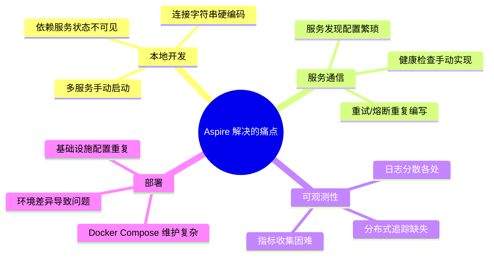
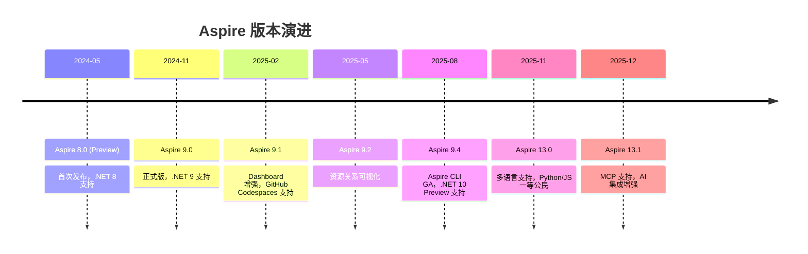
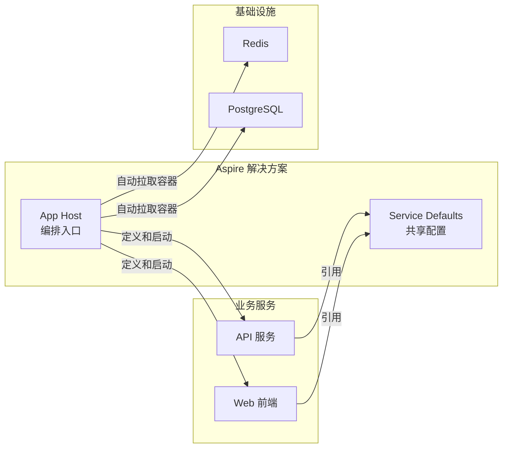
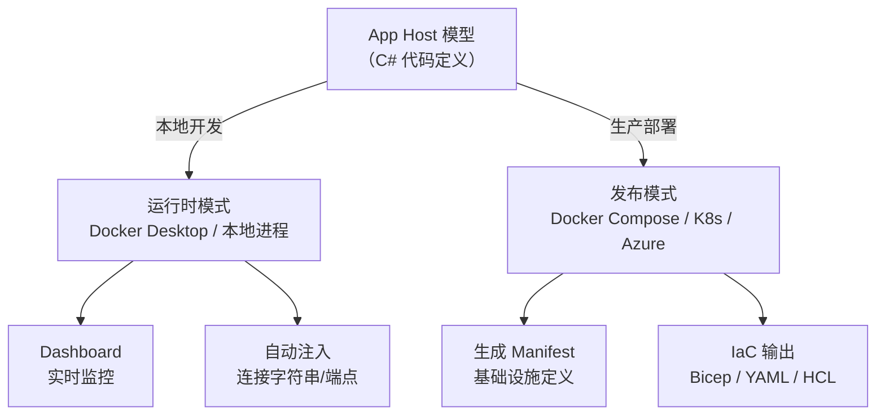
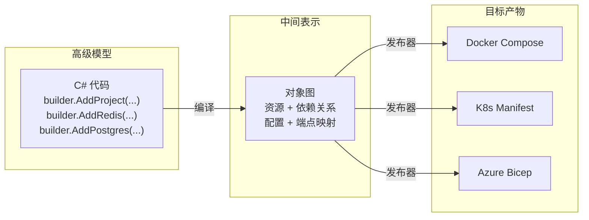
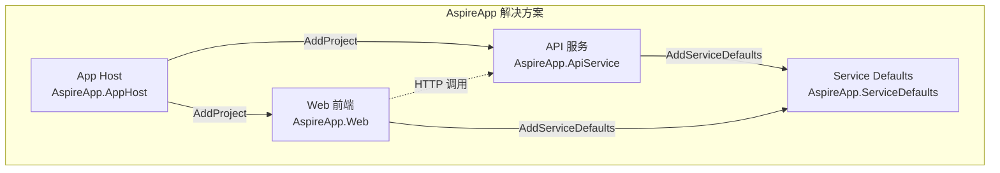
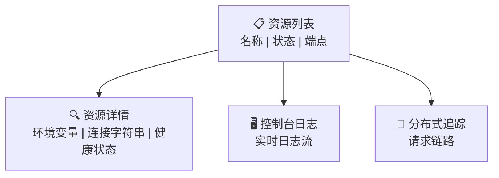
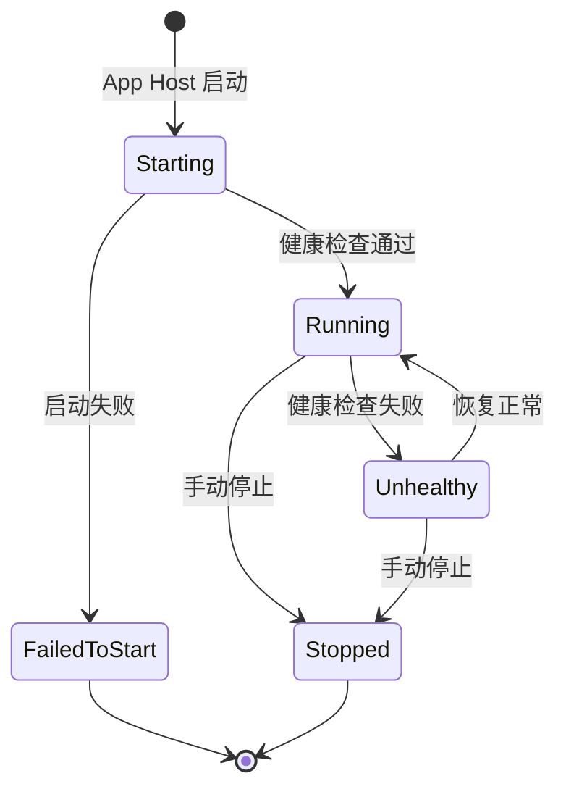

## 一、什么是 Aspire

Aspire 是微软推出的云原生应用开发平台，用于简化分布式系统的构建、编排和部署。它不是一个新的运行时或框架，而是一套**工具链 + 编排模型 + 集成生态**的组合，解决的是"把多个服务拼在一起跑起来"这个痛点。

> **历史注记**：Aspire 最初叫 ".NET Aspire"，从 13.0 版本起去掉了 ".NET" 前缀，因为 Python 和 JavaScript 已成为一等公民——它不再只是 .NET 的编排工具，而是一个多语言云原生平台。

### 1.1 它解决什么问题



用一个具体场景说明：假设你的项目包含一个 Web 前端、一个 API 后端、一个 Redis 缓存和一个 PostgreSQL 数据库。传统做法是：

1. 手动启动 Docker 容器运行 Redis 和 PostgreSQL
2. 在每个服务的 `appsettings.json` 里写死连接字符串
3. 自己实现服务发现和健康检查
4. 自己配置 OpenTelemetry 做可观测性
5. 写 Docker Compose 文件做本地编排

Aspire 把这些全部自动化了——**一条命令启动所有服务，连接字符串自动注入，可观测性开箱即用**。

### 1.2 Aspire 不是什么

| 误解 | 事实 |
| --- | --- |
| Aspire 是 Kubernetes 替代品 | Aspire 是开发时编排工具，生产部署仍用 K8s/Docker 等 |
| Aspire 只能编排 .NET 服务 | 从 13.0 起支持 Python、JavaScript 一等公民 |
| Aspire 是微服务框架 | Aspire 不关心你的服务内部架构，只管编排和连接 |
| Aspire 是 Service Fabric 的替代 | 两者定位完全不同，Aspire 不做运行时调度 |

### 1.3 版本演进



> **版本号跳跃**：从 9.x 直接跳到 13.0，是因为与 .NET 10 的版本对齐策略调整。Aspire 的发布节奏独立于 .NET 主版本。

## 二、核心架构

### 2.1 三大核心项目

每个 Aspire 解决方案至少包含三个项目：



| 项目 | 职责 | 关键特性 |
| --- | --- | --- |
| **App Host** | 编排入口，定义所有资源及其关系 | 用 C# 代码描述拓扑，自动管理生命周期 |
| **Service Defaults** | 共享配置包，统一服务行为 | OpenTelemetry、健康检查、服务发现、弹性策略 |
| **业务服务** | 你的实际应用代码 | 引用 Service Defaults 即可获得所有基础能力 |

### 2.2 双模式运行

Aspire 有两种运行模式，共享同一套 App Host 定义：



**运行时模式**（`dotnet run`）：App Host 启动所有服务，自动拉取容器，注入连接信息，打开 Dashboard。

**发布模式**（`dotnet run --publisher manifest`）：App Host 不启动服务，而是将模型"降低"（lowering）为部署清单——Docker Compose 文件、Kubernetes Manifest、Azure Bicep 等。

### 2.3 模型降低（Lowering）

这是 Aspire 架构中最精妙的设计，借鉴了编译器的思路：



这意味着你只需维护一份 C# 编排代码，就能生成不同环境的部署配置——**一次定义，多处部署**。

## 三、环境准备

### 3.1 系统要求

| 依赖 | 最低版本 | 说明 |
| --- | --- | --- |
| .NET SDK | 8.0+（推荐 9.0 或 10.0） | Aspire 13 需要 .NET 10 |
| 容器运行时 | Docker Desktop / Podman | 用于运行 Redis、PostgreSQL 等容器 |
| IDE | VS 2022 17.9+ / VS Code + C# Dev Kit / Rider | 可选，CLI 也能完成所有操作 |

### 3.2 安装 Aspire CLI

Aspire 9.0 之后不再需要安装 workload，改用独立的 Aspire CLI：

```bash
# Windows
iex "& { $(irm https://aspire.dev/install.ps1) }"

# macOS / Linux
curl -sSL https://aspire.dev/install.sh | bash -s
```

安装完成后验证：

```bash
aspire --version
```

> **旧版迁移**：如果你之前安装了 Aspire workload，可以用 `dotnet workload uninstall aspire` 卸载，改用 CLI。

### 3.3 安装项目模板

```bash
dotnet new install Aspire.ProjectTemplates
```

## 四、创建第一个 Aspire 应用

### 4.1 使用 Aspire CLI 创建

```bash
aspire new aspire-starter -n AspireApp -o AspireApp
```

如果提示选择选项，使用方向键导航，回车确认。模板会生成以下项目结构：

```
AspireApp/
├── AspireApp.AppHost/          # 编排入口
│   ├── AppHost.cs
│   └── AspireApp.AppHost.csproj
├── AspireApp.ServiceDefaults/  # 共享配置
│   ├── Extensions.cs
│   └── AspireApp.ServiceDefaults.csproj
├── AspireApp.ApiService/       # API 服务
│   ├── Program.cs
│   └── AspireApp.ApiService.csproj
├── AspireApp.Web/              # Web 前端（Blazor）
│   ├── Program.cs
│   └── AspireApp.Web.csproj
└── AspireApp.sln
```

### 4.2 使用 .NET CLI 创建

如果你不想安装 Aspire CLI，也可以用传统的 dotnet 命令：

```bash
dotnet new aspire-starter -n AspireApp -o AspireApp
```

### 4.3 项目结构解析



#### App Host（AspireApp.AppHost）

这是整个解决方案的编排入口，`Program.cs` 长这样：

```csharp
var builder = DistributedApplication.CreateBuilder(args);

// 添加 API 服务
var apiService = builder.AddProject<Projects.AspireApp_ApiService>("apiservice");

// 添加 Web 前端，并声明对 API 的依赖
builder.AddProject<Projects.AspireApp_Web>("webfrontend")
    .WithExternalHttpEndpoints()
    .WithReference(apiService)
    .WaitFor(apiService);

builder.Build().Run();
```

关键 API 解读：

| API | 作用 |
| --- | --- |
| `AddProject<T>()` | 注册一个 .NET 项目作为资源 |
| `WithReference()` | 声明依赖关系，自动注入连接信息 |
| `WaitFor()` | 等待依赖服务健康后再启动 |
| `WithExternalHttpEndpoints()` | 暴露 HTTP 端点供外部访问 |

#### Service Defaults（AspireApp.ServiceDefaults）

`Extensions.cs` 为所有服务提供统一配置：

```csharp
public static IHostApplicationBuilder AddServiceDefaults(
    this IHostApplicationBuilder builder)
{
    builder.ConfigureOpenTelemetry();      // 可观测性
    builder.AddDefaultHealthChecks();       // 健康检查
    builder.Services.AddServiceDiscovery(); // 服务发现
    builder.Services.ConfigureHttpClientDefaults(http =>
    {
        http.AddStandardResilienceHandler();  // 弹性策略
        http.AddServiceDiscovery();           // 自动服务发现
    });

    return builder;
}
```

每个业务服务只需一行代码即可获得所有能力：

```csharp
// AspireApp.ApiService/Program.cs
var builder = WebApplication.CreateBuilder(args);
builder.AddServiceDefaults();  // ← 这一行搞定一切
```

### 4.4 运行应用

```bash
cd AspireApp
dotnet run --project AspireApp.AppHost
```

首次运行时，Aspire 会自动：

1. 启动 API 服务和 Web 前端
2. 拉取所需的容器镜像（如果模板包含 Redis 等依赖）
3. 注入连接字符串和服务端点
4. 打开 Dashboard

## 五、Dashboard 初探

Dashboard 是 Aspire 最直观的亮点，运行后自动在浏览器打开。

### 5.1 四大功能区域



| 区域 | 功能 | 典型用途 |
| --- | --- | --- |
| **资源列表** | 显示所有注册的资源及其状态 | 快速了解哪些服务在运行 |
| **资源详情** | 查看环境变量、连接字符串、端点 | 排查连接问题 |
| **控制台日志** | 实时查看每个服务的标准输出 | 调试启动问题 |
| **分布式追踪** | 查看请求在服务间的流转 | 定位性能瓶颈 |

### 5.2 资源状态

每个资源有以下生命周期状态：



### 5.3 实用技巧

- **点击资源名称** → 查看详细的环境变量和端点
- **点击端点 URL** → 直接在浏览器打开该服务
- **Console 标签** → 实时日志流，支持 ANSI 颜色
- **Traces 标签** → 按时间线查看请求链路，点击可展开详情
- **Structured Logging** → 日志支持结构化查询和过滤

## 六、与传统方式对比

用一个表格总结 Aspire 带来的变化：

| 场景 | 传统方式 | Aspire 方式 |
| --- | --- | --- |
| 启动多服务 | 手动逐个 `dotnet run` | 一条命令启动全部 |
| 连接字符串 | `appsettings.json` 硬编码 | 自动注入，无需配置 |
| 服务发现 | 手动配置 URL + 端口 | `WithReference()` 自动发现 |
| 健康检查 | 每个服务自己实现 | `AddDefaultHealthChecks()` 一行搞定 |
| 可观测性 | 手动集成 OTel + Jaeger | `ConfigureOpenTelemetry()` 开箱即用 |
| 弹性策略 | 手动配置 Polly | `AddStandardResilienceHandler()` 内置 |
| 本地容器 | 手动写 Docker Compose | `AddRedis()` 自动拉取并运行 |
| 部署配置 | 维护多套 YAML | 从 App Host 模型自动生成 |

## 七、官方资源

| 资源 | 地址 |
| --- | --- |
| 官方文档 | https://aspire.dev/docs/ |
| GitHub 仓库 | https://github.com/dotnet/aspire |
| Aspire CLI 安装 | https://aspire.dev/get-started/install-cli/ |
| 集成列表 | https://aspire.dev/integrations/ |
| Discord 社区 | https://aka.ms/aspire-discord |

---

> **下一篇**：[App Host 编排模型](tutorial.html?type=aspire&file=02AppHost编排模型.md) —— 深入理解 Aspire 的编排核心：资源定义、依赖关系、生命周期钩子、环境变量注入。
