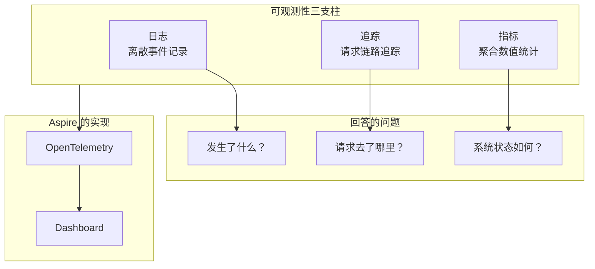
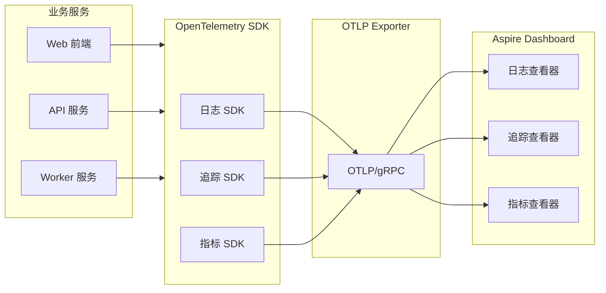
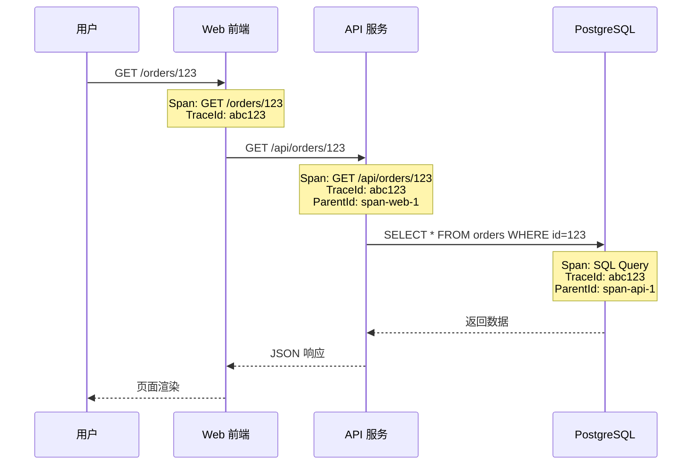
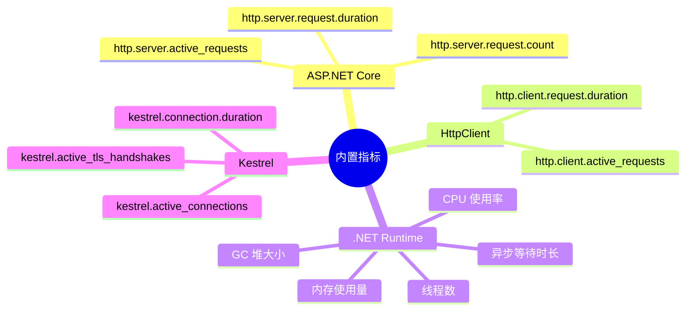
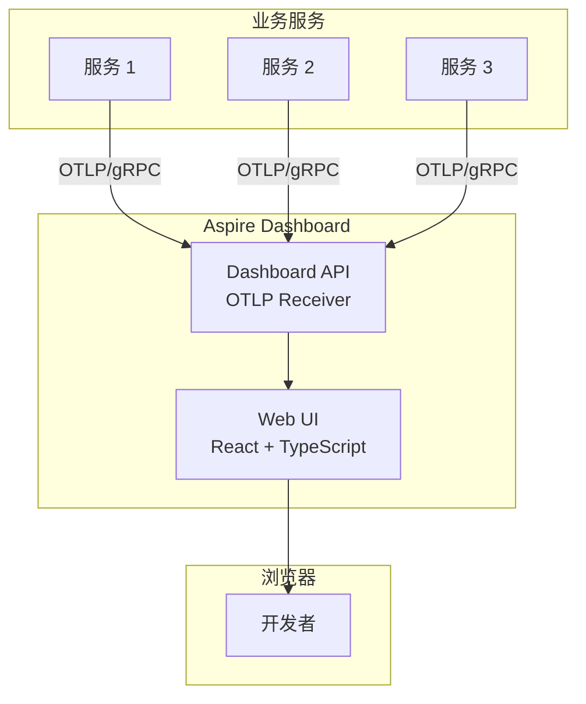
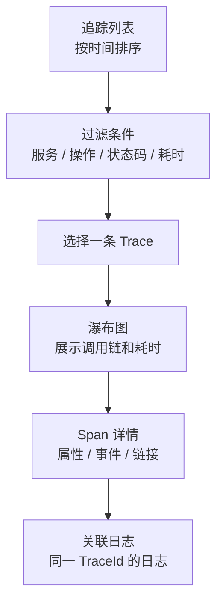
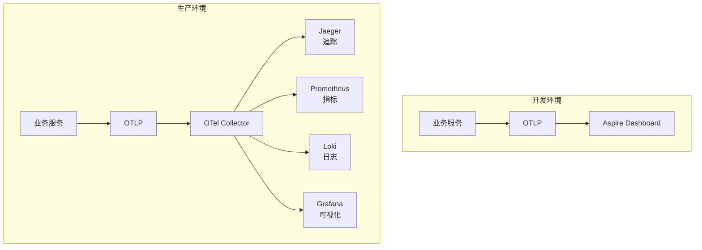

## 一、可观测性三支柱

可观测性（Observability）是理解系统内部状态的能力，基于三大支柱：



| 支柱 | 数据特征 | 示例 | Aspire 自动采集 |
| --- | --- | --- | --- |
| **日志** | 离散事件，带时间戳 | "用户 123 下单成功" | ASP.NET Core 请求日志 |
| **追踪** | 有向无环图，跨服务 | 请求从 Web → API → DB 的完整路径 | HttpClient + ASP.NET Core 追踪 |
| **指标** | 时间序列数值 | 请求延迟 P99 = 120ms | .NET Runtime + ASP.NET Core 指标 |

## 二、OpenTelemetry 自动配置

### 2.1 Aspire 做了什么

Service Defaults 中的 `ConfigureOpenTelemetry()` 一行代码完成所有配置：

```csharp
builder.ConfigureOpenTelemetry();
```

等价于手动配置：

```csharp
builder.Services.AddOpenTelemetry()
    .WithLogging(logging => logging.AddOtlpExporter())
    .WithTracing(tracing =>
    {
        tracing
            .AddAspNetCoreInstrumentation()
            .AddHttpClientInstrumentation()
            .AddOtlpExporter();
    })
    .WithMetrics(metrics =>
    {
        metrics
            .AddAspNetCoreInstrumentation()
            .AddHttpClientInstrumentation()
            .AddRuntimeInstrumentation()
            .AddOtlpExporter();
    });
```

### 2.2 数据流架构



### 2.3 自动采集的内容

**追踪（Traces）**：

| 来源 | 采集的 Span | 说明 |
| --- | --- | --- |
| ASP.NET Core | 每个 HTTP 请求 | 请求路径、状态码、耗时 |
| HttpClient | 每个出站 HTTP 调用 | 目标 URL、方法、耗时 |
| EF Core | 每个数据库查询 | SQL 语句、耗时（需额外配置） |
| Redis | 每个 Redis 命令 | 命令类型、键名、耗时 |

**指标（Metrics）**：

| 来源 | 指标名 | 说明 |
| --- | --- | --- |
| ASP.NET Core | `http.server.request.duration` | 请求耗时分布 |
| ASP.NET Core | `http.server.active_requests` | 活跃请求数 |
| HttpClient | `http.client.request.duration` | 出站请求耗时 |
| .NET Runtime | `process.runtime.dotnet.gc.objects` | GC 堆大小 |
| .NET Runtime | `process.runtime.dotnet.thread.count` | 线程数 |

## 三、结构化日志

### 3.1 日志自动采集

Aspire 自动将所有 `ILogger` 输出发送到 Dashboard：

```csharp
public class OrderService
{
    private readonly ILogger<OrderService> _logger;

    public OrderService(ILogger<OrderService> logger)
    {
        _logger = logger;
    }

    public async Task CreateOrderAsync(Order order)
    {
        // 结构化日志 —— 自动采集到 Dashboard
        _logger.LogInformation("创建订单 {OrderId}, 金额 {Amount}",
            order.Id, order.Amount);
    }
}
```

### 3.2 日志在 Dashboard 中的展示

Dashboard 的 Structured Logging 视图支持：

- 按服务过滤
- 按日志级别过滤（Critical / Error / Warning / Information / Debug / Trace）
- 按时间范围过滤
- 按消息内容搜索
- 按自定义属性过滤

### 3.3 自定义日志属性

```csharp
using var _ = _logger.BeginScope(new Dictionary<string, object>
{
    ["OrderId"] = order.Id,
    ["CustomerId"] = order.CustomerId,
    ["Source"] = "OrderService"
});

_logger.LogInformation("订单处理完成");
// Dashboard 中会显示 OrderId、CustomerId、Source 属性
```

### 3.4 Serilog 集成

如果项目使用 Serilog，可以同时输出到 OTLP 和文件：

```csharp
builder.Services.AddSerilog(logger =>
{
    logger
        .ReadFrom.Configuration(builder.Configuration)
        .WriteTo.Console()
        .WriteTo.File("logs/app-.log", rollingInterval: RollingInterval.Day)
        .WriteTo.OpenTelemetry(options =>
        {
            options.Endpoint = builder.Configuration["OTEL_EXPORTER_OTLP_ENDPOINT"];
        });
});
```

## 四、分布式追踪

### 4.1 追踪的工作原理



**关键概念**：

| 概念 | 说明 |
| --- | --- |
| **Trace** | 一次完整的请求链路，由多个 Span 组成 |
| **Span** | 链路中的一个操作单元 |
| **TraceId** | 全局唯一，标识一次完整链路 |
| **SpanId** | 标识一个 Span |
| **ParentSpanId** | 指向父 Span，形成调用树 |

### 4.2 在 Dashboard 中查看追踪

1. 打开 Dashboard → Traces 标签
2. 按时间范围和服务过滤
3. 点击某条 Trace，展开调用树
4. 每个 Span 显示：服务名、操作名、耗时、状态码

### 4.3 自定义 Span

```csharp
using var activity = DiagnosticsConfig.Source.StartActivity("ProcessOrder");
activity?.SetTag("order.id", order.Id);
activity?.SetTag("order.amount", order.Amount);
activity?.SetTag("order.customer", order.CustomerId);

// 业务逻辑...

activity?.SetStatus(ActivityStatusCode.Ok);
```

定义 ActivitySource：

```csharp
public static class DiagnosticsConfig
{
    public const string ServiceName = "MyApp.OrderService";
    public static ActivitySource Source = new(ServiceName);
}
```

注册到 OpenTelemetry：

```csharp
builder.Services.AddOpenTelemetry()
    .WithTracing(tracing =>
    {
        tracing.AddSource(DiagnosticsConfig.ServiceName);
    });
```

### 4.4 追踪上下文传播

Aspire 自动处理跨服务的追踪上下文传播（W3C Trace Context），无需手动配置。当你使用 `HttpClient` 调用其他服务时，`traceparent` 和 `tracestate` 请求头会自动注入。

## 五、指标

### 5.1 内置指标

Aspire 自动采集的 .NET 指标：



### 5.2 自定义指标

```csharp
// 定义计数器
public class OrderMetrics
{
    private readonly Counter<long> _ordersCreated;
    private readonly Histogram<double> _orderValue;

    public OrderMetrics(Meter meter)
    {
        _ordersCreated = meter.CreateCounter<long>("app.orders.created", "次");
        _orderValue = meter.CreateHistogram<double>("app.orders.value", "元");
    }

    public void OrderCreated(double amount)
    {
        _ordersCreated.Add(1);
        _orderValue.Record(amount);
    }
}
```

注册到 DI 和 OpenTelemetry：

```csharp
// Program.cs
var meter = new Meter("MyApp.OrderService");
builder.Services.AddSingleton(new OrderMetrics(meter));

builder.Services.AddOpenTelemetry()
    .WithMetrics(metrics =>
    {
        metrics.AddMeter("MyApp.OrderService");
    });
```

### 5.3 在 Dashboard 中查看指标

Dashboard 的 Metrics 视图支持：

- 按服务选择
- 按指标名过滤
- 实时刷新
- 图表展示

## 六、Dashboard 深入

### 6.1 架构



### 6.2 资源页面

资源页面展示所有注册的资源：

| 列 | 说明 |
| --- | --- |
| 名称 | 资源名称（App Host 中定义的） |
| 状态 | Starting / Running / Healthy / Stopped 等 |
| 类型 | Project / Container / Executable |
| 端点 | 可点击的 URL |
| 健康状态 | Healthy / Unhealthy / Degraded |

### 6.3 资源详情

点击资源名称进入详情页，可以看到：

- **环境变量**：所有注入的环境变量（敏感信息已脱敏）
- **连接字符串**：数据库、缓存等的连接信息
- **端点列表**：所有暴露的端点
- **健康检查**：存活和就绪检查的结果
- **控制台日志**：实时日志流
- **关联追踪**：该资源产生的所有追踪

### 6.4 控制台日志

Console 标签提供实时日志流：

- 支持 ANSI 颜色输出
- 可暂停/恢复日志流
- 支持文本搜索
- 可下载完整日志

### 6.5 追踪分析

Traces 标签的追踪分析功能：



### 6.6 Dashboard 配置

Dashboard 的行为可以通过环境变量配置：

| 环境变量 | 默认值 | 说明 |
| --- | --- | --- |
| `ASPIRE_DASHBOARD_OTLP_ENDPOINT_URL` | `http://localhost:18889` | OTLP 接收端点 |
| `ASPIRE_DASHBOARD_OTLP_HTTP_ENDPOINT_URL` | 无 | OTLP HTTP 接收端点 |
| `ASPIRE_DASHBOARD_FRONTEND_URL` | 自动 | 前端 URL |
| `DOTNET_ASPIRE_SHOW_DASHBOARD_URL` | `true` | 是否在控制台显示 Dashboard URL |

## 七、自定义遥测

### 7.1 添加 EF Core 追踪

```csharp
builder.Services.AddOpenTelemetry()
    .WithTracing(tracing =>
    {
        tracing.AddEntityFrameworkCoreInstrumentation(options =>
        {
            options.SetDbStatementForText = true;
            options.Filter = (providerName, command) =>
            {
                // 只追踪查询，忽略迁移
                return !command.CommandText.Contains("__EFMigrationsHistory");
            };
        });
    });
```

### 7.2 添加 Redis 追踪

Redis Client 集成自动包含追踪支持，无需额外配置：

```csharp
// 安装 Aspire.StackExchange.Redis 后自动启用
builder.AddRedisClient("cache");
```

### 7.3 添加 gRPC 追踪

```csharp
builder.Services.AddOpenTelemetry()
    .WithTracing(tracing =>
    {
        tracing.AddGrpcClientInstrumentation();
    });
```

### 7.4 自定义采样策略

在高流量场景下，可以通过采样减少遥测数据量：

```csharp
builder.Services.AddOpenTelemetry()
    .WithTracing(tracing =>
    {
        tracing.SetSampler(new TraceIdRatioBasedSampler(0.1));  // 采样 10%
    });
```

## 八、生产环境的可观测性

### 8.1 从 Dashboard 到生产工具链

Aspire Dashboard 是开发时的工具。生产环境需要接入专业的可观测性平台：



### 8.2 配置 OTLP 导出端点

只需修改 OTLP 导出端点，即可将遥测数据发送到任何兼容 OTLP 的后端：

```csharp
builder.Services.AddOpenTelemetry()
    .WithTracing(tracing =>
    {
        tracing.AddOtlpExporter(options =>
        {
            options.Endpoint = new Uri("http://otel-collector:4317");
        });
    });
```

或通过环境变量：

```bash
OTEL_EXPORTER_OTLP_ENDPOINT=http://otel-collector:4317
```

## 九、常见问题

### 9.1 Dashboard 不显示追踪数据

**排查步骤**：

1. 确认调用了 `AddServiceDefaults()`
2. 检查 OTLP 端点是否正确
3. 确认请求确实经过了 ASP.NET Core 管道
4. 检查采样率是否过低

### 9.2 追踪不跨服务

**原因**：手动创建 HttpClient 时未使用 `IHttpClientFactory`。

```csharp
// 错误：手动创建，不会传播追踪上下文
var client = new HttpClient();

// 正确：通过 DI 创建
var client = httpClientFactory.CreateClient("apiservice");
```

### 9.3 日志量过大

**解决方案**：调整日志级别和过滤规则：

```csharp
builder.Logging.SetMinimumLevel(LogLevel.Information);
builder.Logging.AddFilter("Microsoft.AspNetCore", LogLevel.Warning);
builder.Logging.AddFilter("System.Net.Http", LogLevel.Warning);
```

---

> **下一篇**：[部署与发布](tutorial.html?type=aspire&file=06部署与发布.md) —— 深入理解 Aspire 的发布模型、Docker Compose 生成、Azure 部署、Kubernetes Manifest 和生产环境配置。
