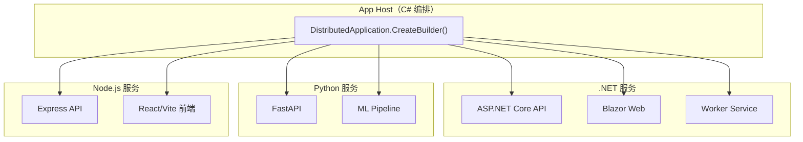
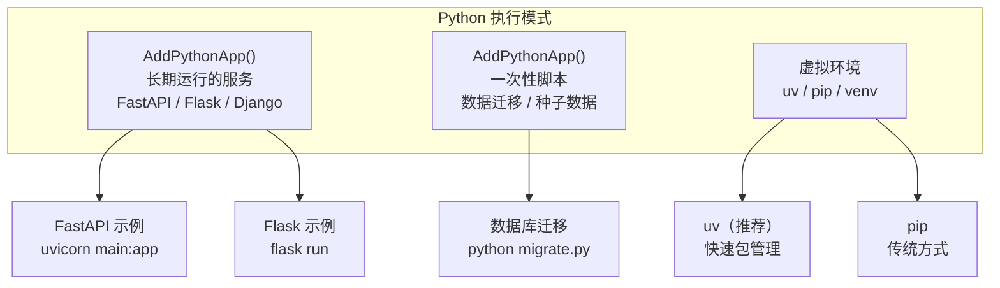
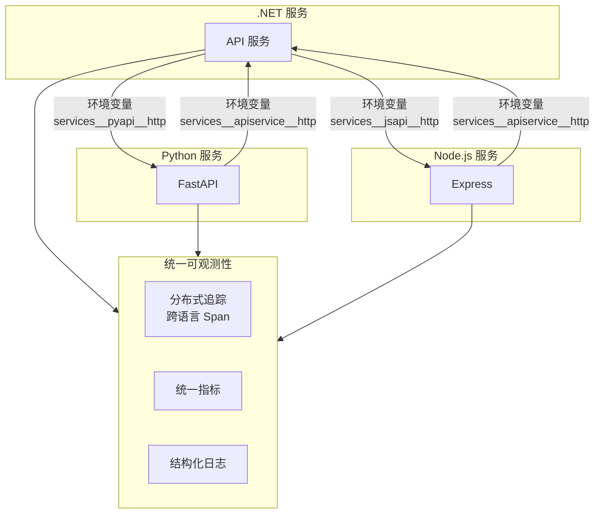
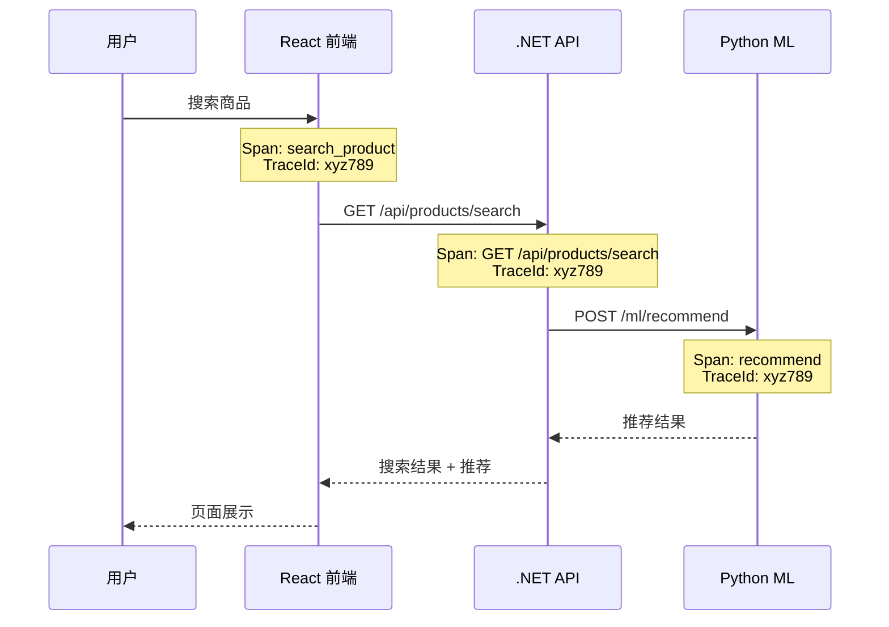
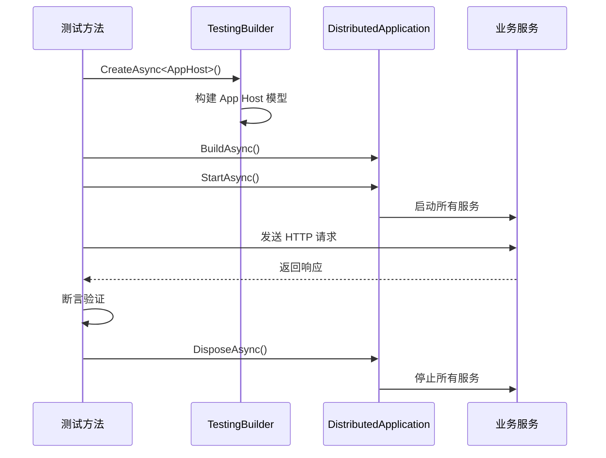
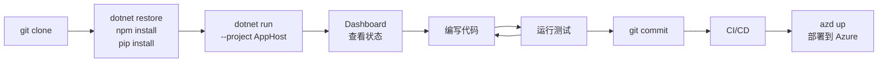

## 一、多语言编排

Aspire 13 的标志性变化是将 Python 和 JavaScript 提升为一等公民。App Host 仍然用 C# 编写编排逻辑，但被编排的资源不再限于 .NET。

### 1.1 多语言架构



### 1.2 语言支持矩阵

| 语言 | 集成包 | 添加方式 | 调试支持 | 容器化 |
| --- | --- | --- | --- | --- |
| C# / .NET | 内置 | `AddProject<T>()` | 完整 | 自动 |
| Python | `Aspire.Hosting.Python` | `AddPythonApp()` | 支持 | 自动生成 Dockerfile |
| Node.js | `Aspire.Hosting.JavaScript` | `AddNpmApp()` | 支持 | 自动生成 Dockerfile |
| Go | 通用 | `AddExecutable()` | 有限 | `PublishAsDockerFile()` |
| Java | 通用 | `AddExecutable()` | 有限 | `PublishAsDockerFile()` |

## 二、Python 集成

### 2.1 安装

```bash
# App Host 项目
dotnet add package Aspire.Hosting.Python
```

### 2.2 三种执行模式



### 2.3 FastAPI 服务示例

项目结构：

```
python-api/
├── main.py
├── requirements.txt
└── .venv/
```

`main.py`：

```python
from fastapi import FastAPI
from opentelemetry import trace
import os

app = FastAPI()
tracer = trace.get_tracer("python-api")

@app.get("/api/data")
async def get_data():
    # 从环境变量获取 .NET 服务地址
    api_url = os.environ.get("services__apiservice__http", "http://localhost:5000")

    with tracer.start_as_current_span("get_data") as span:
        span.set_attribute("service", "python-api")
        return {"message": "Hello from Python", "api_url": api_url}

@app.get("/health")
async def health():
    return {"status": "healthy"}
```

`requirements.txt`：

```
fastapi==0.115.0
uvicorn==0.32.0
opentelemetry-api==1.28.0
opentelemetry-sdk==1.28.0
```

App Host 配置：

```csharp
var pythonApi = builder.AddPythonApp("pyapi", "../python-api", "main.py")
    .WithHttpEndpoint(port: 8000)
    .WithHttpHealthCheck("/health");

// .NET 服务引用 Python API
builder.AddProject<Projects.MyApp_Web>("webfrontend")
    .WithReference(pythonApi);
```

### 2.4 包管理器选择

```csharp
// 使用 uv（推荐，速度最快）
var api = builder.AddPythonApp("pyapi", "../python-api", "main.py")
    .WithUvPackageManagement();

// 使用 pip
var api = builder.AddPythonApp("pyapi", "../python-api", "main.py")
    .WithPipPackageManagement();

// 使用虚拟环境
var api = builder.AddPythonApp("pyapi", "../python-api", "main.py")
    .WithVirtualEnvironment("../python-api/.venv");
```

## 三、JavaScript 集成

### 3.1 安装

```bash
# App Host 项目
dotnet add package Aspire.Hosting.JavaScript
```

### 3.2 Vite 前端示例

项目结构：

```
web-frontend/
├── package.json
├── vite.config.ts
├── src/
│   ├── App.tsx
│   └── main.tsx
└── index.html
```

App Host 配置：

```csharp
var frontend = builder.AddNpmApp("frontend", "../web-frontend", "dev")
    .WithHttpEndpoint(port: 3000, env: "PORT")
    .WithHttpHealthCheck("/health")
    .WithExternalHttpEndpoints();

// 前端引用 API 服务
var apiService = builder.AddProject<Projects.MyApp_ApiService>("apiservice");
frontend.WithReference(apiService);
```

`vite.config.ts` 中配置代理：

```typescript
export default defineConfig({
  server: {
    proxy: {
      '/api': {
        target: process.env.SERVICE_API_HTTP || 'http://localhost:5000',
        changeOrigin: true,
      }
    }
  }
});
```

### 3.3 Express API 示例

```csharp
var jsApi = builder.AddNpmApp("jsapi", "../js-api", "start")
    .WithHttpEndpoint(port: 3001, env: "PORT");

builder.AddProject<Projects.MyApp_Web>("webfrontend")
    .WithReference(jsApi);
```

### 3.4 包管理器自动检测

`AddNpmApp()` 自动检测项目使用的包管理器：

| 检测文件 | 包管理器 |
| --- | --- |
| `pnpm-lock.yaml` | pnpm |
| `yarn.lock` | yarn |
| `package-lock.json` | npm |
| 无锁文件 | npm（默认） |

## 四、多语言服务通信

### 4.1 通信方式



### 4.2 环境变量注入规则

所有语言通过相同的环境变量命名规范获取服务地址：

| 环境变量 | 格式 | 示例 |
| --- | --- | --- |
| HTTP 端点 | `services__{name}__http` | `http://localhost:8000` |
| HTTPS 端点 | `services__{name}__https` | `https://localhost:8001` |
| 连接字符串 | `ConnectionStrings__{name}` | `Host=localhost;Port=5432;Database=appdb` |

Python 读取：

```python
import os
api_url = os.environ.get("services__apiservice__http")
```

Node.js 读取：

```javascript
const apiUrl = process.env.SERVICES_APISERVICE_HTTP;
```

### 4.3 跨语言追踪

Aspire 自动为所有语言的服务配置 OpenTelemetry，实现跨语言分布式追踪：



## 五、集成测试

### 5.1 Aspire.Hosting.Testing

Aspire 提供了专门的测试框架，让你可以在集成测试中启动完整的 Aspire 应用：

```bash
dotnet add package Aspire.Hosting.Testing
```

### 5.2 创建测试项目

```csharp
// Tests/IntegrationTests/IntegrationTest.cs
public class IntegrationTest : IAsyncLifetime
{
    private DistributedApplication _app;
    private HttpClient _client;

    public async Task InitializeAsync()
    {
        // 构建 App Host
        var appHost = await DistributedApplicationTestingBuilder
            .CreateAsync<Projects.MyApp_AppHost>();

        // 启动所有服务
        _app = await appHost.BuildAsync();
        await _app.StartAsync();

        // 获取 HTTP 客户端
        _client = _app.CreateHttpClient("webfrontend");
    }

    [Fact]
    public async Task WebFrontend_ReturnsSuccess()
    {
        var response = await _client.GetAsync("/");
        response.EnsureSuccessStatusCode();
    }

    [Fact]
    public async Task ApiService_ReturnsWeatherData()
    {
        var apiClient = _app.CreateHttpClient("apiservice");
        var response = await apiClient.GetAsync("/weatherforecast");
        response.EnsureSuccessStatusCode();

        var data = await response.Content.ReadFromJsonAsync<WeatherForecast[]>();
        Assert.NotEmpty(data);
    }

    public async Task DisposeAsync()
    {
        await _app.DisposeAsync();
    }
}
```

### 5.3 测试资源替换

在测试中，可以用轻量级资源替换真实的基础设施：

```csharp
public async Task InitializeAsync()
{
    var builder = await DistributedApplicationTestingBuilder
        .CreateAsync<Projects.MyApp_AppHost>();

    // 替换 PostgreSQL 为 SQLite（更快）
    builder.Resources.Remove(builder.Resources.Single(r => r.Name == "postgres"));
    // 添加 SQLite 替代

    // 替换 Redis 为内存缓存
    builder.Resources.Remove(builder.Resources.Single(r => r.Name == "cache"));

    _app = await builder.BuildAsync();
    await _app.StartAsync();
}
```

### 5.4 测试消息队列

```csharp
[Fact]
public async Task OrderCreated_PublishesToRabbitMQ()
{
    // 获取 RabbitMQ 连接
    var rabbitmq = _app.GetConnectionString("rabbitmq");
    var factory = new ConnectionFactory { Uri = new Uri(rabbitmq) };

    using var connection = factory.CreateConnection();
    using var channel = connection.CreateModel();

    // 声明测试队列
    channel.QueueDeclare("test-orders", durable: false, autoDelete: true);

    // 触发订单创建
    var apiClient = _app.CreateHttpClient("apiservice");
    await apiClient.PostAsJsonAsync("/api/orders", new { ProductId = 1, Quantity = 2 });

    // 验证消息已发布
    var result = channel.BasicGet("test-orders", autoAck: true);
    Assert.NotNull(result);
}
```

### 5.5 测试生命周期



## 六、常见踩坑

### 6.1 Python 虚拟环境问题

**症状**：`AddPythonApp()` 启动失败，提示找不到模块。

**原因**：虚拟环境未创建或路径不正确。

**解决**：

```bash
# 在 Python 项目目录下创建虚拟环境
cd python-api
python -m venv .venv
.venv/Scripts/pip install -r requirements.txt  # Windows
# .venv/bin/pip install -r requirements.txt    # Linux/macOS
```

```csharp
// App Host 中指定虚拟环境路径
var api = builder.AddPythonApp("pyapi", "../python-api", "main.py")
    .WithVirtualEnvironment("../python-api/.venv/bin/python");
```

### 6.2 Node.js 端口冲突

**症状**：前端启动失败，端口已被占用。

**原因**：Vite 默认使用 5173 端口，可能与 Aspire 分配的端口冲突。

**解决**：

```csharp
// 通过环境变量指定端口
var frontend = builder.AddNpmApp("frontend", "../web-frontend", "dev")
    .WithHttpEndpoint(port: 3000, env: "PORT");
    //                                   ↑↑↑
    //              将分配的端口写入 PORT 环境变量
```

Vite 会自动读取 `PORT` 环境变量。

### 6.3 容器镜像拉取慢

**症状**：首次启动耗时很长，Docker 拉取镜像慢。

**解决**：

1. 配置 Docker 镜像加速器
2. 预先拉取常用镜像：

```bash
docker pull redis:7-alpine
docker pull postgres:16-alpine
docker pull rabbitmq:3-management-alpine
```

3. 使用 Alpine 变体（体积更小）：

```csharp
var redis = builder.AddRedis("cache")
    .WithImageTag("7-alpine");  // 使用 Alpine 镜像
```

### 6.4 跨域（CORS）问题

**症状**：前端调用 API 时浏览器报 CORS 错误。

**原因**：Vite 开发服务器和 API 服务在不同端口。

**解决**：在 Vite 中配置代理：

```typescript
// vite.config.ts
export default defineConfig({
  server: {
    proxy: {
      '/api': {
        target: process.env.SERVICE_APISERVICE_HTTP || 'http://localhost:5000',
        changeOrigin: true,
      }
    }
  }
});
```

### 6.5 健康检查超时

**症状**：`WaitFor()` 等待时间过长，服务启动慢。

**原因**：默认健康检查间隔较长。

**解决**：自定义健康检查配置：

```csharp
var api = builder.AddProject<Projects.MyApp_ApiService>("apiservice")
    .WithHttpHealthCheck("/health", interval: TimeSpan.FromSeconds(2));
```

### 6.6 连接字符串中的特殊字符

**症状**：数据库连接失败，密码包含特殊字符。

**原因**：连接字符串中的 `@`、`;`、`=` 等字符需要转义。

**解决**：使用 `AddParameter()` 管理密码，Aspire 会自动处理转义：

```csharp
var dbPassword = builder.AddParameter("db-password", secret: true);
var postgres = builder.AddPostgres("postgres", password: dbPassword);
```

## 七、最佳实践

### 7.1 项目结构

```
MyApp/
├── src/
│   ├── MyApp.AppHost/           # 编排入口
│   ├── MyApp.ServiceDefaults/   # 共享配置
│   ├── MyApp.ApiService/        # .NET API
│   ├── MyApp.Web/               # .NET Web 前端
│   ├── python-api/              # Python API
│   │   ├── main.py
│   │   ├── requirements.txt
│   │   └── .venv/
│   └── web-frontend/            # React 前端
│       ├── package.json
│       ├── vite.config.ts
│       └── src/
├── tests/
│   └── MyApp.IntegrationTests/
└── MyApp.sln
```

### 7.2 开发工作流



### 7.3 关键原则

| 原则 | 说明 |
| --- | --- |
| **用 C# 编排，不限制运行时** | App Host 用 C# 定义拓扑，但服务可以用任何语言 |
| **服务发现优于硬编码** | 使用 `https+http://servicename` 而非 `localhost:port` |
| **WaitFor 优于手动等待** | 让 Aspire 管理启动顺序 |
| **参数化优于硬编码** | 用 `AddParameter()` 管理敏感信息 |
| **仿真器模式** | 开发用容器，生产用托管服务 |
| **测试覆盖** | 用 `Aspire.Hosting.Testing` 写集成测试 |

### 7.4 性能优化

- 使用 Alpine 镜像减小容器体积
- 预拉取常用镜像
- 开发时使用 `WaitForStart()` 替代 `WaitFor()` 加速启动
- 调整健康检查间隔
- 使用 `WithExplicitStart()` 延迟启动非必要服务

---

> **系列完结**。回顾全部七篇教程：
> - [第一篇：概述与快速上手](tutorial.html?type=aspire&file=01概述与快速上手.md)
> - [第二篇：App Host 编排模型](tutorial.html?type=aspire&file=02AppHost编排模型.md)
> - [第三篇：服务通信与发现](tutorial.html?type=aspire&file=03服务通信与发现.md)
> - [第四篇：集成外部依赖](tutorial.html?type=aspire&file=04集成外部依赖.md)
> - [第五篇：可观测性与 Dashboard](tutorial.html?type=aspire&file=05可观测性与Dashboard.md)
> - [第六篇：部署与发布](tutorial.html?type=aspire&file=06部署与发布.md)
> - [第七篇：多语言编排与测试](tutorial.html?type=aspire&file=07多语言编排与测试.md)
