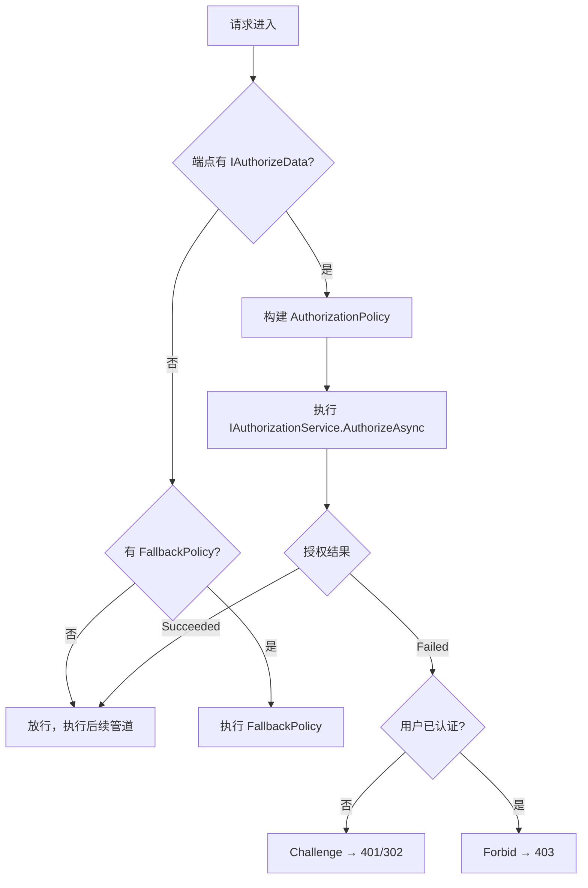
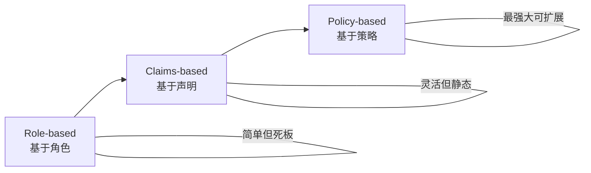
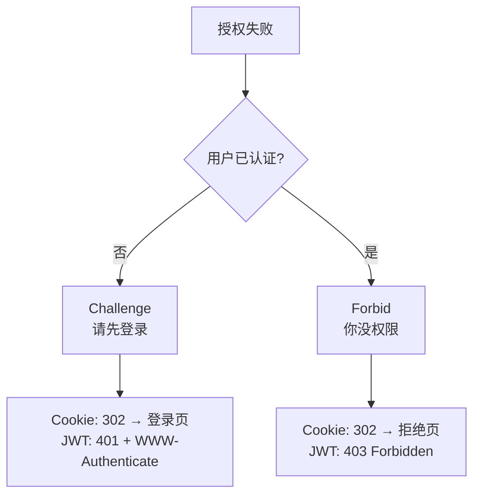

## 一、授权是什么

**授权（Authorization）** 回答的问题是：**你能做什么？**

认证确认了"你是谁"，授权决定"你能访问什么"。在 ASP.NET Core 中，授权建立在认证之上——它读取 `HttpContext.User` 中的声明（Claims），然后根据规则决定是否放行。

## 二、授权中间件的工作流程

### 2.1 注册中间件

```csharp
app.UseAuthentication(); // 先认证
app.UseAuthorization();  // 再授权
```

### 2.2 中间件做了什么

`AuthorizationMiddleware` 的核心流程：



```csharp
// 伪代码
public async Task Invoke(HttpContext context)
{
    var endpoint = context.GetEndpoint();

    // 检查端点上的 IAuthorizeData（来自 [Authorize] 特性）
    var authorizeData = endpoint?.Metadata.GetOrderedMetadata<IAuthorizeData>();

    if (authorizeData?.Count > 0)
    {
        // 执行授权检查
        var result = await context.AuthorizeAsync(authorizeData);

        if (!result.Succeeded)
        {
            // 授权失败：触发 Challenge 或 Forbid
            if (context.User.Identity?.IsAuthenticated != true)
                await context.ChallengeAsync();  // 未认证 → 401/302
            else
                await context.ForbidAsync();      // 已认证但无权限 → 403

            return; // 短路，不执行后续管道
        }
    }

    await _next(context);
}
```

关键理解：
- 中间件**只在端点有授权元数据时**才工作
- 没有 `[Authorize]` 的端点不会被检查
- 授权失败会短路请求，不会到达控制器

## 三、三层授权模型

ASP.NET Core 提供了三种授权方式，从简单到灵活逐层递进：



| 模型 | 适用场景 | 复杂度 |
| --- | --- | --- |
| Role-based | 简单的角色划分（Admin/User） | 低 |
| Claims-based | 基于用户属性（年龄>18、部门=IT） | 中 |
| Policy-based | 复杂业务规则（组合条件、资源相关） | 高 |

### 3.1 基于角色的授权（Role-based）

最简单直接的方式，检查用户是否属于某个角色。

```csharp
// 控制器级别
[Authorize(Roles = "Admin")]
public class AdminController : Controller { }

// 方法级别
[Authorize(Roles = "Admin,Manager")] // 逗号分隔 = OR 关系
public IActionResult Dashboard() => View();

// 多个 [Authorize] = AND 关系
[Authorize(Roles = "Admin")]
[Authorize(Roles = "SuperUser")]
public IActionResult Secret() => View();
```

**角色声明从哪来？** 来自 `ClaimTypes.Role`：

```csharp
var claims = new List<Claim>
{
    new(ClaimTypes.Role, "Admin"),
    new(ClaimTypes.Role, "Manager")
};
```

**局限**：角色是硬编码的字符串，修改规则需要改代码重新部署。

### 3.2 基于声明的授权（Claims-based）

不依赖角色名，而是检查用户的具体声明值。

```csharp
// 检查是否有某个声明
[Authorize(Policy = "EmployeeOnly")]
public IActionResult TimeSheet() => View();

// 注册策略
builder.Services.AddAuthorization(options =>
{
    options.AddPolicy("EmployeeOnly", policy =>
        policy.RequireClaim("EmployeeNumber"));
});

// 检查声明的值
options.AddPolicy("VIPOnly", policy =>
    policy.RequireClaim("MembershipLevel", "Gold", "Platinum"));
```

**声明的灵活性**：声明可以是任何键值对，不受角色名限制。

```csharp
var claims = new List<Claim>
{
    new("EmployeeNumber", "E12345"),
    new("MembershipLevel", "Gold"),
    new("Department", "Engineering"),
    new("HireDate", "2023-01-15")
};
```

### 3.3 基于策略的授权（Policy-based）

策略是 ASP.NET Core 授权的**核心抽象**。角色和声明授权本质上都是策略的语法糖。

```csharp
builder.Services.AddAuthorization(options =>
{
    // 组合多个条件
    options.AddPolicy("SeniorEngineer", policy =>
        policy
            .RequireRole("Engineer")
            .RequireClaim("Department", "Engineering")
            .RequireClaim("Level", "Senior"));

    // 使用自定义需求
    options.AddPolicy("AtLeast21", policy =>
        policy.Requirements.Add(new MinimumAgeRequirement(21)));
});
```

**策略 = 一组需求（Requirements）**，每个需求可以有一个或多个处理器（Handler）。

## 四、[Authorize] 特性详解

### 4.1 三个属性

```csharp
[AttributeUsage(AttributeTargets.Class | AttributeTargets.Method)]
public class AuthorizeAttribute : Attribute, IAuthorizeData
{
    public string? Policy { get; set; }     // 策略名
    public string? Roles { get; set; }      // 角色名（逗号分隔）
    public string? AuthenticationSchemes { get; set; } // 认证方案
}
```

### 4.2 使用方式

```csharp
// 指定策略
[Authorize(Policy = "SeniorEngineer")]

// 指定角色
[Authorize(Roles = "Admin")]

// 指定认证方案
[Authorize(AuthenticationSchemes = JwtBearerDefaults.AuthenticationScheme)]

// 组合使用
[Authorize(Policy = "SeniorEngineer", AuthenticationSchemes = "Bearer")]
```

### 4.3 [AllowAnonymous] 覆盖

```csharp
[Authorize] // 控制器级别：所有方法都需要授权
public class AccountController : Controller
{
    public IActionResult Dashboard() => View(); // 需要授权

    [AllowAnonymous] // 覆盖控制器级别的 [Authorize]
    public IActionResult Login() => View();     // 不需要授权
}
```

### 4.4 全局授权 + 局部放行

更推荐的做法——默认全部需要授权，显式标记公开端点：

```csharp
// 全局授权过滤器
builder.Services.AddAuthorization(options =>
{
    options.FallbackPolicy = new AuthorizationPolicyBuilder()
        .RequireAuthenticatedUser()
        .Build();
});

// 需要公开的端点显式标记
[AllowAnonymous]
public IActionResult Login() => View();
```

## 五、授权的完整流程

一个请求从进入到授权决策的完整链路：

```
1. 请求进入 AuthorizationMiddleware
2. 从 Endpoint.Metadata 获取 IAuthorizeData 列表
3. 如果没有授权元数据，检查 FallbackPolicy
4. 将 IAuthorizeData 转换为 AuthorizationPolicy：
   - 合并 Policy、Roles、AuthenticationSchemes
5. 执行 IAuthorizationService.AuthorizeAsync()
6. 遍历策略中的所有 Requirements
7. 对每个 Requirement 查找对应的 Handler
8. 所有 Handler 投票决定结果
9. 返回结果：Succeeded / Failed
10. 失败时：未认证 → Challenge，已认证 → Forbid
```

### 5.1 AuthorizationPolicy 的构建

`[Authorize(Roles = "Admin", Policy = "SeniorEngineer")]` 会被合并为一个 `AuthorizationPolicy`：

```csharp
// 等价于
var policy = new AuthorizationPolicyBuilder()
    .RequireRole("Admin")              // 来自 Roles 属性
    .Combine(seniorEngineerPolicy)      // 来自 Policy 属性
    .AddAuthenticationSchemes("Bearer") // 来自 AuthenticationSchemes 属性
    .Build();
```

### 5.2 授权服务的核心接口

```csharp
public interface IAuthorizationService
{
    Task<AuthorizationResult> AuthorizeAsync(
        ClaimsPrincipal user,
        object? resource,
        AuthorizationPolicy policy);

    Task<AuthorizationResult> AuthorizeAsync(
        ClaimsPrincipal user,
        object? resource,
        string policyName);
}
```

`AuthorizationResult` 只有两个状态：

```csharp
AuthorizationResult.Success()  // 通过
AuthorizationResult.Failed()   // 拒绝（包含失败原因）
```

## 六、Challenge 和 Forbid 的区别

这两个概念经常被混淆：



| | Challenge | Forbid |
| --- | --- | --- |
| 触发条件 | 用户**未认证** | 用户**已认证但无权限** |
| 含义 | "你是谁？请先登录" | "我知道你是谁，但你没权限" |
| Cookie 行为 | 302 重定向到登录页 | 302 重定向到拒绝页 |
| JWT 行为 | 401 + WWW-Authenticate 头 | 403 Forbidden |

```csharp
// 手动触发
await HttpContext.ChallengeAsync();  // 未认证时触发
await HttpContext.ForbidAsync();     // 无权限时触发
```

## 七、常见踩坑

### 7.1 角色名大小写敏感

```csharp
// 声明中是 "admin"
new(ClaimTypes.Role, "admin")

// 授权检查是 "Admin"
[Authorize(Roles = "Admin")]  // ❌ 不匹配！
```

解决方案：统一大小写规范，或在认证时规范化角色名。

### 7.2 多个 [Authorize] 是 AND 关系

```csharp
// 用户必须同时是 Admin AND Manager
[Authorize(Roles = "Admin")]
[Authorize(Roles = "Manager")]
public IActionResult Both() => View();

// 用户只需要是 Admin OR Manager
[Authorize(Roles = "Admin,Manager")]
public IActionResult Either() => View();
```

### 7.3 全局 FallbackPolicy 与控制器 [Authorize] 的交互

设置了 `FallbackPolicy` 后，`[Authorize]` 仍然生效。`FallbackPolicy` 只影响**没有任何授权元数据的端点**。

### 7.4 控制器上的 [Authorize] 会被 Action 上的覆盖

```csharp
[Authorize(Roles = "Admin")]        // 控制器级别
public class AdminController : Controller
{
    [Authorize(Roles = "SuperAdmin")] // Action 级别：替换而非合并！
    public IActionResult Secret() => View();
}
```

在 ASP.NET Core 中，Action 上的 `[Authorize]` 会**与** Controller 上的**合并**，所以上面实际要求同时满足 Admin AND SuperAdmin。如果 Action 上是 `[AllowAnonymous]`，则完全覆盖。

## 八、三种模型的选型建议

| 场景 | 推荐模型 | 理由 |
| --- | --- | --- |
| 简单后台管理（Admin/User） | Role-based | 最简单，够用 |
| 多租户、多维度权限 | Claims-based | 声明灵活，可扩展 |
| 复杂业务规则（审批流、条件组合） | Policy-based | 最强大，可注入服务 |
| 生产项目 | Policy-based | 统一用策略，后续扩展不需要重构 |

**实战建议**：即使是简单场景，也建议用 Policy-based。因为角色和声明授权只是策略的简化写法，用策略可以保持架构一致性，后续加需求不用重构。

## 九、总结

| 概念 | 一句话 |
| --- | --- |
| 授权中间件 | 检查端点元数据，执行策略，失败则短路 |
| Role-based | 检查 `ClaimTypes.Role`，简单但死板 |
| Claims-based | 检查任意声明，灵活但仍是静态规则 |
| Policy-based | 策略 = 需求 + 处理器，最强大的抽象 |
| Challenge | 未认证 → 请登录 |
| Forbid | 已认证但无权限 → 拒绝 |

下一篇我们将深入**自定义认证处理器**，实现 API Key、签名验证等非标准认证方式。
