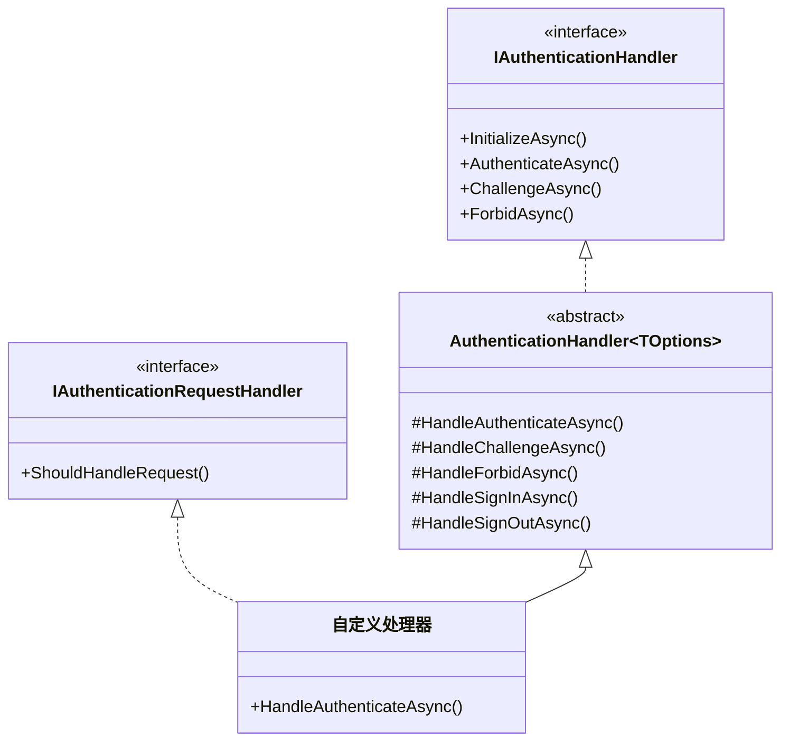
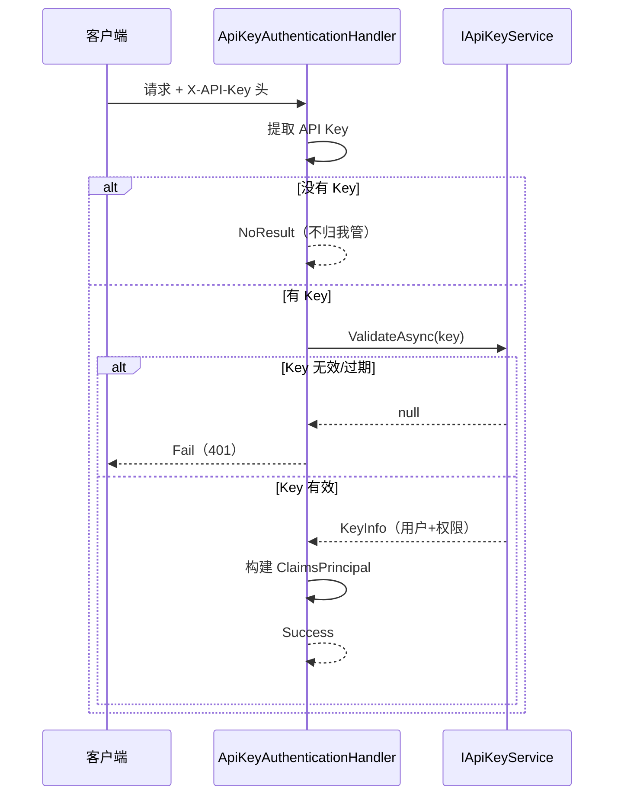
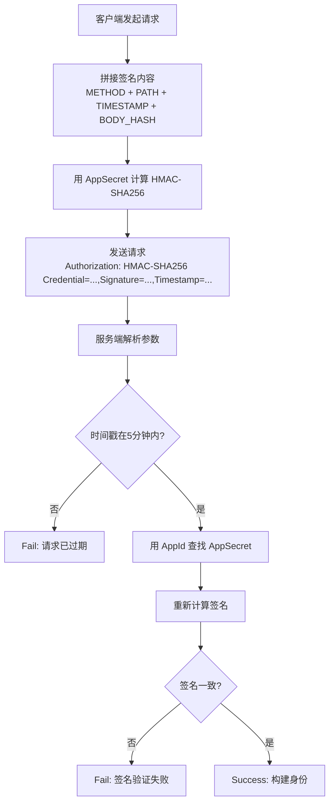

## 一、什么时候需要自定义认证处理器

内置的 Cookie 和 JWT 认证覆盖了 90% 的场景，但有些时候你需要对接非标准协议：

| 场景 | 为什么内置方案不够 |
| --- | --- |
| API Key 认证 | 不是 Cookie 也不是 Bearer Token |
| HMAC 签名验证 | 需要验证请求体的签名 |
| 自定义 Token 格式 | 不是 JWT，可能是加密字符串或数据库 Token |
| 多租户 Header 认证 | 从自定义 Header 中提取租户和身份信息 |
| 遗留系统对接 | 老系统的 Session 机制 |

这些场景的核心思路都一样：**实现 `AuthenticationHandler<TOptions>`**。

## 二、AuthenticationHandler 核心概念

### 2.1 类层次结构



### 2.2 四个核心方法

`AuthenticationHandler<T>` 定义了四个可重写的方法，对应认证的四个阶段：

| 方法 | 作用 | 返回值 |
| --- | --- | --- |
| `HandleAuthenticateAsync()` | **核心**：从请求中提取凭据并验证 | `AuthenticateResult` |
| `HandleChallengeAsync()` | 未认证时如何响应（401/302） | 默认返回 401 |
| `HandleForbidAsync()` | 无权限时如何响应（403） | 默认返回 403 |
| `HandleSignInAsync()` | 登录（某些方案需要） | 默认抛异常 |
| `HandleSignOutAsync()` | 登出（某些方案需要） | 默认抛异常 |

你**只需要重写 `HandleAuthenticateAsync`**，其他方法有合理的默认实现。

## 三、实战：API Key 认证

### 3.1 需求

- 客户端在请求头 `X-API-Key` 中携带 API Key
- 服务端验证 Key 是否有效，并加载对应的身份信息
- Key 存储在数据库中，关联了用户和权限



### 3.2 定义 Options

```csharp
public class ApiKeyAuthenticationOptions : AuthenticationSchemeOptions
{
    public string HeaderName { get; set; } = "X-API-Key";
    public string SchemeName { get; set; } = "ApiKey";
}
```

### 3.3 实现处理器

```csharp
public class ApiKeyAuthenticationHandler : AuthenticationHandler<ApiKeyAuthenticationOptions>
{
    private readonly IApiKeyService _apiKeyService;

    public ApiKeyAuthenticationHandler(
        IOptionsMonitor<ApiKeyAuthenticationOptions> options,
        ILoggerFactory logger,
        UrlEncoder encoder,
        IApiKeyService apiKeyService)
        : base(options, logger, encoder)
    {
        _apiKeyService = apiKeyService;
    }

    protected override async Task<AuthenticateResult> HandleAuthenticateAsync()
    {
        // 1. 从请求头中提取 API Key
        if (!Request.Headers.TryGetValue(Options.HeaderName, out var apiKeyValues))
        {
            return AuthenticateResult.NoResult(); // 没有 Key，不报错，交给其他方案
        }

        var apiKey = apiKeyValues.FirstOrDefault();
        if (string.IsNullOrEmpty(apiKey))
        {
            return AuthenticateResult.NoResult();
        }

        // 2. 验证 Key 是否有效
        var keyInfo = await _apiKeyService.ValidateAsync(apiKey);
        if (keyInfo == null)
        {
            return AuthenticateResult.Fail("无效的 API Key");
        }

        // 3. 检查 Key 是否过期
        if (keyInfo.ExpiresAt < DateTime.UtcNow)
        {
            return AuthenticateResult.Fail("API Key 已过期");
        }

        // 4. 构建身份声明
        var claims = new List<Claim>
        {
            new(ClaimTypes.NameIdentifier, keyInfo.UserId),
            new(ClaimTypes.Name, keyInfo.UserName),
            new("ApiKey", apiKey),
            new("ApiKeyScopes", string.Join(",", keyInfo.Scopes))
        };

        // 添加角色声明
        foreach (var role in keyInfo.Roles)
        {
            claims.Add(new Claim(ClaimTypes.Role, role));
        }

        var identity = new ClaimsIdentity(claims, Scheme.Name);
        var principal = new ClaimsPrincipal(identity);

        // 5. 记录 Key 使用日志（异步不阻塞）
        _ = _apiKeyService.LogUsageAsync(apiKey);

        return AuthenticateResult.Success(
            new AuthenticationTicket(principal, Scheme.Name));
    }

    protected override Task HandleChallengeAsync(AuthenticationProperties properties)
    {
        Response.StatusCode = 401;
        Response.Headers.Append("WWW-Authenticate", $"ApiKey header=\"{Options.HeaderName}\"");
        return Task.CompletedTask;
    }

    protected override Task HandleForbidAsync(AuthenticationProperties properties)
    {
        Response.StatusCode = 403;
        return Task.CompletedTask;
    }
}
```

### 3.4 注册认证方案

```csharp
// 扩展方法，保持注册代码整洁
public static class ApiKeyAuthenticationExtensions
{
    public static AuthenticationBuilder AddApiKey(
        this AuthenticationBuilder builder,
        Action<ApiKeyAuthenticationOptions>? configure = null)
    {
        return builder.AddScheme<ApiKeyAuthenticationOptions, ApiKeyAuthenticationHandler>(
            ApiKeyAuthenticationDefaults.SchemeName,
            configure);
    }
}

public static class ApiKeyAuthenticationDefaults
{
    public const string SchemeName = "ApiKey";
}
```

### 3.5 在 Program.cs 中使用

```csharp
builder.Services.AddScoped<IApiKeyService, ApiKeyService>();

builder.Services.AddAuthentication(options =>
{
    options.DefaultScheme = JwtBearerDefaults.AuthenticationScheme;
})
.AddJwtBearer()
.AddApiKey(options =>
{
    options.HeaderName = "X-API-Key"; // 可自定义 Header 名
});

// API 控制器使用 API Key 认证
[Authorize(AuthenticationSchemes = ApiKeyAuthenticationDefaults.SchemeName)]
[ApiController]
[Route("api/[controller]")]
public class WebhooksController : ControllerBase { }
```

## 四、实战：HMAC 签名认证

### 4.1 需求

开放平台常见的签名认证方式：
- 客户端用 AppSecret 对请求体 + 时间戳进行 HMAC-SHA256 签名
- 服务端验证签名是否一致，防止篡改和重放



### 4.2 签名格式

```
Authorization: HMAC-SHA256 Credential=appId,Signature=base64签名,Timestamp=unix时间戳
```

签名内容：`HTTP方法\n路径\n时间戳\n请求体Hash`

### 4.3 实现处理器

```csharp
public class HmacAuthenticationHandler : AuthenticationHandler<HmacAuthenticationOptions>
{
    private readonly IAppCredentialService _credentialService;

    public HmacAuthenticationHandler(
        IOptionsMonitor<HmacAuthenticationOptions> options,
        ILoggerFactory logger,
        UrlEncoder encoder,
        IAppCredentialService credentialService)
        : base(options, logger, encoder)
    {
        _credentialService = credentialService;
    }

    protected override async Task<AuthenticateResult> HandleAuthenticateAsync()
    {
        // 1. 提取 Authorization 头
        if (!Request.Headers.TryGetValue("Authorization", out var authHeader))
        {
            return AuthenticateResult.NoResult();
        }

        var authValue = authHeader.ToString();
        if (!authValue.StartsWith("HMAC-SHA256 "))
        {
            return AuthenticateResult.NoResult();
        }

        // 2. 解析签名参数
        var parts = ParseHmacHeader(authValue);
        if (parts == null)
        {
            return AuthenticateResult.Fail("无效的 HMAC 签名格式");
        }

        var (appId, signature, timestamp) = parts.Value;

        // 3. 防重放：检查时间戳（5 分钟内有效）
        var requestTime = DateTimeOffset.FromUnixTimeSeconds(timestamp);
        if (Math.Abs((DateTimeOffset.UtcNow - requestTime).TotalMinutes) > 5)
        {
            return AuthenticateResult.Fail("请求已过期");
        }

        // 4. 获取 AppSecret
        var credential = await _credentialService.GetByAppIdAsync(appId);
        if (credential == null)
        {
            return AuthenticateResult.Fail("无效的 AppId");
        }

        // 5. 重新计算签名
        var expectedSignature = ComputeSignature(
            Request.Method,
            Request.Path,
            timestamp,
            await GetRequestBodyHashAsync(),
            credential.AppSecret);

        // 6. 比对签名（使用时间安全的比较方法）
        if (!CryptographicOperations.FixedTimeEquals(
            Convert.FromBase64String(signature),
            Convert.FromBase64String(expectedSignature)))
        {
            return AuthenticateResult.Fail("签名验证失败");
        }

        // 7. 构建身份
        var claims = new List<Claim>
        {
            new("AppId", appId),
            new(ClaimTypes.Name, credential.AppName)
        };

        var identity = new ClaimsIdentity(claims, Scheme.Name);
        var principal = new ClaimsPrincipal(identity);

        return AuthenticateResult.Success(
            new AuthenticationTicket(principal, Scheme.Name));
    }

    /// <summary>
    /// 解析 HMAC Authorization 头
    /// 格式：HMAC-SHA256 Credential=xxx,Signature=xxx,Timestamp=xxx
    /// </summary>
    private (string AppId, string Signature, long Timestamp)? ParseHmacHeader(string header)
    {
        var content = header["HMAC-SHA256 ".Length..];
        var dict = new Dictionary<string, string>();

        foreach (var pair in content.Split(','))
        {
            var kv = pair.Split('=', 2);
            if (kv.Length == 2)
                dict[kv[0].Trim()] = kv[1].Trim();
        }

        if (!dict.TryGetValue("Credential", out var appId) ||
            !dict.TryGetValue("Signature", out var signature) ||
            !dict.TryGetValue("Timestamp", out var tsStr) ||
            !long.TryParse(tsStr, out var timestamp))
        {
            return null;
        }

        return (appId, signature, timestamp);
    }

    /// <summary>
    /// 计算 HMAC-SHA256 签名
    /// 签名内容：METHOD\nPATH\nTIMESTAMP\nBODY_HASH
    /// </summary>
    private string ComputeSignature(string method, string path, long timestamp,
        string bodyHash, string secret)
    {
        var stringToSign = $"{method}\n{path}\n{timestamp}\n{bodyHash}";
        using var hmac = new HMACSHA256(Encoding.UTF8.GetBytes(secret));
        var hash = hmac.ComputeHash(Encoding.UTF8.GetBytes(stringToSign));
        return Convert.ToBase64String(hash);
    }

    /// <summary>
    /// 计算请求体的 SHA256 哈希
    /// </summary>
    private async Task<string> GetRequestBodyHashAsync()
    {
        Request.EnableBuffering();
        Request.Body.Position = 0;
        using var reader = new StreamReader(Request.Body, leaveOpen: true);
        var body = await reader.ReadToEndAsync();
        Request.Body.Position = 0;

        var hash = SHA256.HashData(Encoding.UTF8.GetBytes(body));
        return Convert.ToBase64String(hash);
    }
}
```

### 4.4 注册使用

```csharp
builder.Services.AddAuthentication()
    .AddJwtBearer()
    .AddScheme<HmacAuthenticationOptions, HmacAuthenticationHandler>(
        "HMAC-SHA256", options =>
    {
        // 可配置项：时间戳有效期、签名算法等
    });

// 开放 API 使用 HMAC 认证
[Authorize(AuthenticationSchemes = "HMAC-SHA256")]
[ApiController]
[Route("open/[controller]")]
public class OpenApiController : ControllerBase { }
```

## 五、AuthenticateResult 的三种返回值

这是自定义处理器中最容易搞错的地方：

| 返回值 | 含义 | 后续行为 |
| --- | --- | --- |
| `Success(ticket)` | 认证成功 | `HttpContext.User` 被设置 |
| `NoResult()` | 没有找到凭据 | 继续尝试其他方案（不报错） |
| `Fail("原因")` | 凭据无效 | 记录失败原因，触发 Challenge |

**关键区别**：
- `NoResult()` — "这个请求不归我管"，比如 API Key 处理器没看到 `X-API-Key` 头
- `Fail()` — "这个请求归我管，但凭据无效"，比如 Key 存在但验证失败

## 六、IAuthenticationRequestHandler

默认情况下，`HandleChallengeAsync` 和 `HandleForbidAsync` 只在授权中间件调用时触发。如果你需要在**认证阶段**就处理 401/403（比如 API Key 认证失败直接返回错误），可以实现 `IAuthenticationRequestHandler`：

```csharp
public class ApiKeyAuthenticationHandler : AuthenticationHandler<ApiKeyAuthenticationOptions>,
    IAuthenticationRequestHandler
{
    // 是否应该接管这个请求的处理
    public bool ShouldHandleRequest(HttpContext context)
    {
        // 只处理带有 API Key 头的请求
        return context.Request.Headers.ContainsKey(Options.HeaderName);
    }
}
```

## 七、测试自定义处理器

### 7.1 单元测试

```csharp
[Fact]
public async Task HandleAuthenticateAsync_ValidKey_ReturnsSuccess()
{
    // Arrange
    var services = new ServiceCollection();
    services.AddSingleton<IApiKeyService, MockApiKeyService>();

    var httpContext = new DefaultHttpContext();
    httpContext.Request.Headers.Append("X-API-Key", "valid-key");

    var options = new ApiKeyAuthenticationOptions();
    var optionsMonitor = new TestOptionsMonitor<ApiKeyAuthenticationOptions>(options);

    var handler = new ApiKeyAuthenticationHandler(
        optionsMonitor,
        LoggerFactory.Create(b => b.AddDebug()),
        UrlEncoder.Default,
        new MockApiKeyService());

    await handler.InitializeAsync(
        new AuthenticationScheme("ApiKey", null, typeof(ApiKeyAuthenticationHandler)),
        httpContext);

    // Act
    var result = await handler.AuthenticateAsync();

    // Assert
    Assert.True(result.Succeeded);
    Assert.Equal("user-123", result.Principal?.FindFirst(ClaimTypes.NameIdentifier)?.Value);
}
```

### 7.2 集成测试

```csharp
[Fact]
public async Task ApiKey_ValidKey_Returns200()
{
    var client = _factory.CreateClient();
    client.DefaultRequestHeaders.Add("X-API-Key", "valid-key");

    var response = await client.GetAsync("/api/webhooks/events");

    Assert.Equal(HttpStatusCode.OK, response.StatusCode);
}

[Fact]
public async Task ApiKey_InvalidKey_Returns401()
{
    var client = _factory.CreateClient();
    client.DefaultRequestHeaders.Add("X-API-Key", "invalid-key");

    var response = await client.GetAsync("/api/webhooks/events");

    Assert.Equal(HttpStatusCode.Unauthorized, response.StatusCode);
}
```

## 八、常见踩坑

### 8.1 读取请求体后流位置未重置

```csharp
// ❌ 读取后未重置，后续中间件读到空 body
var body = await new StreamReader(Request.Body).ReadToEndAsync();

// ✅ 启用缓冲 + 重置位置
Request.EnableBuffering();
var body = await new StreamReader(Request.Body).ReadToEndAsync();
Request.Body.Position = 0;
```

### 8.2 Fail 和 NoResult 混用

```csharp
// ❌ 没有 Header 就 Fail，会导致其他方案也没机会处理
if (!Request.Headers.TryGetValue(Options.HeaderName, out var key))
    return AuthenticateResult.Fail("缺少 API Key");

// ✅ 没有 Header 用 NoResult，让其他方案有机会处理
if (!Request.Headers.TryGetValue(Options.HeaderName, out var key))
    return AuthenticateResult.NoResult();
```

### 8.3 签名比较的时序攻击

```csharp
// ❌ 普通字符串比较，存在时序攻击风险
if (signature != expectedSignature)

// ✅ 使用固定时间比较
if (!CryptographicOperations.FixedTimeEquals(
    Convert.FromBase64String(signature),
    Convert.FromBase64String(expectedSignature)))
```

## 九、总结

| 概念 | 一句话 |
| --- | --- |
| AuthenticationHandler | 认证处理器的基类，只需重写 HandleAuthenticateAsync |
| Success / NoResult / Fail | 成功、不归我管、凭据无效 |
| API Key 认证 | 从自定义 Header 提取 Key，查库验证 |
| HMAC 签名认证 | 验证请求签名，防篡改防重放 |
| IAuthenticationRequestHandler | 在认证阶段就接管请求处理 |

下一篇我们将深入**策略授权与需求处理器**，实现资源级授权和动态策略。
