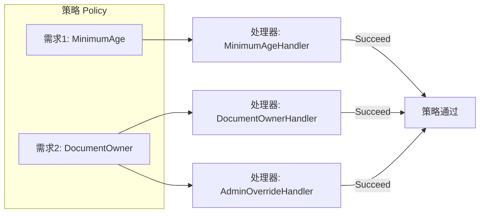
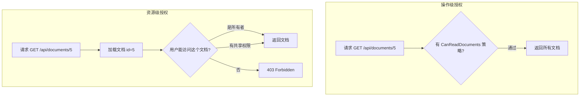
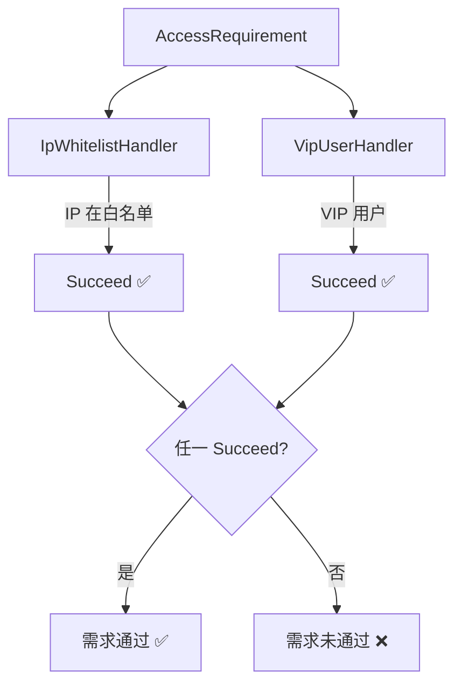

## 一、策略授权的核心模型

上一篇我们提到，Policy-based 是 ASP.NET Core 授权的核心抽象。一个策略由两部分组成：



- **需求**：描述"要检查什么"，是纯数据对象，实现 `IAuthorizationRequirement`
- **处理器**：描述"怎么检查"，包含实际逻辑，继承 `AuthorizationHandler<T>`

这种分离让需求和检查逻辑可以独立演化。

## 二、自定义需求与处理器

### 2.1 最简示例：最低年龄需求

```csharp
/// <summary>
/// 需求：用户必须达到最低年龄
/// </summary>
public class MinimumAgeRequirement : IAuthorizationRequirement
{
    public int MinimumAge { get; }

    public MinimumAgeRequirement(int minimumAge)
    {
        MinimumAge = minimumAge;
    }
}

/// <summary>
/// 处理器：检查用户的出生日期声明
/// </summary>
public class MinimumAgeHandler : AuthorizationHandler<MinimumAgeRequirement>
{
    protected override Task HandleRequirementAsync(
        AuthorizationHandlerContext context,
        MinimumAgeRequirement requirement)
    {
        // 查找出生日期声明
        var birthDateClaim = context.User.FindFirst("BirthDate");
        if (birthDateClaim == null)
            return Task.CompletedTask; // 没有声明，不做决定

        var birthDate = DateTime.Parse(birthDateClaim.Value);
        var age = DateTime.Today.Year - birthDate.Year;

        if (age >= requirement.MinimumAge)
        {
            context.Succeed(requirement); // 满足需求
        }

        return Task.CompletedTask; // 不调用 Succeed = 不满足
    }
}
```

### 2.2 注册策略和处理器

```csharp
// 注册处理器到 DI 容器
builder.Services.AddSingleton<IAuthorizationHandler, MinimumAgeHandler>();

// 注册策略
builder.Services.AddAuthorization(options =>
{
    options.AddPolicy("AtLeast18", policy =>
        policy.Requirements.Add(new MinimumAgeRequirement(18)));

    options.AddPolicy("AtLeast21", policy =>
        policy.Requirements.Add(new MinimumAgeRequirement(21)));
});

// 使用
[Authorize(Policy = "AtLeast21")]
public IActionResult BuyAlcohol() => View();
```

### 2.3 关键规则

- 处理器必须注册到 DI 容器（`AddSingleton`、`AddScoped` 等）
- 一个需求可以有**多个处理器**，任一处理器调用 `Succeed` 即通过
- 处理器不调用 `Succeed`，不代表 `Fail`——只是"未通过"
- 只有显式调用 `context.Fail()` 才是否定

## 三、处理器中注入服务

处理器通过 DI 构造函数注入，可以访问数据库、缓存等任何服务。

### 3.1 示例：文档访问权限

```csharp
/// <summary>
/// 需求：用户必须是文档的所有者或拥有共享权限
/// </summary>
public class DocumentOwnerRequirement : IAuthorizationRequirement { }

/// <summary>
/// 处理器：查询数据库检查文档权限
/// </summary>
public class DocumentOwnerHandler : AuthorizationHandler<DocumentOwnerRequirement, Document>
{
    private readonly IDocumentRepository _repository;

    public DocumentOwnerHandler(IDocumentRepository repository)
    {
        _repository = repository;
    }

    protected override async Task HandleRequirementAsync(
        AuthorizationHandlerContext context,
        DocumentOwnerRequirement requirement,
        Document resource)
    {
        var userId = context.User.FindFirst(ClaimTypes.NameIdentifier)?.Value;
        if (userId == null) return;

        // 检查是否是所有者
        if (resource.OwnerId == userId)
        {
            context.Succeed(requirement);
            return;
        }

        // 检查是否有共享权限
        var permission = await _repository.GetPermissionAsync(resource.Id, userId);
        if (permission?.CanRead == true)
        {
            context.Succeed(requirement);
        }
    }
}
```

注意：处理器注册为 **Scoped**（因为注入了 Scoped 的 Repository）：

```csharp
builder.Services.AddScoped<IAuthorizationHandler, DocumentOwnerHandler>();
```

## 四、资源级授权

### 4.1 什么是资源级授权

之前的授权都是**操作级**的——"你能不能访问这个接口"。但很多时候需要**资源级**授权——"你能不能访问**这个特定的文档/订单/项目**"。



```csharp
// 操作级：你能不能访问文档接口？
[Authorize(Policy = "CanReadDocuments")]
public IActionResult Get(int id) => View();

// 资源级：你能不能访问 id=5 的这个文档？
public async Task<IActionResult> Get(int id)
{
    var document = await _repository.GetByIdAsync(id);
    var result = await _authorizationService.AuthorizeAsync(
        User, document, "DocumentOwner");

    if (!result.Succeeded)
        return Forbid();

    return View(document);
}
```

### 4.2 IAuthorizationService 的资源授权 API

```csharp
public interface IAuthorizationService
{
    // 资源级授权：传入资源对象
    Task<AuthorizationResult> AuthorizeAsync(
        ClaimsPrincipal user, object? resource, string policyName);

    Task<AuthorizationResult> AuthorizeAsync(
        ClaimsPrincipal user, object? resource, AuthorizationPolicy policy);
}
```

### 4.3 完整的资源授权示例

```csharp
[ApiController]
[Route("api/[controller]")]
public class DocumentsController : ControllerBase
{
    private readonly IAuthorizationService _authorizationService;
    private readonly IDocumentRepository _repository;

    public DocumentsController(
        IAuthorizationService authorizationService,
        IDocumentRepository repository)
    {
        _authorizationService = authorizationService;
        _repository = repository;
    }

    [HttpGet("{id}")]
    public async Task<IActionResult> Get(int id)
    {
        var document = await _repository.GetByIdAsync(id);
        if (document == null) return NotFound();

        // 资源级授权检查
        var result = await _authorizationService.AuthorizeAsync(
            User, document, "DocumentOwner");

        if (!result.Succeeded) return Forbid();

        return Ok(document);
    }

    [HttpPut("{id}")]
    public async Task<IActionResult> Update(int id, UpdateDocumentRequest request)
    {
        var document = await _repository.GetByIdAsync(id);
        if (document == null) return NotFound();

        // 编辑需要更高权限
        var result = await _authorizationService.AuthorizeAsync(
            User, document, "DocumentEditor");

        if (!result.Succeeded) return Forbid();

        document.Title = request.Title;
        document.Content = request.Content;
        await _repository.UpdateAsync(document);

        return Ok(document);
    }
}
```

## 五、多需求处理器

### 5.1 一个需求多个处理器

当一个需求有多个处理器时，**任一处理器调用 Succeed 即通过**。这是"投票制"——多个检查者中有一个认可就行。



```csharp
// 需求：可以通过多种方式访问
public class AccessRequirement : IAuthorizationRequirement { }

// 处理器1：检查 IP 白名单
public class IpWhitelistHandler : AuthorizationHandler<AccessRequirement>
{
    private readonly IIpWhitelistService _ipService;

    public IpWhitelistHandler(IIpWhitelistService ipService) => _ipService = ipService;

    protected override Task HandleRequirementAsync(
        AuthorizationHandlerContext context, AccessRequirement requirement)
    {
        var clientIp = context.Resource as HttpContext?
            ?.Connection.RemoteIpAddress?.ToString();

        if (_ipService.IsWhitelisted(clientIp))
            context.Succeed(requirement);

        return Task.CompletedTask;
    }
}

// 处理器2：检查 VIP 用户
public class VipUserHandler : AuthorizationHandler<AccessRequirement>
{
    protected override Task HandleRequirementAsync(
        AuthorizationHandlerContext context, AccessRequirement requirement)
    {
        if (context.User.HasClaim("MembershipLevel", "VIP"))
            context.Succeed(requirement);

        return Task.CompletedTask;
    }
}
```

```csharp
builder.Services.AddSingleton<IAuthorizationHandler, IpWhitelistHandler>();
builder.Services.AddSingleton<IAuthorizationHandler, VipUserHandler>();

builder.Services.AddAuthorization(options =>
{
    options.AddPolicy("CanAccess", policy =>
        policy.Requirements.Add(new AccessRequirement()));
});
```

### 5.2 多需求一个策略

一个策略包含多个需求时，**所有需求都必须通过**。这是 AND 关系。

```csharp
options.AddPolicy("EditDocument", policy =>
{
    policy.Requirements.Add(new DocumentOwnerRequirement());
    policy.Requirements.Add(new NotSuspendedRequirement());
    policy.Requirements.Add(new MinimumAgeRequirement(18));
});
// 三个需求全部 Succeed 才算通过
```

## 六、动态策略

### 6.1 运行时构建策略

有时候策略不能在启动时确定，需要根据请求动态构建。

```csharp
public class DynamicAuthorizationPolicyProvider : IAuthorizationPolicyProvider
{
    private readonly IPermissionService _permissionService;
    private readonly DefaultAuthorizationPolicyProvider _fallbackProvider;

    public DynamicAuthorizationPolicyProvider(
        IOptions<AuthorizationOptions> options,
        IPermissionService permissionService)
    {
        _fallbackProvider = new DefaultAuthorizationPolicyProvider(options);
        _permissionService = permissionService;
    }

    public async Task<AuthorizationPolicy?> GetPolicyAsync(string policyName)
    {
        // 先查默认策略
        var policy = await _fallbackProvider.GetPolicyAsync(policyName);
        if (policy != null) return policy;

        // 动态构建：从数据库加载权限规则
        var rule = await _permissionService.GetRuleAsync(policyName);
        if (rule == null) return null;

        var builder = new AuthorizationPolicyBuilder();

        if (rule.RequiredRoles?.Length > 0)
            builder.RequireRole(rule.RequiredRoles);

        if (rule.RequiredClaims?.Length > 0)
        {
            foreach (var claim in rule.RequiredClaims)
                builder.RequireClaim(claim.Type, claim.Values);
        }

        return builder.Build();
    }

    public Task<AuthorizationPolicy> GetDefaultPolicyAsync()
        => _fallbackProvider.GetDefaultPolicyAsync();

    public Task<AuthorizationPolicy?> GetFallbackPolicyAsync()
        => _fallbackProvider.GetFallbackPolicyAsync();
}
```

```csharp
// 注册自定义 Provider
builder.Services.AddSingleton<IAuthorizationPolicyProvider, DynamicAuthorizationPolicyProvider>();
```

### 6.2 基于权限字符串的授权

很多项目需要细粒度的权限控制（如 `document.read`、`document.write`），可以用动态策略实现：

```csharp
[Authorize(Policy = "permission:document.read")]
public IActionResult Get(int id) => View();

[Authorize(Policy = "permission:document.write")]
public IActionResult Update(int id) => View();
```

`DynamicAuthorizationPolicyProvider` 中识别 `permission:` 前缀，动态构建检查用户声明中是否包含对应权限的策略。

## 七、AuthorizationHandlerContext 详解

处理器中的 `context` 参数提供了丰富的上下文信息：

| 属性/方法 | 说明 |
| --- | --- |
| `User` | 当前用户（ClaimsPrincipal） |
| `Resource` | 资源对象（资源级授权时传入） |
| `Requirements` | 待评估的所有需求 |
| `PendingRequirements` | 尚未通过的需求 |
| `HasSucceeded` | 是否所有需求都已通过 |
| `HasFailed` | 是否已被显式 Fail |
| `Succeed(requirement)` | 标记某个需求通过 |
| `Fail()` | 直接失败，不再评估其他需求 |

## 八、常见踩坑

### 8.1 处理器忘记注册 DI

```csharp
// ❌ 处理器写了但没注册，策略永远不会通过
builder.Services.AddAuthorization(options =>
{
    options.AddPolicy("AtLeast18", policy =>
        policy.Requirements.Add(new MinimumAgeRequirement(18)));
});

// ✅ 必须注册处理器
builder.Services.AddSingleton<IAuthorizationHandler, MinimumAgeHandler>();
```

### 8.2 处理器生命周期不匹配

```csharp
// ❌ 处理器注入了 Scoped 服务，但注册为 Singleton
builder.Services.AddSingleton<IAuthorizationHandler, DocumentOwnerHandler>();

// ✅ 匹配生命周期
builder.Services.AddScoped<IAuthorizationHandler, DocumentOwnerHandler>();
```

### 8.3 HandleRequirementAsync 中忘记 return

```csharp
protected override Task HandleRequirementAsync(
    AuthorizationHandlerContext context,
    MinimumAgeRequirement requirement)
{
    // ❌ 忘记 return，编译报错
    context.Succeed(requirement);

    // ✅ 必须返回 Task
    return Task.CompletedTask;
}
```

### 8.4 资源级授权在 [Authorize] 中无法使用

`[Authorize]` 特性只能做操作级授权，因为它在编译时确定，无法传入运行时资源。资源级授权必须在 Action 方法中手动调用 `_authorizationService.AuthorizeAsync()`。

## 九、总结

| 概念 | 一句话 |
| --- | --- |
| Requirement | 纯数据，描述"检查什么" |
| Handler | 包含逻辑，描述"怎么检查" |
| Succeed | 标记需求通过，多个处理器任一通过即可 |
| 资源级授权 | AuthorizeAsync 传入资源对象，在 Action 中手动调用 |
| 动态策略 | 自定义 IAuthorizationPolicyProvider，运行时构建策略 |

下一篇我们将实战 **ASP.NET Core Identity 集成**，搭建完整的用户系统。
