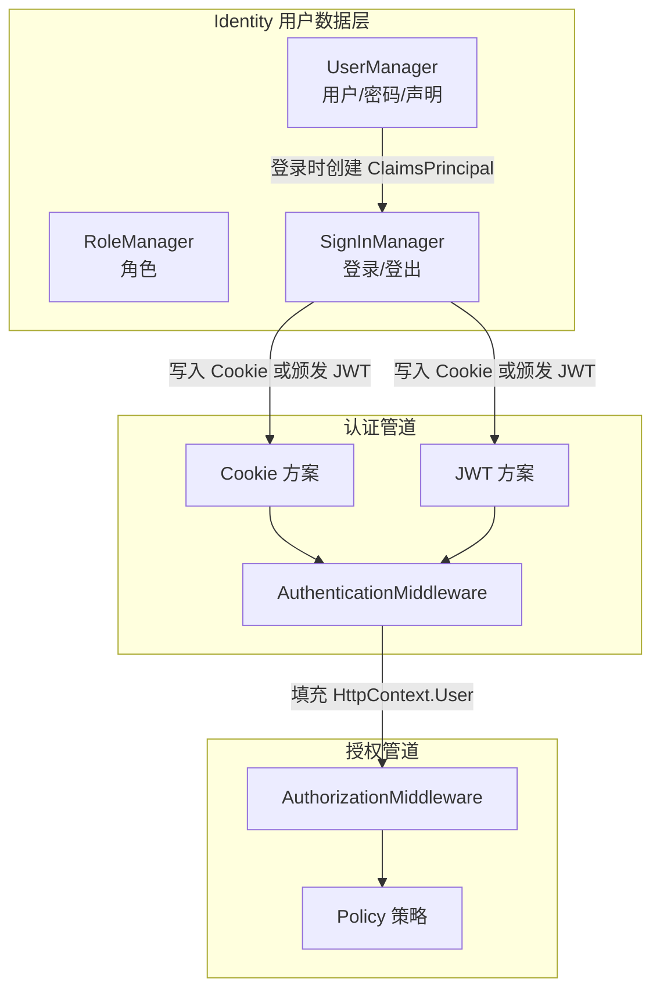
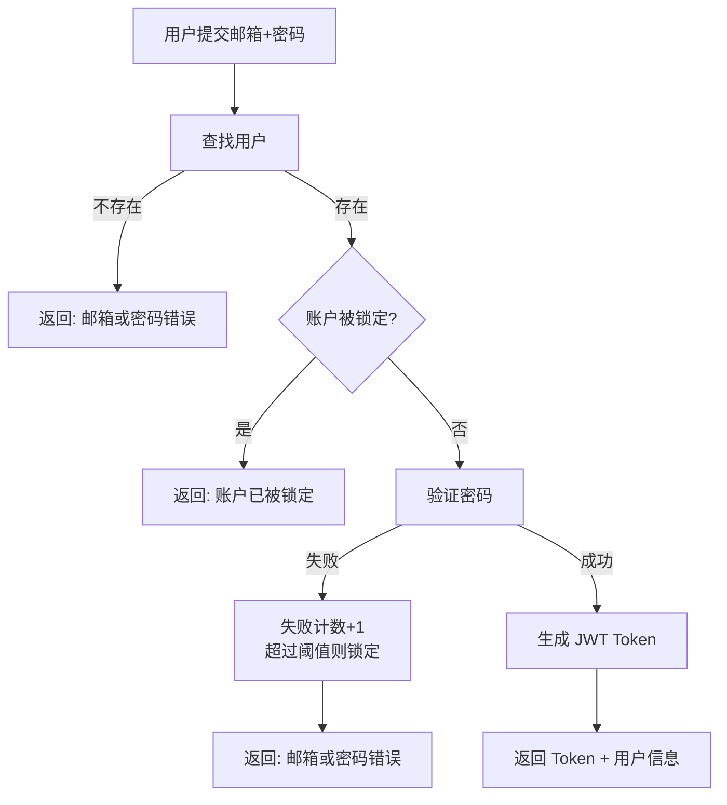

## 一、Identity 在认证授权体系中的位置

Identity 不是认证方案，也不是授权策略——它是**用户管理系统**，负责存储用户、密码、角色、声明，然后和认证授权管道对接。



如果你需要深入了解 Identity 的内部架构，可以参考 [ASP.NET Core Identity 深入解析](../../article/aspnetcore-identity.md)。本篇侧重**怎么用**。

## 二、项目搭建

### 2.1 安装包

```bash
dotnet add package Microsoft.AspNetCore.Identity.EntityFrameworkCore
dotnet add package Microsoft.EntityFrameworkCore.SqlServer
dotnet add package Microsoft.AspNetCore.Authentication.JwtBearer
```

### 2.2 定义用户和角色实体

```csharp
// 自定义用户实体
public class ApplicationUser : IdentityUser
{
    public string? NickName { get; set; }
    public string? Avatar { get; set; }
    public DateTime CreatedAt { get; set; } = DateTime.UtcNow;
}

// 自定义角色实体
public class ApplicationRole : IdentityRole
{
    public string? Description { get; set; }
}
```

### 2.3 数据库上下文

```csharp
public class ApplicationDbContext : IdentityDbContext<ApplicationUser, ApplicationRole, string>
{
    public ApplicationDbContext(DbContextOptions<ApplicationDbContext> options)
        : base(options) { }
}
```

### 2.4 注册服务

```csharp
var connectionString = builder.Configuration.GetConnectionString("DefaultConnection");

builder.Services.AddDbContext<ApplicationDbContext>(options =>
    options.UseSqlServer(connectionString));

builder.Services.AddIdentity<ApplicationUser, ApplicationRole>(options =>
{
    // 密码策略
    options.Password.RequireDigit = true;
    options.Password.RequireLowercase = true;
    options.Password.RequireUppercase = true;
    options.Password.RequireNonAlphanumeric = false;
    options.Password.RequiredLength = 8;

    // 锁定策略
    options.Lockout.DefaultLockoutTimeSpan = TimeSpan.FromMinutes(15);
    options.Lockout.MaxFailedAccessAttempts = 5;

    // 用户策略
    options.User.RequireUniqueEmail = true;
})
.AddEntityFrameworkStores<ApplicationDbContext>()
.AddDefaultTokenProviders(); // 邮箱确认、密码重置等令牌生成器
```

### 2.5 配置认证

```csharp
builder.Services.AddAuthentication(options =>
{
    options.DefaultScheme = CookieAuthenticationDefaults.AuthenticationScheme;
    options.DefaultChallengeScheme = CookieAuthenticationDefaults.AuthenticationScheme;
})
.AddCookie(options =>
{
    options.LoginPath = "/Account/Login";
    options.LogoutPath = "/Account/Logout";
    options.ExpireTimeSpan = TimeSpan.FromDays(7);
    options.SlidingExpiration = true;
})
.AddJwtBearer(options =>
{
    options.TokenValidationParameters = new TokenValidationParameters
    {
        ValidateIssuer = true,
        ValidateAudience = true,
        ValidateLifetime = true,
        ValidateIssuerSigningKey = true,
        ValidIssuer = builder.Configuration["Jwt:Issuer"],
        ValidAudience = builder.Configuration["Jwt:Audience"],
        IssuerSigningKey = new SymmetricSecurityKey(
            Encoding.UTF8.GetBytes(builder.Configuration["Jwt:Key"]!))
    };
});
```

## 三、注册

### 3.1 注册 DTO

```csharp
public class RegisterRequest
{
    [Required, EmailAddress]
    public string Email { get; set; } = "";

    [Required, MinLength(8)]
    public string Password { get; set; } = "";

    [Required, Compare("Password")]
    public string ConfirmPassword { get; set; } = "";

    public string? NickName { get; set; }
}
```

### 3.2 注册逻辑

```csharp
[ApiController]
[Route("api/[controller]")]
public class AccountController : ControllerBase
{
    private readonly UserManager<ApplicationUser> _userManager;
    private readonly SignInManager<ApplicationUser> _signInManager;

    public AccountController(
        UserManager<ApplicationUser> userManager,
        SignInManager<ApplicationUser> signInManager)
    {
        _userManager = userManager;
        _signInManager = signInManager;
    }

    [HttpPost("register")]
    public async Task<IActionResult> Register([FromBody] RegisterRequest request)
    {
        // 检查邮箱是否已注册
        var existingUser = await _userManager.FindByEmailAsync(request.Email);
        if (existingUser != null)
        {
            return BadRequest(new { error = "该邮箱已注册" });
        }

        // 创建用户
        var user = new ApplicationUser
        {
            UserName = request.Email,
            Email = request.Email,
            NickName = request.NickName ?? request.Email.Split('@')[0],
            CreatedAt = DateTime.UtcNow
        };

        var result = await _userManager.CreateAsync(user, request.Password);

        if (!result.Succeeded)
        {
            var errors = result.Errors.Select(e => e.Description);
            return BadRequest(new { errors });
        }

        // 分配默认角色
        await _userManager.AddToRoleAsync(user, "User");

        // 生成邮箱确认令牌（实际项目需要发邮件）
        var token = await _userManager.GenerateEmailConfirmationTokenAsync(user);
        // 发送确认邮件的逻辑...

        return Ok(new { message = "注册成功", userId = user.Id });
    }
}
```

## 四、登录与 JWT 颁发

### 4.1 登录 DTO

```csharp
public class LoginRequest
{
    [Required, EmailAddress]
    public string Email { get; set; } = "";

    [Required]
    public string Password { get; set; } = "";

    public bool RememberMe { get; set; }
}
```

### 4.2 登录逻辑



```csharp
[HttpPost("login")]
public async Task<IActionResult> Login([FromBody] LoginRequest request)
{
    // 查找用户
    var user = await _userManager.FindByEmailAsync(request.Email);
    if (user == null)
    {
        return Unauthorized(new { error = "邮箱或密码错误" });
    }

    // 检查是否被锁定
    if (await _userManager.IsLockedOutAsync(user))
    {
        return Unauthorized(new { error = "账户已被锁定，请稍后再试" });
    }

    // 验证密码
    var result = await _signInManager.CheckPasswordSignInAsync(
        user, request.Password, lockoutOnFailure: true);

    if (!result.Succeeded)
    {
        if (result.IsLockedOut)
            return Unauthorized(new { error = "账户已被锁定" });

        return Unauthorized(new { error = "邮箱或密码错误" });
    }

    // 生成 JWT
    var token = await GenerateJwtToken(user);

    return Ok(new
    {
        token,
        expiresIn = 7200, // 2 小时
        user = new
        {
            user.Id,
            user.Email,
            user.NickName,
            user.Avatar
        }
    });
}
```

### 4.3 JWT Token 生成

```csharp
private async Task<string> GenerateJwtToken(ApplicationUser user)
{
    var claims = new List<Claim>
    {
        new(JwtRegisteredClaimNames.Sub, user.Id),
        new(JwtRegisteredClaimNames.Email, user.Email ?? ""),
        new(JwtRegisteredClaimNames.Name, user.NickName ?? user.UserName ?? ""),
        new(JwtRegisteredClaimNames.Jti, Guid.NewGuid().ToString())
    };

    // 添加角色声明
    var roles = await _userManager.GetRolesAsync(user);
    foreach (var role in roles)
    {
        claims.Add(new Claim(ClaimTypes.Role, role));
    }

    // 添加自定义声明
    claims.Add(new Claim("NickName", user.NickName ?? ""));

    var key = new SymmetricSecurityKey(
        Encoding.UTF8.GetBytes(Configuration["Jwt:Key"]!));
    var credentials = new SigningCredentials(key, SecurityAlgorithms.HmacSha256);

    var token = new JwtSecurityToken(
        issuer: Configuration["Jwt:Issuer"],
        audience: Configuration["Jwt:Audience"],
        claims: claims,
        expires: DateTime.UtcNow.AddHours(2),
        signingCredentials: credentials);

    return new JwtSecurityTokenHandler().WriteToken(token);
}
```

## 五、角色管理

### 5.1 种子数据

```csharp
public static class IdentitySeed
{
    public static async Task SeedAsync(
        RoleManager<ApplicationRole> roleManager,
        UserManager<ApplicationUser> userManager)
    {
        // 创建角色
        var roles = new[] { "User", "Admin", "SuperAdmin" };
        foreach (var roleName in roles)
        {
            if (!await roleManager.RoleExistsAsync(roleName))
            {
                await roleManager.CreateAsync(new ApplicationRole
                {
                    Name = roleName,
                    Description = roleName switch
                    {
                        "User" => "普通用户",
                        "Admin" => "管理员",
                        "SuperAdmin" => "超级管理员",
                        _ => roleName
                    }
                });
            }
        }

        // 创建超级管理员
        var adminEmail = "admin@example.com";
        if (await userManager.FindByEmailAsync(adminEmail) == null)
        {
            var admin = new ApplicationUser
            {
                UserName = adminEmail,
                Email = adminEmail,
                NickName = "超级管理员",
                EmailConfirmed = true
            };

            await userManager.CreateAsync(admin, "Admin@123");
            await userManager.AddToRoleAsync(admin, "SuperAdmin");
        }
    }
}
```

```csharp
// Program.cs 中调用
using (var scope = app.Services.CreateScope())
{
    var roleManager = scope.ServiceProvider.GetRequiredService<RoleManager<ApplicationRole>>();
    var userManager = scope.ServiceProvider.GetRequiredService<UserManager<ApplicationUser>>();
    await IdentitySeed.SeedAsync(roleManager, userManager);
}
```

### 5.2 角色授权

```csharp
[Authorize(Roles = "Admin")]
[ApiController]
[Route("api/admin/[controller]")]
public class UserManagementController : ControllerBase
{
    private readonly UserManager<ApplicationUser> _userManager;

    public UserManagementController(UserManager<ApplicationUser> userManager)
    {
        _userManager = userManager;
    }

    // 获取所有用户
    [HttpGet("users")]
    public async Task<IActionResult> GetUsers()
    {
        var users = _userManager.Users.Select(u => new
        {
            u.Id,
            u.Email,
            u.NickName,
            u.CreatedAt
        }).ToList();

        return Ok(users);
    }

    // 分配角色
    [HttpPost("users/{userId}/roles")]
    public async Task<IActionResult> AssignRole(string userId, [FromBody] AssignRoleRequest request)
    {
        var user = await _userManager.FindByIdAsync(userId);
        if (user == null) return NotFound();

        var result = await _userManager.AddToRoleAsync(user, request.Role);
        if (!result.Succeeded) return BadRequest(result.Errors);

        return Ok();
    }

    // 移除角色
    [HttpDelete("users/{userId}/roles/{role}")]
    public async Task<IActionResult> RemoveRole(string userId, string role)
    {
        var user = await _userManager.FindByIdAsync(userId);
        if (user == null) return NotFound();

        var result = await _userManager.RemoveFromRoleAsync(user, role);
        if (!result.Succeeded) return BadRequest(result.Errors);

        return Ok();
    }
}
```

## 六、声明管理

### 6.1 添加自定义声明

```csharp
// 给用户添加部门声明
await _userManager.AddClaimAsync(user, new Claim("Department", "Engineering"));

// 给用户添加权限声明
await _userManager.AddClaimAsync(user, new Claim("Permission", "document.read"));
await _userManager.AddClaimAsync(user, new Claim("Permission", "document.write"));
```

### 6.2 基于声明的授权

```csharp
builder.Services.AddAuthorization(options =>
{
    options.AddPolicy("CanReadDocument", policy =>
        policy.RequireClaim("Permission", "document.read"));

    options.AddPolicy("CanWriteDocument", policy =>
        policy.RequireClaim("Permission", "document.write"));
});

[Authorize(Policy = "CanWriteDocument")]
[HttpPut("documents/{id}")]
public async Task<IActionResult> UpdateDocument(int id) { ... }
```

### 6.3 在 JWT 中包含声明

登录时把用户的声明写入 Token：

```csharp
private async Task<string> GenerateJwtToken(ApplicationUser user)
{
    var claims = new List<Claim>
    {
        new(JwtRegisteredClaimNames.Sub, user.Id),
        new(JwtRegisteredClaimNames.Email, user.Email ?? ""),
    };

    // 从 Identity 数据库加载用户的声明
    var userClaims = await _userManager.GetClaimsAsync(user);
    claims.AddRange(userClaims);

    // 加载角色
    var roles = await _userManager.GetRolesAsync(user);
    foreach (var role in roles)
    {
        claims.Add(new Claim(ClaimTypes.Role, role));
    }

    // ... 生成 Token
}
```

## 七、密码重置

### 7.1 生成重置令牌

```csharp
[HttpPost("forgot-password")]
public async Task<IActionResult> ForgotPassword([FromBody] ForgotPasswordRequest request)
{
    var user = await _userManager.FindByEmailAsync(request.Email);
    if (user == null)
    {
        // 安全考虑：不透露用户是否存在
        return Ok(new { message = "如果该邮箱已注册，重置链接已发送" });
    }

    var token = await _userManager.GeneratePasswordResetTokenAsync(user);
    var encodedToken = WebEncoders.Base64UrlEncode(Encoding.UTF8.GetBytes(token));

    // 发送重置邮件（包含 token）
    var resetUrl = $"https://myapp.com/reset-password?email={request.Email}&token={encodedToken}";
    // await _emailService.SendPasswordResetAsync(request.Email, resetUrl);

    return Ok(new { message = "如果该邮箱已注册，重置链接已发送" });
}
```

### 7.2 重置密码

```csharp
[HttpPost("reset-password")]
public async Task<IActionResult> ResetPassword([FromBody] ResetPasswordRequest request)
{
    var user = await _userManager.FindByEmailAsync(request.Email);
    if (user == null) return BadRequest();

    var decodedToken = Encoding.UTF8.GetString(WebEncoders.Base64UrlDecode(request.Token));
    var result = await _userManager.ResetPasswordAsync(user, decodedToken, request.NewPassword);

    if (!result.Succeeded)
        return BadRequest(result.Errors);

    return Ok(new { message = "密码重置成功" });
}
```

## 八、Cookie 登录（MVC 场景）

如果你的项目是 MVC/Razor Pages 而不是 SPA + API：

```csharp
[HttpPost("login")]
public async Task<IActionResult> Login(LoginViewModel model)
{
    if (!ModelState.IsValid) return View(model);

    var result = await _signInManager.PasswordSignInAsync(
        model.Email, model.Password, model.RememberMe, lockoutOnFailure: true);

    if (result.Succeeded)
    {
        return RedirectToAction("Index", "Home");
    }

    if (result.IsLockedOut)
    {
        ModelState.AddModelError("", "账户已被锁定");
        return View(model);
    }

    ModelState.AddModelError("", "邮箱或密码错误");
    return View(model);
}

[HttpPost("logout")]
public async Task<IActionResult> Logout()
{
    await _signInManager.SignOutAsync();
    return RedirectToAction("Index", "Home");
}
```

## 九、常见踩坑

### 9.1 AddIdentity 自动注册了 Cookie 认证

`AddIdentity` 会自动注册 Cookie 认证方案并设为默认。如果你同时需要 JWT，必须显式配置：

```csharp
// AddIdentity 默认设置了 DefaultScheme = "Identity.Application"
// 需要在 AddAuthentication 中覆盖
builder.Services.AddAuthentication(options =>
{
    options.DefaultScheme = CookieAuthenticationDefaults.AuthenticationScheme;
})
.AddCookie()
.AddJwtBearer();
```

### 9.2 UserManager 的异步方法不是线程安全的

`UserManager` 是 Scoped 服务，不要在并发场景中共享实例。

### 9.3 密码重置令牌的 URL 编码

Identity 生成的令牌包含 `+`、`/`、`=` 等 URL 不安全字符，必须编码后才能放在 URL 中：

```csharp
// 编码
var encoded = WebEncoders.Base64UrlEncode(Encoding.UTF8.GetBytes(token));

// 解码
var decoded = Encoding.UTF8.GetString(WebEncoders.Base64UrlDecode(encoded));
```

### 9.4 JWT 中角色声明不生效

确保 JWT 中的角色声明类型是 `ClaimTypes.Role`（即 `http://schemas.microsoft.com/ws/2008/06/identity/claims/role`），同时 JWT Bearer 配置中映射了 RoleClaimType：

```csharp
options.TokenValidationParameters = new TokenValidationParameters
{
    // ... 其他配置
    RoleClaimType = ClaimTypes.Role
};
```

## 十、总结

| 功能 | 关键 API |
| --- | --- |
| 注册 | `UserManager.CreateAsync()` |
| 登录 | `SignInManager.PasswordSignInAsync()` |
| JWT 颁发 | `JwtSecurityToken` + `JwtSecurityTokenHandler` |
| 角色管理 | `RoleManager.CreateAsync()` / `UserManager.AddToRoleAsync()` |
| 声明管理 | `UserManager.AddClaimAsync()` / `GetClaimsAsync()` |
| 密码重置 | `GeneratePasswordResetTokenAsync()` / `ResetPasswordAsync()` |
| Cookie 登出 | `SignInManager.SignOutAsync()` |

下一篇我们将实战 **OAuth2 客户端集成**，对接 GitHub/Google 等外部 IdP。
