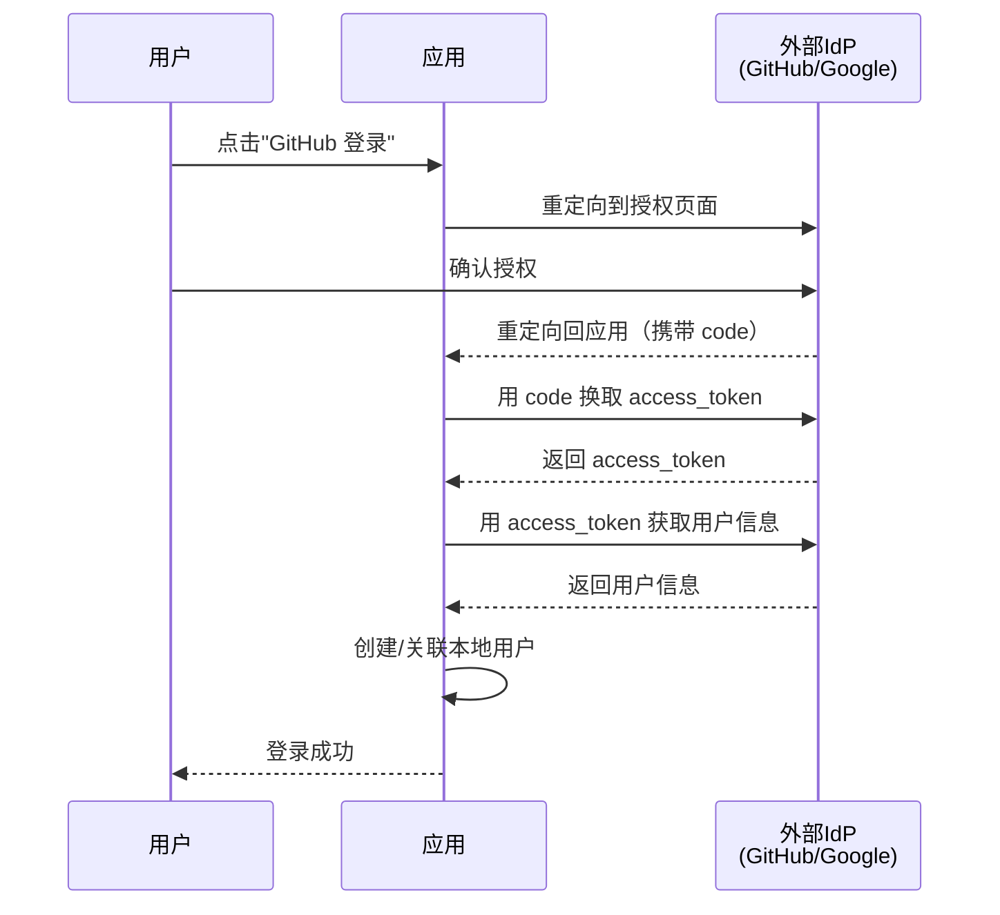
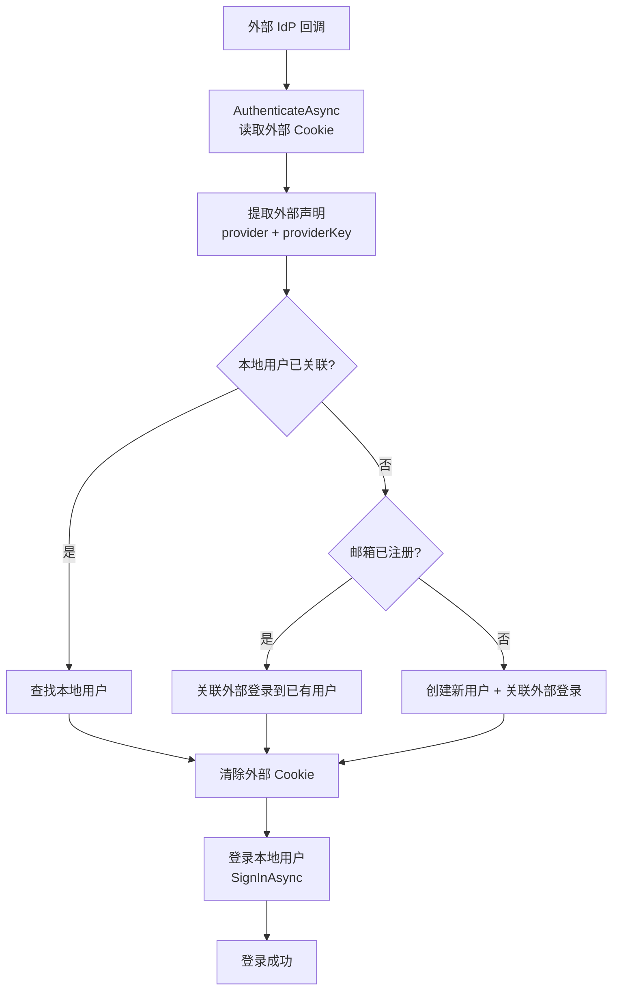

## 一、OAuth2 客户端 vs 服务端

在开始之前，先明确角色定位：

| 角色 | 做什么 | 本站教程 |
| --- | --- | --- |
| OAuth2 **服务端** | 搭建认证中心，颁发令牌 | [OpenIddict 教程](../openiddict/01概述与快速上手.md) |
| OAuth2 **客户端** | 对接外部认证中心，验证令牌 | **本篇** |

你的应用通常是客户端——让用户用 GitHub/Google/企业微信账号登录你的系统。

## 二、OAuth2 授权码流程回顾

外部登录的标准流程：



## 三、GitHub 外部登录

### 3.1 注册 OAuth App

在 GitHub Settings → Developer settings → OAuth Apps → New OAuth App：

| 字段 | 值 |
| --- | --- |
| Application name | 你的应用名 |
| Homepage URL | `https://localhost:5001` |
| Authorization callback URL | `https://localhost:5001/signin-github` |

注册后获得 **Client ID** 和 **Client Secret**。

### 3.2 配置服务

```csharp
builder.Services.AddAuthentication()
    .AddGitHub(options =>
    {
        options.ClientId = builder.Configuration["GitHub:ClientId"]!;
        options.ClientSecret = builder.Configuration["GitHub:ClientSecret"]!;
        options.CallbackPath = "/signin-github";
        // 请求的权限范围
        options.Scope.Add("user:email");
    });
```

如果没有 `AddGitHub` 扩展方法，可以用 `AddOAuth` 手动配置：

```csharp
builder.Services.AddAuthentication()
    .AddOAuth("GitHub", "GitHub 登录", options =>
    {
        options.ClientId = builder.Configuration["GitHub:ClientId"]!;
        options.ClientSecret = builder.Configuration["GitHub:ClientSecret"]!;
        options.CallbackPath = new PathString("/signin-github");

        // GitHub 的 OAuth2 端点
        options.AuthorizationEndpoint = "https://github.com/login/oauth/authorize";
        options.TokenEndpoint = "https://github.com/login/oauth/access_token";
        options.UserInformationEndpoint = "https://api.github.com/user";

        options.Scope.Add("user:email");

        // 声明映射：从 JSON 响应中提取字段
        options.ClaimActions.MapJsonKey(ClaimTypes.NameIdentifier, "id");
        options.ClaimActions.MapJsonKey(ClaimTypes.Name, "login");
        options.ClaimActions.MapJsonKey(ClaimTypes.Email, "email");
        options.ClaimActions.MapJsonKey("urn:github:name", "name");
        options.ClaimActions.MapJsonKey("urn:github:url", "html_url");

        // 自定义事件
        options.Events = new OAuthEvents
        {
            OnCreatingTicket = async context =>
            {
                // 获取用户信息
                var request = new HttpRequestMessage(HttpMethod.Get,
                    context.Options.UserInformationEndpoint);
                request.Headers.Authorization =
                    new AuthenticationHeaderValue("Bearer", context.AccessToken);
                request.Headers.Accept.Add(
                    new MediaTypeWithQualityHeaderValue("application/json"));
                request.Headers.UserAgent.Add(
                    new ProductInfoHeaderValue("MyApp", "1.0"));

                var response = await context.Backchannel.SendAsync(request);
                response.EnsureSuccessStatusCode();

                var user = JsonDocument.Parse(await response.Content.ReadAsStringAsync());
                context.RunClaimActions(user.RootElement);
            }
        };
    });
```

### 3.3 配置文件

```json
// appsettings.json
{
  "GitHub": {
    "ClientId": "your-client-id",
    "ClientSecret": "your-client-secret"
  }
}
```

### 3.4 登录按钮

```html
<a href="/login?provider=GitHub" class="btn-github">
    GitHub 登录
</a>
```

### 3.5 触发外部登录

```csharp
[HttpGet("login")]
public IActionResult Login(string provider)
{
    // 触发 Challenge，重定向到外部 IdP
    var properties = new AuthenticationProperties
    {
        RedirectUri = "/account/external-callback"
    };
    return Challenge(properties, provider);
}
```

### 3.6 处理回调

```csharp
[HttpGet("external-callback")]
public async Task<IActionResult> ExternalCallback()
{
    // 读取外部登录信息
    var result = await HttpContext.AuthenticateAsync(
        IdentityConstants.ExternalScheme);

    if (result?.Succeeded != true)
    {
        return BadRequest("外部登录失败");
    }

    // 获取外部声明
    var externalClaims = result.Principal!.Claims;
    var provider = result.Properties.Items["LoginProvider"];
    var providerKey = externalClaims.FirstOrDefault(c =>
        c.Type == ClaimTypes.NameIdentifier)?.Value;

    // 查找是否已关联本地用户
    var user = await _userManager.FindByLoginAsync(provider!, providerKey!);

    if (user == null)
    {
        // 首次登录：创建本地用户
        var email = externalClaims.FirstOrDefault(c =>
            c.Type == ClaimTypes.Email)?.Value;

        user = await _userManager.FindByEmailAsync(email!);

        if (user == null)
        {
            user = new ApplicationUser
            {
                UserName = email,
                Email = email,
                NickName = externalClaims.FirstOrDefault(c =>
                    c.Type == ClaimTypes.Name)?.Value,
                EmailConfirmed = true // 外部 IdP 已验证邮箱
            };

            await _userManager.CreateAsync(user);
            await _userManager.AddToRoleAsync(user, "User");
        }

        // 关联外部登录
        await _userManager.AddLoginAsync(user, new UserLoginInfo(
            provider, providerKey, provider));
    }

    // 清除外部 Cookie
    await HttpContext.SignOutAsync(IdentityConstants.ExternalScheme);

    // 登录本地用户
    await _signInManager.SignInAsync(user, isPersistent: false);

    return RedirectToAction("Index", "Home");
}
```

## 四、Google 外部登录（OpenID Connect）

Google 使用 OpenID Connect（OAuth2 的超集），用 `AddOpenIdConnect` 而不是 `AddOAuth`。

### 4.1 配置服务

```csharp
builder.Services.AddAuthentication()
    .AddGoogle(options =>
    {
        options.ClientId = builder.Configuration["Google:ClientId"]!;
        options.ClientSecret = builder.Configuration["Google:ClientSecret"]!;
        options.CallbackPath = "/signin-google";

        // 请求的权限范围
        options.Scope.Add("openid");
        options.Scope.Add("profile");
        options.Scope.Add("email");
    });
```

`AddGoogle` 是 `AddOpenIdConnect` 的预配置版本。如果需要更多控制，可以直接用 `AddOpenIdConnect`：

```csharp
builder.Services.AddAuthentication()
    .AddOpenIdConnect("Google", "Google 登录", options =>
    {
        options.ClientId = builder.Configuration["Google:ClientId"]!;
        options.ClientSecret = builder.Configuration["Google:ClientSecret"]!;
        options.CallbackPath = "/signin-google";

        options.Authority = "https://accounts.google.com";
        options.ResponseType = "code";

        options.Scope.Add("openid");
        options.Scope.Add("profile");
        options.Scope.Add("email");

        // 保存 Token（可用于调用 Google API）
        options.SaveTokens = true;

        // 获取用户信息
        options.GetClaimsFromUserInfoEndpoint = true;

        // 自定义声明映射
        options.ClaimActions.MapJsonKey("picture", "picture");
        options.ClaimActions.MapJsonKey("locale", "locale");
    });
```

### 4.2 OpenID Connect vs OAuth2 的区别

| | OAuth2 (`AddOAuth`) | OpenID Connect (`AddOpenIdConnect`) |
| --- | --- | --- |
| 协议 | 纯授权 | 认证 + 授权 |
| 用户信息 | 需要手动调用 API | 自动通过 ID Token 获取 |
| Token 类型 | 只有 Access Token | ID Token + Access Token |
| 标准化 | 每个提供商不同 | 统一标准 |
| 适用 | GitHub、自定义 OAuth | Google、Azure AD、企业 IdP |

## 五、企业微信外部登录

企业微信使用 OAuth2 但端点不同，需要用 `AddOAuth` 手动配置。

### 5.1 配置

```csharp
builder.Services.AddAuthentication()
    .AddOAuth("WeCom", "企业微信", options =>
    {
        options.ClientId = builder.Configuration["WeCom:CorpId"]!;
        options.ClientSecret = builder.Configuration["WeCom:CorpSecret"]!;
        options.CallbackPath = "/signin-wecom";

        // 企业微信 OAuth2 端点
        options.AuthorizationEndpoint =
            "https://open.weixin.qq.com/connect/oauth2/authorize";
        options.TokenEndpoint =
            "https://qyapi.weixin.qq.com/cgi-bin/gettoken";

        // 企业微信的授权码换取用户身份需要两步
        options.Events = new OAuthEvents
        {
            OnCreatingTicket = async context =>
            {
                // 1. 用 access_token 获取用户身份
                var userIdUrl =
                    $"https://qyapi.weixin.qq.com/cgi-bin/auth/getuserinfo" +
                    $"?access_token={context.AccessToken}" +
                    $"&code={context.TokenResponse!.Values["code"]}";

                var userIdResponse = await context.Backchannel.GetAsync(userIdUrl);
                var userIdJson = JsonDocument.Parse(
                    await userIdResponse.Content.ReadAsStringAsync());

                var userId = userIdJson.RootElement
                    .GetProperty("userid").GetString();

                // 2. 用 access_token + userId 获取用户详情
                var userDetailUrl =
                    $"https://qyapi.weixin.qq.com/cgi-bin/user/get" +
                    $"?access_token={context.AccessToken}" +
                    $"&userid={userId}";

                var userDetailResponse = await context.Backchannel.GetAsync(userDetailUrl);
                var userDetailJson = JsonDocument.Parse(
                    await userDetailResponse.Content.ReadAsStringAsync());

                context.RunClaimActions(userDetailJson.RootElement);
            }
        };
    });
```

## 六、多外部登录方案组合

### 6.1 配置多个方案

```csharp
builder.Services.AddAuthentication(options =>
{
    options.DefaultScheme = CookieAuthenticationDefaults.AuthenticationScheme;
})
.AddCookie()
.AddGitHub()
.AddGoogle()
.AddOAuth("WeCom", "企业微信", /* ... */);
```

### 6.2 外部登录按钮

```html
<div class="external-logins">
    <a href="/login?provider=GitHub" class="btn-github">GitHub 登录</a>
    <a href="/login?provider=Google" class="btn-google">Google 登录</a>
    <a href="/login?provider=WeCom" class="btn-wecom">企业微信登录</a>
</div>
```

### 6.3 统一回调处理

所有外部登录都走同一个回调端点，通过 `LoginProvider` 区分来源。



## 七、外部登录的 Identity 集成

### 7.1 数据库表

Identity 自动创建 `AspNetUserLogins` 表存储外部登录关联：

| 列 | 说明 |
| --- | --- |
| LoginProvider | 外部提供商名（如 "GitHub"） |
| ProviderKey | 外部用户 ID |
| ProviderDisplayName | 显示名 |
| UserId | 关联的本地用户 ID |

### 7.2 管理外部登录

```csharp
// 查看用户的所有外部登录
var logins = await _userManager.GetLoginsAsync(user);

// 添加外部登录关联
await _userManager.AddLoginAsync(user, new UserLoginInfo(provider, providerKey, displayName));

// 移除外部登录关联
await _userManager.RemoveLoginAsync(user, provider, providerKey);

// 通过外部登录查找本地用户
var user = await _userManager.FindByLoginAsync(provider, providerKey);
```

### 7.3 已登录用户绑定外部账号

```csharp
[Authorize]
[HttpPost("link-external")]
public async Task<IActionResult> LinkExternal(string provider)
{
    var userId = User.FindFirst(ClaimTypes.NameIdentifier)?.Value;
    var user = await _userManager.FindByIdAsync(userId!);

    var properties = new AuthenticationProperties
    {
        RedirectUri = "/account/link-callback",
        Items = { { "LinkAccount", "true" } } // 标记这是绑定操作
    };

    return Challenge(properties, provider);
}

[HttpGet("link-callback")]
public async Task<IActionResult> LinkCallback()
{
    var result = await HttpContext.AuthenticateAsync(
        IdentityConstants.ExternalScheme);

    if (result?.Succeeded != true)
        return BadRequest("外部登录失败");

    var provider = result.Properties!.Items["LoginProvider"]!;
    var providerKey = result.Principal!.FindFirst(ClaimTypes.NameIdentifier)!.Value;

    var userId = User.FindFirst(ClaimTypes.NameIdentifier)!.Value;
    var user = await _userManager.FindByIdAsync(userId);

    await _userManager.AddLoginAsync(user!, new UserLoginInfo(provider, providerKey, provider));
    await HttpContext.SignOutAsync(IdentityConstants.ExternalScheme);

    return RedirectToAction("Profile");
}
```

## 八、安全注意事项

### 8.1 State 参数防 CSRF

`AddOAuth` 和 `AddOpenIdConnect` 自动处理 `state` 参数，验证回调的 state 是否匹配。**不要关闭这个功能**：

```csharp
// ❌ 不要这样做
options.CorrelationCookie.SameSite = SameSiteMode.None;
```

### 8.2 PKCE（Proof Key for Code Exchange）

OpenID Connect 默认启用 PKCE，OAuth2 需要手动启用：

```csharp
builder.Services.AddAuthentication()
    .AddOAuth("GitHub", options =>
    {
        // ... 其他配置
        options.UsePkce = true; // 启用 PKCE
    });
```

### 8.3 Client Secret 安全

永远不要把 Client Secret 提交到代码仓库：

```csharp
// ❌ 硬编码
options.ClientSecret = "abc123";

// ✅ 从配置读取
options.ClientSecret = builder.Configuration["GitHub:ClientSecret"];

// ✅ 生产环境用环境变量或密钥管理服务
```

### 8.4 回调 URL 验证

`CallbackPath` 必须精确匹配你在外部 IdP 注册的回调 URL。`AddOAuth` 只处理匹配 `CallbackPath` 的请求，不会处理任意 URL。

## 九、常见踩坑

### 9.1 外部登录回调 404

确保 `CallbackPath` 正确，且应用监听了该路径。`AddOAuth` 会自动注册一个中间件端点来处理回调。

### 9.2 GitHub API 返回 403

GitHub API 要求 User-Agent 头：

```csharp
request.Headers.UserAgent.Add(new ProductInfoHeaderValue("MyApp", "1.0"));
```

### 9.3 外部登录后 HttpContext.User 没有更新

外部登录使用临时的 `IdentityConstants.ExternalScheme` Cookie，需要手动读取外部声明并登录到本地方案：

```csharp
// ❌ 期望外部登录自动登录本地用户
var result = await HttpContext.AuthenticateAsync();

// ✅ 读取外部声明，手动登录本地用户
var result = await HttpContext.AuthenticateAsync(IdentityConstants.ExternalScheme);
// ... 创建/查找本地用户
await _signInManager.SignInAsync(user, isPersistent: false);
```

### 9.4 多个外部登录的 Cookie 冲突

每次只处理一个外部登录，回调结束后清除外部 Cookie：

```csharp
await HttpContext.SignOutAsync(IdentityConstants.ExternalScheme);
```

## 十、总结

| 概念 | 一句话 |
| --- | --- |
| AddOAuth | 对接纯 OAuth2 提供商（GitHub、企业微信） |
| AddOpenIdConnect | 对接 OIDC 提供商（Google、Azure AD） |
| 外部登录流程 | Challenge → IdP 授权 → 回调 → 创建/关联用户 → 本地登录 |
| Identity 集成 | AspNetUserLogins 表存储外部登录关联 |
| 安全 | State 防 CSRF、PKCE 防授权码截获、Secret 不入库 |

至此，.NET 认证与授权系列教程完结。从认证中间件到授权策略，从自定义处理器到 Identity 集成，再到 OAuth2 客户端对接——你现在应该能独立搭建一个完整的认证授权体系了。
