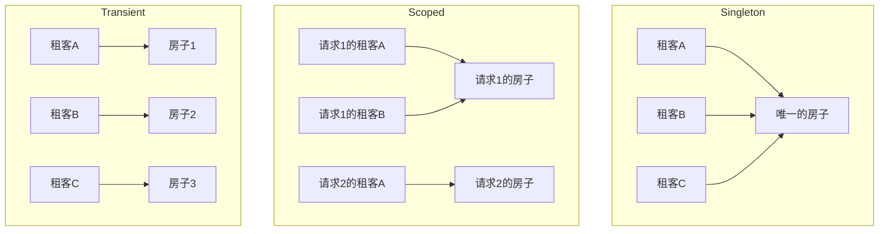
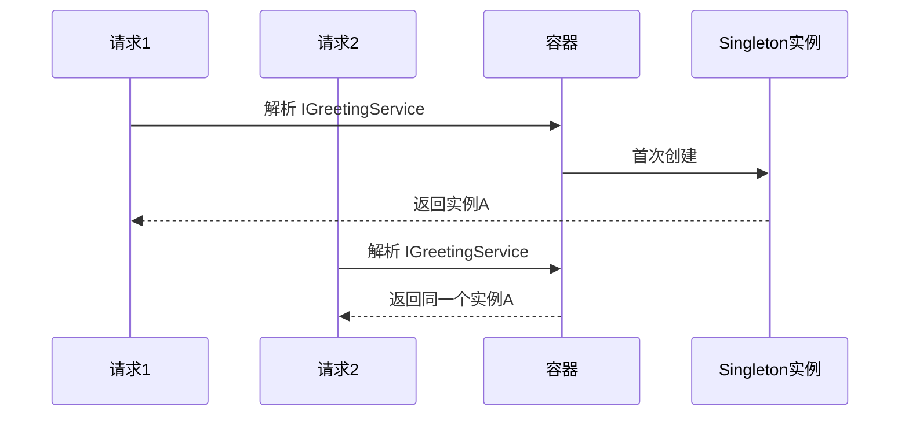
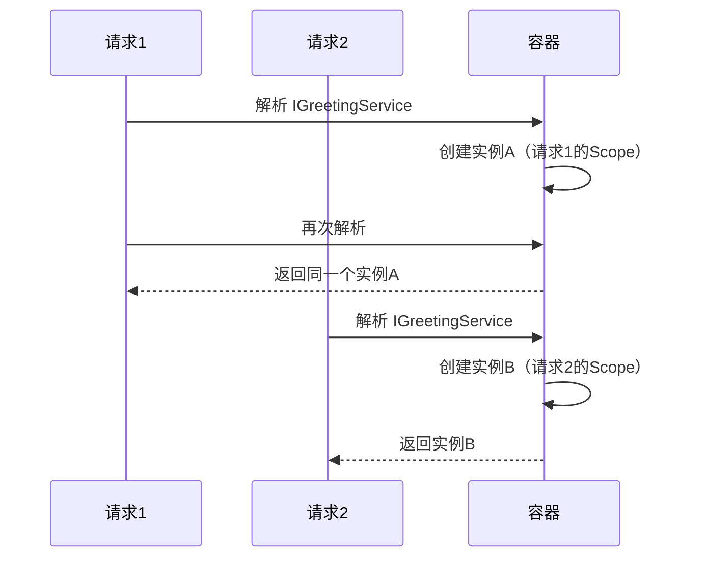
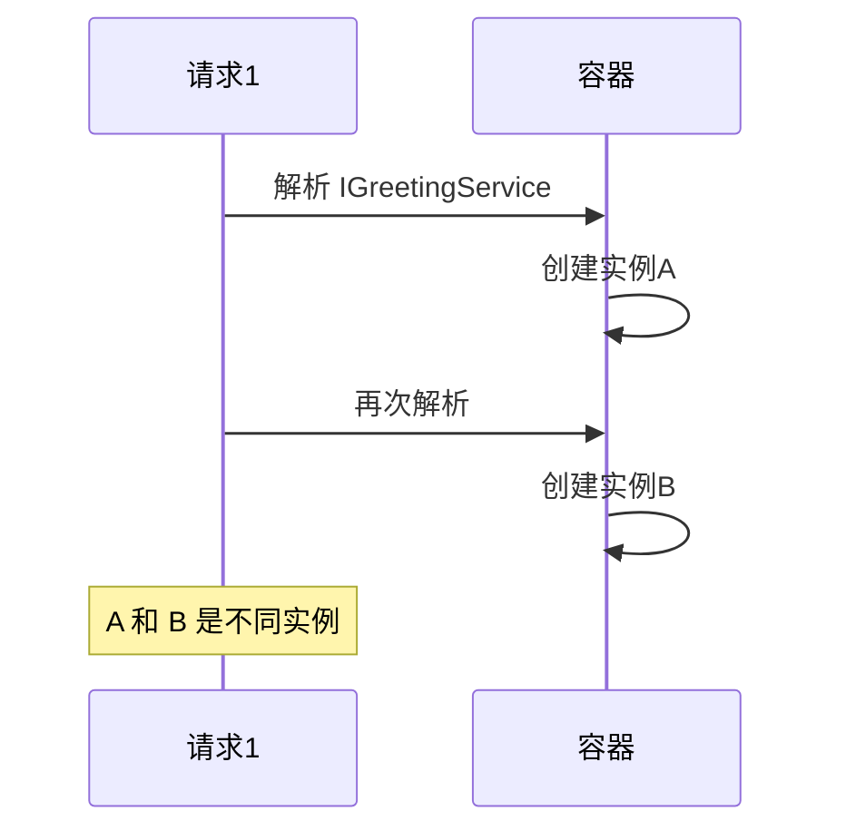
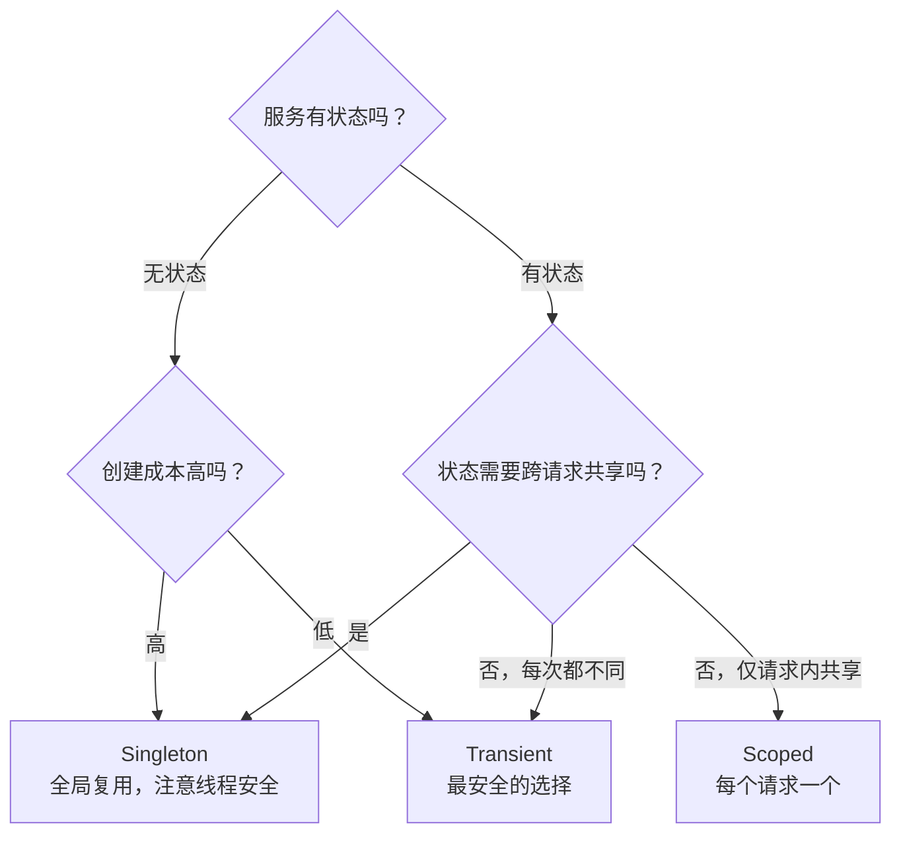
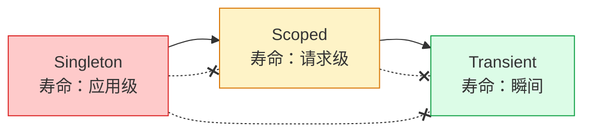
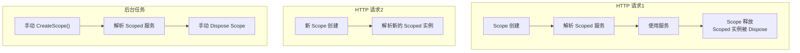
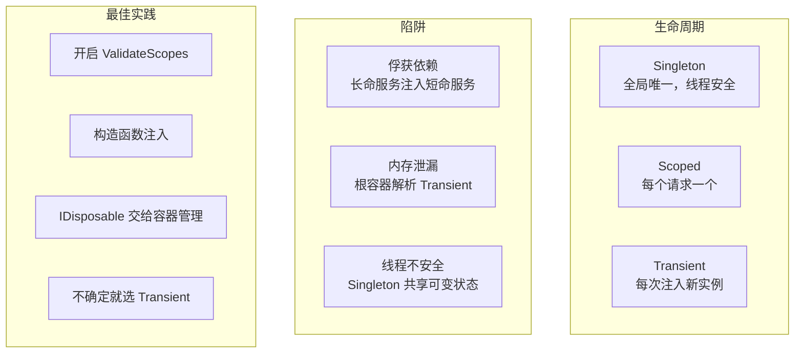

## 一、先建立直觉：三种"租房子"模式

把服务实例想象成"房子"，容器是"房东"：

| 生命周期 | 类比 | 房东行为 |
|---------|------|---------|
| **Singleton** | 整栋楼只有一套房 | 所有租客住同一间，从入住到退租 |
| **Scoped** | 每批客人一套房 | 同一批客人住同一间，换一批换一间 |
| **Transient** | 每人一间房 | 来一个人开一间，从不复用 |



## 二、5分钟跑通：最简单的依赖注入

### 第一步：定义服务

```csharp
public interface IGreetingService
{
    string Greet(string name);
}

public class GreetingService : IGreetingService
{
    private readonly Guid _id = Guid.NewGuid(); // 每个实例有唯一ID

    public string Greet(string name) => $"[{_id}] 你好, {name}!";
}
```

### 第二步：注册服务

```csharp
// Program.cs
builder.Services.AddSingleton<IGreetingService, GreetingService>();
// 或者
builder.Services.AddScoped<IGreetingService, GreetingService>();
// 或者
builder.Services.AddTransient<IGreetingService, GreetingService>();
```

### 第三步：使用服务

```csharp
app.MapGet("/test", (IGreetingService s1, IGreetingService s2) => new
{
    s1 = s1.Greet("A"),
    s2 = s2.Greet("B"),
    sameInstance = s1 == s2  // Singleton: true, Scoped: true, Transient: false
});
```

**跑起来了！** 同一个请求中注入两次，三种生命周期的行为不同。

## 三、三种生命周期详解

### 1. Singleton — 全局唯一

整个应用生命周期内只创建**一个实例**，所有请求共享。



**适用场景**：
- 无状态服务（如工具类、配置读取）
- 全局共享的资源（如缓存、计数器）
- 创建成本高的对象（如数据库连接池）

**注意**：Singleton 必须是**线程安全**的，因为多个请求会并发访问同一个实例。

### 2. Scoped — 每个请求一个

每个 Scope（通常是每次 HTTP 请求）内创建一个实例，同一 Scope 内复用。



**适用场景**：
- 数据库上下文（DbContext）——每个请求一个连接，请求结束释放
- 单元工作（Unit of Work）——请求内共享事务
- 当前请求的上下文信息（如当前用户）

### 3. Transient — 每次注入一个新实例

每次解析都创建一个**全新的实例**，从不复用。



**适用场景**：
- 轻量级无状态服务
- 每次使用都需要全新状态的服务
- 不确定该用什么时的安全默认选择

## 四、选型决策树



**简单记忆**：

| 场景 | 选择 |
|------|------|
| 不确定 | Transient（最安全） |
| 每个请求一个（如 DbContext） | Scoped |
| 全局唯一（如缓存） | Singleton |

## 五、最危险的陷阱：俘获依赖

**这是 .NET DI 中最常见的运行时炸弹。**

### 规则：不能把"短命"的服务注入到"长命"的服务中



- ❌ Singleton 不能注入 Scoped 或 Transient
- ❌ Scoped 不能注入 Transient（仅当 Scoped 被 Singleton 间接持有时）
- ✅ Scoped 可以注入 Singleton
- ✅ Transient 可以注入任何

### 反面示例：Singleton 注入 Scoped

```csharp
// Scoped 服务
public class UserContext
{
    public string UserId { get; set; }
}

// Singleton 服务，注入了 Scoped
public class CacheService
{
    private readonly UserContext _userContext;

    public CacheService(UserContext userContext)
    {
        _userContext = userContext; // 俘获了 Scoped 实例！
    }

    public string GetCachedValue() => $"用户 {_userContext.UserId} 的缓存";
}
```

```csharp
builder.Services.AddSingleton<CacheService>();
builder.Services.AddScoped<UserContext>();
```

**后果**：`CacheService` 是 Singleton，只在启动时创建一次。它"俘获"了创建时那个请求的 `UserContext`，之后所有请求看到的都是第一个请求的用户信息。

### 正面示例：用 IServiceProvider 延迟解析

```csharp
public class CacheService
{
    private readonly IServiceProvider _sp;

    public CacheService(IServiceProvider sp)
    {
        _sp = sp;  // 注入 IServiceProvider 本身是安全的
    }

    public string GetCachedValue()
    {
        // 每次使用时从当前 Scope 解析，获取正确的 UserContext
        using var scope = _sp.CreateScope();
        var userContext = scope.ServiceProvider.GetRequiredService<UserContext>();
        return $"用户 {userContext.UserId} 的缓存";
    }
}
```

### 开发环境验证

ASP.NET Core 在开发环境下会自动检测俘获依赖，在控制台输出警告：

```
warn: Microsoft.Extensions.DependencyInjection.ValidateScopes[100]
      Cannot consume scoped service 'UserContext' from singleton 'CacheService'.
```

**生产环境默认不验证**，如需启用：

```csharp
builder.Host.UseDefaultServiceProvider(options =>
{
    options.ValidateScopes = true;           // 验证俘获依赖
    options.ValidateOnBuild = true;          // 启动时验证所有注册
});
```

> **强烈建议**：开发和测试环境都开启 `ValidateScopes`，俘获依赖是隐蔽的 Bug 来源。

## 六、Scope 的本质：不止是 HTTP 请求

虽然最常见的 Scope 是"一次 HTTP 请求"，但 Scope 可以手动创建：

### 后台任务中创建 Scope

```csharp
public class BackgroundWorker : BackgroundService
{
    private readonly IServiceProvider _sp;

    public BackgroundWorker(IServiceProvider sp)
    {
        _sp = sp;
    }

    protected override async Task ExecuteAsync(CancellationToken ct)
    {
        while (!ct.IsCancellationRequested)
        {
            // 后台任务没有 HTTP 请求，必须手动创建 Scope
            using var scope = _sp.CreateScope();
            var dbContext = scope.ServiceProvider.GetRequiredService<AppDbContext>();
            var emailService = scope.ServiceProvider.GetRequiredService<IEmailService>();

            await emailService.SendPendingEmailsAsync(dbContext, ct);

            await Task.Delay(TimeSpan.FromMinutes(5), ct);
        }
    }
}
```

**为什么必须手动创建 Scope？** 因为后台任务不在 HTTP 请求管道中，没有自动创建的 Scope。如果直接从根容器解析 Scoped 服务，会抛异常或得到错误行为。

### Scope 生命周期图



## 七、IDisposable 与服务释放

当服务实现了 `IDisposable`，容器会在 Scope 结束时自动调用 `Dispose`。

### 释放规则

| 生命周期 | 何时 Dispose | 由谁 Dispose |
|---------|-------------|-------------|
| Singleton | 应用关闭时 | 根容器 |
| Scoped | Scope 结束时（请求结束） | 当前 Scope |
| Transient | Scope 结束时 | 当前 Scope |

### 关键认知

**1. Transient 服务由解析它的 Scope 负责释放**

```csharp
// 在请求中解析的 Transient，请求结束时释放
app.MapGet("/test", (IServiceProvider sp) =>
{
    var service = sp.GetRequiredService<ITransientService>();
    // 请求结束时，service 会被 Dispose
});
```

**2. 从根容器解析的 Transient 永远不会被释放**

```csharp
// ❌ 危险：从根容器解析，没有 Scope 负责释放
var service = builder.Services.BuildServiceProvider()
    .GetRequiredService<ITransientService>();
// 这个实例永远不会被 Dispose → 内存泄漏！
```

**3. Singleton 的 Dispose 时机**

```csharp
// Singleton 在应用关闭时由根容器释放
builder.Services.AddSingleton<IDisposableService, DisposableService>();

// 如果 Singleton 持有需要释放的资源，确保实现 IDisposable
```

### 最佳实践

```csharp
// ✅ 让需要释放的服务实现 IDisposable
public class EmailService : IEmailService, IDisposable
{
    private readonly SmtpClient _client = new();

    public void Dispose() => _client.Dispose();
}

// ✅ 注册时容器会自动管理释放
builder.Services.AddScoped<IEmailService, EmailService>();
```

## 八、注册方式与工厂模式

### 基本注册

```csharp
// 接口 → 实现
builder.Services.AddSingleton<IGreetingService, GreetingService>();

// 直接注册实现类
builder.Services.AddSingleton<GreetingService>();

// 注册已有实例
builder.Services.AddSingleton<IGreetingService>(new GreetingService());
```

### 工厂注册

当创建逻辑需要依赖其他服务时：

```csharp
builder.Services.AddSingleton<ICacheService>(sp =>
{
    var config = sp.GetRequiredService<IConfiguration>();
    var logger = sp.GetRequiredService<ILogger<CacheService>>();
    var redis = sp.GetRequiredService<IConnectionMultiplexer>();

    return new CacheService(redis, config, logger);
});
```

### TryAdd 系列避免重复注册

```csharp
// AddSingleton 会覆盖已注册的同类型服务
builder.Services.AddSingleton<IService, ServiceA>();
builder.Services.AddSingleton<IService, ServiceB>(); // 最终只有 ServiceB

// TryAddSingleton 只在未注册时才添加
builder.Services.TryAddSingleton<IService, ServiceA>();
builder.Services.TryAddSingleton<IService, ServiceB>(); // 被忽略，仍是 ServiceA
```

### 多实现注册与枚举解析

```csharp
// 注册多个实现
builder.Services.AddSingleton<IHandler, OrderHandler>();
builder.Services.AddSingleton<IHandler, PaymentHandler>();
builder.Services.AddSingleton<IHandler, ShippingHandler>();

// 解析所有实现
public class HandlerManager
{
    public HandlerManager(IEnumerable<IHandler> handlers)
    {
        // handlers 包含所有注册的 IHandler 实现
        foreach (var handler in handlers) { /* ... */ }
    }
}
```

## 九、常见反模式

### 反模式1：在构造函数中做耗时操作

```csharp
// ❌ Singleton 构造函数中访问数据库
public class CacheService
{
    public CacheService(AppDbContext db)
    {
        // 应用启动时就查数据库，启动变慢
        Data = db.CacheItems.ToDictionary(x => x.Key, x => x.Value);
    }
}

// ✅ 延迟加载
public class CacheService
{
    private readonly AppDbContext _db;
    private Dictionary<string, string>? _data;

    public CacheService(AppDbContext db) => _db = db;

    public Dictionary<string, string> Data =>
        _data ??= _db.CacheItems.ToDictionary(x => x.Key, x => x.Value);
}
```

### 反模式2：Service Locator 模式

```csharp
// ❌ 在代码中直接用 IServiceProvider 解析服务
public class OrderService
{
    public void Process(Order order)
    {
        var handler = _serviceProvider.GetRequiredService<IHandler>(); // 隐藏了依赖
    }
}

// ✅ 构造函数注入，依赖一目了然
public class OrderService
{
    private readonly IHandler _handler;

    public OrderService(IHandler handler) => _handler = handler;
}
```

> **例外**：后台任务中创建 Scope 后解析服务是合理的，因为那时没有构造函数注入的机会。

### 反模式3：用 Singleton 模拟全局状态

```csharp
// ❌ 用 Singleton 存储请求级数据
public class GlobalState
{
    public string CurrentUserId { get; set; } // 多个请求会互相覆盖！
}

// ✅ 用 Scoped 存储请求级数据
builder.Services.AddScoped<RequestContext>();
```

## 十、一张图总结



| 概念 | 一句话 |
|------|-------|
| Singleton | 全局唯一，注意线程安全，不能注入 Scoped/Transient |
| Scoped | 每个请求一个，最适合 DbContext 等请求级资源 |
| Transient | 每次新实例，最安全但可能有性能开销 |
| 俘获依赖 | 长命服务持有短命服务，导致数据错乱——开发环境开 ValidateScopes 检测 |
| IDisposable | 容器自动管理释放，不要从根容器解析 Transient |
| 选型原则 | 不确定选 Transient，请求级选 Scoped，全局共享选 Singleton |
