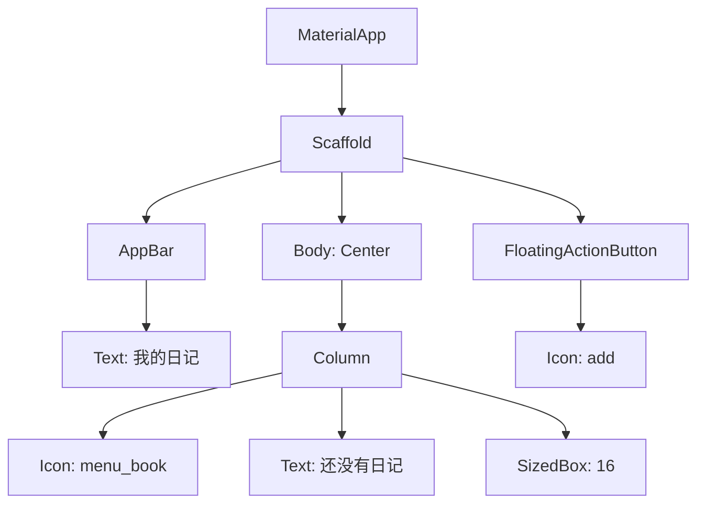
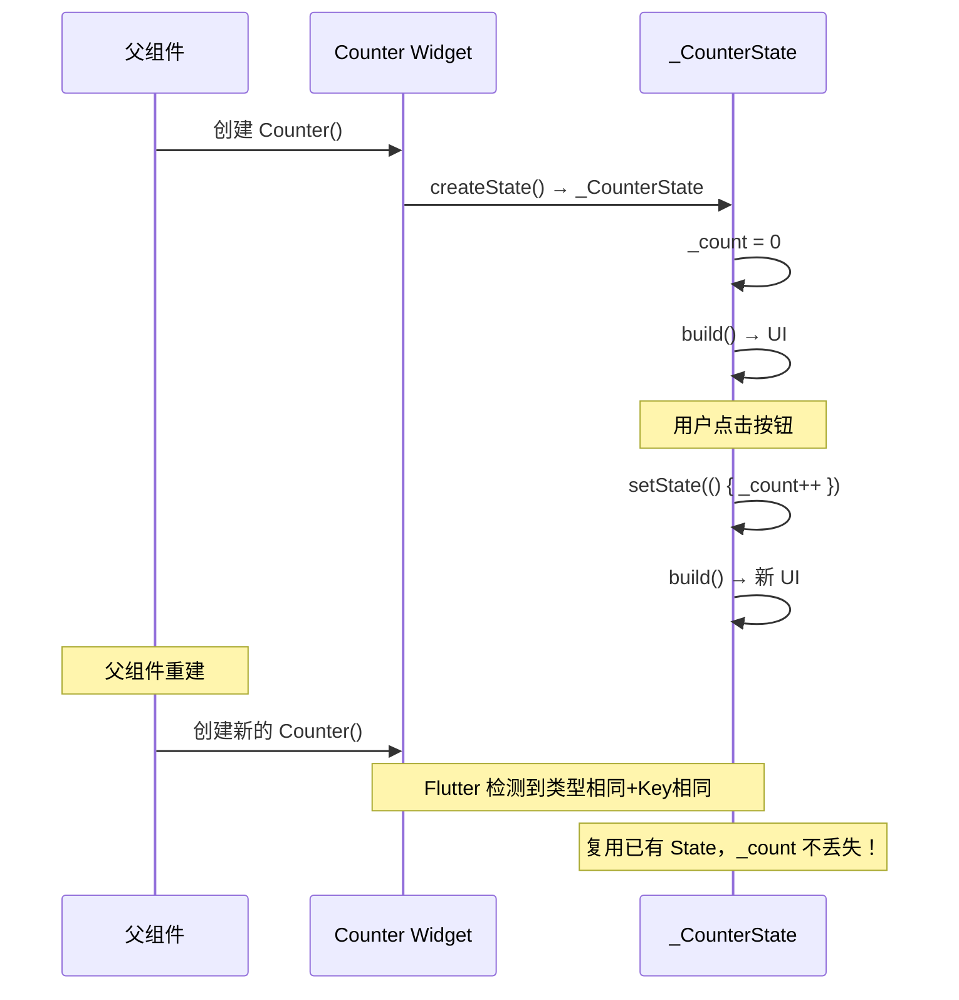
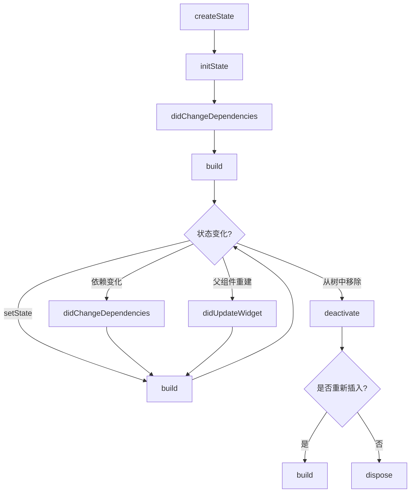
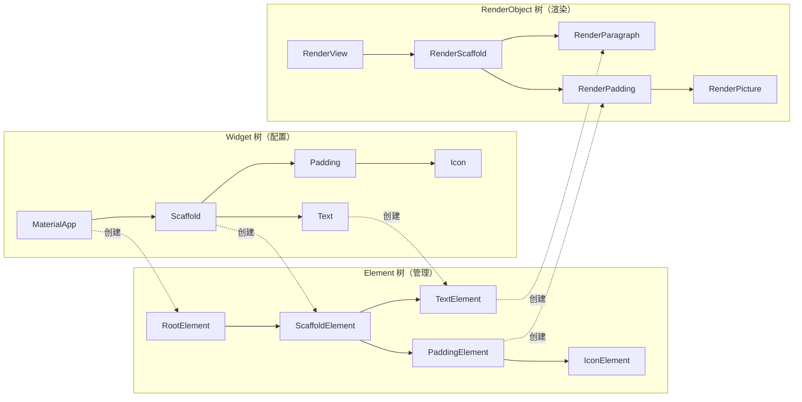

## 一、核心理念：一切皆 Widget

在 Flutter 中，**所有东西都是 Widget**——按钮是 Widget，布局是 Widget，间距是 Widget，甚至主题、导航、手势识别也是 Widget。这种设计叫做**组合优于继承**。



这个树形结构就是 Widget 树。Flutter 通过组合简单的 Widget 来构建复杂的 UI，而不是通过继承。

**对比传统方式：**

| 传统 Android/iOS | Flutter |
|-----------------|---------|
| 继承 View/UIView 创建自定义控件 | 组合现有 Widget |
| 在 View 中写布局逻辑 | 用布局 Widget（Row/Column/Stack） |
| 手动管理 padding/margin | 用 Padding/Container Widget |
| 手动处理点击事件 | 用 GestureDetector/InkWell Widget |

## 二、StatelessWidget

StatelessWidget 是最简单的 Widget——**创建后不可变**。它的 `build` 方法只在两种情况下被调用：

1. Widget 被插入树中
2. Widget 的父组件重新 build，且本 Widget 的类型或 Key 变了

```dart
class JournalCard extends StatelessWidget {
  // final 属性 — 创建后不可变
  final String title;
  final String summary;
  final VoidCallback? onTap;

  // 构造函数 — 用 const 优化性能
  const JournalCard({
    super.key,
    required this.title,
    required this.summary,
    this.onTap,
  });

  @override
  Widget build(BuildContext context) {
    return Card(
      child: ListTile(
        title: Text(title),
        subtitle: Text(summary),
        trailing: const Icon(Icons.chevron_right),
        onTap: onTap,
      ),
    );
  }
}
```

**使用：**

```dart
JournalCard(
  title: '今天天气不错',
  summary: '出门散步，心情很好...',
  onTap: () => print('点击了日记'),
)
```

**StatelessWidget 的误区：**

> "StatelessWidget 就是静态的、不会变的" — **错！**

StatelessWidget 可以通过接收不同的属性来展示不同内容。它"无状态"指的是**自身不持有可变状态**，而不是"界面不变"。

```dart
// 这个 StatelessWidget 每次接收不同的 title，显示不同内容
class Greeting extends StatelessWidget {
  final String name;
  const Greeting({super.key, required this.name});

  @override
  Widget build(BuildContext context) {
    return Text('Hello, $name!');
  }
}

// 父组件可以不断传入不同的 name
Greeting(name: 'Flutter');  // Hello, Flutter!
Greeting(name: 'Dart');     // Hello, Dart!
```

## 三、StatefulWidget

StatefulWidget 是"有状态的"Widget——它持有一个可变的 State 对象，当 State 变化时，Widget 会重新构建。

### 3.1 基本结构

```dart
// Widget 类 — 不可变，负责创建 State
class Counter extends StatefulWidget {
  const Counter({super.key});

  @override
  State<Counter> createState() => _CounterState();
}

// State 类 — 可变，持有状态和 build 方法
class _CounterState extends State<Counter> {
  int _count = 0;  // 可变状态

  void _increment() {
    setState(() {
      _count++;  // 修改状态，触发重建
    });
  }

  @override
  Widget build(BuildContext context) {
    return Column(
      children: [
        Text('点击次数: $_count'),
        ElevatedButton(
          onPressed: _increment,
          child: const Text('加一'),
        ),
      ],
    );
  }
}
```

**为什么分成 Widget 和 State 两个类？**

因为 Widget 是不可变的。当父组件重建时，Flutter 会创建新的 Widget 实例，但**复用已有的 State 对象**。这样 State 中的数据不会丢失。



### 3.2 生命周期

State 的生命周期是 Flutter 面试必考题，也是日常开发必须掌握的：



**各阶段详解：**

```dart
class _JournalDetailState extends State<JournalDetail> {
  @override
  void initState() {
    super.initState();
    // ✅ 初始化：只执行一次
    // 适合：初始化控制器、订阅事件、发起网络请求
    _loadJournal();
  }

  @override
  void didChangeDependencies() {
    super.didChangeDependencies();
    // ✅ 依赖变化时调用
    // 适合：获取 InheritedWidget 的数据（如 Theme、MediaQuery）
    // initState 之后也会调用一次
  }

  @override
  void didUpdateWidget(JournalDetail oldWidget) {
    super.didUpdateWidget(oldWidget);
    // ✅ 父组件重建本 Widget 时调用
    // 适合：对比新旧 widget 属性，响应变化
    if (oldWidget.journalId != widget.journalId) {
      _loadJournal();  // ID 变了，重新加载
    }
  }

  @override
  Widget build(BuildContext context) {
    // ✅ 构建 UI — 调用最频繁的方法
    // 必须纯函数：同样的状态 → 同样的 UI
    // 不要在这里做耗时操作！
    return Scaffold(/* ... */);
  }

  @override
  void dispose() {
    // ✅ 销毁 — 只执行一次
    // 适合：取消订阅、释放控制器、关闭 Stream
    _scrollController.dispose();
    _subscription.cancel();
    super.dispose();
  }
}
```

**生命周期方法使用频率：**

| 方法 | 使用频率 | 典型用途 |
|------|---------|---------|
| `initState` | ★★★★★ | 初始化控制器、发请求、订阅 |
| `build` | ★★★★★ | 构建 UI |
| `dispose` | ★★★★☆ | 释放资源、取消订阅 |
| `didUpdateWidget` | ★★☆☆☆ | 响应父组件属性变化 |
| `didChangeDependencies` | ★☆☆☆☆ | 获取 InheritedWidget 数据 |

### 3.3 setState 的正确用法

`setState` 是最简单的状态管理方式，但容易用错：

```dart
// ❌ 错误1：忘记 setState
void _increment() {
  _count++;  // 数据变了，但 UI 不会更新！
}

// ✅ 正确
void _increment() {
  setState(() {
    _count++;
  });
}

// ❌ 错误2：在 setState 外做耗时操作
void _loadData() {
  setState(() {
    // ❌ 网络请求不应该在 setState 里！
    // setState 应该只包含状态赋值
    _data = await fetchData();  // 编译错误：await 不能在非 async 函数中
  });
}

// ✅ 正确：耗时操作在 setState 外，赋值在 setState 内
Future<void> _loadData() async {
  final data = await fetchData();  // 耗时操作在外面
  if (mounted) {  // 重要！确保 Widget 还在树中
    setState(() {
      _data = data;  // 只有赋值在 setState 里
    });
  }
}

// ❌ 错误3：在 build 中调用 setState
@override
Widget build(BuildContext context) {
  setState(() {});  // 💥 无限循环！build → setState → build → ...
  return Container();
}
```

**setState 的黄金法则：**

1. `setState` 内只放状态赋值，不放耗时操作
2. 异步操作完成后，先检查 `mounted` 再 `setState`
3. 永远不要在 `build` 中调用 `setState`

## 四、Key：Widget 的身份证

Key 是 Flutter 中容易被忽略但非常重要的概念。它告诉 Flutter 框架"这个 Widget 是谁"。

### 4.1 为什么需要 Key

看这个例子：

```dart
class ColorfulTile extends StatelessWidget {
  final Color color;
  const ColorfulTile({super.key, required this.color});

  @override
  Widget build(BuildContext context) {
    return Container(
      width: 100, height: 100,
      color: color,
      margin: const EdgeInsets.all(8),
    );
  }
}

// 两个彩色方块
var tiles = [
  ColorfulTile(color: Colors.red),
  ColorfulTile(color: Colors.blue),
];

// 交换顺序后...
var tiles = [
  ColorfulTile(color: Colors.blue),
  ColorfulTile(color: Colors.red),
];
```

没有 Key 时，Flutter 通过**类型+位置**来匹配 Widget。交换顺序后，Flutter 认为第一个方块还是原来的（只是颜色变了），第二个也是。结果是：**颜色渐变过渡，而不是位置交换**。

加上 Key 后，Flutter 知道"红色方块"和"蓝色方块"是不同的实体，交换时就能正确地移动位置。

```dart
var tiles = [
  ColorfulTile(key: ValueKey('red'), color: Colors.red),
  ColorfulTile(key: ValueKey('blue'), color: Colors.blue),
];
```

### 4.2 Key 的类型

```dart
// ValueKey — 用一个值作为标识
ValueKey('journal-123')
ValueKey(42)

// ObjectKey — 用对象引用作为标识
ObjectKey(myJournalObject)

// UniqueKey — 每次创建都是唯一的
UniqueKey()  // 每次 build 都是新 key，强制重建

// GlobalKey — 全局唯一，可以跨树访问 State
GlobalKey<FormFieldState>()  // 常用于 Form 表单验证
```

**使用场景：**

| 场景 | Key 类型 |
|------|---------|
| 列表项有唯一 ID | `ValueKey(item.id)` |
| 需要强制重建 Widget | `UniqueKey()` |
| 需要访问子 Widget 的 State | `GlobalKey()` |
| 大多数情况 | 不需要 Key |

> **原则**：不需要 Key 的时候不要加 Key。只有当 Widget 的类型相同、需要在列表中区分时才用 Key。

## 五、Widget/Element/RenderObject 三棵树

这是 Flutter 最核心的架构设计，理解它就能理解 Flutter 的渲染机制。



**三棵树的职责：**

| 树 | 职责 | 特点 |
|----|------|------|
| Widget | 描述 UI 应该长什么样 | 不可变、轻量、频繁创建销毁 |
| Element | 管理 Widget 和 RenderObject 的关系 | 持久、桥接两者、处理 diff |
| RenderObject | 计算、布局、绘制 | 负责实际的像素渲染 |

**为什么分三棵树？**

- **性能**：Widget 非常轻量（只是配置数据），可以频繁创建销毁。Element 和 RenderObject 比较重，通过 diff 算法尽量复用。
- **解耦**：Widget 只关心"是什么"，RenderObject 只关心"怎么画"，Element 负责协调。

**日常开发需要关心三棵树吗？**

99% 的情况下不需要。但当你遇到以下问题时，理解三棵树能帮你快速定位：

- Widget 不更新 → Element 没有检测到变化（可能缺 Key）
- 性能问题 → 不必要的 Widget 重建导致 Element/RenderObject 重建
- 状态丢失 → Element 被意外销毁（Key 变了）

## 六、实战：Flutter Journal 的日记卡片

把前面学到的知识综合起来，为 Flutter Journal 创建一个日记卡片组件：

```dart
/// 日记数据模型
class Journal {
  final String id;
  final String title;
  final String content;
  final String category;
  final int likes;
  final DateTime createdAt;

  const Journal({
    required this.id,
    required this.title,
    required this.content,
    this.category = '生活',
    this.likes = 0,
    DateTime? createdAt,
  }) : createdAt = createdAt ?? DateTime.now();

  bool get isPopular => likes > 100;
  String get summary =>
      content.length > 50 ? '${content.substring(0, 50)}...' : content;
}

/// 日记卡片 — StatelessWidget
class JournalCard extends StatelessWidget {
  final Journal journal;
  final VoidCallback? onTap;
  final VoidCallback? onLike;

  const JournalCard({
    super.key,
    required this.journal,
    this.onTap,
    this.onLike,
  });

  @override
  Widget build(BuildContext context) {
    final theme = Theme.of(context);

    return Card(
      margin: const EdgeInsets.symmetric(horizontal: 16, vertical: 8),
      child: InkWell(
        onTap: onTap,
        child: Padding(
          padding: const EdgeInsets.all(16),
          child: Column(
            crossAxisAlignment: CrossAxisAlignment.start,
            children: [
              // 标题行
              Row(
                children: [
                  Expanded(
                    child: Text(
                      journal.title,
                      style: theme.textTheme.titleMedium?.copyWith(
                        fontWeight: FontWeight.bold,
                      ),
                    ),
                  ),
                  if (journal.isPopular)
                    Container(
                      padding: const EdgeInsets.symmetric(
                        horizontal: 8, vertical: 2,
                      ),
                      decoration: BoxDecoration(
                        color: Colors.orange.shade100,
                        borderRadius: BorderRadius.circular(12),
                      ),
                      child: Text(
                        '热门',
                        style: TextStyle(
                          fontSize: 12,
                          color: Colors.orange.shade800,
                        ),
                      ),
                    ),
                ],
              ),
              const SizedBox(height: 8),
              // 摘要
              Text(
                journal.summary,
                style: theme.textTheme.bodyMedium?.copyWith(
                  color: Colors.grey.shade600,
                ),
                maxLines: 2,
                overflow: TextOverflow.ellipsis,
              ),
              const SizedBox(height: 12),
              // 底部信息行
              Row(
                children: [
                  // 分类标签
                  Container(
                    padding: const EdgeInsets.symmetric(
                      horizontal: 8, vertical: 4,
                    ),
                    decoration: BoxDecoration(
                      color: theme.colorScheme.primaryContainer,
                      borderRadius: BorderRadius.circular(4),
                    ),
                    child: Text(
                      journal.category,
                      style: TextStyle(
                        fontSize: 12,
                        color: theme.colorScheme.onPrimaryContainer,
                      ),
                    ),
                  ),
                  const Spacer(),
                  // 点赞按钮
                  InkWell(
                    onTap: onLike,
                    child: Row(
                      children: [
                        Icon(
                          Icons.favorite,
                          size: 16,
                          color: journal.likes > 0
                              ? Colors.red
                              : Colors.grey,
                        ),
                        const SizedBox(width: 4),
                        Text(
                          '${journal.likes}',
                          style: TextStyle(
                            fontSize: 12,
                            color: Colors.grey.shade600,
                          ),
                        ),
                      ],
                    ),
                  ),
                  const SizedBox(width: 12),
                  // 日期
                  Text(
                    _formatDate(journal.createdAt),
                    style: TextStyle(
                      fontSize: 12,
                      color: Colors.grey.shade400,
                    ),
                  ),
                ],
              ),
            ],
          ),
        ),
      ),
    );
  }

  String _formatDate(DateTime date) {
    return '${date.year}-${date.month.toString().padLeft(2, '0')}-${date.day.toString().padLeft(2, '0')}';
  }
}
```

**使用：**

```dart
class HomePage extends StatefulWidget {
  const HomePage({super.key});

  @override
  State<HomePage> createState() => _HomePageState();
}

class _HomePageState extends State<HomePage> {
  final List<Journal> _journals = [
    Journal(
      id: '1',
      title: '今天开始学 Flutter',
      content: '第一天学习 Flutter，搭建了环境，写了第一个项目。热重载真的太爽了，改代码按 r 就能看到效果。',
      category: '技术',
      likes: 5,
    ),
    Journal(
      id: '2',
      title: '周末爬山记',
      content: '今天和朋友去爬山，山顶的风景太美了。下山的时候腿都在抖，但是很值得。下次还要去！',
      category: '生活',
      likes: 120,
    ),
  ];

  @override
  Widget build(BuildContext context) {
    return Scaffold(
      appBar: AppBar(
        title: const Text('我的日记'),
        backgroundColor: Theme.of(context).colorScheme.inversePrimary,
      ),
      body: ListView.builder(
        itemCount: _journals.length,
        itemBuilder: (context, index) {
          final journal = _journals[index];
          return JournalCard(
            key: ValueKey(journal.id),
            journal: journal,
            onTap: () => _openJournal(journal),
            onLike: () => _likeJournal(index),
          );
        },
      ),
      floatingActionButton: FloatingActionButton(
        onPressed: _addJournal,
        child: const Icon(Icons.add),
      ),
    );
  }

  void _openJournal(Journal journal) {
    // 后续：跳转到详情页
  }

  void _likeJournal(int index) {
    setState(() {
      _journals[index] = _journals[index].copyWith(
        likes: _journals[index].likes + 1,
      );
    });
  }

  void _addJournal() {
    // 后续：跳转到写日记页面
  }
}
```

注意这里用了 `ValueKey(journal.id)` — 因为列表中的 JournalCard 类型相同，需要用 Key 来区分。

## 七、小结

| 概念 | 核心要点 |
|------|---------|
| 一切皆 Widget | 组合优于继承，用 Widget 组合构建 UI |
| StatelessWidget | 不可变，适合纯展示组件 |
| StatefulWidget | 可变状态，setState 触发重建 |
| 生命周期 | initState → build → dispose 是最常用的三个 |
| Key | Widget 的身份证，列表中区分同类型 Widget |
| 三棵树 | Widget（配置）→ Element（管理）→ RenderObject（渲染） |

---

上一篇：[Dart 语言速览（下）](tutorial.html?type=flutter&file=02Dart语言速览（下）.md)

下一篇：[布局系统](tutorial.html?type=flutter&file=04布局系统.md)
