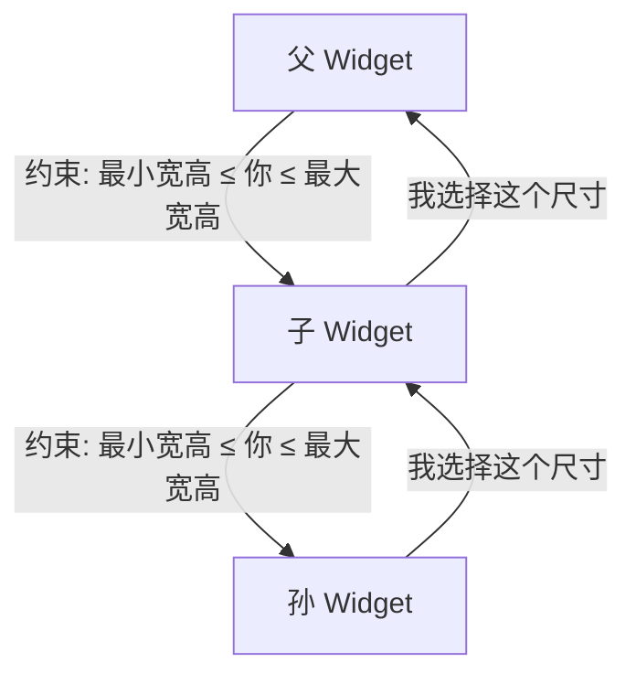
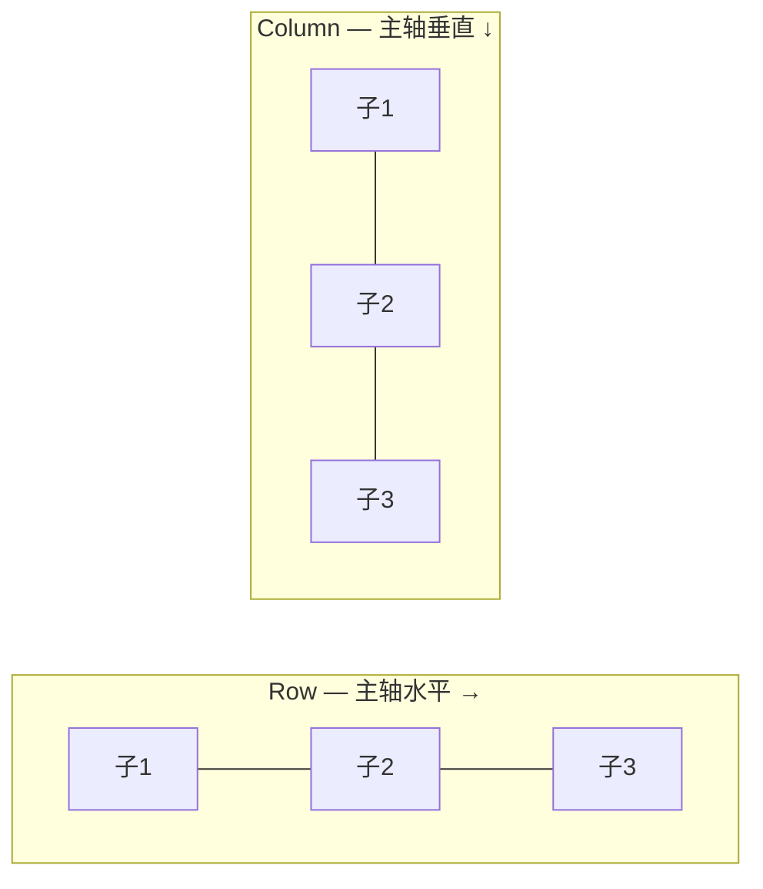

## 一、Flutter 布局的核心思维

Flutter 的布局系统和 CSS 完全不同，也不同于 Android 的 LinearLayout/RelativeLayout。它的核心规则只有一条：

> **父 Widget 向下传递约束（Constraints），子 Widget 向上报告尺寸（Size）。**



这意味着：
- 子 Widget **不能**自己决定大小，只能在父 Widget 给的约束范围内选择
- 父 Widget **可以**完全控制子 Widget 的大小
- 整个过程从根节点（屏幕尺寸）开始，逐级向下传递

**常见困惑：为什么我的 Widget 不显示？**

90% 的原因是约束问题——父 Widget 给了 0 的约束，或者子 Widget 没有在约束范围内选择尺寸。

## 二、容器类 Widget

### 2.1 Container — 万能容器

Container 是最常用的容器 Widget，它本身不做布局，而是组合了 Padding、Align、DecoratedBox、ConstrainedBox 等多个 Widget：

```dart
Container(
  width: 200,                    // 固定宽度
  height: 100,                   // 固定高度
  padding: const EdgeInsets.all(16),    // 内边距
  margin: const EdgeInsets.all(8),      // 外边距
  alignment: Alignment.center,   // 子 Widget 对齐方式
  decoration: BoxDecoration(
    color: Colors.white,
    borderRadius: BorderRadius.circular(12),
    boxShadow: [
      BoxShadow(
        color: Colors.black.withOpacity(0.1),
        blurRadius: 8,
        offset: const Offset(0, 2),
      ),
    ],
  ),
  child: const Text('日记卡片'),
)
```

**Container 的行为规则：**

| 条件 | 行为 |
|------|------|
| 有 child + 有约束 | 尽量满足约束，child 决定大小 |
| 有 child + 无约束 | 跟 child 一样大 |
| 无 child + 有约束 | 尽量大（满足约束） |
| 无 child + 无约束 | 尽量小（0x0） |

> **踩坑提醒**：Container 在无约束环境下默认是 0x0。如果你发现 Container 不显示，检查它的父 Widget 是否给了约束。

### 2.2 Padding — 纯内边距

如果只需要加内边距，用 Padding 比 Container 更高效（少一层 Widget）：

```dart
Padding(
  padding: const EdgeInsets.all(16),
  child: Text('内容'),
)

// EdgeInsets 的各种写法
EdgeInsets.all(16)                    // 四边相同
EdgeInsets.symmetric(horizontal: 16, vertical: 8)  // 水平/垂直
EdgeInsets.only(left: 16, top: 8)     // 指定边
EdgeInsets.fromLTRB(16, 8, 16, 8)     // 左上右下
```

### 2.3 Align 和 Center — 对齐

```dart
// Align — 将子 Widget 放在指定位置
Align(
  alignment: Alignment.topRight,
  child: Icon(Icons.close),
)

// Center — Align 的语法糖，等价于 alignment: Alignment.center
Center(
  child: CircularProgressIndicator(),
)

// Alignment 常用值
Alignment.topLeft       // 左上
Alignment.topCenter     // 上中
Alignment.topRight      // 右上
Alignment.centerLeft    // 左中
Alignment.center        // 正中
Alignment.centerRight   // 右中
Alignment.bottomLeft    // 左下
Alignment.bottomCenter  // 下中
Alignment.bottomRight   // 右下
Alignment(0.5, 0.5)    // 自定义：x 和 y 范围 [-1, 1]
```

### 2.4 SizedBox 和 ConstrainedBox — 尺寸约束

```dart
// SizedBox — 固定尺寸
SizedBox(
  width: 200,
  height: 100,
  child: Text('固定大小'),
)

// SizedBox 作为间距（无 child）
SizedBox(height: 16)   // 垂直间距 16
SizedBox(width: 8)     // 水平间距 8

// ConstrainedBox — 约束范围
ConstrainedBox(
  constraints: const BoxConstraints(
    minWidth: 100,
    maxWidth: 300,
    minHeight: 50,
    maxHeight: 200,
  ),
  child: Text('弹性大小'),
)

// Expanded 的简化版 — 占满剩余空间
SizedBox.expand(child: Text('占满父容器'))
```

## 三、线性布局：Row 和 Column

Row 和 Column 是最常用的布局 Widget，分别沿水平和垂直方向排列子 Widget。

### 3.1 基本用法

```dart
// Row — 水平排列
Row(
  children: [
    Icon(Icons.star),
    SizedBox(width: 8),    // 间距
    Text('5.0'),
    Spacer(),              // 弹性空间，把后面的推到右边
    Text('128 评论'),
  ],
)

// Column — 垂直排列
Column(
  children: [
    Text('标题', style: TextStyle(fontSize: 20)),
    SizedBox(height: 8),
    Text('副标题', style: TextStyle(fontSize: 14)),
  ],
)
```

### 3.2 主轴和交叉轴

Row 和 Column 的布局基于两条轴：



| | Row | Column |
|---|-----|--------|
| 主轴（MainAxis） | 水平 → | 垂直 ↓ |
| 交叉轴（CrossAxis） | 垂直 ↓ | 水平 → |

```dart
Row(
  mainAxisAlignment: MainAxisAlignment.spaceEvenly,    // 主轴对齐
  crossAxisAlignment: CrossAxisAlignment.center,       // 交叉轴对齐
  children: [/* ... */],
)
```

**MainAxisAlignment 对齐方式：**

```dart
// start — 靠主轴起点
[■■■ ■■ ■          ]

// center — 居中
[     ■■■ ■■ ■     ]

// end — 靠主轴终点
[          ■■■ ■■ ■]

// spaceBetween — 首尾贴边，中间均匀分布
[■■■          ■■          ■]

// spaceAround — 每个子元素两侧间距相等
[  ■■■    ■■    ■  ]

// spaceEvenly — 所有间距完全相等
[   ■■■   ■■   ■   ]
```

**CrossAxisAlignment 对齐方式：**

```dart
// start — 靠交叉轴起点
// center — 居中（默认）
// end — 靠交叉轴终点
// stretch — 拉伸填满交叉轴
// baseline — 按文字基线对齐（需要 textBaseline 参数）
```

### 3.3 Expanded 和 Flexible — 弹性布局

这是 Row/Column 中最重要的概念。当子 Widget 需要按比例分配空间时，用 Expanded 或 Flexible：

```dart
Row(
  children: [
    // Expanded — 占满剩余空间（强制填满）
    Expanded(
      child: Container(color: Colors.red, height: 50),
    ),
    // flex 参数控制比例
    Expanded(
      flex: 2,  // 占 2 份
      child: Container(color: Colors.blue, height: 50),
    ),
    Expanded(
      flex: 1,  // 占 1 份
      child: Container(color: Colors.green, height: 50),
    ),
    // 非弹性子 Widget 先分配空间
    Icon(Icons.star),  // 固定宽度
  ],
)
// 结果：红:蓝:绿 = 1:2:1（减去 Icon 的宽度后）
```

**Expanded vs Flexible：**

```dart
Row(
  children: [
    // Expanded — 必须填满分配的空间
    Expanded(
      child: Text('我会被强制拉伸到占满分配的空间'),
    ),

    // Flexible — 可以小于分配的空间
    Flexible(
      fit: FlexFit.loose,  // 默认值，子 Widget 可以更小
      child: Text('我只占我需要的空间，但不超过分配的'),
    ),
  ],
)
```

| | Expanded | Flexible |
|---|---------|----------|
| FlexFit | tight（强制填满） | loose（可以更小） |
| 子 Widget 尺寸 | 等于分配的空间 | 可以小于分配的空间 |
| 使用场景 | 需要填满剩余空间 | 需要限制最大空间但不强制填满 |

### 3.4 常见布局问题与解决

**问题1：Row/Column 溢出（最常见的报错）**

```
══════ Exception caught by rendering library ══════
A RenderFlex overflowed by 42 pixels on the right.
```

原因：子 Widget 的总宽度/高度超过了 Row/Column 的可用空间。

```dart
// ❌ 文本太长导致溢出
Row(
  children: [
    Text('这是一段非常非常非常非常长的文本会导致溢出'),
    Icon(Icons.arrow_forward),
  ],
)

// ✅ 用 Expanded 包裹文本
Row(
  children: [
    Expanded(
      child: Text(
        '这是一段非常非常非常非常长的文本',
        overflow: TextOverflow.ellipsis,  // 超出部分显示省略号
        maxLines: 1,
      ),
    ),
    Icon(Icons.arrow_forward),
  ],
)
```

**问题2：Row/Column 内使用 ListView**

```dart
// ❌ ListView 需要无限高度，Column 给不了
Column(
  children: [
    Text('标题'),
    ListView.builder(itemCount: 100, ...),  // 💥 报错！
  ],
)

// ✅ 方案1：给 ListView 固定高度
Column(
  children: [
    Text('标题'),
    SizedBox(
      height: 300,
      child: ListView.builder(itemCount: 100, ...),
    ),
  ],
)

// ✅ 方案2：用 Expanded 让 ListView 占满剩余空间
Column(
  children: [
    Text('标题'),
    Expanded(
      child: ListView.builder(itemCount: 100, ...),
    ),
  ],
)

// ✅ 方案3：用 shrinkWrap（不推荐，性能差）
ListView.builder(
  shrinkWrap: true,        // 让 ListView 只占内容高度
  physics: NeverScrollableScrollPhysics(),  // 禁用自身滚动
  itemCount: 100,
  ...
)
```

## 四、层叠布局：Stack 和 Positioned

Stack 让子 Widget 像图层一样堆叠，Positioned 控制每个子 Widget 的位置。

### 4.1 基本用法

```dart
Stack(
  children: [
    // 底层 — 背景
    Container(
      width: 200,
      height: 150,
      decoration: BoxDecoration(
        image: DecorationImage(
          image: AssetImage('images/cover.jpg'),
          fit: BoxFit.cover,
        ),
        borderRadius: BorderRadius.circular(12),
      ),
    ),
    // 上层 — 渐变遮罩
    Positioned.fill(
      child: Container(
        decoration: BoxDecoration(
          borderRadius: BorderRadius.circular(12),
          gradient: LinearGradient(
            begin: Alignment.topCenter,
            end: Alignment.bottomCenter,
            colors: [Colors.transparent, Colors.black54],
          ),
        ),
      ),
    ),
    // 最上层 — 文字
    Positioned(
      left: 12,
      bottom: 12,
      child: Text(
        '日记标题',
        style: TextStyle(color: Colors.white, fontSize: 18),
      ),
    ),
  ],
)
```

### 4.2 Stack 的对齐方式

```dart
Stack(
  alignment: Alignment.bottomRight,  // 未 Positioned 的子 Widget 的对齐方式
  children: [
    Container(width: 200, height: 200, color: Colors.blue),
    Icon(Icons.star, color: Colors.white),  // 右下角
  ],
)
```

### 4.3 Positioned 详解

```dart
Positioned(
  left: 10,      // 距左边 10
  top: 20,       // 距上边 20
  right: 10,     // 距右边 10
  // 不设 bottom，高度由子 Widget 决定
  child: Text('标题'),
)

Positioned.fill(  // 填满整个 Stack
  child: Container(color: Colors.black54),
)

// 相对定位
Positioned.directional(
  textDirection: TextDirection.ltr,
  start: 10,     // LTR 时等于 left
  end: 10,       // LTR 时等于 right
  top: 10,
  child: Text('适配 RTL'),
)
```

### 4.4 实战：图片上的点赞角标

```dart
class ImageWithBadge extends StatelessWidget {
  final String imageUrl;
  final int likes;

  const ImageWithBadge({
    super.key,
    required this.imageUrl,
    required this.likes,
  });

  @override
  Widget build(BuildContext context) {
    return Stack(
      clipBehavior: Clip.none,  // 允许子元素超出 Stack 范围
      children: [
        // 图片
        ClipRRect(
          borderRadius: BorderRadius.circular(12),
          child: Image.network(
            imageUrl,
            width: 200,
            height: 150,
            fit: BoxFit.cover,
          ),
        ),
        // 点赞角标 — 右上角突出
        Positioned(
          top: -8,
          right: -8,
          child: Container(
            padding: const EdgeInsets.symmetric(horizontal: 8, vertical: 4),
            decoration: BoxDecoration(
              color: Colors.red,
              borderRadius: BorderRadius.circular(12),
            ),
            child: Row(
              mainAxisSize: MainAxisSize.min,
              children: [
                const Icon(Icons.favorite, color: Colors.white, size: 14),
                const SizedBox(width: 4),
                Text(
                  '$likes',
                  style: const TextStyle(color: Colors.white, fontSize: 12),
                ),
              ],
            ),
          ),
        ),
      ],
    );
  }
}
```

## 五、Flex 和 Wrap

### 5.1 Flex — Row/Column 的底层实现

Row 和 Column 其实是 Flex 的语法糖：

```dart
// 这两个等价
Row(children: [...])
Flex(direction: Axis.horizontal, children: [...])

// 这两个等价
Column(children: [...])
Flex(direction: Axis.vertical, children: [...])
```

一般不需要直接用 Flex，除非你需要动态切换水平/垂直方向。

### 5.2 Wrap — 自动换行的 Row

Row 不会自动换行，子元素太多会溢出。Wrap 会自动换行：

```dart
Wrap(
  spacing: 8,       // 水平间距
  runSpacing: 8,    // 行间距
  alignment: WrapAlignment.start,
  children: [
    Chip(label: Text('Flutter')),
    Chip(label: Text('Dart')),
    Chip(label: Text('移动开发')),
    Chip(label: Text('跨平台')),
    Chip(label: Text('UI')),
    Chip(label: Text('Material')),
    Chip(label: Text('Cupertino')),
  ],
)
```

**Wrap 的典型场景：标签列表、标签选择器、流式布局。**

## 六、响应式布局

Flutter 没有像 CSS 媒体查询那样的内置响应式系统，但有几种常用方案：

### 6.1 MediaQuery — 获取屏幕信息

```dart
@override
Widget build(BuildContext context) {
  final size = MediaQuery.of(context).size;
  final width = size.width;
  final height = size.height;
  final padding = MediaQuery.of(context).padding;  // 安全区域

  if (width > 600) {
    // 平板/横屏布局
    return WideLayout();
  } else {
    // 手机/竖屏布局
    return NarrowLayout();
  }
}
```

### 6.2 LayoutBuilder — 根据父约束构建

```dart
LayoutBuilder(
  builder: (context, constraints) {
    if (constraints.maxWidth > 600) {
      return Row(
        children: [
          SizedBox(width: 250, child: NavPanel()),
          Expanded(child: ContentPanel()),
        ],
      );
    } else {
      return Column(
        children: [
          ContentPanel(),
          NavPanel(),
        ],
      );
    }
  },
)
```

### 6.3 实战：自适应日记列表

```dart
class JournalList extends StatelessWidget {
  final List<Journal> journals;

  const JournalList({super.key, required this.journals});

  @override
  Widget build(BuildContext context) {
    return LayoutBuilder(
      builder: (context, constraints) {
        // 宽屏：两列卡片
        if (constraints.maxWidth > 600) {
          final half = (journals.length / 2).ceil();
          return Row(
            crossAxisAlignment: CrossAxisAlignment.start,
            children: [
              Expanded(
                child: Column(
                  children: journals.take(half)
                      .map((j) => JournalCard(journal: j))
                      .toList(),
                ),
              ),
              const SizedBox(width: 16),
              Expanded(
                child: Column(
                  children: journals.skip(half)
                      .map((j) => JournalCard(journal: j))
                      .toList(),
                ),
              ),
            ],
          );
        }

        // 窄屏：单列列表
        return Column(
          children: journals
              .map((j) => JournalCard(journal: j))
              .toList(),
        );
      },
    );
  }
}
```

## 七、布局调试技巧

### 7.1 Flutter Inspector

在 DevTools 中打开 Flutter Inspector，可以：
- 选择任意 Widget 查看其约束和尺寸
- 高亮重绘区域（Repaint Rainbow）
- 查看 Widget 树结构

### 7.2 debugPaintSizeEnabled

```dart
void main() {
  debugPaintSizeEnabled = true;  // 显示所有 Widget 的边界和约束
  runApp(const MyApp());
}
```

这会在每个 Widget 周围画出边界线，帮你快速定位布局问题。

### 7.3 常见布局错误速查

| 错误信息 | 原因 | 解决 |
|---------|------|------|
| `RenderFlex overflowed` | Row/Column 子元素太大 | 用 Expanded 包裹或限制尺寸 |
| `RenderBox was not laid out` | 子 Widget 没有收到约束 | 检查父 Widget 是否给了约束 |
| `hasSize` is false | Widget 尺寸为 0 | 检查是否在无约束环境中 |
| `Vertical viewport was given unbounded height` | ListView 在 Column 中没有高度 | 用 Expanded 或 SizedBox 包裹 |

## 八、小结

| Widget 类别 | 常用 Widget | 核心用途 |
|-------------|------------|---------|
| 容器 | Container, Padding, Align, Center, SizedBox | 包裹、间距、对齐、固定尺寸 |
| 线性 | Row, Column, Expanded, Flexible | 水平/垂直排列，弹性分配空间 |
| 层叠 | Stack, Positioned | 图层堆叠，绝对定位 |
| 换行 | Wrap | 自动换行的流式布局 |
| 响应式 | MediaQuery, LayoutBuilder | 根据屏幕尺寸调整布局 |

---

上一篇：[Widget 一切皆组件](tutorial.html?type=flutter&file=03Widget一切皆组件.md)

下一篇：[路由与导航](tutorial.html?type=flutter&file=05路由与导航.md)
