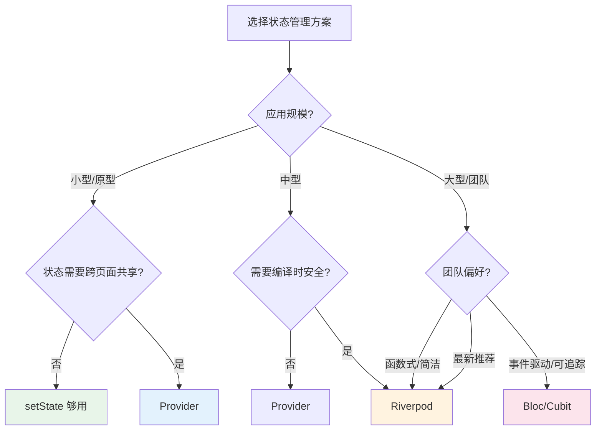

## 一、Riverpod：编译时安全的 Provider

Riverpod 是 Provider 作者的重新设计，解决了 Provider 的核心痛点——**运行时错误**。

### 1.1 Provider 的问题

```dart
// Provider 的运行时错误：忘记注册 Provider 时，编译不会报错
final provider = context.watch<JournalProvider>();  // 💥 运行时抛异常

// Provider 依赖 BuildContext，无法在 initState 之前使用
// Provider 不支持同一个类型的多个实例
```

### 1.2 Riverpod 的核心改进

| | Provider | Riverpod |
|---|---------|----------|
| 错误检测 | 运行时 | 编译时 |
| 依赖 Context | 是 | 否 |
| 同类型多实例 | 不支持 | 支持 |
| 异步状态 | 手动管理 | 内置 AsyncValue |
| 可测试性 | 中等 | 优秀 |

### 1.3 安装

```yaml
dependencies:
  flutter_riverpod: ^2.5.0
```

### 1.4 ProviderScope 和基础用法

```dart
void main() {
  runApp(
    const ProviderScope(  // Riverpod 的根组件
      child: JournalApp(),
    ),
  );
}
```

**声明 Provider：**

```dart
// 简单值 Provider
final helloProvider = Provider<String>((ref) => 'Hello, Riverpod!');

// 可变状态 Provider（类似 ChangeNotifierProvider）
final counterProvider = StateProvider<int>((ref) => 0);

// 异步数据 Provider
final journalsProvider = FutureProvider<List<Journal>>((ref) async {
  return fetchJournals();
});

// 通知者 Provider（推荐，类似 ChangeNotifier 但更安全）
class JournalNotifier extends Notifier<List<Journal>> {
  @override
  List<Journal> build() => [];  // 初始状态

  void add(Journal journal) {
    state = [...state, journal];
  }

  void remove(String id) {
    state = state.where((j) => j.id != id).toList();
  }

  void like(String id) {
    state = [
      for (final j in state)
        if (j.id == id) j.copyWith(likes: j.likes + 1) else j,
    ];
  }
}

final journalProvider = NotifierProvider<JournalNotifier, List<Journal>>(
  JournalNotifier.new,
);

// 异步通知者 Provider（最强大的模式）
class AsyncJournalNotifier extends AsyncNotifier<List<Journal>> {
  @override
  Future<List<Journal>> build() async {
    return fetchJournals();  // 初始加载
  }

  Future<void> add(Journal journal) async {
    state = const AsyncLoading();
    state = await AsyncValue.guard(() async {
      await saveJournal(journal);
      return [journal, ...?state.value];
    });
  }

  Future<void> refresh() async {
    ref.invalidateSelf();  // 重新执行 build
  }
}

final asyncJournalProvider = AsyncNotifierProvider<AsyncJournalNotifier, List<Journal>>(
  AsyncJournalNotifier.new,
);
```

### 1.5 在 Widget 中使用

```dart
// 方式1：ConsumerWidget（替代 StatelessWidget）
class JournalList extends ConsumerWidget {
  @override
  Widget build(BuildContext context, WidgetRef ref) {
    final journals = ref.watch(journalProvider);

    return ListView.builder(
      itemCount: journals.length,
      itemBuilder: (context, index) => JournalCard(journal: journals[index]),
    );
  }
}

// 方式2：ConsumerStatefulWidget（替代 StatefulWidget）
class JournalPage extends ConsumerStatefulWidget {
  @override
  ConsumerState<JournalPage> createState() => _JournalPageState();
}

class _JournalPageState extends ConsumerState<JournalPage> {
  @override
  void initState() {
    super.initState();
    // 在 initState 中使用 ref.read
    Future.microtask(() => ref.read(asyncJournalProvider.notifier).refresh());
  }

  @override
  Widget build(BuildContext context) {
    // watch 监听变化
    final asyncJournals = ref.watch(asyncJournalProvider);

    return asyncJournals.when(
      data: (journals) => ListView.builder(
        itemCount: journals.length,
        itemBuilder: (context, index) => JournalCard(journal: journals[index]),
      ),
      loading: () => const Center(child: CircularProgressIndicator()),
      error: (err, stack) => Center(child: Text('错误: $err')),
    );
  }
}
```

### 1.6 AsyncValue：优雅处理异步状态

Riverpod 最棒的设计之一——`AsyncValue` 把加载中、数据、错误三种状态统一管理：

```dart
// ❌ Provider 方式：手动管理三种状态
class JournalProvider extends ChangeNotifier {
  List<Journal> _journals = [];
  bool _isLoading = false;
  String? _error;

  // 需要在 UI 中分别判断 isLoading、error、journals
}

// ✅ Riverpod 方式：AsyncValue 自动管理
final journalsProvider = FutureProvider<List<Journal>>((ref) async {
  return fetchJournals();
});

// UI 中用 when 一次性处理三种状态
ref.watch(journalsProvider).when(
  data: (journals) => Text('${journals.length} 篇日记'),
  loading: () => CircularProgressIndicator(),
  error: (err, stack) => Text('错误: $err'),
);

// 还可以处理"保留旧数据的同时加载新数据"的场景
ref.watch(journalsProvider).whenData((journals) {
  // journals 是最新数据
});
```

### 1.7 Provider 依赖和组合

```dart
// Provider 可以依赖其他 Provider
final filteredJournalsProvider = Provider<List<Journal>>((ref) {
  final journals = ref.watch(journalProvider);
  final filter = ref.watch(categoryFilterProvider);  // 依赖筛选条件

  return journals.where((j) => j.category == filter).toList();
});

// 当 categoryFilterProvider 变化时，filteredJournalsProvider 自动重新计算
```

### 1.8 ref 的三种用法

```dart
// watch — 监听变化，Provider 变化时重建
final journals = ref.watch(journalProvider);

// read — 只读一次，不监听（适合事件回调）
ref.read(journalProvider.notifier).add(newJournal);

// listen — 监听变化但自己处理（适合显示 SnackBar）
ref.listen<AsyncValue>(asyncJournalProvider, (prev, next) {
  next.whenError((err, _) {
    ScaffoldMessenger.of(context).showSnackBar(
      SnackBar(content: Text('操作失败: $err')),
    );
  });
});
```

## 二、Bloc/Cubit：事件驱动的状态管理

Bloc（Business Logic Component）是另一种流行的状态管理方案，核心思想是**事件驱动**——通过输入事件（Event）产生输出状态（State）。

### 2.1 Cubit：Bloc 的简化版

Cubit 是 Bloc 的轻量版，用方法代替事件，适合简单场景：

```dart
// 安装
// flutter pub add flutter_bloc

// 定义 Cubit
class JournalCubit extends Cubit<List<Journal>> {
  JournalCubit() : super([]);

  Future<void> load() async {
    final journals = await fetchJournals();
    emit(journals);  // 发射新状态
  }

  void add(Journal journal) {
    emit([journal, ...state]);
  }

  void like(String id) {
    emit([
      for (final j in state)
        if (j.id == id) j.copyWith(likes: j.likes + 1) else j,
    ]);
  }

  void remove(String id) {
    emit(state.where((j) => j.id != id).toList());
  }
}
```

**在 Widget 中使用：**

```dart
BlocProvider(
  create: (context) => JournalCubit()..load(),
  child: JournalList(),
)

class JournalList extends StatelessWidget {
  @override
  Widget build(BuildContext context) {
    return BlocBuilder<JournalCubit, List<Journal>>(
      builder: (context, journals) {
        return ListView.builder(
          itemCount: journals.length,
          itemBuilder: (context, index) => JournalCard(journal: journals[index]),
        );
      },
    );
  }
}

// 调用方法
context.read<JournalCubit>().like('123');
```

### 2.2 Bloc：完整的事件驱动

Bloc 比 Cubit 多了一层 Event，适合复杂场景——每个状态变化都有对应的事件，便于追踪和测试：

```dart
// 定义事件
sealed class JournalEvent {}
class LoadJournals extends JournalEvent {}
class AddJournal extends JournalEvent { final Journal journal; AddJournal(this.journal); }
class LikeJournal extends JournalEvent { final String id; LikeJournal(this.id); }
class DeleteJournal extends JournalEvent { final String id; DeleteJournal(this.id); }

// 定义状态
sealed class JournalState {}
class JournalInitial extends JournalState {}
class JournalLoading extends JournalState {}
class JournalLoaded extends JournalState { final List<Journal> journals; JournalLoaded(this.journals); }
class JournalError extends JournalState { final String message; JournalError(this.message); }

// 定义 Bloc
class JournalBloc extends Bloc<JournalEvent, JournalState> {
  JournalBloc() : super(JournalInitial()) {
    on<LoadJournals>(_onLoad);
    on<AddJournal>(_onAdd);
    on<LikeJournal>(_onLike);
    on<DeleteJournal>(_onDelete);
  }

  Future<void> _onLoad(LoadJournals event, Emitter<JournalState> emit) async {
    emit(JournalLoading());
    try {
      final journals = await fetchJournals();
      emit(JournalLoaded(journals));
    } catch (e) {
      emit(JournalError(e.toString()));
    }
  }

  Future<void> _onAdd(AddJournal event, Emitter<JournalState> emit) async {
    await saveJournal(event.journal);
    final current = state is JournalLoaded ? (state as JournalLoaded).journals : <Journal>[];
    emit(JournalLoaded([event.journal, ...current]));
  }

  void _onLike(LikeJournal event, Emitter<JournalState> emit) {
    if (state is! JournalLoaded) return;
    final journals = (state as JournalLoaded).journals;
    emit(JournalLoaded([
      for (final j in journals)
        if (j.id == event.id) j.copyWith(likes: j.likes + 1) else j,
    ]));
  }

  void _onDelete(DeleteJournal event, Emitter<JournalState> emit) {
    if (state is! JournalLoaded) return;
    final journals = (state as JournalLoaded).journals;
    emit(JournalLoaded(journals.where((j) => j.id != event.id).toList()));
  }
}
```

**在 Widget 中使用：**

```dart
BlocProvider(
  create: (context) => JournalBloc()..add(LoadJournals()),
  child: JournalList(),
)

class JournalList extends StatelessWidget {
  @override
  Widget build(BuildContext context) {
    return BlocBuilder<JournalBloc, JournalState>(
      builder: (context, state) {
        return switch (state) {
          JournalInitial() => const SizedBox.shrink(),
          JournalLoading() => const Center(child: CircularProgressIndicator()),
          JournalLoaded(journals: final j) => ListView.builder(
            itemCount: j.length,
            itemBuilder: (context, index) => JournalCard(journal: j[index]),
          ),
          JournalError(message: final m) => Center(child: Text('错误: $m')),
        };
      },
    );
  }
}

// 发送事件
context.read<JournalBloc>().add(LikeJournal('123'));
```

### 2.3 Cubit vs Bloc 选择

| | Cubit | Bloc |
|---|-------|------|
| 复杂度 | 低 | 中 |
| 状态变化触发 | 调用方法 | 发送事件 |
| 可追踪性 | 一般 | 优秀（每个事件都有记录） |
| 可测试性 | 好 | 优秀（事件序列可验证） |
| 适用场景 | 简单状态 | 复杂业务逻辑 |

**原则**：先用 Cubit，当逻辑复杂到需要追踪"什么事件导致了什么状态变化"时，再升级为 Bloc。

## 三、选型决策树



**2026 年社区趋势：**

| 方案 | 社区热度 | 官方态度 | 学习曲线 |
|------|---------|---------|---------|
| Riverpod | ★★★★★ | 推荐 | 中 |
| Bloc | ★★★★☆ | 认可 | 中高 |
| Provider | ★★★☆☆ | 维护模式 | 低 |
| MobX | ★★☆☆☆ | 社区维护 | 中 |

## 四、用 Riverpod 重构 Flutter Journal

```dart
// providers/journal_provider.dart
import 'package:flutter_riverpod/flutter_riverpod.dart';

// API 服务 Provider
final journalApiProvider = Provider<JournalApi>((ref) => JournalApi());

// 日记列表 Provider
final journalListProvider = AsyncNotifierProvider<JournalListNotifier, List<Journal>>(
  JournalListNotifier.new,
);

class JournalListNotifier extends AsyncNotifier<List<Journal>> {
  @override
  Future<List<Journal>> build() async {
    final api = ref.watch(journalApiProvider);
    return api.fetchJournals();
  }

  Future<void> add(Journal journal) async {
    final api = ref.read(journalApiProvider);
    state = const AsyncLoading();
    state = await AsyncValue.guard(() async {
      await api.saveJournal(journal);
      return [journal, ...?state.value];
    });
  }

  Future<void> delete(String id) async {
    final api = ref.read(journalApiProvider);
    state = await AsyncValue.guard(() async {
      await api.deleteJournal(id);
      return state.value?.where((j) => j.id != id).toList() ?? [];
    });
  }

  void like(String id) {
    final current = state.value ?? [];
    state = AsyncData([
      for (final j in current)
        if (j.id == id) j.copyWith(likes: j.likes + 1) else j,
    ]);
  }

  Future<void> refresh() async {
    ref.invalidateSelf();
  }
}

// 分类筛选 Provider
final categoryFilterProvider = StateProvider<String?>((ref) => null);

// 筛选后的日记列表
final filteredJournalsProvider = Provider<AsyncValue<List<Journal>>>((ref) {
  final asyncJournals = ref.watch(journalListProvider);
  final filter = ref.watch(categoryFilterProvider);

  return asyncJournals.whenData((journals) {
    if (filter == null) return journals;
    return journals.where((j) => j.category == filter).toList();
  });
});

// 搜索 Provider
final searchQueryProvider = StateProvider<String>((ref) => '');

final searchResultsProvider = Provider<AsyncValue<List<Journal>>>((ref) {
  final asyncJournals = ref.watch(journalListProvider);
  final query = ref.watch(searchQueryProvider).toLowerCase();

  return asyncJournals.whenData((journals) {
    if (query.isEmpty) return journals;
    return journals.where((j) =>
      j.title.toLowerCase().contains(query) ||
      j.content.toLowerCase().contains(query)
    ).toList();
  });
});
```

**UI 中使用：**

```dart
class HomePage extends ConsumerWidget {
  @override
  Widget build(BuildContext context, WidgetRef ref) {
    final asyncJournals = ref.watch(filteredJournalsProvider);

    return Scaffold(
      appBar: AppBar(
        title: const Text('我的日记'),
        actions: [
          // 分类筛选
          PopupMenuButton<String?>(
            onSelected: (value) => ref.read(categoryFilterProvider.notifier).state = value,
            itemBuilder: (_) => [
              const PopupMenuItem(value: null, child: Text('全部')),
              const PopupMenuItem(value: '生活', child: Text('生活')),
              const PopupMenuItem(value: '技术', child: Text('技术')),
            ],
          ),
        ],
      ),
      body: asyncJournals.when(
        data: (journals) {
          if (journals.isEmpty) {
            return const Center(child: Text('还没有日记'));
          }
          return RefreshIndicator(
            onRefresh: () => ref.read(journalListProvider.notifier).refresh(),
            child: ListView.builder(
              itemCount: journals.length,
              itemBuilder: (context, index) => JournalCard(
                journal: journals[index],
                onLike: () => ref.read(journalListProvider.notifier).like(journals[index].id),
              ),
            ),
          );
        },
        loading: () => const Center(child: CircularProgressIndicator()),
        error: (err, _) => Center(
          child: Column(
            mainAxisAlignment: MainAxisAlignment.center,
            children: [
              Text('加载失败: $err'),
              ElevatedButton(
                onPressed: () => ref.invalidate(journalListProvider),
                child: const Text('重试'),
              ),
            ],
          ),
        ),
      ),
      floatingActionButton: FloatingActionButton(
        onPressed: () => context.push('/editor'),
        child: const Icon(Icons.add),
      ),
    );
  }
}
```

## 五、小结

| 方案 | 核心思想 | 优点 | 缺点 |
|------|---------|------|------|
| Riverpod | 编译时安全的 Provider | 类型安全、AsyncValue、组合灵活 | 学习曲线比 Provider 陡 |
| Cubit | 方法驱动的状态管理 | 简单、上手快 | 可追踪性不如 Bloc |
| Bloc | 事件驱动的状态管理 | 可追踪、可测试、适合大团队 | 样板代码多 |

**推荐路线**：小型应用用 Provider → 中型应用用 Riverpod → 大型团队项目可以考虑 Bloc。

---

上一篇：[状态管理（上）](tutorial.html?type=flutter&file=06状态管理（上）.md)

下一篇：[网络请求](tutorial.html?type=flutter&file=08网络请求.md)
