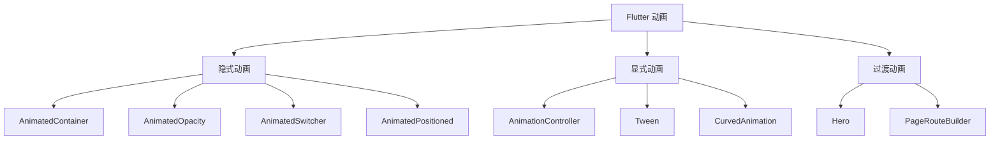

## 一、Flutter 动画体系



| 类型 | 特点 | 适用场景 |
|------|------|---------|
| 隐式动画 | 改属性自动动画，无需管理 Controller | 简单过渡效果 |
| 显式动画 | 手动控制动画过程，灵活度高 | 复杂自定义动画 |
| 过渡动画 | 页面间共享元素过渡 | 页面跳转动画 |

## 二、隐式动画

隐式动画是最简单的动画方式——改变属性值，Flutter 自动添加动画过渡。

### 2.1 AnimatedContainer

```dart
class AnimatedCard extends StatefulWidget {
  @override
  State<AnimatedCard> createState() => _AnimatedCardState();
}

class _AnimatedCardState extends State<AnimatedCard> {
  bool _expanded = false;

  @override
  Widget build(BuildContext context) {
    return GestureDetector(
      onTap: () => setState(() => _expanded = !_expanded),
      child: AnimatedContainer(
        duration: const Duration(milliseconds: 300),
        curve: Curves.easeInOut,
        width: _expanded ? double.infinity : 200,
        height: _expanded ? 200 : 100,
        padding: EdgeInsets.all(_expanded ? 24 : 12),
        decoration: BoxDecoration(
          color: _expanded ? Colors.indigo : Colors.white,
          borderRadius: BorderRadius.circular(_expanded ? 16 : 8),
          boxShadow: [
            BoxShadow(
              color: Colors.black.withOpacity(_expanded ? 0.2 : 0.1),
              blurRadius: _expanded ? 16 : 8,
            ),
          ],
        ),
        child: Text(
          '点击展开/收起',
          style: TextStyle(color: _expanded ? Colors.white : Colors.black),
        ),
      ),
    );
  }
}
```

### 2.2 其他隐式动画 Widget

```dart
// 透明度动画
AnimatedOpacity(
  opacity: _visible ? 1.0 : 0.0,
  duration: const Duration(milliseconds: 300),
  child: Text('淡入淡出'),
)

// 位置动画
AnimatedPositioned(
  left: _moved ? 100 : 0,
  top: _moved ? 100 : 0,
  duration: const Duration(milliseconds: 500),
  curve: Curves.bounceOut,
  child: Icon(Icons.star),
)

// 切换动画 — 两个 Widget 之间的过渡
AnimatedSwitcher(
  duration: const Duration(milliseconds: 300),
  child: _showA ? Text('A', key: ValueKey('a')) : Text('B', key: ValueKey('b')),
)

// 交叉淡入淡出
AnimatedCrossFade(
  firstChild: Widget1(),
  secondChild: Widget2(),
  crossFadeState: _showFirst ? CrossFadeState.showFirst : CrossFadeState.showSecond,
  duration: const Duration(milliseconds: 300),
)

// 列表项增删动画
AnimatedList(
  initialItemCount: items.length,
  itemBuilder: (context, index, animation) {
    return SlideTransition(
      position: animation.drive(Tween(
        begin: const Offset(1, 0),
        end: Offset.zero,
      )),
      child: ListTile(title: Text(items[index])),
    );
  },
)
```

## 三、显式动画

显式动画让你完全控制动画的每一帧。

### 3.1 AnimationController

```dart
class PulseAnimation extends StatefulWidget {
  final Widget child;
  const PulseAnimation({super.key, required this.child});

  @override
  State<PulseAnimation> createState() => _PulseAnimationState();
}

class _PulseAnimationState extends State<PulseAnimation>
    with SingleTickerProviderStateMixin {
  late final AnimationController _controller;

  @override
  void initState() {
    super.initState();
    _controller = AnimationController(
      vsync: this,
      duration: const Duration(milliseconds: 1500),
    )..repeat(reverse: true);  // 来回循环
  }

  @override
  void dispose() {
    _controller.dispose();
    super.dispose();
  }

  @override
  Widget build(BuildContext context) {
    return ScaleTransition(
      scale: Tween<double>(begin: 0.95, end: 1.05).animate(
        CurvedAnimation(parent: _controller, curve: Curves.easeInOut),
      ),
      child: widget.child,
    );
  }
}
```

### 3.2 Tween 和 Curve

```dart
// Tween — 定义值的变化范围
final colorTween = ColorTween(begin: Colors.blue, end: Colors.red);
final sizeTween = Tween<double>(begin: 50, end: 200);
final offsetTween = Tween<Offset>(begin: Offset.zero, end: const Offset(1, 0));

// Curve — 定义动画的时间曲线
Curves.linear          // 匀速
Curves.easeIn          // 慢→快
Curves.easeOut         // 快→慢
Curves.easeInOut       // 慢→快→慢
Curves.bounceOut       // 弹跳效果
Curves.elasticOut      // 弹性效果
Curves.decelerate      // 减速

// 组合使用
final animation = Tween<double>(begin: 0, end: 1).animate(
  CurvedAnimation(
    parent: _controller,
    curve: const Interval(0.0, 0.5, curve: Curves.easeOut),  // 只在前半段时间动画
  ),
);
```

### 3.3 自定义动画 Widget

```dart
class FadeSlideTransition extends StatelessWidget {
  final Animation<double> animation;
  final Widget child;

  const FadeSlideTransition({
    super.key,
    required this.animation,
    required this.child,
  });

  @override
  Widget build(BuildContext context) {
    return AnimatedBuilder(
      animation: animation,
      builder: (context, child) {
        return Opacity(
          opacity: animation.value,
          child: Transform.translate(
            offset: Offset(0, (1 - animation.value) * 50),
            child: child,
          ),
        );
      },
      child: child,
    );
  }
}
```

## 四、Hero 过渡动画

Hero 动画让两个页面共享一个元素，页面跳转时该元素平滑过渡：

```dart
// 列表页
Hero(
  tag: 'journal-${journal.id}',
  child: JournalCard(journal: journal),
)

// 详情页
Hero(
  tag: 'journal-${journal.id}',  // 相同的 tag
  child: JournalDetail(journal: journal),
)
```

跳转时使用 MaterialPageRoute，Hero 动画自动生效：

```dart
Navigator.push(
  context,
  MaterialPageRoute(builder: (_) => DetailPage(journal: journal)),
);
```

## 五、日记卡片翻转动画实战

```dart
class FlipCard extends StatefulWidget {
  final Widget front;
  final Widget back;

  const FlipCard({super.key, required this.front, required this.back});

  @override
  State<FlipCard> createState() => _FlipCardState();
}

class _FlipCardState extends State<FlipCard>
    with SingleTickerProviderStateMixin {
  late final AnimationController _controller;
  bool _showFront = true;

  @override
  void initState() {
    super.initState();
    _controller = AnimationController(
      vsync: this,
      duration: const Duration(milliseconds: 600),
    );
  }

  @override
  void dispose() {
    _controller.dispose();
    super.dispose();
  }

  void _flip() {
    if (_showFront) {
      _controller.forward();
    } else {
      _controller.reverse();
    }
    setState(() => _showFront = !_showFront);
  }

  @override
  Widget build(BuildContext context) {
    return GestureDetector(
      onTap: _flip,
      child: AnimatedBuilder(
        animation: _controller,
        builder: (context, child) {
          final angle = _controller.value * pi;
          return Transform(
            alignment: Alignment.center,
            transform: Matrix4.identity()
              ..setEntry(3, 2, 0.001)  // 透视效果
              ..rotateY(angle),
            child: angle < pi / 2
                ? widget.front
                : Transform(
                    alignment: Alignment.center,
                    transform: Matrix4.identity()..rotateY(pi),
                    child: widget.back,
                  ),
          );
        },
      ),
    );
  }
}
```

## 六、小结

| 类型 | Widget | 特点 |
|------|--------|------|
| 隐式动画 | AnimatedContainer 等 | 改属性自动动画，简单 |
| 显式动画 | AnimationController + Tween | 完全控制，灵活 |
| Hero | Hero | 页面间共享元素过渡 |

---

上一篇：[本地存储](tutorial.html?type=flutter&file=09本地存储.md)

下一篇：[自定义绘制与 Sliver](tutorial.html?type=flutter&file=11自定义绘制与Sliver.md)
