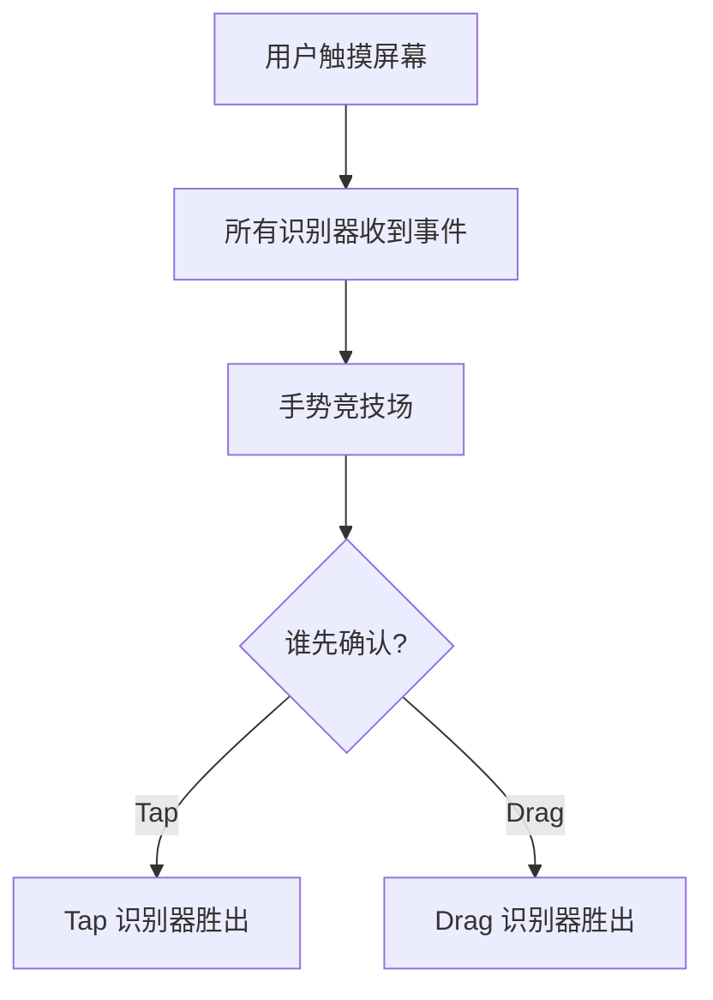

## 一、GestureDetector

GestureDetector 是 Flutter 手势识别的核心 Widget，可以识别点击、双击、长按、拖拽、缩放等手势。

### 1.1 常用手势

```dart
GestureDetector(
  onTap: () => print('点击'),
  onDoubleTap: () => print('双击'),
  onLongPress: () => print('长按'),
  onVerticalDragStart: (details) => print('垂直拖拽开始'),
  onHorizontalDragUpdate: (details) => print('水平拖拽: ${details.delta}'),
  onScaleStart: (details) => print('缩放开始'),
  onScaleUpdate: (details) => print('缩放: ${details.scale}'),
  child: Container(
    width: 200, height: 200,
    color: Colors.blue,
    child: const Center(child: Text('试试各种手势')),
  ),
)
```

### 1.2 InkWell vs GestureDetector

```dart
// InkWell — Material 涟漪效果
InkWell(
  onTap: () {},
  borderRadius: BorderRadius.circular(8),
  child: Padding(
    padding: const EdgeInsets.all(12),
    child: Text('点击有涟漪'),
  ),
)

// GestureDetector — 无视觉反馈，需要自己加
GestureDetector(
  onTap: () {},
  child: Container(/* ... */),
)
```

**选择**：需要 Material 涟漪效果用 InkWell，自定义交互用 GestureDetector。

### 1.3 手势竞争

当多个手势识别器同时监听时，Flutter 通过"手势竞技场"（Gesture Arena）决定谁胜出：



```dart
// 常见冲突：列表中的卡片既要点击又要滑动
// 解决：用 Listener 获取原始触摸事件，或用 InkWell 的 onTap
```

## 二、Dismissible：滑动删除

```dart
Dismissible(
  key: ValueKey(journal.id),
  direction: DismissDirection.endToStart,  // 只允许从右向左滑
  background: Container(
    color: Colors.red,
    alignment: Alignment.centerRight,
    padding: const EdgeInsets.only(right: 20),
    child: const Icon(Icons.delete, color: Colors.white),
  ),
  confirmDismiss: (direction) async {
    // 确认对话框
    return await showDialog<bool>(
      context: context,
      builder: (context) => AlertDialog(
        title: const Text('确认删除'),
        content: Text('确定删除"${journal.title}"吗？'),
        actions: [
          TextButton(onPressed: () => Navigator.pop(context, false), child: const Text('取消')),
          TextButton(onPressed: () => Navigator.pop(context, true), child: const Text('删除')),
        ],
      ),
    );
  },
  onDismissed: (direction) {
    ref.read(journalListProvider.notifier).delete(journal.id);
    ScaffoldMessenger.of(context).showSnackBar(
      SnackBar(content: Text('已删除 "${journal.title}"')),
    );
  },
  child: JournalCard(journal: journal),
)
```

## 三、ReorderableListView：拖拽排序

```dart
ReorderableListView.builder(
  itemCount: journals.length,
  onReorder: (oldIndex, newIndex) {
    if (newIndex > oldIndex) newIndex -= 1;
    ref.read(journalListProvider.notifier).reorder(oldIndex, newIndex);
  },
  itemBuilder: (context, index) {
    final journal = journals[index];
    return JournalCard(
      key: ValueKey(journal.id),
      journal: journal,
    );
  },
)
```

## 四、自定义拖拽

```dart
class DraggableJournal extends StatelessWidget {
  final Journal journal;

  const DraggableJournal({super.key, required this.journal});

  @override
  Widget build(BuildContext context) {
    return LongPressDraggable<Journal>(
      data: journal,
      feedback: Material(
        elevation: 4,
        borderRadius: BorderRadius.circular(12),
        child: SizedBox(
          width: 200,
          child: JournalCard(journal: journal),
        ),
      ),
      childWhenDragging: Opacity(
        opacity: 0.5,
        child: JournalCard(journal: journal),
      ),
      child: JournalCard(journal: journal),
    );
  }
}

class CategoryDropTarget extends StatelessWidget {
  final String category;
  final Widget child;

  const CategoryDropTarget({super.key, required this.category, required this.child});

  @override
  Widget build(BuildContext context) {
    return DragTarget<Journal>(
      onAccept: (journal) {
        // 移动到该分类
        ref.read(journalListProvider.notifier).moveToCategory(journal.id, category);
      },
      builder: (context, candidateData, rejectedData) {
        final isHovering = candidateData.isNotEmpty;
        return Container(
          decoration: BoxDecoration(
            color: isHovering ? Colors.indigo.shade50 : null,
            borderRadius: BorderRadius.circular(12),
            border: isHovering ? Border.all(color: Colors.indigo, width: 2) : null,
          ),
          child: child,
        );
      },
    );
  }
}
```

## 五、下拉刷新与加载更多

```dart
class JournalListView extends ConsumerWidget {
  @override
  Widget build(BuildContext context, WidgetRef ref) {
    final provider = ref.watch(journalListProvider);

    return RefreshIndicator(
      onRefresh: () => ref.read(journalListProvider.notifier).refresh(),
      child: NotificationListener<ScrollNotification>(
        onNotification: (notification) {
          // 滚动到底部加载更多
          if (notification is ScrollEndNotification &&
              notification.metrics.pixels >= notification.metrics.maxScrollExtent - 100) {
            ref.read(journalListProvider.notifier).loadMore();
          }
          return false;
        },
        child: ListView.builder(
          physics: const AlwaysScrollableScrollPhysics(),
          itemCount: provider.journals.length + (provider.hasMore ? 1 : 0),
          itemBuilder: (context, index) {
            if (index == provider.journals.length) {
              return const Padding(
                padding: EdgeInsets.all(16),
                child: Center(child: CircularProgressIndicator()),
              );
            }
            return Dismissible(
              key: ValueKey(provider.journals[index].id),
              onDismissed: (_) => ref.read(journalListProvider.notifier).delete(provider.journals[index].id),
              background: Container(color: Colors.red, child: const Icon(Icons.delete, color: Colors.white)),
              child: JournalCard(journal: provider.journals[index]),
            );
          },
        ),
      ),
    );
  }
}
```

## 六、小结

| 交互 | Widget | 用途 |
|------|--------|------|
| 手势识别 | GestureDetector | 点击、拖拽、缩放 |
| 涟漪效果 | InkWell | Material 风格点击 |
| 滑动删除 | Dismissible | 列表项左滑删除 |
| 拖拽排序 | ReorderableListView | 长按拖拽调整顺序 |
| 拖放 | Draggable + DragTarget | 跨区域拖放 |
| 下拉刷新 | RefreshIndicator | 下拉刷新数据 |

---

上一篇：[自定义绘制与 Sliver](tutorial.html?type=flutter&file=11自定义绘制与Sliver.md)

下一篇：[平台交互与插件](tutorial.html?type=flutter&file=13平台交互与插件.md)
