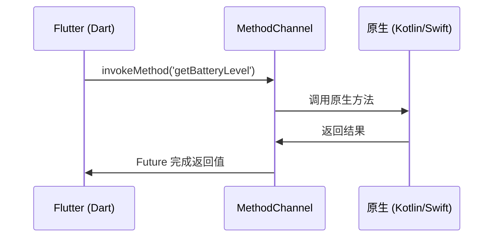

## 一、MethodChannel：Flutter 与原生的桥梁

Flutter 代码运行在 Dart VM 中，无法直接调用原生 API。MethodChannel 是两者通信的机制。



### 1.1 Dart 端调用

```dart
class PlatformService {
  static const _channel = MethodChannel('com.example.journal/platform');

  // 调用原生方法
  Future<int> getBatteryLevel() async {
    try {
      final level = await _channel.invokeMethod<int>('getBatteryLevel');
      return level!;
    } on PlatformException catch (e) {
      throw Exception('获取电量失败: ${e.message}');
    }
  }

  // 带参数调用
  Future<void> shareText(String text) async {
    await _channel.invokeMethod('shareText', {'text': text});
  }
}
```

### 1.2 Android 端实现

```kotlin
// android/app/src/main/kotlin/.../MainActivity.kt
class MainActivity : FlutterActivity() {
    override fun configureFlutterEngine(flutterEngine: FlutterEngine) {
        super.configureFlutterEngine(flutterEngine)

        MethodChannel(flutterEngine.dartExecutor.binaryMessenger, "com.example.journal/platform")
            .setMethodCallHandler { call, result ->
                when (call.method) {
                    "getBatteryLevel" -> {
                        val level = getBatteryLevel()
                        if (level != -1) result.success(level) else result.error("UNAVAILABLE", "无法获取电量", null)
                    }
                    "shareText" -> {
                        val text = call.argument<String>("text") ?: ""
                        shareText(text)
                        result.success(null)
                    }
                    else -> result.notImplemented()
                }
            }
    }

    private fun getBatteryLevel(): Int {
        val bm = getSystemService(BATTERY_SERVICE) as BatteryManager
        return bm.getIntProperty(BatteryManager.BATTERY_PROPERTY_CAPACITY)
    }
}
```

### 1.3 iOS 端实现

```swift
// ios/Runner/AppDelegate.swift
import Flutter

@UIApplicationMain
@objc class AppDelegate: FlutterAppDelegate {
    override func application(_ application: UIApplication, didFinishLaunchingWithOptions launchOptions: [UIApplication.LaunchOptionsKey: Any]?) -> Bool {
        let controller = window?.rootViewController as! FlutterViewController
        let channel = FlutterMethodChannel(name: "com.example.journal/platform", binaryMessenger: controller.binaryMessenger)

        channel.setMethodCallHandler { (call, result) in
            switch call.method {
            case "getBatteryLevel":
                let level = self.getBatteryLevel()
                result(level)
            default:
                result(FlutterMethodNotImplemented)
            }
        }

        return super.application(application, didFinishLaunchingWithOptions: launchOptions)
    }

    private func getBatteryLevel() -> Int {
        UIDevice.current.isBatteryMonitoringEnabled = true
        return Int(UIDevice.current.batteryLevel * 100)
    }
}
```

### 1.4 EventChannel：原生向 Flutter 推送事件

```dart
// Dart 端
static const _eventChannel = EventChannel('com.example.journal/events');

Stream<String> get networkStatus {
  return _eventChannel.receiveBroadcastStream().map((event) => event as String);
}

// 使用
platformService.networkStatus.listen((status) {
  print('网络状态: $status');
});
```

## 二、常用插件实战

### 2.1 图片选择

```yaml
dependencies:
  image_picker: ^1.0.0
```

```dart
import 'package:image_picker/image_picker.dart';

class ImagePickerService {
  final _picker = ImagePicker();

  Future<XFile?> pickFromGallery() async {
    return await _picker.pickImage(
      source: ImageSource.gallery,
      maxWidth: 1920,
      maxHeight: 1080,
      imageQuality: 85,
    );
  }

  Future<XFile?> pickFromCamera() async {
    // 需要相机权限
    return await _picker.pickImage(
      source: ImageSource.camera,
      maxWidth: 1920,
      maxHeight: 1080,
      imageQuality: 85,
    );
  }
}

// 在 UI 中使用
void _showImagePicker(BuildContext context) {
  showModalBottomSheet(
    context: context,
    builder: (context) => SafeArea(
      child: Wrap(
        children: [
          ListTile(
            leading: const Icon(Icons.camera_alt),
            title: const Text('拍照'),
            onTap: () async {
              Navigator.pop(context);
              final image = await ImagePickerService().pickFromCamera();
              if (image != null) _handleImage(image);
            },
          ),
          ListTile(
            leading: const Icon(Icons.photo_library),
            title: const Text('从相册选择'),
            onTap: () async {
              Navigator.pop(context);
              final image = await ImagePickerService().pickFromGallery();
              if (image != null) _handleImage(image);
            },
          ),
        ],
      ),
    ),
  );
}
```

### 2.2 权限管理

```yaml
dependencies:
  permission_handler: ^11.0.0
```

```dart
import 'package:permission_handler/permission_handler.dart';

Future<bool> requestCameraPermission() async {
  final status = await Permission.camera.request();
  if (status.isDenied) {
    // 用户拒绝了
    await openAppSettings();  // 引导用户去设置页开启
    return false;
  }
  return status.isGranted;
}

Future<bool> requestStoragePermission() async {
  if (Platform.isAndroid) {
    final status = await Permission.storage.request();
    return status.isGranted;
  }
  return true;  // iOS 不需要存储权限
}
```

### 2.3 分享

```yaml
dependencies:
  share_plus: ^7.0.0
```

```dart
import 'package:share_plus/share_plus.dart';

// 分享文本
await Share.share('看看这篇日记：${journal.title}\n${journal.summary}');

// 分享文件
await Share.shareXFiles(
  [XFile(imagePath)],
  text: journal.title,
  subject: journal.title,
);
```

### 2.4 本地推送

```yaml
dependencies:
  flutter_local_notifications: ^17.0.0
```

```dart
class NotificationService {
  static final _plugin = FlutterLocalNotificationsPlugin();

  static Future<void> init() async {
    const androidSettings = AndroidInitializationSettings('@mipmap/ic_launcher');
    const iosSettings = DarwinInitializationSettings();

    await _plugin.initialize(
      const InitializationSettings(android: androidSettings, iOS: iosSettings),
      onDidReceiveNotificationResponse: (response) {
        // 点击通知的回调
        final payload = response.payload;
        if (payload != null) {
          // 跳转到对应日记
          router.push('/journal/$payload');
        }
      },
    );
  }

  static Future<void> scheduleReminder({
    required String journalId,
    required String title,
    required DateTime scheduledTime,
  }) async {
    await _plugin.schedule(
      journalId.hashCode,
      '写作提醒',
      '别忘了写日记：$title',
      scheduledTime,
      const NotificationDetails(
        android: AndroidNotificationDetails(
          'journal_reminder',
          '日记提醒',
          importance: Importance.high,
        ),
        iOS: DarwinNotificationDetails(),
      ),
      payload: journalId,
    );
  }
}
```

## 三、编写自己的插件

### 3.1 创建插件项目

```bash
flutter create --template=plugin --platforms=android,ios,web my_plugin
```

### 3.2 插件结构

```
my_plugin/
├── lib/
│   └── my_plugin.dart       ← Dart API
├── android/                  ← Android 原生实现
├── ios/                      ← iOS 原生实现
├── example/                  ← 示例 App
└── pubspec.yaml
```

### 3.3 Federated Plugin 架构

现代 Flutter 插件使用"联合插件"模式，将接口和平台实现分离：

```dart
// 1. 接口包（my_plugin_platform_interface）
abstract class MyPluginPlatform {
  static MyPluginPlatform get instance => _instance;
  static MyPluginPlatform _instance = MethodChannelMyPlugin();

  Future<String?> getPlatformVersion();
}

// 2. MethodChannel 实现（my_plugin）
class MethodChannelMyPlugin extends MyPluginPlatform {
  @override
  Future<String?> getPlatformVersion() {
    return const MethodChannel('my_plugin').invokeMethod<String>('getPlatformVersion');
  }
}

// 3. 对外 API（my_plugin）
class MyPlugin {
  static Future<String?> get platformVersion =>
      MyPluginPlatform.instance.getPlatformVersion();
}
```

## 四、Web 平台差异

```dart
import 'package:flutter/foundation.dart' show kIsWeb;

if (kIsWeb) {
  // Web 端不支持某些插件（如相机、推送）
  // 使用 Web 替代方案
} else if (Platform.isAndroid) {
  // Android 特有逻辑
} else if (Platform.isIOS) {
  // iOS 特有逻辑
}
```

## 五、小结

| 主题 | 核心要点 |
|------|---------|
| MethodChannel | Flutter ↔ 原生通信，invokeMethod 调用 |
| EventChannel | 原生向 Flutter 推送事件流 |
| 常用插件 | image_picker、share_plus、flutter_local_notifications |
| 权限 | permission_handler 管理运行时权限 |
| 自定义插件 | Federated 架构，接口与实现分离 |

---

上一篇：[手势与交互](tutorial.html?type=flutter&file=12手势与交互.md)

下一篇：[架构设计](tutorial.html?type=flutter&file=14架构设计.md)
