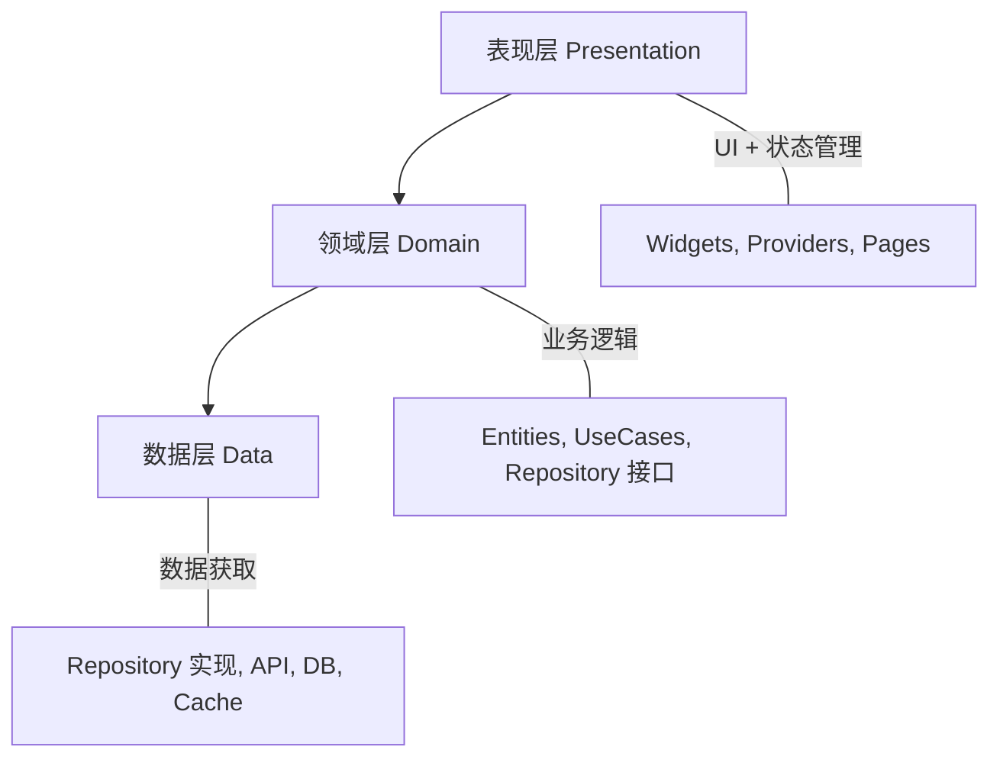

## 一、为什么需要架构

小型应用可以"状态管理 + UI"一把梭，但随着功能增长，代码会变成一团乱麻。架构的目标是：**让代码可维护、可测试、可扩展**。

## 二、分层架构



### 2.1 目录结构

```
lib/
├── main.dart
├── app.dart
├── core/                     ← 基础设施
│   ├── theme/
│   ├── router/
│   ├── constants/
│   └── utils/
├── domain/                   ← 领域层（纯 Dart，不依赖 Flutter）
│   ├── entities/
│   │   └── journal.dart
│   ├── repositories/
│   │   └── journal_repository.dart   ← 接口
│   └── usecases/
│       ├── get_journals.dart
│       ├── add_journal.dart
│       └── delete_journal.dart
├── data/                     ← 数据层
│   ├── models/
│   │   └── journal_model.dart        ← 含 JSON 序列化
│   ├── repositories/
│   │   └── journal_repository_impl.dart  ← 实现
│   ├── datasources/
│   │   ├── local/
│   │   │   └── journal_local_data_source.dart
│   │   └── remote/
│   │       └── journal_remote_data_source.dart
│   └── mappers/
│       └── journal_mapper.dart       ← Model ↔ Entity 转换
└── presentation/             ← 表现层
    ├── pages/
    │   ├── home/
    │   ├── detail/
    │   └── editor/
    ├── widgets/
    │   ├── journal_card.dart
    │   └── category_filter.dart
    └── providers/
        ├── journal_provider.dart
        └── theme_provider.dart
```

### 2.2 领域层

领域层是纯 Dart 代码，不依赖任何 Flutter 或第三方包：

```dart
// domain/entities/journal.dart
class Journal {
  final String id;
  final String title;
  final String content;
  final String category;
  final int likes;
  final DateTime createdAt;

  const Journal({
    required this.id,
    required this.title,
    required this.content,
    this.category = '生活',
    this.likes = 0,
    required this.createdAt,
  });

  Journal copyWith({String? title, String? content, String? category, int? likes}) {
    return Journal(
      id: id,
      title: title ?? this.title,
      content: content ?? this.content,
      category: category ?? this.category,
      likes: likes ?? this.likes,
      createdAt: createdAt,
    );
  }
}

// domain/repositories/journal_repository.dart — 接口
abstract class JournalRepository {
  Future<List<Journal>> getJournals({String? category});
  Future<Journal> getJournal(String id);
  Future<Journal> addJournal(Journal journal);
  Future<Journal> updateJournal(Journal journal);
  Future<void> deleteJournal(String id);
  Stream<List<Journal>> watchJournals();
}

// domain/usecases/get_journals.dart
class GetJournals {
  final JournalRepository _repository;

  GetJournals(this._repository);

  Future<List<Journal>> call({String? category}) {
    return _repository.getJournals(category: category);
  }
}
```

### 2.3 数据层

```dart
// data/models/journal_model.dart
class JournalModel {
  final String id;
  final String title;
  final String content;
  final String category;
  final int likes;
  final String createdAt;

  const JournalModel({
    required this.id,
    required this.title,
    required this.content,
    required this.category,
    required this.likes,
    required this.createdAt,
  });

  factory JournalModel.fromJson(Map<String, dynamic> json) => JournalModel(
    id: json['id'],
    title: json['title'],
    content: json['content'],
    category: json['category'] ?? '生活',
    likes: json['likes'] ?? 0,
    createdAt: json['created_at'],
  );

  Map<String, dynamic> toJson() => {
    'id': id, 'title': title, 'content': content,
    'category': category, 'likes': likes, 'created_at': createdAt,
  };
}

// data/mappers/journal_mapper.dart
extension JournalModelMapper on JournalModel {
  Journal toEntity() => Journal(
    id: id, title: title, content: content,
    category: category, likes: likes,
    createdAt: DateTime.parse(createdAt),
  );
}

extension JournalEntityMapper on Journal {
  JournalModel toModel() => JournalModel(
    id: id, title: title, content: content,
    category: category, likes: likes,
    createdAt: createdAt.toIso8601String(),
  );
}

// data/repositories/journal_repository_impl.dart
class JournalRepositoryImpl implements JournalRepository {
  final JournalRemoteDataSource _remote;
  final JournalLocalDataSource _local;

  JournalRepositoryImpl(this._remote, this._local);

  @override
  Future<List<Journal>> getJournals({String? category}) async {
    try {
      final models = await _remote.getJournals(category: category);
      await _local.cacheJournals(models);
      return models.map((m) => m.toEntity()).toList();
    } catch (_) {
      // 网络失败，从本地缓存读取
      final models = await _local.getCachedJournals(category: category);
      return models.map((m) => m.toEntity()).toList();
    }
  }

  @override
  Stream<List<Journal>> watchJournals() {
    return _local.watchJournals().map(
      (models) => models.map((m) => m.toEntity()).toList(),
    );
  }
  // ...
}
```

### 2.4 依赖注入

```yaml
dependencies:
  get_it: ^7.6.0
```

```dart
// core/di/injection.dart
import 'package:get_it/get_it.dart';

final locator = GetIt.instance;

void setupDependencies() {
  // Data sources
  locator.registerLazySingleton<JournalRemoteDataSource>(
    () => JournalRemoteDataSourceImpl(dio: locator()),
  );
  locator.registerLazySingleton<JournalLocalDataSource>(
    () => JournalLocalDataSourceImpl(db: locator()),
  );

  // Repository
  locator.registerLazySingleton<JournalRepository>(
    () => JournalRepositoryImpl(locator(), locator()),
  );

  // Use cases
  locator.registerFactory(() => GetJournals(locator()));
  locator.registerFactory(() => AddJournal(locator()));
  locator.registerFactory(() => DeleteJournal(locator()));

  // External
  locator.registerLazySingleton(() => Dio());
  locator.registerLazySingleton(() => AppDatabase());
}

// main.dart
void main() {
  setupDependencies();
  runApp(const JournalApp());
}
```

**registerLazySingleton vs registerFactory：**

| | LazySingleton | Factory |
|---|--------------|---------|
| 创建时机 | 第一次访问时 | 每次访问时 |
| 实例数量 | 1 | 每次新建 |
| 适用 | 数据库、API 客户端 | UseCase（无状态） |

## 三、Flutter Journal 最终架构

```dart
// presentation/providers/journal_provider.dart
final journalListProvider = AsyncNotifierProvider<JournalListNotifier, List<Journal>>(
  JournalListNotifier.new,
);

class JournalListNotifier extends AsyncNotifier<List<Journal>> {
  @override
  Future<List<Journal>> build() async {
    final getJournals = locator<GetJournals>();
    return getJournals();
  }

  Future<void> add(Journal journal) async {
    final addJournal = locator<AddJournal>();
    state = const AsyncLoading();
    state = await AsyncValue.guard(() async {
      await addJournal(journal);
      return [journal, ...?state.value];
    });
  }

  Future<void> delete(String id) async {
    final deleteJournal = locator<DeleteJournal>();
    state = await AsyncValue.guard(() async {
      await deleteJournal(id);
      return state.value?.where((j) => j.id != id).toList() ?? [];
    });
  }
}
```

## 四、小结

| 层 | 职责 | 依赖方向 |
|----|------|---------|
| 表现层 | UI + 状态管理 | → 领域层 |
| 领域层 | 业务逻辑 + 接口 | 无外部依赖 |
| 数据层 | 数据获取 + 缓存 | → 领域层（实现接口） |

---

上一篇：[平台交互与插件](tutorial.html?type=flutter&file=13平台交互与插件.md)

下一篇：[测试全攻略](tutorial.html?type=flutter&file=15测试全攻略.md)
