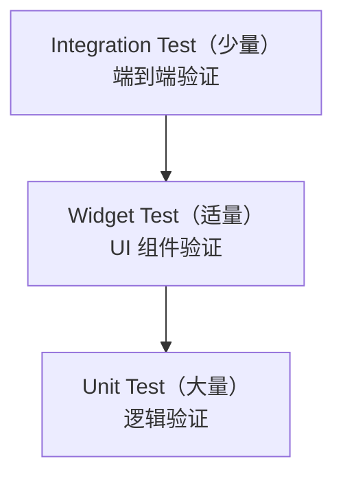

## 一、测试金字塔



| 类型 | 速度 | 覆盖范围 | 数量 |
|------|------|---------|------|
| Unit Test | 毫秒级 | 单个函数/类 | 最多 |
| Widget Test | 秒级 | 单个 Widget | 适中 |
| Integration Test | 分钟级 | 整个流程 | 最少 |

## 二、Unit Test

### 2.1 基本用法

```dart
// domain/entities/journal_test.dart
import 'package:flutter_test/flutter_test.dart';

void main() {
  group('Journal', () {
    test('copyWith 应该只修改指定字段', () {
      final journal = Journal(
        id: '1', title: '标题', content: '内容',
        category: '生活', likes: 5, createdAt: DateTime(2026),
      );

      final updated = journal.copyWith(likes: 10);

      expect(updated.id, '1');
      expect(updated.title, '标题');
      expect(updated.likes, 10);
      expect(journal.likes, 5);  // 原对象不变
    });

    test('isPopular 应该在 likes > 100 时返回 true', () {
      final popular = Journal(
        id: '1', title: '', content: '', likes: 101, createdAt: DateTime(2026),
      );
      final normal = Journal(
        id: '2', title: '', content: '', likes: 99, createdAt: DateTime(2026),
      );

      expect(popular.isPopular, true);
      expect(normal.isPopular, false);
    });
  });
}
```

### 2.2 Mock 和 Fake

```dart
// 使用 mockito 生成 Mock
import 'package:mockito/mockito.dart';
import 'package:mockito/annotations.dart';

@GenerateMocks([JournalRepository])
import 'journal_usecase_test.mocks.dart';

void main() {
  late GetJournals useCase;
  late MockJournalRepository mockRepo;

  setUp(() {
    mockRepo = MockJournalRepository();
    useCase = GetJournals(mockRepo);
  });

  test('应该返回日记列表', () async {
    // Arrange
    final journals = [
      Journal(id: '1', title: '测试', content: '内容', createdAt: DateTime(2026)),
    ];
    when(mockRepo.getJournals()).thenAnswer((_) async => journals);

    // Act
    final result = await useCase();

    // Assert
    expect(result, equals(journals));
    verify(mockRepo.getJournals()).called(1);
  });

  test('应该按分类过滤', () async {
    when(mockRepo.getJournals(category: '技术')).thenAnswer((_) async => []);

    final result = await useCase(category: '技术');

    expect(result, isEmpty);
    verify(mockRepo.getJournals(category: '技术')).called(1);
  });
}
```

**Fake vs Mock：**

```dart
// Fake — 手写假实现，适合简单场景
class FakeJournalRepository implements JournalRepository {
  final List<Journal> _journals = [];

  @override
  Future<List<Journal>> getJournals({String? category}) async {
    if (category != null) {
      return _journals.where((j) => j.category == category).toList();
    }
    return _journals;
  }
}

// Mock — 自动生成，适合验证调用行为
// 用 mockito 的 @GenerateMocks 注解生成
```

## 三、Widget Test

```dart
// presentation/widgets/journal_card_test.dart
void main() {
  group('JournalCard', () {
    testWidgets('应该显示标题和摘要', (tester) async {
      final journal = Journal(
        id: '1',
        title: '测试日记',
        content: '这是一篇测试日记的内容，需要超过五十个字符才能看到省略号效果吧',
        category: '技术',
        likes: 5,
        createdAt: DateTime(2026, 6, 6),
      );

      await tester.pumpWidget(
        MaterialApp(
          home: Scaffold(
            body: JournalCard(journal: journal),
          ),
        ),
      );

      expect(find.text('测试日记'), findsOneWidget);
      expect(find.byIcon(Icons.favorite), findsOneWidget);
      expect(find.text('5'), findsOneWidget);
    });

    testWidgets('点击应该触发 onTap', (tester) async {
      var tapped = false;
      final journal = Journal(
        id: '1', title: '测试', content: '内容', createdAt: DateTime(2026),
      );

      await tester.pumpWidget(
        MaterialApp(
          home: Scaffold(
            body: JournalCard(
              journal: journal,
              onTap: () => tapped = true,
            ),
          ),
        ),
      );

      await tester.tap(find.byType(InkWell));
      expect(tapped, true);
    });

    testWidgets('热门日记应该显示标签', (tester) async {
      final popular = Journal(
        id: '1', title: '热门', content: '内容', likes: 200, createdAt: DateTime(2026),
      );

      await tester.pumpWidget(
        MaterialApp(
          home: Scaffold(body: JournalCard(journal: popular)),
        ),
      );

      expect(find.text('热门'), findsOneWidget);  // 标签
    });
  });
}
```

## 四、Integration Test

```dart
// integration_test/app_test.dart
import 'package:integration_test/integration_test.dart';

void main() {
  IntegrationTestWidgetsFlutterBinding.ensureInitialized();

  group('日记流程', () {
    testWidgets('创建并查看日记', (tester) async {
      await tester.pumpWidget(const JournalApp());
      await tester.pumpAndSettle();

      // 点击添加按钮
      await tester.tap(find.byIcon(Icons.add));
      await tester.pumpAndSettle();

      // 输入标题
      await tester.enterText(find.bySemanticsLabel('标题'), '集成测试日记');
      await tester.enterText(find.bySemanticsLabel('内容'), '这是通过集成测试创建的日记');

      // 保存
      await tester.tap(find.text('保存'));
      await tester.pumpAndSettle();

      // 验证首页显示新日记
      expect(find.text('集成测试日记'), findsOneWidget);
    });
  });
}
```

## 五、Golden Test（视觉回归测试）

```dart
// test/widgets/journal_card_golden_test.dart
import 'package:golden_toolkit/golden_toolkit.dart';

void main() {
  testGoldens('JournalCard 应该匹配快照', (tester) async {
    await tester.pumpWidgetBuilder(
      MaterialApp(
        home: Scaffold(body: JournalCard(journal: testJournal)),
      ),
    );

    await screenMatchesGolden(tester, 'journal_card_default');
  });
}
```

## 六、运行测试

```bash
# 运行所有单元测试
flutter test

# 运行指定文件
flutter test test/domain/entities/journal_test.dart

# 运行集成测试
flutter test integration_test/app_test.dart

# 生成覆盖率
flutter test --coverage
```

## 七、小结

| 类型 | 用途 | 关键 API |
|------|------|---------|
| Unit Test | 逻辑验证 | test(), expect(), mockito |
| Widget Test | UI 验证 | testWidgets(), pumpWidget(), tap() |
| Integration Test | 端到端 | IntegrationTestWidgetsFlutterBinding |
| Golden Test | 视觉回归 | screenMatchesGolden() |

---

上一篇：[架构设计](tutorial.html?type=flutter&file=14架构设计.md)

下一篇：[性能优化](tutorial.html?type=flutter&file=16性能优化.md)
