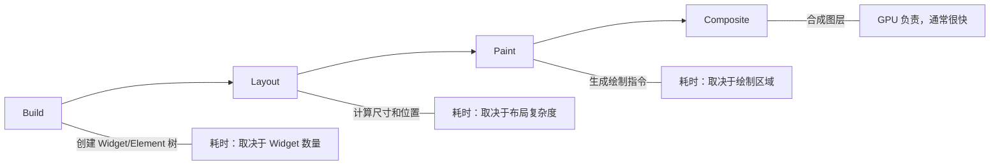

## 一、Flutter 渲染原理

理解渲染流程才能找到性能瓶颈：



**性能优化目标：16ms 内完成 Build + Layout + Paint（60fps）。**

## 二、const 优化

`const` 构造函数让 Flutter 跳过 Widget 的重建和比较：

```dart
// ❌ 每次 build 都创建新实例
Text('标题')
Icon(Icons.star)
SizedBox(height: 8)

// ✅ 编译时常量，只创建一次
const Text('标题')
const Icon(Icons.star)
const SizedBox(height: 8)

// ❌ 父 Widget 重建时，子 Widget 也重建
Widget build(BuildContext context) {
  return Column(
    children: [
      Text('标题'),           // 每次新建
      SizedBox(height: 8),   // 每次新建
      Text('内容'),
    ],
  );
}

// ✅ 提取为 const 子组件
class _TitleSection extends StatelessWidget {
  const _TitleSection();

  @override
  Widget build(BuildContext context) {
    return const Column(
      children: [
        Text('标题'),
        SizedBox(height: 8),
        Text('内容'),
      ],
    );
  }
}
```

**const 的效果：**
- Widget 比较时直接用 `identical()`，O(1)
- 不需要重新创建 Widget 实例
- Element 可以直接复用

## 三、RepaintBoundary

当 Widget 频繁重绘时，用 RepaintBoundary 隔离重绘范围：

```dart
// ❌ 列表中一个点赞动画导致整个列表重绘
ListView.builder(
  itemBuilder: (context, index) {
    return JournalCard(journal: journals[index]);  // 点赞动画触发整个 ListView 重绘
  },
)

// ✅ 用 RepaintBoundary 隔离
ListView.builder(
  itemBuilder: (context, index) {
    return RepaintBoundary(
      child: JournalCard(journal: journals[index]),
    );
  },
)
```

**什么时候用 RepaintBoundary：**
- 列表项中有动画
- 频繁更新的 Widget（计时器、进度条）
- 复杂的自绘 Widget

## 四、ListView 优化

### 4.1 懒加载

```dart
// ❌ 一次性创建所有子项
ListView(
  children: journals.map((j) => JournalCard(journal: j)).toList(),
)

// ✅ 按需创建
ListView.builder(
  itemCount: journals.length,
  itemBuilder: (context, index) => JournalCard(journal: journals[index]),
)
```

### 4.2 addAutomaticKeepAlives

```dart
ListView.builder(
  addAutomaticKeepAlives: false,  // 禁用自动保活，减少开销
  addRepaintBoundaries: true,     // 自动添加 RepaintBoundary
  itemCount: journals.length,
  itemBuilder: (context, index) => JournalCard(journal: journals[index]),
)
```

### 4.3 图片缓存

```dart
Image.network(
  url,
  cacheWidth: 300,    // 解码后的缓存宽度（节省内存）
  cacheHeight: 200,
  fit: BoxFit.cover,
)
```

## 五、DevTools 实战

### 5.1 Performance 面板

```bash
# 启动应用时启用性能覆盖
flutter run --profile
```

在 DevTools → Performance 中：
- **Flutter Frames** — 查看每帧耗时，红色帧表示超 16ms
- **CPU Profiler** — 查看函数调用耗时
- **Timeline** — 查看 Build/Layout/Paint 各阶段耗时

### 5.2 检测问题

```dart
// 开启性能覆盖层（调试用）
void main() {
  debugProfileBuildsEnabled = true;     // 标记重建的 Widget
  debugProfilePaintsEnabled = true;     // 标记重绘的区域
  runApp(const JournalApp());
}
```

### 5.3 Repaint Rainbow

在 DevTools 中开启 Repaint Rainbow，重绘的区域会显示彩色边框。如果整个屏幕都在闪烁，说明重绘范围太大。

## 六、内存优化

### 6.1 常见内存泄漏

```dart
// ❌ 忘记取消订阅
class _MyState extends State<MyWidget> {
  StreamSubscription? _sub;

  @override
  void initState() {
    super.initState();
    _sub = someStream.listen((data) {
      if (mounted) setState(() {/* ... */});
    });
  }

  // 忘记 dispose！Stream 持有 State 引用，导致内存泄漏
}

// ✅ 正确释放
@override
void dispose() {
  _sub?.cancel();
  super.dispose();
}
```

### 6.2 图片内存

```dart
// ❌ 加载原始分辨率的大图
Image.asset('images/photo.jpg')  // 4000x3000 的图片占用 48MB 内存

// ✅ 指定缓存尺寸
Image.asset(
  'images/photo.jpg',
  cacheWidth: 800,  // 只解码到 800px 宽
  fit: BoxFit.cover,
)
```

### 6.3 使用 const 减少对象创建

```dart
// ❌ 每次 build 创建新的 EdgeInsets
padding: EdgeInsets.all(16)

// ✅ 使用 const
padding: const EdgeInsets.all(16)
```

## 七、启动优化

```dart
// 使用 Deferred Components 延迟加载
// pubspec.yaml
# flutter:
#   deferred-components:
#     - name: editor
#       libraries:
#         - package:journal/editor.dart

// 代码中
import 'package:journal/editor.dart' deferred as editor;

Future<void> openEditor() async {
  await editor.loadLibrary();  // 首次使用时加载
  Navigator.push(context, MaterialPageRoute(
    builder: (_) => editor.EditorPage(),
  ));
}
```

## 八、小结

| 优化手段 | 效果 | 难度 |
|---------|------|------|
| const 构造函数 | 减少重建 | 低 |
| ListView.builder | 懒加载 | 低 |
| RepaintBoundary | 隔离重绘 | 中 |
| 图片缓存尺寸 | 减少内存 | 低 |
| 释放资源 | 防内存泄漏 | 中 |
| DevTools | 定位瓶颈 | 中 |

---

上一篇：[测试全攻略](tutorial.html?type=flutter&file=15测试全攻略.md)

下一篇：[主题与国际化](tutorial.html?type=flutter&file=17主题与国际化.md)
