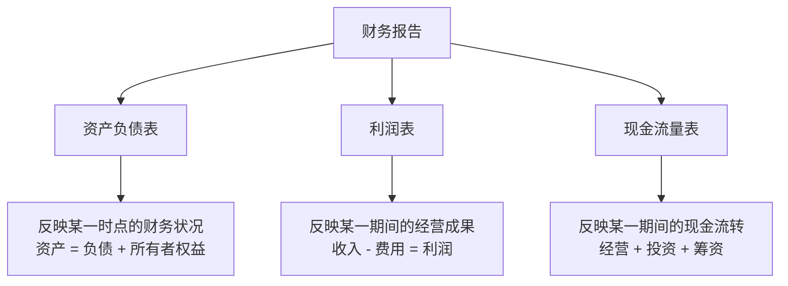
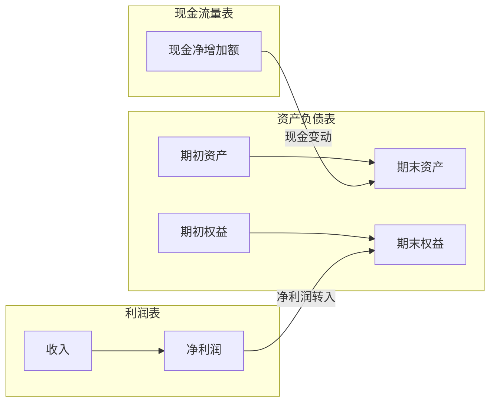

## 一、为什么要读财报

财报是企业的"体检报告"。无论是投资、信贷还是合作，读懂财报才能看清一家公司的真实经营状况——它赚了多少钱、欠了多少钱、钱从哪里来、花到哪里去。

**不读财报的投资，就像闭着眼睛过马路。**

## 二、财报的类型与披露时间

上市公司必须定期披露财务报告，不同类型的报告在时间和详细程度上有显著差异：

| 报告类型 | 披露截止时间 | 是否审计 | 详细程度 |
|---------|------------|---------|---------|
| 年报 | 次年4月30日前 | 必须审计 | 最详细、可信度最高 |
| 半年报 | 当年8月31日前 | 可选审计 | 较详细 |
| 一季报 | 季度结束后1个月内 | 不审计 | 简略 |
| 三季报 | 季度结束后1个月内 | 不审计 | 简略 |

> **关键原则**：年报准备时间最充分、信息披露最详细、可信度最高。读财报，首选年报。

### 特别注意

- 一季报不得早于同年年报披露
- 年报必须经会计师事务所审计并出具**审计意见**
- 半年报虽不强制审计，但若审计需一并披露审计意见

## 三、三张核心报表

无论是年报还是季报，至少包含三张核心报表：

### 1. 资产负债表——"拍照片"

资产负债表是**某一时点**的财务状况快照，核心等式：

> **资产 = 负债 + 所有者权益**

- **资产**：公司拥有什么（钱、货、厂房、投资等）
- **负债**：公司欠别人什么（借款、应付账款等）
- **所有者权益**：真正属于股东的部分（资产减去负债后的净值）

### 2. 利润表——"录视频"

利润表是**某一期间**的经营成果记录，核心等式：

> **收入 - 费用 = 利润**

利润表从营业收入出发，层层扣减成本、费用、税金，最终得出净利润，展示公司"赚不赚钱"。

### 3. 现金流量表——"验钞机"

现金流量表是**某一期间**的现金流转记录，分为三大活动：

| 活动类型 | 含义 | 关注点 |
|---------|------|-------|
| 经营活动 | 日常经营产生的现金 | 是否造血（正为造血，负为失血） |
| 投资活动 | 买卖长期资产、对外投资 | 扩张还是收缩 |
| 筹资活动 | 借款、还款、分红、融资 | 靠自己还是靠借钱 |

## 四、三张表的关系

三张报表不是孤立的，它们之间存在紧密的逻辑联系：

- **利润表**的净利润最终流入资产负债表的**未分配利润**
- **现金流量表**的现金净增加额等于资产负债表中**货币资金的变动**
- 三张表互相印证，任何一张表的异常都可能在另外两张中找到线索

## 五、读财报的基本原则

1. **先看审计意见**——非标意见（保留意见、否定意见、无法表示意见）直接排除
2. **三年对比**——单年数据意义有限，至少看三年趋势
3. **同行业对比**——不同行业的财务特征差异巨大，横向比较才有意义
4. **关注异常**——大幅波动、与行业背离、与常识不符的数据要深究
5. **三表交叉验证**——利润表说赚了钱，现金流量表要看钱到没到手

> **唐朝心法**：财报是用来排除企业的，不是用来选择企业的。先把有问题的公司排除掉，剩下的自然就是好公司。
