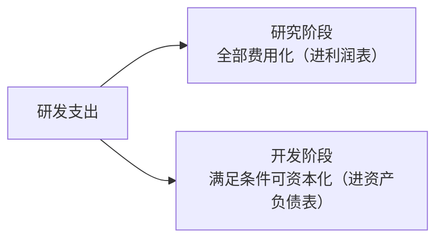
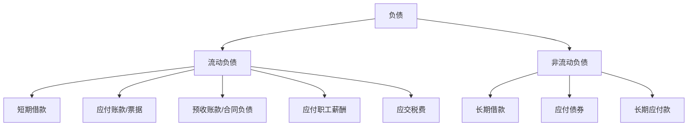
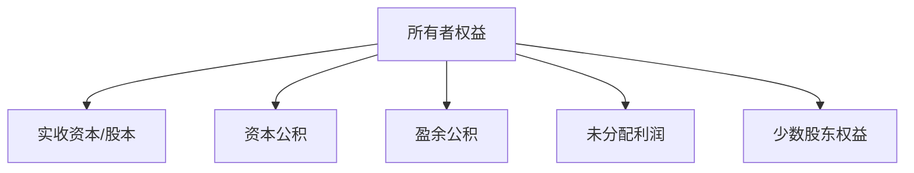

## 一、非流动资产补充

### 1. 固定资产

固定资产是为生产商品、出租或经营管理而持有的、使用寿命超过一年的有形资产。

**折旧**是固定资产的核心概念——资产的价值随着使用逐步转移到成本费用中：

| 折旧方法 | 特点 | 适用场景 |
|---------|------|---------|
| 直线法 | 每期折旧额相同 | 磨损均匀的资产 |
| 工作量法 | 按实际使用量计提 | 运输工具等 |
| 双倍余额递减法 | 前期多提、后期少提 | 技术更新快的资产 |
| 年数总和法 | 前期多提、后期少提 | 类似双倍余额 |

**关注要点**：

- **折旧政策变更**：延长折旧年限 → 减少当期费用 → 虚增利润
- **固定资产周转率**：衡量资产利用效率
- **在建工程**：长期不转固 → 可能虚增资产或资金挪用

> **唐朝提醒**：折旧是"非现金费用"——它减少了利润但并没有实际支出现金。因此，重资产公司（折旧多）的经营活动现金流通常远大于净利润。

### 2. 无形资产

无形资产包括专利、商标、土地使用权、软件等没有实物形态的可辨认资产。

**研发支出**的会计处理：

**风险信号**：

- 研发资本化率异常高 → 可能通过资本化减少费用、虚增利润
- 无形资产占总资产比例过高 → 资产质量存疑

### 3. 商誉

商誉是**并购时支付的对价超过被并购方可辨认净资产公允价值的部分**，本质是"买贵了"的溢价。

**商誉是资产负债表中最危险的科目之一**：

- 商誉**不需要摊销**，但每年必须进行**减值测试**
- 一旦计提减值，直接冲减当期利润，且不可转回
- 高商誉意味着并购溢价高，未来减值风险大

$$商誉 = 并购支付对价 - 被并购方可辨认净资产公允价值$$

> **唐朝提醒**：商誉占净资产比例超过30%的公司要高度警惕。商誉减值是"黑天鹅"的常见来源——某一年突然大额计提，利润瞬间变脸。

## 二、负债

负债按照到期时间排列，分为流动负债和非流动负债：

### 1. 短期借款

短期借款是一年内到期的借款，关注：

- **短期借款与货币资金的关系**：货币资金远小于短期借款 → 偿债压力大
- **短期借款占负债比例**：过高说明依赖短期融资，财务风险大
- **利息支出**：与借款规模是否匹配

### 2. 应付账款和应付票据

应付账款是买了货但还没付的钱——**公司占用了供应商的资金**。

| 对比 | 应付账款 | 应付票据 |
|------|---------|---------|
| 性质 | 纯信用 | 有票据承诺 |
| 话语权体现 | 占比大 → 对上游强势 | 银行承兑汇票信用更好 |

**应付 vs 应收的对比**：

- 应收多、应付少 → 上下游都不占优，被动
- 应收少、应付多 → 对上下游都有话语权，强势
- 两者都多 → 行业特性（如垫资施工）

### 3. 预收账款/合同负债

预收账款是先收钱后交货——**客户先给公司垫资**，这是**好负债**！

- 预收账款多 → 产品供不应求，客户愿意先付款
- 预收账款持续增长 → 未来收入有保障

> 新收入准则下，预收账款中与合同相关的部分重分类为**合同负债**。

### 4. 有息负债率

有息负债是需要支付利息的借款，是真正有还款压力的负债：

$$有息负债率 = \frac{短期借款 + 长期借款 + 应付债券 + 一年内到期的非流动负债}{总资产}$$

| 有息负债率 | 风险等级 |
|-----------|---------|
| < 20% | 低风险 |
| 20%-40% | 中等 |
| 40%-60% | 较高风险 |
| > 60% | 高风险 |

## 三、所有者权益

所有者权益是资产减去负债后的余额，真正属于股东的部分：

### 核心科目解读

| 科目 | 含义 | 变动方式 |
|------|------|---------|
| 实收资本 | 股东投入的注册资本 | 增发、配股时增加 |
| 资本公积 | 股本溢价等 | 主要来自增发溢价 |
| 盈余公积 | 从净利润中提取的法定公积金 | 每年按净利润10%提取 |
| 未分配利润 | 历年累积的未分配净利润 | 净利润增加、分红减少 |
| 少数股东权益 | 子公司中非全资部分的权益 | 合并报表才有 |

### 关键比率

**净资产（所有者权益）**是衡量公司"家底"的核心指标：

$$每股净资产 = \frac{所有者权益}{总股本}$$

$$市净率（PB）= \frac{股价}{每股净资产}$$

> **唐朝提醒**：未分配利润是最能体现公司历史盈利能力的科目。如果一家公司经营多年但未分配利润很少甚至为负，说明历史盈利能力堪忧。但也要注意，未分配利润不等于现金——它可能已经变成了存货、固定资产等其他资产。
