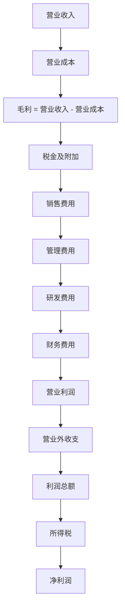

## 一、利润表的结构

利润表是"层层剥洋葱"——从营业收入出发，逐级扣减，最终得到净利润：

> **核心原则**：利润表的重点不是最后一行的净利润，而是每一层利润的质量。

## 二、营业收入

营业收入是利润表的起点，但"收入增长"不等于"增长质量好"。

### 收入确认原则

新收入准则下，收入确认的核心原则是**控制权转移**：

- 客户取得商品或服务的控制权时确认收入
- 不再以风险报酬转移为标准

### 收入质量分析

| 维度 | 好的收入 | 差的收入 |
|------|---------|---------|
| 增长方式 | 量价齐升 | 靠并购并表 |
| 现金含量 | 收到真金白银 | 大量应收账款 |
| 持续性 | 主营业务驱动 | 一次性收入 |
| 集中度 | 客户分散 | 依赖单一客户 |

### 收入造假常见手法

- **提前确认收入**：货物尚未交付就确认
- **虚构收入**：与关联方循环交易
- **总额法vs净额法**：将本应按净额确认的收入按总额确认，虚增收入规模

> **唐朝提醒**：看收入一定要和应收账款、现金流量表对照看。收入增长但应收账款增长更快、经营现金流没有同步增长，这种"增长"要打折扣。

## 三、营业成本与毛利

$$毛利 = 营业收入 - 营业成本$$

$$毛利率 = \frac{毛利}{营业收入} \times 100\%$$

### 毛利率的意义

毛利率是衡量**产品竞争力**的核心指标：

| 毛利率水平 | 典型行业 | 竞争特征 |
|-----------|---------|---------|
| > 60% | 高端白酒、创新药 | 品牌壁垒/技术壁垒 |
| 30%-60% | 软件、消费品 | 差异化竞争 |
| 10%-30% | 制造业、零售 | 成本控制是关键 |
| < 10% | 大宗商品、代工 | 薄利多销 |

### 毛利率分析要点

1. **纵向对比**：毛利率持续上升 → 产品竞争力增强或成本控制改善
2. **横向对比**：与同行业对比，显著偏高或偏低都要深究
3. **异常波动**：毛利率突然大幅变化 → 可能是会计政策变更或造假

> **唐朝提醒**：毛利率是财报分析中最重要的单一指标之一。一家公司的毛利率如果显著高于同行且没有合理的商业逻辑支撑，要高度警惕。

## 四、期间费用

期间费用是公司在经营过程中发生的、不直接计入产品成本的费用：

### 1. 销售费用

为销售产品或服务而发生的费用，包括广告费、促销费、销售人员薪酬等。

$$销售费用率 = \frac{销售费用}{营业收入}$$

- 销售费用率上升 → 获客成本增加，竞争加剧
- 销售费用率持续下降 → 品牌力增强，自然获客

### 2. 管理费用

公司行政管理和组织经营活动发生的费用。

关注**管理费用率**的异常波动：
- 大幅增加 → 可能是效率下降或隐藏费用
- 大幅减少 → 可能是费用资本化或延迟确认

### 3. 研发费用

研发活动发生的支出。新准则下，研发费用单独列示（原在管理费用中）。

$$研发费用率 = \frac{研发费用}{营业收入}$$

- 研发费用率高 → 技术驱动型公司，关注研发成果转化
- 研发费用率突然下降 → 可能为了短期利润削减研发

### 4. 财务费用

利息支出、汇兑损益等。重点关注：

- 财务费用与有息负债规模是否匹配
- 利息资本化的比例（资本化减少当期费用）

### 费用率综合分析

$$期间费用率 = \frac{销售费用 + 管理费用 + 研发费用 + 财务费用}{营业收入}$$

| 指标 | 含义 |
|------|------|
| 毛利率 - 期间费用率 | 核心经营盈利能力 |
| 期间费用率趋势 | 运营效率变化方向 |

## 五、营业利润

营业利润是**核心经营能力的体现**，是最应该关注的利润指标：

$$营业利润 = 毛利 - 税金及附加 - 期间费用 + 其他收益 - 资产减值损失$$

### 营业利润 vs 利润总额

- **营业利润**：核心经营赚的钱
- **利润总额**：加上营业外收支

营业利润占利润总额的比重越高，利润质量越好。

## 六、营业外收支

营业外收支是与主营业务无关的偶发性收支：

| 项目 | 示例 |
|------|------|
| 营业外收入 | 政府补助、违约金收入、捐赠利得 |
| 营业支出 | 罚款支出、捐赠支出、非常损失 |

> **唐朝提醒**：如果一家公司的利润很大一部分来自营业外收入（尤其是政府补助），这种利润的持续性是存疑的。要区分"经常性"和"非经常性"损益。

## 七、净利润

净利润是利润表的"终点"，但不是分析的"终点"：

$$净利润 = 利润总额 - 所得税费用$$

### 净利润质量判断

| 质量维度 | 高质量 | 低质量 |
|---------|-------|-------|
| 现金含量 | 经营现金流 > 净利润 | 经营现金流 << 净利润 |
| 来源 | 营业利润为主 | 投资收益/营业外收入为主 |
| 持续性 | 主营业务驱动 | 一次性收益 |
| 所得税 | 实际税率与名义税率接近 | 实际税率异常偏低 |

### 非经常性损益

非经常性损益是**与正常经营无关的、偶发性的损益**，包括：

- 非流动资产处置损益
- 政府补助（与正常经营无关的部分）
- 债务重组损益
- 投资收益（非经常性部分）

$$扣非净利润 = 净利润 - 非经常性损益$$

> **唐朝心法**：看利润表，先看毛利率，再看营业利润率，最后看净利率。如果毛利率高但净利率低，说明费用控制有问题；如果营业利润低但净利润高，说明利润来自非经常性项目，不可持续。**扣非净利润比净利润更能反映公司的真实盈利能力。**
