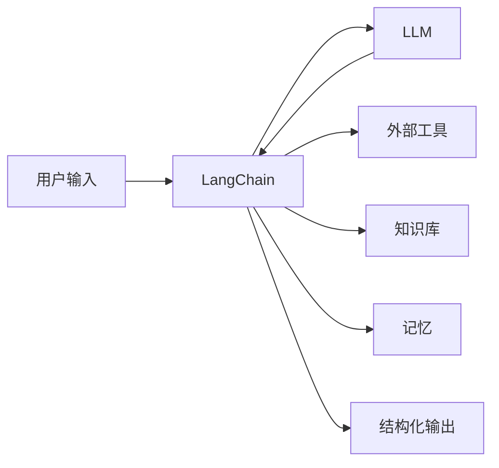

## 一、什么是 LangChain

LangChain 是一个用于构建 LLM（大语言模型）应用的框架。它解决的核心问题是：**LLM 本身只会生成文本，但真实应用需要与外部数据、工具、记忆交互**。



### 1.1 LangChain 解决什么

| 没有 LangChain | 有了 LangChain |
|---------------|---------------|
| 手动拼接 Prompt 字符串 | 模板化 Prompt 管理 |
| 手动解析 JSON 输出 | 结构化输出解析器 |
| 手动管理对话历史 | 内置记忆组件 |
| 手动调用 API 拼接流程 | LCEL 管道语法 |
| 手动实现检索逻辑 | RAG 全流程组件 |

### 1.2 LangChain 生态

| 包 | 用途 |
|----|------|
| `langchain-core` | 核心抽象（Runnable、消息类型等） |
| `langchain` | 主包，包含链、Agent、记忆等 |
| `langchain-community` | 第三方集成（向量库、Loader 等） |
| `langchain-openai` | OpenAI 集成 |
| `langchain-chroma` | Chroma 向量库集成 |
| `langgraph` | 多 Agent 状态图 |
| `langsmith` | 追踪、评估、调试 |

## 二、环境搭建

### 2.1 Python 环境

```bash
# 需要 Python 3.10+
python --version

# 创建虚拟环境
python -m venv .venv
source .venv/bin/activate  # Windows: .venv\Scripts\activate

# 安装核心包
pip install langchain langchain-core langchain-openai

# 安装教程后续需要的包
pip install langchain-chroma langchain-community python-dotenv pydantic
```

### 2.2 项目结构

```
customer-service-bot/
├── .env                    ← API 密钥等配置
├── pyproject.toml          ← 依赖管理
├── app/
│   ├── __init__.py
│   ├── main.py             ← 入口
│   ├── chains/             ← 链定义
│   ├── tools/              ← 自定义工具
│   ├── agents/             ← Agent 定义
│   └── data/               ← 知识库文档
└── tests/
```

### 2.3 API 密钥配置

```bash
# .env 文件
OPENAI_API_KEY=sk-xxxxxxxxxxxxxxxx
# 如果用国内模型
# DASHSCOPE_API_KEY=sk-xxxxxxxxxxxxxxxx
```

```python
# 加载环境变量
from dotenv import load_dotenv
load_dotenv()  # 从 .env 文件加载
```

> **安全提醒**：`.env` 文件必须加入 `.gitignore`，永远不要提交到版本库。

## 三、第一个 LLM 应用

```python
from langchain_openai import ChatOpenAI

# 创建模型实例
llm = ChatOpenAI(model="gpt-4o-mini", temperature=0)

# 最简单的调用
response = llm.invoke("你好，请用一句话介绍 LangChain")
print(response.content)
```

运行：

```bash
python app/main.py
```

输出类似：

```
LangChain 是一个用于构建大语言模型应用的框架，提供了链式调用、记忆管理和工具集成等核心能力。
```

## 四、LangChain 版本说明

LangChain 经历了重大重构，了解版本差异很重要：

| 版本 | 特点 | 状态 |
|------|------|------|
| v0.1 | 旧版 Chain 类（LLMChain 等） | 已废弃 |
| v0.2+ | LCEL（管道语法）为主 | 当前稳定版 |
| v0.3 | 更强的类型提示，更简洁的 API | 最新 |

**本教程基于 v0.3，全部使用 LCEL 语法，不教旧版写法。**

## 五、常见问题

### Q：必须用 OpenAI 吗？

不是。LangChain 支持多种模型：

```python
# 阿里通义千问
from langchain_community.chat_models import ChatTongyi
llm = ChatTongyi(model="qwen-plus")

# 本地模型（Ollama）
from langchain_community.chat_models import ChatOllama
llm = ChatOllama(model="qwen2.5")

# Azure OpenAI
from langchain_openai import AzureChatOpenAI
llm = AzureChatOpenAI(deployment_name="gpt-4o")
```

### Q：LangChain 和直接调 API 有什么区别？

直接调 API：你手动管理 Prompt、解析输出、维护对话状态。
LangChain：提供标准化组件，让你像搭积木一样组合功能，代码更简洁、可维护。

### Q：LangChain 适合生产环境吗？

适合，但需要注意：
- 使用 LangSmith 做追踪和调试
- 控制重试和超时
- 做好输出校验和兜底

---

下一篇：[Python 速览](tutorial.html?type=langchain&file=02Python速览.md)
