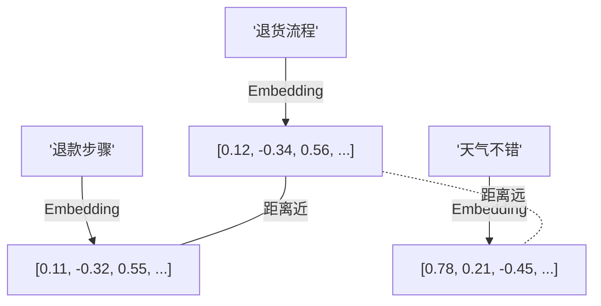

## 一、Embedding 原理

Embedding 将文本转换为高维向量，语义相近的文本在向量空间中距离更近：



```python
from langchain_openai import OpenAIEmbeddings

embeddings = OpenAIEmbeddings(model="text-embedding-3-small")

# 单条文本向量化
vector = embeddings.embed_query("退货流程是什么")
print(f"维度: {len(vector)}")  # 1536

# 批量向量化
vectors = embeddings.embed_documents(["退货流程", "退款步骤", "天气不错"])
```

## 二、向量数据库

### 2.1 Chroma（推荐入门）

```python
from langchain_chroma import Chroma
from langchain_openai import OpenAIEmbeddings

embeddings = OpenAIEmbeddings(model="text-embedding-3-small")

# 创建向量库并添加文档
vectorstore = Chroma.from_documents(
    documents=chunks,           # Document 列表
    embedding=embeddings,
    persist_directory="./data/chroma_db",  # 持久化目录
    collection_name="customer_service",
)

# 加载已有向量库
vectorstore = Chroma(
    persist_directory="./data/chroma_db",
    embedding_function=embeddings,
    collection_name="customer_service",
)
```

### 2.2 FAISS（纯内存，速度快）

```python
from langchain_community.vectorstores import FAISS

# 创建
vectorstore = FAISS.from_documents(chunks, embeddings)

# 保存到磁盘
vectorstore.save_local("./data/faiss_index")

# 加载
vectorstore = FAISS.load_local(
    "./data/faiss_index",
    embeddings,
    allow_dangerous_deserialization=True,
)
```

### 2.3 对比

| 特性 | Chroma | FAISS |
|------|--------|-------|
| 持久化 | 内置 | 手动 save/load |
| 元数据过滤 | 支持 | 有限 |
| 安装 | pip install | pip install |
| 适用规模 | 中小规模 | 大规模 |
| 生产部署 | 需要服务化 | 需要服务化 |

## 三、相似度搜索

```python
# 基本搜索
results = vectorstore.similarity_search(
    "退货流程是什么",
    k=3,  # 返回最相似的 3 个结果
)

for doc in results:
    print(f"内容: {doc.page_content[:100]}")
    print(f"来源: {doc.metadata['source']}")
    print("---")

# 带分数的搜索
results_with_scores = vectorstore.similarity_search_with_score(
    "退货流程是什么",
    k=3,
)
for doc, score in results_with_scores:
    print(f"分数: {score:.4f} | {doc.page_content[:80]}")
```

## 四、元数据过滤

```python
# 只在 FAQ 分类中搜索
results = vectorstore.similarity_search(
    "退货流程",
    k=3,
    filter={"category": "faq"},
)

# 多条件过滤
results = vectorstore.similarity_search(
    "iPhone 保修",
    k=3,
    filter={
        "category": {"$in": ["faq", "product"]},
        "source": {"$contains": "warranty"},
    },
)
```

## 五、检索器接口

VectorStore 实现了 `Retriever` 接口，可以直接在 LCEL 链中使用：

```python
# 从向量库创建检索器
retriever = vectorstore.as_retriever(
    search_type="similarity",   # 相似度搜索
    search_kwargs={"k": 3},     # 返回 3 个结果
)

# 也可以用 MMR（最大边际相关性），减少重复
retriever = vectorstore.as_retriever(
    search_type="mmr",
    search_kwargs={"k": 3, "fetch_k": 10},  # 先取10个，再选3个最不重复的
)

# 在链中使用
from langchain_core.prompts import ChatPromptTemplate
from langchain_core.runnables import RunnablePassthrough

prompt = ChatPromptTemplate.from_messages([
    ("system", "根据以下参考资料回答问题：\n{context}"),
    ("human", "{question}"),
])

def format_docs(docs):
    return "\n\n".join(doc.page_content for doc in docs)

chain = (
    {"context": retriever | format_docs, "question": RunnablePassthrough()}
    | prompt
    | ChatOpenAI(model="gpt-4o-mini")
    | StrOutputParser()
)

answer = chain.invoke("退货流程是什么")
```

## 六、小结

| 组件 | 用途 |
|------|------|
| Embeddings | 文本向量化 |
| Chroma | 向量数据库（推荐入门） |
| FAISS | 纯内存向量库（速度快） |
| similarity_search | 相似度搜索 |
| as_retriever | 转为检索器，接入 LCEL |

---

上一篇：[文档加载与分割](tutorial.html?type=langchain&file=07文档加载与分割.md)

下一篇：[RAG 检索增强生成](tutorial.html?type=langchain&file=09RAG检索增强生成.md)
