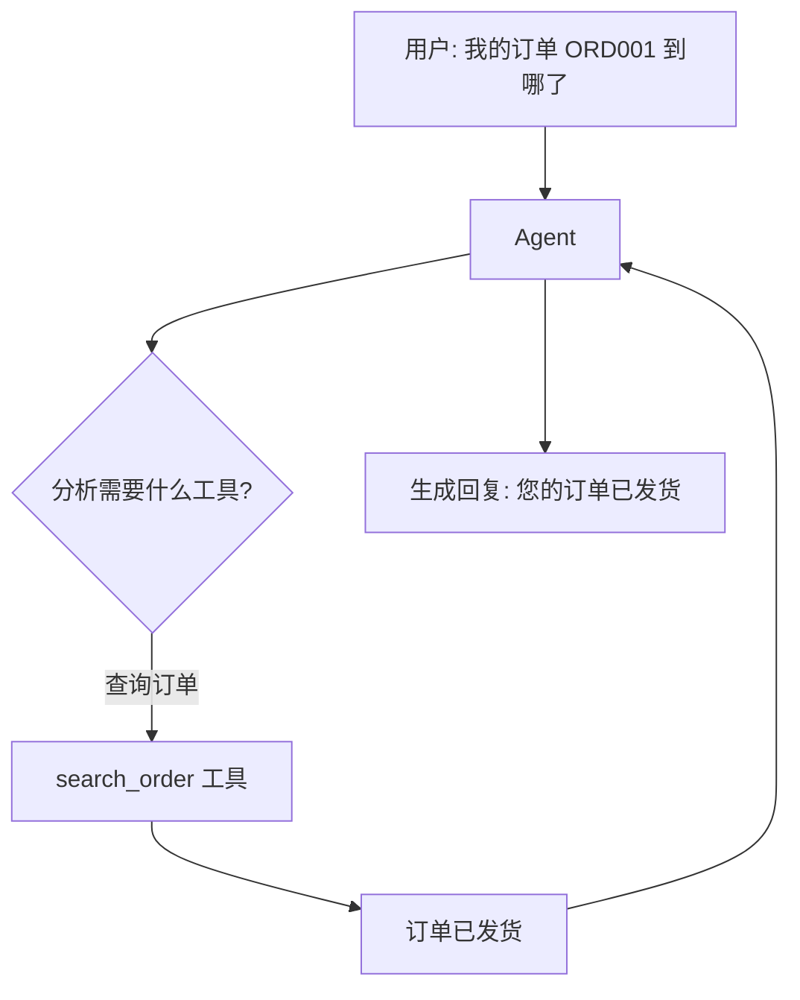
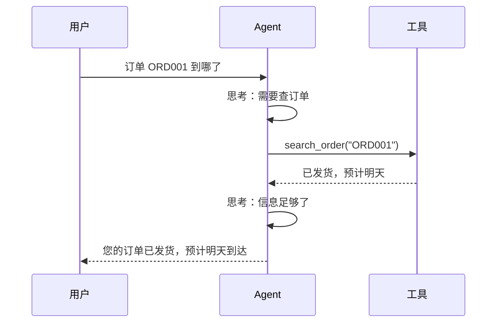

## 一、为什么需要 Agent

RAG 只能"读"知识库，但客服还需要"做"事情——查订单、退换货、查物流。Agent 让 LLM 自主决定调用哪个工具：



## 二、定义工具

### 2.1 @tool 装饰器

```python
from langchain_core.tools import tool

@tool
def search_order(order_id: str) -> str:
    """查询订单状态。参数：order_id - 订单编号"""
    # 模拟数据库查询
    orders = {
        "ORD001": "已发货，预计明天到达",
        "ORD002": "待发货，预计后天发出",
        "ORD003": "已签收",
    }
    return orders.get(order_id, f"未找到订单 {order_id}")

@tool
def check_inventory(product_name: str) -> str:
    """查询商品库存。参数：product_name - 商品名称"""
    inventory = {
        "iPhone 15 Pro": "有货，3种颜色可选",
        "MacBook Air": "有货，2种配置",
        "AirPods Pro": "暂时缺货，预计下周到货",
    }
    return inventory.get(product_name, f"未找到商品 {product_name}")

@tool
def create_return_request(order_id: str, reason: str) -> str:
    """创建退货申请。参数：order_id - 订单编号，reason - 退货原因"""
    return f"退货申请已创建，订单号 {order_id}，原因：{reason}，将在1-2个工作日内审核。"

tools = [search_order, check_inventory, create_return_request]
```

**关键**：工具的 docstring 就是 LLM 看到的工具描述，必须写清楚用途和参数含义。

### 2.2 StructuredTool

更灵活的工具定义方式：

```python
from langchain_core.tools import StructuredTool
from pydantic import BaseModel, Field

class ReturnInput(BaseModel):
    order_id: str = Field(description="订单编号")
    reason: str = Field(description="退货原因")
    refund_method: str = Field(default="原路退回", description="退款方式")

def _create_return(order_id: str, reason: str, refund_method: str = "原路退回") -> str:
    return f"退货申请已创建: {order_id}, {reason}, {refund_method}"

create_return = StructuredTool.from_function(
    func=_create_return,
    name="create_return",
    description="创建退货申请",
    args_schema=ReturnInput,
)
```

## 三、create_tool_calling_agent

```python
from langchain_openai import ChatOpenAI
from langchain_core.prompts import ChatPromptTemplate
from langchain.agents import create_tool_calling_agent, AgentExecutor

# Prompt
prompt = ChatPromptTemplate.from_messages([
    ("system", "你是电商客服助手，使用工具帮助用户解决问题。回答简洁专业。"),
    ("human", "{input}"),
    ("placeholder", "{agent_scratchpad}"),  # Agent 中间思考过程
])

# 创建 Agent
llm = ChatOpenAI(model="gpt-4o-mini", temperature=0)
agent = create_tool_calling_agent(llm, tools, prompt)

# 创建执行器
agent_executor = AgentExecutor(
    agent=agent,
    tools=tools,
    verbose=True,           # 打印思考过程
    max_iterations=5,       # 最多5轮工具调用
    handle_parsing_errors=True,
)

# 使用
result = agent_executor.invoke({"input": "我的订单 ORD001 到哪了"})
print(result["output"])
```

## 四、AgentExecutor 详解

```python
agent_executor = AgentExecutor(
    agent=agent,
    tools=tools,
    verbose=True,              # 打印中间步骤
    max_iterations=5,          # 最大迭代次数
    max_execution_time=30,     # 最大执行时间（秒）
    handle_parsing_errors=True, # 解析错误时继续
    return_intermediate_steps=True,  # 返回中间步骤
)

result = agent_executor.invoke({"input": "我要退货 ORD002，商品有质量问题"})

print("最终回答:", result["output"])
print("中间步骤:", result["intermediate_steps"])
# [(AgentAction(tool='create_return_request', tool_input={'order_id': 'ORD002', 'reason': '商品有质量问题'}),
#   '退货申请已创建...')]
```

## 五、ReAct 原理

ReAct（Reasoning + Acting）是 Agent 的核心模式：

```
思考：用户要查询订单状态，需要使用 search_order 工具
行动：search_order(order_id="ORD001")
观察：订单已发货，预计明天到达
思考：已获得订单信息，可以回答用户了
回答：您的订单 ORD001 已发货，预计明天到达。
```



## 六、工具选择控制

```python
# 限制 Agent 只能使用特定工具
agent = create_tool_calling_agent(llm, [search_order, check_inventory], prompt)

# 或者动态选择工具
def get_tools_for_intent(intent: str):
    tool_map = {
        "order_query": [search_order],
        "return_request": [search_order, create_return_request],
        "product_info": [check_inventory],
    }
    return tool_map.get(intent, tools)
```

## 七、小结

| 概念 | 用途 |
|------|------|
| `@tool` | 定义工具（推荐） |
| `StructuredTool` | 灵活工具定义 |
| `create_tool_calling_agent` | 创建 Agent |
| `AgentExecutor` | 执行 Agent，控制迭代 |
| ReAct | 思考-行动-观察循环 |

---

上一篇：[RAG 检索增强生成](tutorial.html?type=langchain&file=09RAG检索增强生成.md)

下一篇：[自定义工具与多 Agent](tutorial.html?type=langchain&file=11自定义工具与多Agent.md)
