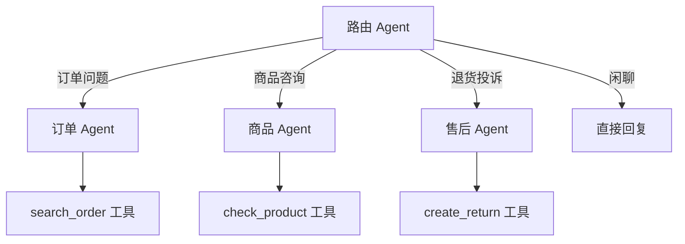

## 一、自定义工具集成外部 API

### 1.1 HTTP 工具

```python
import httpx
from langchain_core.tools import tool

API_BASE = "https://api.example.com"

@tool
async def query_order_api(order_id: str) -> str:
    """查询订单状态（调用后端API）。参数：order_id - 订单编号"""
    async with httpx.AsyncClient() as client:
        resp = await client.get(f"{API_BASE}/orders/{order_id}")
        if resp.status_code == 200:
            data = resp.json()
            return f"订单 {data['id']}，状态：{data['status']}，物流：{data.get('tracking', '暂无')}"
        return f"查询失败：{resp.status_code}"

@tool
async def create_return_api(order_id: str, reason: str) -> str:
    """创建退货申请（调用后端API）。参数：order_id - 订单编号，reason - 退货原因"""
    async with httpx.AsyncClient() as client:
        resp = await client.post(f"{API_BASE}/returns", json={
            "order_id": order_id,
            "reason": reason,
        })
        if resp.status_code == 201:
            data = resp.json()
            return f"退货申请已创建，工单号：{data['ticket_id']}"
        return f"创建失败：{resp.status_code}"

@tool
async def check_product_api(product_name: str) -> str:
    """查询商品信息（调用后端API）。参数：product_name - 商品名称"""
    async with httpx.AsyncClient() as client:
        resp = await client.get(f"{API_BASE}/products", params={"name": product_name})
        if resp.status_code == 200:
            data = resp.json()
            return f"{data['name']}，价格：{data['price']}元，库存：{data['stock']}件"
        return f"未找到商品：{product_name}"
```

### 1.2 数据库工具

```python
import sqlite3
from langchain_core.tools import tool

@tool
def query_customer_info(phone: str) -> str:
    """查询客户信息。参数：phone - 手机号"""
    conn = sqlite3.connect("./data/customers.db")
    cursor = conn.execute(
        "SELECT name, vip_level, total_orders FROM customers WHERE phone = ?",
        (phone,)
    )
    row = cursor.fetchone()
    conn.close()
    if row:
        return f"客户：{row[0]}，VIP等级：{row[1]}，历史订单：{row[2]}单"
    return "未找到该客户"
```

## 二、LangGraph 多 Agent

当单个 Agent 工具太多时，LLM 容易选错工具。多 Agent 架构把不同职责分配给不同 Agent：



### 2.1 安装 LangGraph

```bash
pip install langgraph
```

### 2.2 状态定义

```python
from typing import Annotated
from typing_extensions import TypedDict
from langgraph.graph.message import add_messages

class CustomerServiceState(TypedDict):
    """客服系统状态"""
    messages: Annotated[list, add_messages]  # 对话消息
    intent: str | None                        # 识别的意图
    customer_id: str | None                   # 客户ID
```

### 2.3 路由节点

```python
from langchain_openai import ChatOpenAI
from pydantic import BaseModel, Field
from enum import Enum

class Intent(str, Enum):
    ORDER = "order"
    PRODUCT = "product"
    AFTER_SALE = "after_sale"
    CHAT = "chat"

class IntentResult(BaseModel):
    intent: Intent
    confidence: float = Field(ge=0, le=1)

llm = ChatOpenAI(model="gpt-4o-mini", temperature=0)
intent_classifier = llm.with_structured_output(IntentResult)

def route_intent(state: CustomerServiceState) -> dict:
    """识别用户意图"""
    last_message = state["messages"][-1].content
    result = intent_classifier.invoke(
        f"判断以下用户消息的意图类别（order/product/after_sale/chat）：\n{last_message}"
    )
    return {"intent": result.intent.value}
```

### 2.4 专家 Agent 节点

```python
from langchain.agents import create_tool_calling_agent, AgentExecutor
from langchain_core.prompts import ChatPromptTemplate

# 订单 Agent
order_prompt = ChatPromptTemplate.from_messages([
    ("system", "你是订单查询专家，帮助用户查询订单状态和物流信息。"),
    ("human", "{input}"),
    ("placeholder", "{agent_scratchpad}"),
])
order_agent = create_tool_calling_agent(llm, [search_order], order_prompt)
order_executor = AgentExecutor(agent=order_agent, tools=[search_order], verbose=True)

# 商品 Agent
product_prompt = ChatPromptTemplate.from_messages([
    ("system", "你是商品咨询专家，帮助用户了解商品信息和库存。"),
    ("human", "{input}"),
    ("placeholder", "{agent_scratchpad}"),
])
product_agent = create_tool_calling_agent(llm, [check_product], product_prompt)
product_executor = AgentExecutor(agent=product_agent, tools=[check_product], verbose=True)

def order_node(state: CustomerServiceState) -> dict:
    result = order_executor.invoke({"input": state["messages"][-1].content})
    return {"messages": [("ai", result["output"])]}

def product_node(state: CustomerServiceState) -> dict:
    result = product_executor.invoke({"input": state["messages"][-1].content})
    return {"messages": [("ai", result["output"])]}

def chat_node(state: CustomerServiceState) -> dict:
    response = llm.invoke(state["messages"])
    return {"messages": [response]}
```

### 2.5 构建状态图

```python
from langgraph.graph import StateGraph, START, END

def route_by_intent(state: CustomerServiceState) -> str:
    intent = state.get("intent", "chat")
    return {
        "order": "order_agent",
        "product": "product_agent",
        "after_sale": "after_sale_agent",
        "chat": "chat_agent",
    }.get(intent, "chat_agent")

# 构建图
graph = StateGraph(CustomerServiceState)

# 添加节点
graph.add_node("router", route_intent)
graph.add_node("order_agent", order_node)
graph.add_node("product_agent", product_node)
graph.add_node("chat_agent", chat_node)

# 添加边
graph.add_edge(START, "router")
graph.add_conditional_edges("router", route_by_intent)
graph.add_edge("order_agent", END)
graph.add_edge("product_agent", END)
graph.add_edge("chat_agent", END)

# 编译
app = graph.compile()

# 使用
result = app.invoke({
    "messages": [("human", "我的订单 ORD001 到哪了")],
    "intent": None,
    "customer_id": None,
})
print(result["messages"][-1].content)
```

## 三、小结

| 概念 | 用途 |
|------|------|
| 自定义 Tool | 集成外部 API/数据库 |
| LangGraph | 多 Agent 状态图 |
| 路由节点 | 意图识别 + 分发 |
| 专家 Agent | 各司其职，减少工具冲突 |
| StateGraph | 声明式状态流转 |

---

上一篇：[Agent 与工具调用](tutorial.html?type=langchain&file=10Agent与工具调用.md)

下一篇：[对话系统实战](tutorial.html?type=langchain&file=12对话系统实战.md)
