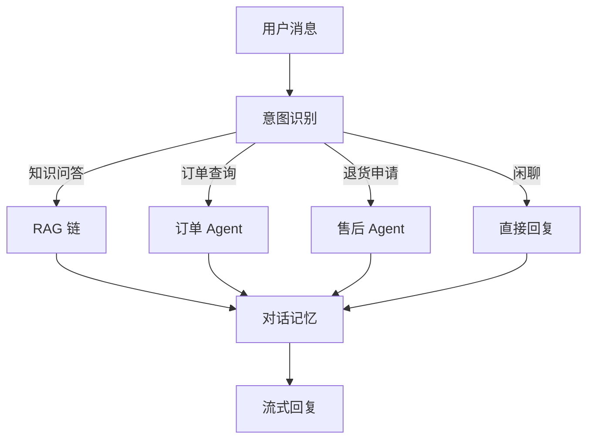

## 一、系统架构



## 二、完整代码

### 2.1 项目结构

```
customer-service-bot/
├── .env
├── pyproject.toml
├── app/
│   ├── __init__.py
│   ├── main.py              ← FastAPI 入口
│   ├── config.py            ← 配置
│   ├── knowledge/           ← 知识库
│   │   ├── loader.py        ← 文档加载
│   │   └── vectorstore.py   ← 向量库
│   ├── agents/              ← Agent
│   │   ├── router.py        ← 意图路由
│   │   ├── order.py         ← 订单 Agent
│   │   └── after_sale.py    ← 售后 Agent
│   ├── tools/               ← 工具
│   │   ├── order_tools.py
│   │   └── product_tools.py
│   ├── chains/              ← 链
│   │   ├── rag_chain.py
│   │   └── chat_chain.py
│   └── memory/              ← 记忆
│       └── session.py
└── data/
    ├── docs/                ← 知识库文档
    └── chroma_db/           ← 向量库数据
```

### 2.2 配置

```python
# app/config.py
import os
from dotenv import load_dotenv

load_dotenv()

class Config:
    OPENAI_API_KEY = os.getenv("OPENAI_API_KEY")
    MODEL_NAME = os.getenv("MODEL_NAME", "gpt-4o-mini")
    CHROMA_DIR = os.getenv("CHROMA_DIR", "./data/chroma_db")
    EMBEDDING_MODEL = os.getenv("EMBEDDING_MODEL", "text-embedding-3-small")

config = Config()
```

### 2.3 知识库

```python
# app/knowledge/loader.py
from langchain_community.document_loaders import DirectoryLoader, TextLoader
from langchain_text_splitters import RecursiveCharacterTextSplitter

def load_and_split(data_dir: str = "./data/docs"):
    loader = DirectoryLoader(
        data_dir,
        glob="**/*.{txt,md}",
        loader_cls=TextLoader,
        loader_kwargs={"encoding": "utf-8"},
    )
    docs = loader.load()

    for doc in docs:
        path = doc.metadata["source"]
        if "faq" in path:
            doc.metadata["category"] = "faq"
        elif "product" in path:
            doc.metadata["category"] = "product"
        elif "policy" in path:
            doc.metadata["category"] = "policy"

    splitter = RecursiveCharacterTextSplitter(
        chunk_size=500,
        chunk_overlap=50,
        separators=["\n\n", "\n", "。", "！", "？", "，", " ", ""],
    )
    return splitter.split_documents(docs)
```

```python
# app/knowledge/vectorstore.py
from langchain_chroma import Chroma
from langchain_openai import OpenAIEmbeddings
from app.config import config
from app.knowledge.loader import load_and_split

def get_vectorstore():
    embeddings = OpenAIEmbeddings(model=config.EMBEDDING_MODEL)
    return Chroma(
        persist_directory=config.CHROMA_DIR,
        embedding_function=embeddings,
    )

def init_vectorstore():
    """首次运行时构建向量库"""
    chunks = load_and_split()
    embeddings = OpenAIEmbeddings(model=config.EMBEDDING_MODEL)
    Chroma.from_documents(
        documents=chunks,
        embedding=embeddings,
        persist_directory=config.CHROMA_DIR,
    )
    print(f"知识库已构建：{len(chunks)} 个文档块")
```

### 2.4 RAG 链

```python
# app/chains/rag_chain.py
from langchain_openai import ChatOpenAI
from langchain_core.prompts import ChatPromptTemplate
from langchain_core.output_parsers import StrOutputParser
from langchain_core.runnables import RunnablePassthrough, RunnableParallel
from app.config import config
from app.knowledge.vectorstore import get_vectorstore

def create_rag_chain():
    vectorstore = get_vectorstore()
    retriever = vectorstore.as_retriever(
        search_type="mmr",
        search_kwargs={"k": 3, "fetch_k": 10},
    )

    prompt = ChatPromptTemplate.from_messages([
        ("system", """你是电商客服"小助手"，根据参考资料回答问题。
规则：
1. 只基于参考资料回答，不编造
2. 资料中没有的，说"我暂时无法回答，建议联系人工客服"
3. 回答简洁，不超过200字

参考资料：
{context}"""),
        ("human", "{question}"),
    ])

    def format_docs(docs):
        return "\n\n---\n\n".join(d.page_content for d in docs)

    return (
        RunnableParallel(
            context=retriever | format_docs,
            question=RunnablePassthrough(),
        )
        | prompt
        | ChatOpenAI(model=config.MODEL_NAME, temperature=0)
        | StrOutputParser()
    )
```

### 2.5 会话管理

```python
# app/memory/session.py
from langchain_community.chat_message_histories import ChatMessageHistory
from langchain_core.runnables import RunnableWithMessageHistory

store: dict[str, ChatMessageHistory] = {}

def get_session_history(session_id: str) -> ChatMessageHistory:
    if session_id not in store:
        store[session_id] = ChatMessageHistory()
    return store[session_id]
```

### 2.6 意图路由

```python
# app/agents/router.py
from enum import Enum
from pydantic import BaseModel, Field
from langchain_openai import ChatOpenAI
from app.config import config

class Intent(str, Enum):
    KNOWLEDGE = "knowledge"     # 知识问答 → RAG
    ORDER = "order"             # 订单查询 → Agent
    AFTER_SALE = "after_sale"   # 售后 → Agent
    CHAT = "chat"               # 闲聊 → 直接回复

class IntentResult(BaseModel):
    intent: Intent = Field(description="用户意图")
    confidence: float = Field(ge=0, le=1)

llm = ChatOpenAI(model=config.MODEL_NAME, temperature=0)
intent_classifier = llm.with_structured_output(IntentResult)

def classify_intent(message: str) -> Intent:
    result = intent_classifier.invoke(
        f"判断用户意图（knowledge/order/after_sale/chat）：\n{message}"
    )
    return result.intent
```

### 2.7 主服务

```python
# app/main.py
from app.agents.router import classify_intent, Intent
from app.chains.rag_chain import create_rag_chain
from app.memory.session import get_session_history

rag_chain = create_rag_chain()

async def chat(message: str, session_id: str = "default") -> str:
    """主对话入口"""
    intent = classify_intent(message)

    if intent == Intent.KNOWLEDGE:
        return rag_chain.invoke(message)
    elif intent == Intent.ORDER:
        # 订单 Agent（第10章的 Agent）
        return order_executor.invoke({"input": message})["output"]
    elif intent == Intent.AFTER_SALE:
        # 售后 Agent
        return after_sale_executor.invoke({"input": message})["output"]
    else:
        # 闲聊
        from langchain_openai import ChatOpenAI
        llm = ChatOpenAI(model="gpt-4o-mini")
        return llm.invoke(message).content
```

### 2.8 FastAPI 接口

```python
# server.py
from fastapi import FastAPI
from fastapi.responses import StreamingResponse
from pydantic import BaseModel
from app.main import chat
from app.chains.rag_chain import create_rag_chain
from langchain_openai import ChatOpenAI
from langchain_core.prompts import ChatPromptTemplate
from langchain_core.output_parsers import StrOutputParser

app = FastAPI(title="客服机器人 API")

class ChatRequest(BaseModel):
    message: str
    session_id: str = "default"

@app.post("/chat")
async def chat_endpoint(req: ChatRequest):
    answer = await chat(req.message, req.session_id)
    return {"answer": answer}

@app.post("/chat/stream")
async def stream_endpoint(req: ChatRequest):
    """流式输出"""
    rag_chain = create_rag_chain()

    async def generate():
        async for chunk in rag_chain.astream(req.message):
            yield chunk

    return StreamingResponse(generate(), media_type="text/event-stream")

# 启动：uvicorn server:app --reload --port 8000
```

## 三、测试

```bash
# 普通请求
curl -X POST http://localhost:8000/chat \
  -H "Content-Type: application/json" \
  -d '{"message": "退货流程是什么", "session_id": "user-001"}'

# 流式请求
curl -X POST http://localhost:8000/chat/stream \
  -H "Content-Type: application/json" \
  -d '{"message": "退货流程是什么"}'
```

## 四、小结

| 组件 | 职责 |
|------|------|
| 意图路由 | 分类用户意图 |
| RAG 链 | 知识问答 |
| Agent | 工具调用（订单/售后） |
| 对话记忆 | 维护上下文 |
| FastAPI | HTTP 接口 + 流式输出 |

---

上一篇：[自定义工具与多 Agent](tutorial.html?type=langchain&file=11自定义工具与多Agent.md)

下一篇：[评估与测试](tutorial.html?type=langchain&file=13评估与测试.md)
