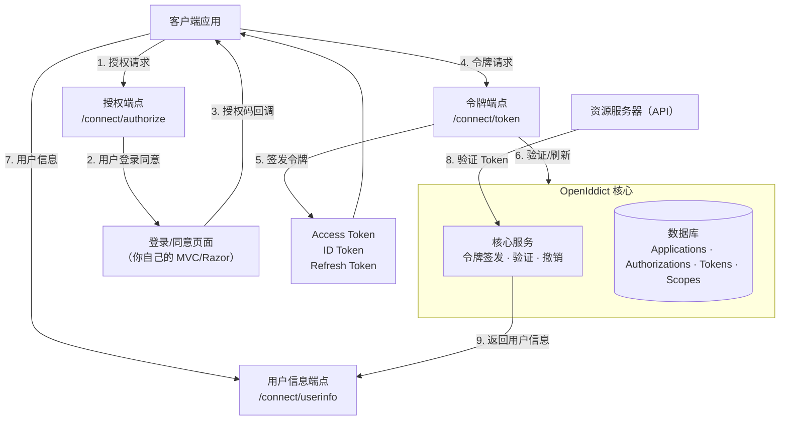

## 一、什么是 OpenIddict

OpenIddict 是 .NET 生态中最主流的 OpenID Connect 服务器框架，用于在 ASP.NET Core 中搭建自己的 OAuth2/OpenID Connect 认证中心。它不是 IdentityServer 的替代品——它是一个**更轻量、更灵活、更新更快**的选择。

### 1.1 OAuth2 vs OpenID Connect

很多人混淆这两个概念，简单对比：

| 概念 | 解决的问题 | 核心协议 |
| --- | --- | --- |
| OAuth2 | 授权：让第三方应用访问你的资源 | RFC 6749 |
| OpenID Connect | 认证：让第三方应用知道你是谁 | 建立在 OAuth2 之上，增加 ID Token |

**类比理解**：OAuth2 是门禁卡（你能进哪个门），OpenID Connect 是门禁卡+身份证（你是谁 + 你能进哪个门）。

OpenIddict 同时支持这两种协议，所以它既能做授权中心，也能做认证中心。

### 1.2 为什么选 OpenIddict 而不是 IdentityServer

| 对比项 | OpenIddict | IdentityServer |
| --- | --- | --- |
| 开源协议 | Apache 2.0（完全免费） | 商业许可（企业版收费） |
| 维护状态 | 活跃更新 | Duende 接手后商业运营 |
| 学习曲线 | 中等 | 较陡 |
| 默认存储 | EF Core / MongoDB | EF Core |
| 协议支持 | OAuth2 + OIDC 全流程 | OAuth2 + OIDC 全流程 |
| .NET 版本 | .NET 6+ | .NET 6+ |
| 社区生态 | 快速增长 | 成熟但转向商业 |

**一句话**：如果你不想花钱买商业许可，又需要一个可靠的 OIDC 服务器，OpenIddict 是当前最好的选择。

### 1.3 架构概览



**关键理解**：OpenIddict 只负责协议层（令牌签发、验证、撤销），**不负责用户登录界面**。你需要自己实现登录页面和同意页面——这是设计上的刻意选择，让你完全掌控用户体验。

### 1.4 官方资源

| 资源 | 地址 |
| --- | --- |
| 官方文档 | https://documentation.openiddict.com |
| GitHub 仓库 | https://github.com/openiddict/openiddict-core |

## 二、安装与依赖

在 ASP.NET Core Web 项目中添加以下 NuGet 包：

```xml name="csproj 依赖"
<PackageReference Include="OpenIddict.AspNetCore" Version="5.8.0" />
<PackageReference Include="OpenIddict.EntityFrameworkCore" Version="5.8.0" />
<PackageReference Include="Pomelo.EntityFrameworkCore.MySql" Version="8.0.0" />
```

> **版本选择**：`OpenIddict.AspNetCore` 是元包，自动包含 Core、Server、Validation 三个模块。如果你用 SQL Server，把 Pomelo 替换为 `Microsoft.EntityFrameworkCore.SqlServer`。

## 三、服务注册

OpenIddict 的服务注册分三步：Core → Server → Validation，各自职责不同。

```csharp name="Program.cs - 认证服务器"
builder.Services.AddOpenIddict()

    // ── 第一层：Core ──
    // 核心服务：使用 EF Core 存储令牌、授权等数据
    .AddCore(options =>
    {
        options.UseEntityFrameworkCore()
            .UseDbContext<AppDbContext>()
            .ReplaceDefaultEntities<
                OpenIddictApplication,
                OpenIddictAuthorization,
                OpenIddictScope,
                OpenIddictToken>();
    })

    // ── 第二层：Server ──
    // 服务器功能：定义你的认证中心支持哪些协议流程
    .AddServer(options =>
    {
        // 启用令牌端点
        options.SetTokenEndpointUris("/connect/token");

        // 启用授权端点
        options.SetAuthorizationEndpointUris("/connect/authorize");

        // 启用注销端点
        options.SetLogoutEndpointUris("/connect/logout");

        // 启用用户信息端点
        options.SetUserinfoEndpointUris("/connect/userinfo");

        // 启用授权码流程（最安全，有后端的 Web 应用使用）
        options.AllowAuthorizationCodeFlow();

        // 启用客户端凭证流程（服务间通信，无用户参与）
        options.AllowClientCredentialsFlow();

        // 启用刷新令牌（延长用户会话）
        options.AllowRefreshTokenFlow();

        // 注册签名凭据（开发环境用临时证书）
        options.AddDevelopmentEncryptionCertificate()
              .AddDevelopmentSigningCertificate();

        // 注册作用域
        options.RegisterScopes("api", "profile", "email");

        // 注册声明类型
        options.RegisterClaims("name", "email", "role");
    })

    // ── 第三层：Validation ──
    // 验证功能：让同一个项目中的 API 也能验证令牌
    .AddValidation(options =>
    {
        options.UseAspNetCore();
    });
```

### 3.1 生产环境证书

`AddDevelopmentSigningCertificate()` **仅用于开发环境**，部署到生产后会报错。生产环境必须使用真实证书：

```csharp name="生产环境证书"
if (builder.Environment.IsProduction())
{
    options.AddEncryptionCertificate(
        LoadCertificate(builder.Configuration["Certificates:Encryption"]!));
    options.AddSigningCertificate(
        LoadCertificate(builder.Configuration["Certificates:Signing"]!));
}

// 从文件加载证书
static X509Certificate2 LoadCertificate(string path)
{
    if (File.Exists(path))
        return new X509Certificate2(path);
    throw new FileNotFoundException($"证书文件不存在: {path}");
}
```

> **证书获取方式**：可以用 `openssl` 自签、从 Let's Encrypt 申请、或从内部 CA 获取。加密证书和签名证书可以是同一个，但最佳实践是分开。

## 四、用户模型

OpenIddict 不管用户——用户管理是 ASP.NET Core Identity 的职责。我们需要定义自己的用户实体：

```csharp name="ApplicationUser.cs"
public class ApplicationUser : IdentityUser<Guid>
{
    /// <summary>显示名称（区别于登录用的 UserName）</summary>
    public string? DisplayName { get; set; }

    /// <summary>是否激活（用于刷新令牌时校验用户状态）</summary>
    public bool IsActive { get; set; } = true;

    /// <summary>注册时间</summary>
    public DateTime CreatedAt { get; set; } = DateTime.UtcNow;
}
```

> **为什么继承 `IdentityUser<Guid>`**：默认的 `IdentityUser` 用 string 做 Id（实际上是 GUID 的字符串形式），直接用 `IdentityUser<Guid>` 可以在数据库中存为真正的 GUID 列，查询性能更好。如果你习惯 string 主键，改为 `IdentityUser` 即可。

## 五、数据库上下文

```csharp name="AppDbContext.cs"
public class AppDbContext : IdentityDbContext<ApplicationUser, IdentityRole<Guid>, Guid>
{
    public AppDbContext(DbContextOptions<AppDbContext> options) : base(options) { }

    protected override void OnModelCreating(ModelBuilder builder)
    {
        base.OnModelCreating(builder);

        // 自定义表名（可选）
        builder.Entity<ApplicationUser>().ToTable("Users");
        builder.Entity<IdentityRole<Guid>>().ToTable("Roles");

        // OpenIddict 实体配置（必须在 base.OnModelCreating 之后）
        builder.UseOpenIddict();
    }
}
```

> **关键点**：`builder.UseOpenIddict()` 必须写在 `base.OnModelCreating(builder)` **之后**，否则 OpenIddict 的实体配置会被 Identity 的配置覆盖。

执行迁移：

```bash name="迁移命令"
dotnet ef migrations add AddOpenIddict
dotnet ef database update
```

## 六、种子数据——注册客户端应用

认证中心需要知道有哪些客户端应用会来请求令牌。这些信息存储在数据库的 `OpenIddictApplication` 表中。

```csharp name="种子数据"
public static class SeedData
{
    public static async Task InitializeAsync(IServiceProvider provider)
    {
        using var scope = provider.CreateScope();
        var manager = scope.ServiceProvider.GetRequiredService<IOpenIddictApplicationManager>();

        // ── Web 前端客户端（授权码流程）──
        if (await manager.FindByClientIdAsync("web_app") == null)
        {
            await manager.CreateAsync(new OpenIddictApplicationDescriptor
            {
                ClientId = "web_app",
                ClientSecret = "901564A5-E7FE-42CB-B14D-61BB296E1C3A", // 生产环境用强密码
                DisplayName = "Web 前端应用",
                RedirectUris =
                {
                    new Uri("https://localhost:5001/callback"),
                    new Uri("https://localhost:5001/signin-oidc")
                },
                PostLogoutRedirectUris =
                {
                    new Uri("https://localhost:5001/signout-callback-oidc")
                },
                Permissions =
                {
                    OpenIddictConstants.Permissions.Endpoints.Authorization,
                    OpenIddictConstants.Permissions.Endpoints.Logout,
                    OpenIddictConstants.Permissions.Endpoints.Token,
                    OpenIddictConstants.Permissions.GrantTypes.AuthorizationCode,
                    OpenIddictConstants.Permissions.GrantTypes.RefreshToken,
                    OpenIddictConstants.Permissions.ResponseTypes.Code,
                    OpenIddictConstants.Permissions.Scopes.Profile,
                    OpenIddictConstants.Permissions.Scopes.Email,
                    OpenIddictConstants.Permissions.Prefixes.Scope + "api"
                },
                Requirements =
                {
                    OpenIddictConstants.Requirements.Features.ProofKeyForCodeExchange
                }
            });
        }

        // ── API 服务客户端（客户端凭证流程）──
        if (await manager.FindByClientIdAsync("service_client") == null)
        {
            await manager.CreateAsync(new OpenIddictApplicationDescriptor
            {
                ClientId = "service_client",
                ClientSecret = "B676E22A-4E0E-4B8A-8C2E-3F9A1D5E7B2C",
                DisplayName = "后端服务间调用",
                Permissions =
                {
                    OpenIddictConstants.Permissions.Endpoints.Token,
                    OpenIddictConstants.Permissions.GrantTypes.ClientCredentials,
                    OpenIddictConstants.Permissions.Prefixes.Scope + "api"
                }
            });
        }
    }
}
```

### 6.1 Permissions 和 Requirements 的区别

很多新手搞不清这两个：

- **Permissions**：客户端**允许做什么**（可以访问哪些端点、使用哪些授权类型、请求哪些 scope）
- **Requirements**：客户端**必须满足什么条件**（比如必须使用 PKCE）

上面的 `web_app` 客户端：
- Permissions 里列了它能用授权码、刷新令牌、访问 profile/email/api scope
- Requirements 里要求它必须用 PKCE（安全增强）

`service_client` 客户端：
- Permissions 只允许客户端凭证流程和 api scope
- 没有 Requirements（客户端凭证不需要 PKCE）

> **下一篇**：[授权码流程详解](tutorial.html?type=openiddict&file=02授权码流程详解.md) —— 实现完整的授权码+PKCE流程，包含授权端点、令牌端点、用户信息端点的完整代码。