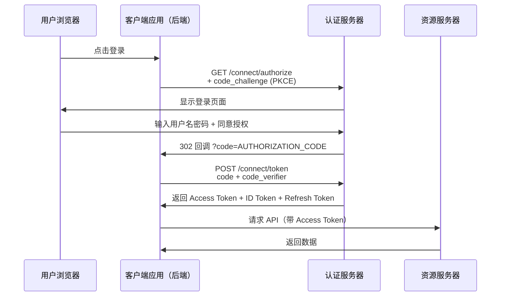
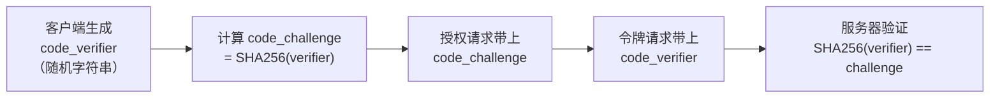

> 本篇是 OpenIddict 五篇教程的第二篇。系列目录：
> - [第一篇：概述与快速上手](tutorial.html?type=openiddict&file=01概述与快速上手.md)
> - [第二篇：授权码流程详解](tutorial.html?type=openiddict&file=02授权码流程详解.md)
> - [第三篇：客户端凭证与资源服务器](tutorial.html?type=openiddict&file=03客户端凭证与资源服务器.md)
> - [第四篇：令牌管理](tutorial.html?type=openiddict&file=04令牌管理.md)
> - [第五篇：自定义扩展与踩坑](tutorial.html?type=openiddict&file=05自定义扩展与踩坑.md)
> - [第六篇：核心类关系解析](tutorial.html?type=openiddict&file=06核心类关系解析.md)

## 一、授权码流程概述

授权码流程（Authorization Code Flow）是最安全、最常用的 OAuth2 流程，适用于有后端的 Web 应用。

### 1.1 为什么需要授权码

直接在浏览器里返回令牌是不安全的（Implicit Flow，已被废弃）。授权码流程的核心思路是：**先用一个短期的一次性授权码换取令牌，令牌只在后端通道中传输，永远不会经过浏览器**。



### 1.2 流程中每个步骤的含义

| 步骤 | 发生在 | 说明 |
| --- | --- | --- |
| 1. 授权请求 | 浏览器 → 认证服务器 | 用户点击"登录"，浏览器跳转到认证服务器 |
| 2. 用户登录 | 浏览器 ← 认证服务器 | 认证服务器显示登录页面，用户输入密码 |
| 3. 授权码回调 | 浏览器 ← 认证服务器 | 认证服务器把授权码通过 302 重定向传回客户端 |
| 4. 令牌请求 | 客户端后端 → 认证服务器 | 客户端后端用授权码 + code_verifier 换取令牌 |
| 5. 令牌返回 | 认证服务器 → 客户端后端 | Access Token、ID Token、Refresh Token 仅在后端传递 |
| 6. API 请求 | 客户端 → 资源服务器 | 客户端带 Access Token 调用 API |

**关键安全点**：步骤 3 的授权码经过浏览器，但它是一次性的短期码（通常5分钟有效），且只能用一次。步骤 4-5 的令牌完全不经过浏览器，不会被前端 JavaScript 泄露。

## 二、授权端点实现

授权端点负责：检查用户是否已登录 → 如果未登录跳转登录页 → 如果已登录创建 Claims 并签发授权码。

```csharp name="AuthorizationController.cs"
public class AuthorizationController : Controller
{
    private readonly IOpenIddictApplicationManager _applicationManager;
    private readonly IOpenIddictAuthorizationManager _authorizationManager;
    private readonly IOpenIddictScopeManager _scopeManager;
    private readonly SignInManager<ApplicationUser> _signInManager;
    private readonly UserManager<ApplicationUser> _userManager;

    public AuthorizationController(
        IOpenIddictApplicationManager applicationManager,
        IOpenIddictAuthorizationManager authorizationManager,
        IOpenIddictScopeManager scopeManager,
        SignInManager<ApplicationUser> signInManager,
        UserManager<ApplicationUser> userManager)
    {
        _applicationManager = applicationManager;
        _authorizationManager = authorizationManager;
        _scopeManager = scopeManager;
        _signInManager = signInManager;
        _userManager = userManager;
    }

    [HttpGet("~/connect/authorize")]
    [HttpPost("~/connect/authorize")]
    [IgnoreAntiforgeryToken]
    public async Task<IActionResult> Authorize()
    {
        var request = HttpContext.GetOpenIddictServerRequest() ??
            throw new InvalidOperationException("无效的 OpenID Connect 请求");

        // 检查用户是否已登录（通过 Identity Cookie）
        var result = await HttpContext.AuthenticateAsync(
            IdentityConstants.ApplicationScheme);

        // ── 未登录：跳转到登录页面 ──
        if (result?.Succeeded != true)
        {
            // 把当前请求参数存起来，登录后回来继续处理
            return Challenge(
                new AuthenticationProperties
                {
                    RedirectUri = Request.Path + Request.QueryString
                },
                IdentityConstants.ApplicationScheme);
        }

        // ── 已登录：创建 ClaimsPrincipal ──
        var user = await _userManager.GetUserAsync(result.Principal) ??
            throw new InvalidOperationException("用户不存在");

        var principal = await CreateClaimsPrincipalAsync(user, request.GetScopes());

        // 自动批准授权（也可以实现同意页面让用户手动确认）
        return SignIn(principal, OpenIddictServerAspNetCoreDefaults.AuthenticationScheme);
    }

    // ── 创建包含声明的 ClaimsPrincipal ──
    private async Task<ClaimsPrincipal> CreateClaimsPrincipalAsync(
        ApplicationUser user, IEnumerable<string> scopes)
    {
        var principal = await _signInManager.CreateUserPrincipalAsync(user);
        var identity = (ClaimsIdentity)principal.Identity!;

        // 添加 OpenID Connect 标准声明
        identity.SetClaim(ClaimTypes.NameIdentifier, user.Id.ToString());
        identity.SetClaim(ClaimTypes.Name, user.DisplayName);
        identity.SetClaim(ClaimTypes.Email, user.Email);

        // 添加角色声明
        var roles = await _userManager.GetRolesAsync(user);
        foreach (var role in roles)
            identity.AddClaim(new Claim(ClaimTypes.Role, role));

        // 设置作用域限制的声明（只在请求了对应 scope 时才添加）
        identity.SetScopes(scopes);

        // 设置资源（令牌的受众）
        identity.SetResources(await _scopeManager.ListResourcesAsync(identity.GetScopes())
            .ToListAsync());

        return principal;
    }
}
```

### 2.1 关键代码逐行解释

**`HttpContext.GetOpenIddictServerRequest()`**：从 HTTP 请求中提取 OpenIddict 解析后的参数（client_id、redirect_uri、scope、response_type 等）。如果返回 null 说明请求格式不合法。

**`HttpContext.AuthenticateAsync(IdentityConstants.ApplicationScheme)`**：检查用户是否通过 ASP.NET Core Identity 的 Cookie 登录了。注意这里用的是 `ApplicationScheme`（Identity 的默认 Cookie Scheme），不是 OpenIddict 的 Scheme。

**`Challenge()` 跳转登录**：当用户未登录时，不是直接报错，而是把当前请求"暂存"，跳转到登录页面。用户登录成功后，Identity 会自动回到这个 URL 继续授权流程。`RedirectUri = Request.Path + Request.QueryString` 就是存储回来的地址。

**`SignIn(principal, OpenIddictServerAspNetCoreDefaults.AuthenticationScheme)`**：签发授权码！OpenIddict 会在 HTTP 响应中自动把授权码附加到 redirect_uri 上，以 302 重定向返回客户端。

### 2.2 声明（Claims）和作用域（Scopes）的关系

OpenIddict 默认只在令牌中包含 `sub`（用户ID）声明。其他声明需要通过 scope 来控制：

| Scope | 对应的声明 |
| --- | --- |
| profile | name |
| email | email |
| api | 自定义的资源访问权限 |

`identity.SetScopes(scopes)` 的作用是：告诉 OpenIddict "这个令牌只允许包含这些 scope 对应的声明"。后续在用户信息端点中，也要根据 scope 来决定返回哪些字段。

## 三、令牌端点实现

令牌端点负责：接收授权码/刷新令牌/客户端凭证 → 验证 → 签发 Access Token + ID Token + Refresh Token。

```csharp name="TokenController.cs"
public class TokenController : Controller
{
    private readonly IOpenIddictApplicationManager _applicationManager;
    private readonly SignInManager<ApplicationUser> _signInManager;
    private readonly UserManager<ApplicationUser> _userManager;

    [HttpPost("~/connect/token")]
    [IgnoreAntiforgeryToken]
    [Produces("application/json")]
    public async Task<IActionResult> Exchange()
    {
        var request = HttpContext.GetOpenIddictServerRequest() ??
            throw new InvalidOperationException("无效的令牌请求");

        // ── 授权码流程 或 刷新令牌流程 ──
        if (request.IsAuthorizationCodeGrantType() || request.IsRefreshTokenGrantType())
        {
            // 从授权码或刷新令牌中恢复 ClaimsPrincipal
            var result = await HttpContext.AuthenticateAsync(
                OpenIddictServerAspNetCoreDefaults.AuthenticationScheme);

            // 刷新令牌时：检查用户是否仍然有效
            if (request.IsRefreshTokenGrantType())
            {
                var userId = result.Principal?.GetClaim(ClaimTypes.NameIdentifier);
                if (userId != null)
                {
                    var user = await _userManager.FindByIdAsync(userId);
                    // 用户不存在或被禁用 → 拒绝刷新
                    if (user == null || !user.IsActive)
                        return Forbid(OpenIddictServerAspNetCoreDefaults.AuthenticationScheme);
                }
            }

            // 签发新令牌（OpenIddict 自动处理）
            return SignIn(result.Principal!,
                OpenIddictServerAspNetCoreDefaults.AuthenticationScheme);
        }

        // ── 客户端凭证流程 ──
        if (request.IsClientCredentialsGrantType())
        {
            var application = await _applicationManager.FindByClientIdAsync(request.ClientId!) ??
                throw new InvalidOperationException("客户端不存在");

            var identity = new ClaimsIdentity(
                TokenValidationParameters.DefaultAuthenticationType,
                OpenIddictConstants.Claims.Name,
                OpenIddictConstants.Claims.Role);

            identity.SetClaim(OpenIddictConstants.Claims.Name,
                await _applicationManager.GetDisplayNameAsync(application));
            identity.SetScopes(request.GetScopes());

            return SignIn(new ClaimsPrincipal(identity),
                OpenIddictServerAspNetCoreDefaults.AuthenticationScheme);
        }

        throw new InvalidOperationException("不支持的授权类型");
    }
}
```

### 3.1 授权码流程 vs 刷新令牌流程的区别

在令牌端点中，这两种流程的处理方式几乎一样——都是从之前签发的 ClaimsPrincipal 中恢复身份，然后签发新令牌。区别在于：

| 流程 | 输入 | 验证重点 |
| --- | --- | --- |
| 授权码换令牌 | code + code_verifier | 授权码是否有效、PKCE 校验 |
| 刷新令牌换新令牌 | refresh_token | 用户是否仍然有效（IsActive） |

刷新令牌时的额外检查（`!user.IsActive`）非常重要：如果用户被管理员禁用，他的 Refresh Token 应该立即失效，不应该继续签发新令牌。

### 3.2 `AuthenticateAsync` 做了什么

调用 `HttpContext.AuthenticateAsync(OpenIddictServerAspNetCoreDefaults.AuthenticationScheme)` 时，OpenIddict 会：
- 如果是授权码流程：解密授权码，还原出授权端点签发的 ClaimsPrincipal
- 如果是刷新令牌流程：解密刷新令牌，还原出之前签发的 ClaimsPrincipal

你不需要手动解码——OpenIddict 自动处理了所有加密、签名、验证逻辑。

## 四、用户信息端点实现

用户信息端点让客户端用 Access Token 获取用户详细信息。

```csharp name="UserInfoController.cs"
[HttpGet("~/connect/userinfo")]
[HttpPost("~/connect/userinfo")]
[Produces("application/json")]
public async Task<IActionResult> Userinfo()
{
    // 验证 Access Token
    var result = await HttpContext.AuthenticateAsync(
        OpenIddictServerAspNetCoreDefaults.AuthenticationScheme);

    if (result.Principal == null)
        return Challenge(OpenIddictServerAspNetCoreDefaults.AuthenticationScheme);

    var userId = result.Principal.GetClaim(ClaimTypes.NameIdentifier);
    var user = await _userManager.FindByIdAsync(userId!);

    if (user == null)
        return Challenge(OpenIddictServerAspNetCoreDefaults.AuthenticationScheme);

    // 基础声明（总是返回）
    var claims = new Dictionary<string, object>(StringComparer.Ordinal)
    {
        [OpenIddictConstants.Claims.Subject] = user.Id.ToString(),
        [OpenIddictConstants.Claims.Name] = user.DisplayName ?? ""
    };

    // scope 限制的声明（只在请求了对应 scope 时才返回）
    if (result.Principal.HasScope(OpenIddictConstants.Scopes.Email))
        claims[OpenIddictConstants.Claims.Email] = user.Email ?? "";

    if (result.Principal.HasScope(OpenIddictConstants.Scopes.Profile))
        claims["created_at"] = user.CreatedAt.ToString("o");

    return Ok(claims);
}
```

### 4.1 scope 控制的含义

用户信息端点**不能返回所有用户字段**，只能返回令牌中 scope 对应的声明：

- 请求了 `email` scope → 可以返回 email
- 请求了 `profile` scope → 可以返回 name、created_at
- 没请求 `email` scope → 不应该返回 email

这是隐私保护的基本原则：客户端只应该获取它需要的最低限度信息。

## 五、PKCE 安全增强

PKCE（Proof Key for Code Exchange）是授权码流程的安全增强，防止授权码被截获后滥用。**所有公开客户端（SPA、移动端）必须使用 PKCE**。

### 5.1 PKCE 工作原理



核心思路：客户端在授权请求时发送 `code_challenge`（hash 值），在令牌请求时发送 `code_verifier`（原始值）。即使授权码被截获，攻击者没有 `code_verifier` 也无法换取令牌。

### 5.2 客户端 PKCE 实现

```csharp name="PKCE 生成"
public static class PkceHelper
{
    // 生成 code_verifier（43-128 个字符的随机字符串）
    public static string GenerateCodeVerifier()
    {
        var bytes = RandomNumberGenerator.GetBytes(32);
        return Base64Url.EncodeToString(bytes);
    }

    // 从 code_verifier 计算 code_challenge
    public static string ComputeCodeChallenge(string codeVerifier)
    {
        var bytes = SHA256.HashData(Encoding.ASCII.GetBytes(codeVerifier));
        return Base64Url.EncodeToString(bytes);
    }
}
```

**code_verifier**：43-128 字符的随机字符串，用 Base64Url 编码。每次授权请求都重新生成。

**code_challenge**：对 code_verifier 做 SHA256 + Base64Url 编码。随授权请求一起发送给服务器。

### 5.3 服务端强制 PKCE

在客户端注册时添加 Requirements：

```csharp name="强制 PKCE"
new OpenIddictApplicationDescriptor
{
    ClientId = "spa_app",
    // 公开客户端不需要 ClientSecret
    Requirements =
    {
        OpenIddictConstants.Requirements.Features.ProofKeyForCodeExchange
    }
}
```

加了 `ProofKeyForCodeExchange` Requirement 后，这个客户端的授权请求**必须**带 `code_challenge`，不带就直接拒绝。OpenIddict 在令牌端点自动验证 `code_verifier` 与之前存储的 `code_challenge` 是否匹配。

> **下一篇**：[客户端凭证与资源服务器](tutorial.html?type=openiddict&file=03客户端凭证与资源服务器.md) —— 服务间通信的客户端凭证流程，以及资源服务器如何验证 Access Token。