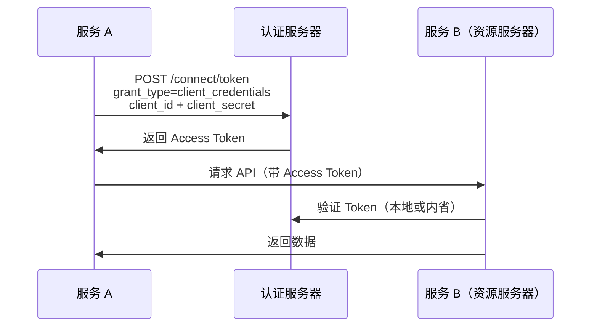

> 本篇是 OpenIddict 五篇教程的第三篇。系列目录：
> - [第一篇：概述与快速上手](tutorial.html?type=openiddict&file=01概述与快速上手.md)
> - [第二篇：授权码流程详解](tutorial.html?type=openiddict&file=02授权码流程详解.md)
> - [第三篇：客户端凭证与资源服务器](tutorial.html?type=openiddict&file=03客户端凭证与资源服务器.md)
> - [第四篇：令牌管理](tutorial.html?type=openiddict&file=04令牌管理.md)
> - [第五篇：自定义扩展与踩坑](tutorial.html?type=openiddict&file=05自定义扩展与踩坑.md)
> - [第六篇：核心类关系解析](tutorial.html?type=openiddict&file=06核心类关系解析.md)

## 一、客户端凭证流程概述

客户端凭证流程（Client Credentials Flow）用于**服务间通信**，没有用户参与。典型场景：微服务 A 调用微服务 B 的 API。

### 1.1 与授权码流程的区别

| 对比项 | 授权码流程 | 客户端凭证流程 |
| --- | --- | --- |
| 用户参与 | 需要用户登录 | 不需要用户 |
| 令牌代表 | 某个用户的身份 | 客户端应用本身 |
| 安全机制 | PKCE | Client Secret |
| 适用场景 | Web 应用、移动端 | 服务间 API 调用 |
| 刷新令牌 | 支持 | 不需要（随时可重新获取） |



### 1.2 为什么不需要刷新令牌

客户端凭证流程中，客户端持有 `client_id` + `client_secret`，随时可以重新获取令牌，不需要像用户令牌那样"延长会话"。Access Token 过期后直接重新请求一个即可。

## 二、服务端实现

客户端凭证的处理逻辑在令牌端点中（已在[第二篇](tutorial.html?type=openiddict&file=02授权码流程详解.md)中展示）。这里单独看核心部分：

```csharp name="令牌端点 - 客户端凭证分支"
if (request.IsClientCredentialsGrantType())
{
    // 从数据库中查找客户端
    var application = await _applicationManager
        .FindByClientIdAsync(request.ClientId!) ??
            throw new InvalidOperationException("客户端不存在");

    // 创建 ClaimsIdentity（没有用户，只有客户端信息）
    var identity = new ClaimsIdentity(
        TokenValidationParameters.DefaultAuthenticationType,
        OpenIddictConstants.Claims.Name,   // Name 声明类型
        OpenIddictConstants.Claims.Role);  // Role 声明类型

    // 设置客户端名称
    identity.SetClaim(OpenIddictConstants.Claims.Name,
        await _applicationManager.GetDisplayNameAsync(application));

    // 设置作用域
    identity.SetScopes(request.GetScopes());

    return SignIn(new ClaimsPrincipal(identity),
        OpenIddictServerAspNetCoreDefaults.AuthenticationScheme);
}
```

### 2.1 注意这里没有用户

`ClaimsIdentity` 中**没有** `sub`（subject）声明——因为没有用户。令牌的 `sub` 字段为空，资源服务器不能依赖用户身份。客户端凭证的令牌只证明"这个请求来自 `service_client` 这个已授权的应用"。

### 2.2 客户端身份验证

OpenIddict 在处理客户端凭证请求时会自动验证 `client_id` 和 `client_secret` 是否匹配种子数据中注册的客户端。你不需要手动验证密码。

## 三、客户端请求示例

在微服务 A 中请求令牌并调用微服务 B：

```csharp name="ServiceClient.cs"
public class ServiceClient
{
    private readonly HttpClient _httpClient;
    private readonly string _tokenEndpoint;
    private readonly string _clientId;
    private readonly string _clientSecret;

    public ServiceClient(HttpClient httpClient, IConfiguration config)
    {
        _httpClient = httpClient;
        _tokenEndpoint = config["Auth:TokenEndpoint"]!;
        _clientId = config["Auth:ClientId"]!;
        _clientSecret = config["Auth:ClientSecret"]!;
    }

    // ── 获取 Access Token ──
    public async Task<string> GetAccessTokenAsync()
    {
        var request = new HttpRequestMessage(HttpMethod.Post, _tokenEndpoint);
        request.Content = new FormUrlEncodedContent(new Dictionary<string, string>
        {
            ["grant_type"] = "client_credentials",
            ["client_id"] = _clientId,
            ["client_secret"] = _clientSecret,
            ["scope"] = "api"
        });

        var response = await _httpClient.SendAsync(request);
        response.EnsureSuccessStatusCode();

        var payload = JsonDocument.Parse(await response.Content.ReadAsStringAsync());
        return payload.RootElement.GetProperty("access_token").GetString()!;
    }

    // ── 调用 API（带令牌）──
    public async Task<HttpResponseMessage> CallApiAsync(string apiUrl)
    {
        var token = await GetAccessTokenAsync();

        var request = new HttpRequestMessage(HttpMethod.Get, apiUrl);
        request.Headers.Authorization =
            new AuthenticationHeaderValue("Bearer", token);

        return await _httpClient.SendAsync(request);
    }
}
```

### 3.1 优化：缓存令牌

上面的实现每次都重新请求令牌，性能差。生产环境应该缓存令牌直到过期前再刷新：

```csharp name="带缓存的令牌客户端"
public class CachedTokenClient
{
    private string? _cachedToken;
    private DateTimeOffset _tokenExpiresAt;

    public async Task<string> GetAccessTokenAsync()
    {
        // 令牌未过期且还有 60 秒余量
        if (_cachedToken != null && DateTimeOffset.UtcNow < _tokenExpiresAt.AddSeconds(-60))
            return _cachedToken;

        // 请求新令牌
        var request = new HttpRequestMessage(HttpMethod.Post, _tokenEndpoint);
        request.Content = new FormUrlEncodedContent(new Dictionary<string, string>
        {
            ["grant_type"] = "client_credentials",
            ["client_id"] = _clientId,
            ["client_secret"] = _clientSecret,
            ["scope"] = "api"
        });

        var response = await _httpClient.SendAsync(request);
        var payload = JsonDocument.Parse(await response.Content.ReadAsStringAsync());

        _cachedToken = payload.RootElement.GetProperty("access_token").GetString()!;
        var expiresIn = payload.RootElement.GetProperty("expires_in").GetInt32();
        _tokenExpiresAt = DateTimeOffset.UtcNow.AddSeconds(expiresIn);

        return _cachedToken;
    }
}
```

> **最佳实践**：生产环境中，把 `CachedTokenClient` 注册为 Scoped 或 Singleton 服务，避免每个请求都获取令牌。

## 四、资源服务器配置

资源服务器是接受 Access Token 的 API 服务。它**不需要完整的 OpenIddict 服务器配置**，只需要验证令牌的能力。

### 4.1 方式一：从 OIDC 配置验证（推荐，跨项目部署）

当认证服务器和资源服务器部署在不同项目/服务中时：

```csharp name="资源服务器 Program.cs（OIDC 方式）"
builder.Services.AddAuthentication(options =>
{
    options.DefaultScheme = JwtBearerDefaults.AuthenticationScheme;
})
.AddJwtBearer(options =>
{
    // 从认证服务器的 OIDC 发现端点自动获取配置
    options.Authority = "https://auth.myapp.com";
    options.Audience = "api";

    options.TokenValidationParameters = new TokenValidationParameters
    {
        ValidateIssuer = true,
        ValidIssuer = "https://auth.myapp.com",
        ValidateAudience = true,
        ValidateLifetime = true,
        ClockSkew = TimeSpan.FromSeconds(30)
    };
});

builder.Services.AddAuthorization();
```

**原理**：OpenIddict 自动发布一个 `.well-known/openid-configuration` 端点，包含公钥、Issuer 等信息。资源服务器通过这个端点获取验证令牌所需的一切。

### 4.2 方式二：使用 OpenIddict 验证（同项目部署）

当认证服务器和资源服务器在同一个项目中时：

```csharp name="使用 OpenIddict 验证（同项目）"
builder.Services.AddOpenIddict()
    .AddValidation(options =>
    {
        options.UseAspNetCore();

        // 同一项目内直接使用
        options.UseLocalServer();
    });
```

这种方式不经过 HTTP 调用，直接共享本地内存中的密钥，性能更好。

### 4.3 方式三：引用令牌 + 内省端点

如果使用引用令牌（Reference Token）而非 JWT，资源服务器需要调用内省端点来验证：

```csharp name="内省方式（引用令牌）"
.AddValidation(options =>
{
    options.UseAspNetCore();

    // 启用内省——每次验证令牌时查询数据库
    options.UseIntrospection()
        .SetIntrospectionEndpointUri(new Uri("https://auth.myapp.com/connect/introspect"))
        .SetClientId("resource_server")
        .SetClientSecret("resource_server_secret");
})
```

> **性能取舍**：引用令牌可以即时撤销，但每次 API 调用都需要网络请求。JWT 无网络开销，但无法即时撤销。详见[第四篇：令牌管理](tutorial.html?type=openiddict&file=04令牌管理.md)。

### 4.4 方式对比

| 方式 | 适用场景 | 网络开销 | 即时撤销 |
| --- | --- | --- | --- |
| OIDC 发现（JWT） | 跨项目、微服务 | 仅首次获取公钥 | 否（等过期） |
| OpenIddict 验证 | 同一项目 | 无 | 否（等过期） |
| 内省端点 | 引用令牌 | 每次请求 | 是 |

## 五、保护 API 端点

### 5.1 基础授权

```csharp name="基础 API 授权"
[ApiController]
[Route("api/[controller]")]
[Authorize(AuthenticationSchemes = JwtBearerDefaults.AuthenticationScheme)]
public class ProductsController : ControllerBase
{
    // 任何已认证用户/客户端都可以访问
    [HttpGet]
    public IActionResult GetAll() => Ok(/* ... */);

    // 需要 admin 角色
    [HttpGet("admin")]
    [Authorize(Roles = "admin")]
    public IActionResult GetAdminData() => Ok(/* ... */);
}
```

### 5.2 基于策略的授权

更灵活的授权方式——基于 scope 的策略：

```csharp name="基于 scope 的策略"
// 注册策略
builder.Services.AddAuthorization(options =>
{
    options.AddPolicy("RequireApiScope", policy =>
        policy.RequireAssertion(ctx =>
            ctx.User.HasClaim("scope", "api")));
});

// 使用策略
[HttpGet("internal")]
[Authorize(Policy = "RequireApiScope")]
public IActionResult GetInternalData() => Ok(/* ... */);
```

### 5.3 在 API 中识别调用者

API 可以检查令牌来判断请求来自谁：

```csharp name="识别调用者"
[HttpGet]
public IActionResult GetUserInfo()
{
    // 获取用户 ID（授权码流程有，客户端凭证没有）
    var userId = User.FindFirst(ClaimTypes.NameIdentifier)?.Value;

    // 获取客户端名称（两种流程都有）
    var clientName = User.FindFirst("name")?.Value;

    // 获取请求的 scope
    var scopes = User.FindAll("scope").Select(c => c.Value).ToList();

    if (userId != null)
        return Ok($"用户 {userId}（来自客户端 {clientName}）");
    else
        return Ok($"客户端服务 {clientName}");
}
```

> **下一篇**：[令牌管理](tutorial.html?type=openiddict&file=04令牌管理.md) —— 刷新令牌机制、令牌撤销、引用令牌、令牌加密、安全最佳实践。