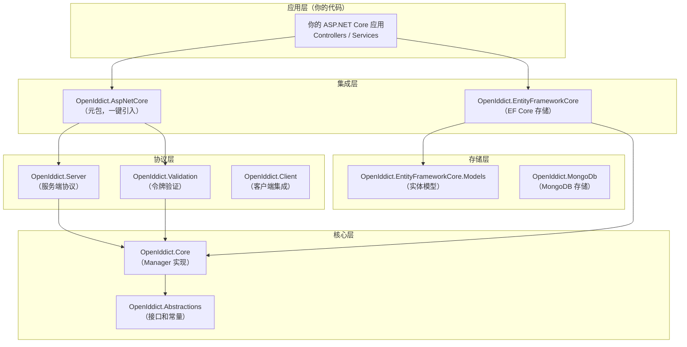
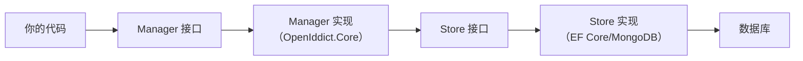
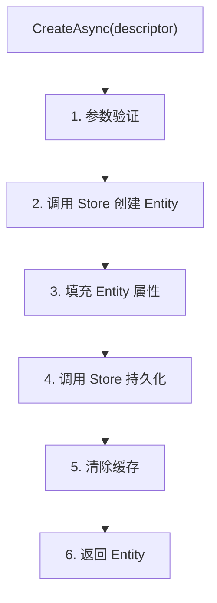
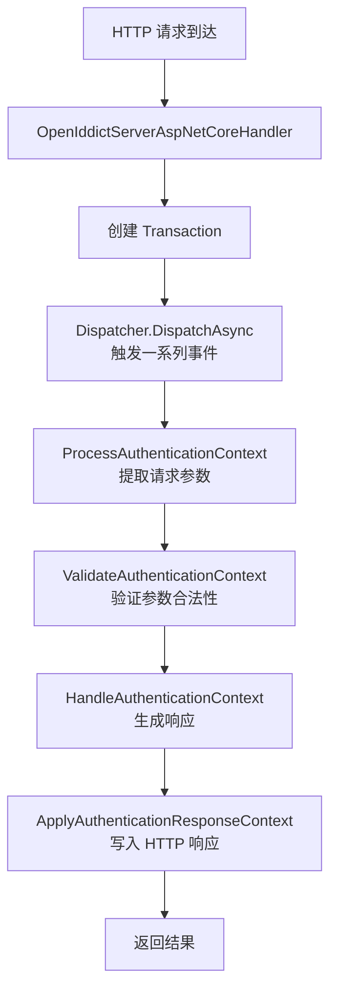
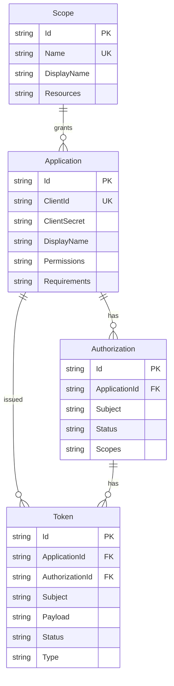
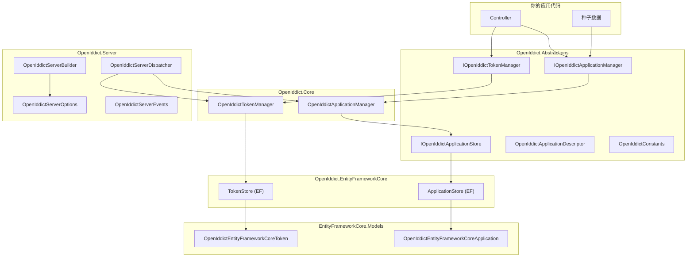

> **源码参考**：本文基于 [openiddict/openiddict-core](https://github.com/openiddict/openiddict-core) 仓库分析。

## 一、项目结构总览

OpenIddict 采用高度模块化的分层架构，源码分为 30+ 个项目，但可以归纳为 **五大层次**：



### 1.1 依赖方向

| 层 | 依赖 | 说明 |
| --- | --- | --- |
| 应用层 | 集成层 | 你的代码只接触高层 API |
| 集成层 | 协议层 | 把 Server/Validation/Client 组合起来 |
| 协议层 | 核心层 | 调用 Manager 完成业务逻辑 |
| 核心层 | 抽象层 | 实现接口，不关心具体存储 |
| 存储层 | 核心层 | 实现 Store 接口 |

## 二、Abstractions 层——接口与契约

`OpenIddict.Abstractions` 是整个框架的基石，定义了所有接口、描述符和常量，**不包含任何实现**。

### 2.1 Manager 接口（业务操作）

Manager 是你对 OpenIddict 数据的主要操作入口：

| 接口 | 职责 | 常用方法 |
| --- | --- | --- |
| `IOpenIddictApplicationManager` | 管理客户端应用 | CreateAsync, FindByClientIdAsync, ValidateAsync |
| `IOpenIddictAuthorizationManager` | 管理用户授权记录 | CreateAsync, FindAsync, PruneAsync |
| `IOpenIddictTokenManager` | 管理令牌记录 | CreateAsync, FindByIdAsync, TryRevokeAsync |
| `IOpenIddictScopeManager` | 管理作用域定义 | CreateAsync, FindByNameAsync, ListResourcesAsync |

**典型使用场景**：在种子数据中注册客户端时，你用的就是 `IOpenIddictApplicationManager`：

```csharp name="通过 Manager 操作数据"
var manager = scope.ServiceProvider
    .GetRequiredService<IOpenIddictApplicationManager>();

await manager.CreateAsync(new OpenIddictApplicationDescriptor
{
    ClientId = "my_app",
    DisplayName = "我的应用",
    // ...
});
```

### 2.2 Store 接口（数据存储）

Store 是 Manager 背后的数据访问层，定义了如何读写持久化数据：

| 接口 | 职责 | 实现者 |
| --- | --- | --- |
| `IOpenIddictApplicationStore` | 应用数据读写 | EF Core / MongoDB |
| `IOpenIddictAuthorizationStore` | 授权记录读写 | EF Core / MongoDB |
| `IOpenIddictTokenStore` | 令牌记录读写 | EF Core / MongoDB |
| `IOpenIddictScopeStore` | 作用域读写 | EF Core / MongoDB |

**Manager 和 Store 的关系**：Manager 不直接操作数据库，而是通过 Store 接口间接访问。这种设计让你可以替换存储实现（如改用 Redis）而不影响业务逻辑。



### 2.3 Descriptor 类（数据传输对象）

Descriptor 是创建实体时使用的"蓝图"——你填充 Descriptor，Manager 据此创建真正的实体：

| Descriptor | 用于创建 |
| --- | --- |
| `OpenIddictApplicationDescriptor` | OpenIddictApplication |
| `OpenIddictAuthorizationDescriptor` | OpenIddictAuthorization |
| `OpenIddictScopeDescriptor` | OpenIddictScope |
| `OpenIddictTokenDescriptor` | OpenIddictToken |

**Descriptor vs Entity**：
- **Descriptor**：临时的、用于传递配置数据的对象，不被持久化
- **Entity**：存储在数据库中的实体，有完整的生命周期管理

```csharp name="Descriptor 和 Entity 的区别"
// 1. 创建 Descriptor（配置数据）
var descriptor = new OpenIddictApplicationDescriptor
{
    ClientId = "web_app",
    ClientSecret = "secret",
    Permissions = { "authorization_code" }
};

// 2. Manager 根据 Descriptor 创建 Entity（持久化）
var entity = await manager.CreateAsync(descriptor);
// entity 现在有了 Id、CreatedDate 等数据库字段
```

### 2.4 OpenIddictConstants（常量集合）

这个静态类包含了所有 OAuth2/OIDC 协议中使用的常量值，避免硬编码字符串：

```csharp name="常用常量分类"
// 授权类型
OpenIddictConstants.GrantTypes.AuthorizationCode  // "authorization_code"
OpenIddictConstants.GrantTypes.ClientCredentials  // "client_credentials"
OpenIddictConstants.GrantTypes.RefreshToken       // "refresh_token"

// 权限前缀
OpenIddictConstants.Permissions.Endpoints.Token   // 令牌端点权限
OpenIddictConstants.Permissions.GrantTypes.Xxx    // 授权类型权限
OpenIddictConstants.Permissions.Prefixes.Scope    // scope 权限前缀 "scp:"

// 声明类型
OpenIddictConstants.Claims.Subject  // "sub"
OpenIddictConstants.Claims.Name     // "name"
OpenIddictConstants.Claims.Email    // "email"

// 令牌状态
OpenIddictConstants.Statuses.Valid    // "valid"
OpenIddictConstants.Statuses.Revoked  // "revoked"
```

## 三、Core 层——Manager 实现

`OpenIddict.Core` 包含 Manager 接口的具体实现，封装了业务逻辑和验证。

### 3.1 Manager 实现类

| 实现类 | 实现接口 | 职责 |
| --- | --- | --- |
| `OpenIddictApplicationManager` | `IOpenIddictApplicationManager` | 应用管理、验证、密码校验 |
| `OpenIddictAuthorizationManager` | `IOpenIddictAuthorizationManager` | 授权记录管理、过期清理 |
| `OpenIddictTokenManager` | `IOpenIddictTokenManager` | 令牌管理、撤销、过期清理 |
| `OpenIddictScopeManager` | `IOpenIddictScopeManager` | 作用域管理、资源映射 |

### 3.2 Manager 内部流程

以 `CreateAsync` 为例，Manager 内部做了这些事：



### 3.3 缓存机制

Manager 内置了简单的内存缓存，避免频繁查询数据库：

```csharp name="Manager 缓存"
// OpenIddictApplicationManager 内部
private readonly IOpenIddictApplicationCacheResolver _cacheResolver;

// FindByClientIdAsync 实现
public async ValueTask<object?> FindByClientIdAsync(string id, CancellationToken ct)
{
    // 先查缓存
    var cache = _cacheResolver.Get(typeof(TApplication));
    if (cache.TryGetValue(id, out var application))
        return application;

    // 缓存未命中，查 Store
    application = await Store.FindByClientIdAsync(id, ct);

    // 写入缓存
    if (application != null)
        cache.Set(id, application);

    return application;
}
```

## 四、Server 层——协议实现

`OpenIddict.Server` 实现了 OAuth2/OpenID Connect 服务端的所有协议逻辑。

### 4.1 核心类

| 类 | 职责 |
| --- | --- |
| `OpenIddictServerBuilder` | 配置服务端选项的 Fluent API |
| `OpenIddictServerOptions` | 服务端配置选项 |
| `OpenIddictServerDispatcher` | 事件分发器，协调处理流程 |
| `OpenIddictServerEvents` | 所有事件的基类 |

### 4.2 OpenIddictServerBuilder

你在 `Program.cs` 中调用的 `.AddServer(options => { ... })` 实际上操作的是 `OpenIddictServerBuilder`：

```csharp name="Builder 方法分类"
// 端点配置
options.SetTokenEndpointUris("/connect/token");
options.SetAuthorizationEndpointUris("/connect/authorize");

// 授权流程
options.AllowAuthorizationCodeFlow();
options.AllowClientCredentialsFlow();
options.AllowRefreshTokenFlow();

// 令牌配置
options.SetAccessTokenLifetime(TimeSpan.FromHours(1));
options.SetRefreshTokenLifetime(TimeSpan.FromDays(14));

// 证书
options.AddDevelopmentSigningCertificate();
options.AddDevelopmentEncryptionCertificate();

// 声明和作用域
options.RegisterScopes("api", "profile");
options.RegisterClaims("name", "email");
```

### 4.3 事件系统（EventHandler）

Server 层采用**事件驱动架构**，每个请求的处理被分解为一系列事件：

| 事件类 | 触发的端点 |
| --- | --- |
| `OpenIddictServerEvents.Authentication` | 授权端点 /authorize |
| `OpenIddictServerEvents.Exchange` | 令牌端点 /token |
| `OpenIddictServerEvents.Revocation` | 撤销端点 /revoke |
| `OpenIddictServerEvents.Introspection` | 内省端点 /introspect |
| `OpenIddictServerEvents.Userinfo` | 用户信息 /userinfo |
| `OpenIddictServerEvents.Session` | 注销 /logout |
| `OpenIddictServerEvents.Device` | 设备授权 /device |
| `OpenIddictServerEvents.Discovery` | 发现 /.well-known |
| `OpenIddictServerEvents.Protection` | 令牌保护/解密 |

### 4.4 请求处理流程



### 4.5 自定义 Handler

你可以通过注册自定义 Handler 来扩展或修改 OpenIddict 的行为：

```csharp name="自定义事件处理器"
// 示例：在令牌签发前添加自定义声明
builder.Services.AddOpenIddict()
    .AddServer(options =>
    {
        options.AddEventHandler<OpenIddictServerEvents.Exchange.ProcessAuthenticationContext>(builder =>
            builder.UseInlineHandler(context =>
            {
                // 在令牌中加入租户 ID
                context.Principal?.SetClaim("tenant_id", GetTenantId(context.Request));
                return default;
            }));
    });
```

## 五、Validation 层——令牌验证

`OpenIddict.Validation` 让资源服务器能够验证 Access Token。

### 5.1 核心类

| 类 | 职责 |
| --- | --- |
| `OpenIddictValidationBuilder` | 配置验证选项 |
| `OpenIddictValidationOptions` | 验证配置（Authority、Audience） |
| `OpenIddictValidationHandler` | ASP.NET Core AuthenticationHandler |

### 5.2 验证模式

Validation 支持两种验证模式：

```csharp name="验证模式配置"
.AddValidation(options =>
{
    // 模式 1：本地验证（同项目部署）
    options.UseLocalServer();

    // 模式 2：远程验证（跨项目部署）
    // options.SetIssuer(new Uri("https://auth.myapp.com"));

    // 模式 3：内省验证（引用令牌）
    // options.UseIntrospection()
    //     .SetIntrospectionEndpointUri(new Uri("https://auth.myapp.com/connect/introspect"))
    //     .SetClientId("resource_server");

    options.UseAspNetCore();
})
```

## 六、实体模型——数据持久化

### 6.1 EF Core 实体

| 实体类 | 对应表 | 主要字段 |
| --- | --- | --- |
| `OpenIddictEntityFrameworkCoreApplication` | OpenIddictApplications | Id, ClientId, ClientSecret, DisplayName, Permissions, Requirements |
| `OpenIddictEntityFrameworkCoreAuthorization` | OpenIddictAuthorizations | Id, ApplicationId, Subject, Status, Scopes, Type |
| `OpenIddictEntityFrameworkCoreToken` | OpenIddictTokens | Id, ApplicationId, AuthorizationId, Subject, Payload, Status, Type |
| `OpenIddictEntityFrameworkCoreScope` | OpenIddictScopes | Id, Name, DisplayName, Description, Resources |

### 6.2 实体关系图



### 6.3 自定义实体

你可以继承这些实体来添加自定义字段（详见[第五篇](tutorial.html?type=openiddict&file=05自定义扩展与踩坑.md)）：

```csharp name="自定义实体"
public class MyApplication : OpenIddictEntityFrameworkCoreApplication
{
    public string? TenantId { get; set; }
    public DateTime? ExpireAt { get; set; }
}
```

## 七、ASP.NET Core 集成层

### 7.1 默认常量

| 常量 | 用途 |
| --- | --- |
| `OpenIddictServerAspNetCoreDefaults.AuthenticationScheme` | 服务端认证方案名称 |
| `OpenIddictValidationAspNetCoreDefaults.AuthenticationScheme` | 验证端认证方案名称 |

### 7.2 HttpContext 扩展方法

这些方法让你方便地从 HTTP 请求中提取 OpenIddict 数据：

```csharp name="常用扩展方法"
// 获取 OpenIddict 解析后的请求
var request = HttpContext.GetOpenIddictServerRequest();

// 获取 OpenIddict 存储的 ClaimsPrincipal
var principal = HttpContext.GetOpenIddictServerPrincipal();

// 设置 OpenIddict 的响应
HttpContext.SetOpenIddictServerResponse(response);
```

## 八、类关系总结



## 九、总结

OpenIddict 的架构设计体现了几个核心原则：

| 原则 | 体现 |
| --- | --- |
| **依赖倒置** | Manager 依赖 Store 接口而非具体实现 |
| **关注点分离** | Abstractions（接口）/ Core（逻辑）/ Server（协议）/ Validation（验证）|
| **可扩展性** | 可替换 Store、自定义 Entity、注册 EventHandler |
| **模块化** | 按需引入 Server/Validation/Client，不用的功能不加载 |

**日常开发中你需要关注的主要是**：
1. `IOpenIddictApplicationManager` —— 管理客户端
2. `IOpenIddictTokenManager` —— 管理令牌（撤销、查询）
3. `OpenIddictApplicationDescriptor` —— 配置客户端
4. `OpenIddictConstants` —— 避免硬编码字符串
5. `OpenIddictServerBuilder` —— 服务端配置