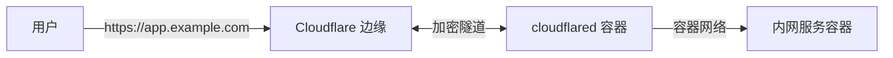
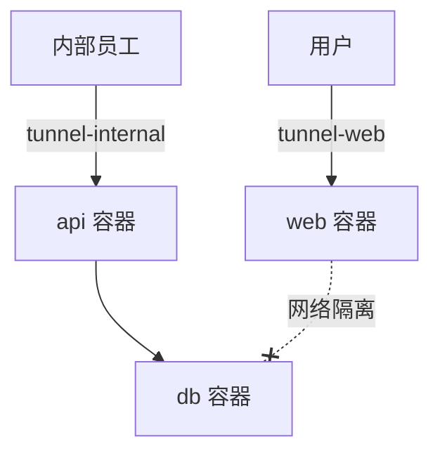
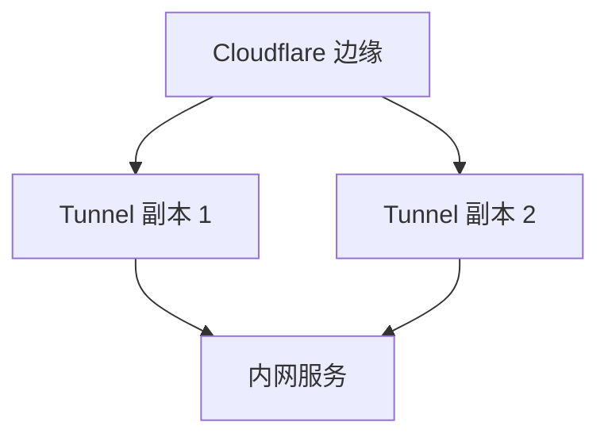
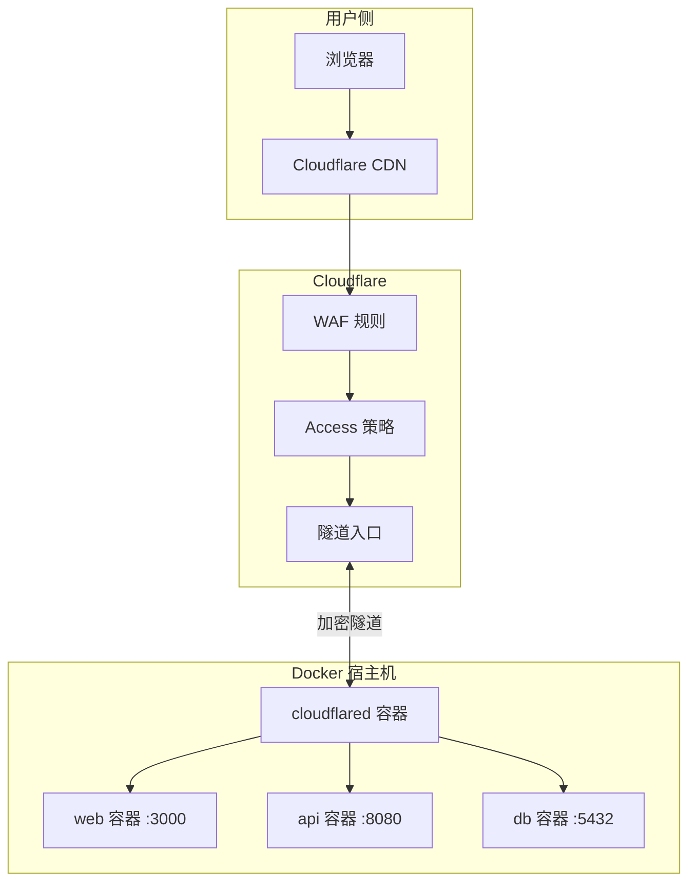

## 一、Cloudflare Tunnel 是什么

Cloudflare Tunnel（原名 Argo Tunnel）让你把内网服务安全地暴露到公网，无需开放端口、无需公网 IP、无需 DDNS。



**核心优势：**

| 传统方案 | Cloudflare Tunnel |
|---------|-------------------|
| 需要公网 IP | 不需要 |
| 需要开放端口 | 不开放任何端口 |
| 需要 DDNS | 自动绑定域名 |
| 自签证书/手动配 HTTPS | Cloudflare 自动 HTTPS |
| 暴露真实 IP | 隐藏真实 IP |
| 需要防火墙规则 | 零入站规则 |

**为什么用 Docker 运行：**
- 不装额外软件，不污染宿主机
- 一行命令启动，`docker compose up -d` 搞定
- 和业务容器在同一网络，无需 `localhost`
- 更新方便：拉新镜像即可

## 二、前置条件

- 一个 Cloudflare 账号（免费）
- 一个已托管在 Cloudflare 的域名
- 安装了 Docker 的机器

## 三、获取 Token

所有 Docker 方式都需要 Token，在 Dashboard 中获取：

1. 登录 [Cloudflare Zero Trust](https://one.dash.cloudflare.com/)
2. Networks → Tunnels → Create a tunnel
3. 选择 "Cloudflared" 类型，命名隧道
4. 复制生成的 Token

> Token 只出现一次，务必保存。忘了就删掉隧道重建。

## 四、快速开始：临时隧道

无需登录、无需域名，一行命令创建临时隧道：

```bash
# 暴露宿主机上的服务
docker run -it --rm \
  --network host \
  cloudflare/cloudflared:latest \
  tunnel --url http://localhost:3000
```

输出类似：

```
+--------------------------------------------------------------------------------------------+
|  Your quick Tunnel has been created! Visit it at (it may take some time to be reachable):  |
|  https://some-random-words.trycloudflare.com                                               |
+--------------------------------------------------------------------------------------------+
```

如果目标服务也在 Docker 中：

```bash
docker run -it --rm \
  --network my-app-net \
  cloudflare/cloudflared:latest \
  tunnel --url http://web:3000
```

**特点：**
- 无需登录、无需域名
- URL 随机，每次不同
- 适合临时分享、调试

**适用场景：** 给客户演示本地项目、临时 Webhook 回调测试、远程协助。

## 五、命名隧道（推荐）

临时隧道重启后 URL 会变，命名隧道绑定固定域名，适合长期使用。

### 5.1 Token 方式（最简单）

```bash
docker run -d \
  --name cloudflared \
  --restart unless-stopped \
  cloudflare/cloudflared:latest \
  tunnel --no-autoupdate run --token <YOUR_TOKEN>
```

`--no-autoupdate` 很重要——容器内自动更新会导致进程退出，更新应该通过替换镜像实现。

然后在 Dashboard 的 Public Hostname 页面添加路由：

| Subdomain | Domain | Service |
|-----------|--------|---------|
| app | example.com | http://web:3000 |
| api | example.com | http://api:8080 |

> 这里 `web` 和 `api` 是 Docker 网络中的服务名，不需要 `localhost`。

### 5.2 凭证文件方式（需要自定义 config.yml）

当需要 TCP 代理、路径路由等 Dashboard 不支持的功能时使用：

**第一步：在宿主机上完成认证**（需要先安装 cloudflared CLI）

```bash
cloudflared tunnel login
cloudflared tunnel create my-app
cloudflared tunnel route dns my-app app.example.com
```

**第二步：编写 config.yml**

```yaml
# config.yml
tunnel: my-app
credentials-file: /etc/cloudflared/credentials.json

ingress:
  - hostname: app.example.com
    service: http://web:3000
  - hostname: api.example.com
    service: http://api:8080
  - hostname: db.example.com
    service: tcp://db:5432
  - service: http_status:404
```

**第三步：Docker 运行**

```yaml
# docker-compose.yml
services:
  tunnel:
    image: cloudflare/cloudflared:latest
    command: tunnel --no-autoupdate --config /etc/cloudflared/config.yml run
    volumes:
      - ./config.yml:/etc/cloudflared/config.yml:ro
      - ~/.cloudflared/<TUNNEL_ID>.json:/etc/cloudflared/credentials.json:ro
    restart: unless-stopped
    networks:
      - app-net
```

## 六、Docker Compose 完整示例

一个完整的 Web 应用：Tunnel + Nginx + API + PostgreSQL。

```yaml
# docker-compose.yml
version: "3.8"

services:
  # Cloudflare Tunnel
  tunnel:
    image: cloudflare/cloudflared:latest
    command: tunnel --no-autoupdate run --token ${TUNNEL_TOKEN}
    restart: unless-stopped
    # 不需要暴露任何端口！
    networks:
      - app-net

  # Web 前端
  web:
    image: nginx:alpine
    volumes:
      - ./nginx.conf:/etc/nginx/conf.d/default.conf
      - ./dist:/usr/share/nginx/html
    restart: unless-stopped
    networks:
      - app-net
    # 不需要 ports！tunnel 直接通过容器网络访问

  # 后端 API
  api:
    build: ./api
    environment:
      - DATABASE_URL=postgres://user:pass@db:5432/myapp
    restart: unless-stopped
    networks:
      - app-net

  # 数据库
  db:
    image: postgres:16-alpine
    environment:
      POSTGRES_USER: user
      POSTGRES_PASSWORD: pass
      POSTGRES_DB: myapp
    volumes:
      - pgdata:/var/lib/postgresql/data
    restart: unless-stopped
    networks:
      - app-net

networks:
  app-net:
    driver: bridge

volumes:
  pgdata:
```

```bash
# .env 文件
TUNNEL_TOKEN=your_token_here
```

```bash
# 启动
docker compose up -d

# 查看日志
docker compose logs -f tunnel

# 重启隧道
docker compose restart tunnel

# 更新镜像
docker compose pull tunnel
docker compose up -d tunnel
```

**关键点：**
- 所有服务在同一个 `app-net` 网络中
- Tunnel 通过 Docker DNS（`web`、`api`）访问其他容器
- 不需要 `ports` 映射——服务完全不暴露到宿主机
- 数据库也不需要暴露端口，只有 tunnel 能访问

## 七、多服务路由

一个隧道可以暴露多个服务，在 Dashboard 中添加多条 Public Hostname 规则即可：

| Subdomain | Domain | Service | 说明 |
|-----------|--------|---------|------|
| app | example.com | http://web:3000 | Web 应用 |
| api | example.com | http://api:8080 | API |
| db | example.com | tcp://db:5432 | 数据库（TCP 代理） |
| ssh | example.com | ssh://ssh-server:22 | SSH |

如果用凭证文件方式，在 `config.yml` 中配置：

```yaml
ingress:
  - hostname: app.example.com
    service: http://web:3000

  - hostname: api.example.com
    service: http://api:8080

  # 路径路由：同一域名不同路径
  - hostname: app.example.com
    path: /api/.*
    service: http://api:8080

  # TCP 代理
  - hostname: db.example.com
    service: tcp://db:5432

  # SSH 代理
  - hostname: ssh.example.com
    service: ssh://ssh-server:22

  # 兜底（必须）
  - service: http_status:404
```

**ingress 规则匹配顺序：从上到下，第一个匹配的生效。**

### TCP 服务代理

数据库、Redis 等 TCP 服务通过隧道暴露后，客户端需要 `cloudflared access` 代理：

```bash
# 本地启动 TCP 代理
cloudflared access tcp --hostname db.example.com --url localhost:5432

# 然后用普通客户端连接 localhost:5432
psql -h localhost -p 5432 -U user dbname
```

### SSH 代理

客户端配置 `~/.ssh/config`：

```
Host ssh.example.com
    ProxyCommand cloudflared access ssh --hostname %h
```

然后直接 `ssh user@ssh.example.com` 即可。

## 八、多隧道 + 网络隔离

生产环境中，用多个隧道隔离不同业务：

```yaml
# docker-compose.yml
services:
  # 主站隧道——对外公开
  tunnel-web:
    image: cloudflare/cloudflared:latest
    command: tunnel --no-autoupdate run --token ${WEB_TOKEN}
    restart: unless-stopped
    networks:
      - web-net

  # 内部服务隧道——仅内部访问
  tunnel-internal:
    image: cloudflare/cloudflared:latest
    command: tunnel --no-autoupdate --config /etc/cloudflared/config.yml run
    volumes:
      - ./internal-config.yml:/etc/cloudflared/config.yml:ro
      - ./credentials/internal.json:/etc/cloudflared/credentials.json:ro
    restart: unless-stopped
    networks:
      - internal-net

  # Web 服务
  web:
    image: nginx:alpine
    networks:
      - web-net

  # 内部 API
  api:
    build: ./api
    networks:
      - internal-net

  # 内部数据库
  db:
    image: postgres:16-alpine
    networks:
      - internal-net

networks:
  web-net:
    driver: bridge
  internal-net:
    driver: bridge
```



两个隧道分别在不同网络中，web 无法直接访问 db。

## 九、生产加固

### 9.1 健康检查

```yaml
services:
  tunnel:
    image: cloudflare/cloudflared:latest
    command: tunnel --no-autoupdate run --token ${TUNNEL_TOKEN}
    healthcheck:
      test: ["CMD", "cloudflared", "tunnel", "info"]
      interval: 30s
      timeout: 10s
      retries: 3
      start_period: 10s
    restart: unless-stopped
```

### 9.2 日志管理

```yaml
services:
  tunnel:
    image: cloudflare/cloudflared:latest
    command: tunnel --no-autoupdate run --token ${TUNNEL_TOKEN} --loglevel info
    logging:
      driver: json-file
      options:
        max-size: "10m"
        max-file: "3"
    restart: unless-stopped
```

日志级别：`debug > info > warn > error > fatal`

- 开发调试用 `debug`
- 生产用 `info` 或 `warn`

### 9.3 资源限制

```yaml
services:
  tunnel:
    image: cloudflare/cloudflared:latest
    command: tunnel --no-autoupdate run --token ${TUNNEL_TOKEN}
    deploy:
      resources:
        limits:
          memory: 256M
          cpus: "0.5"
        reservations:
          memory: 64M
          cpus: "0.1"
    restart: unless-stopped
```

cloudflared 本身非常轻量，64M 内存足够正常运行。

### 9.4 高可用

同一个隧道可以运行多个 `cloudflared` 副本，Cloudflare 自动做负载均衡：

```yaml
services:
  tunnel:
    image: cloudflare/cloudflared:latest
    command: tunnel --no-autoupdate run --token ${TUNNEL_TOKEN}
    restart: unless-stopped
    deploy:
      replicas: 2
    networks:
      - app-net
```



建议至少 2 个副本。

### 9.5 宿主机服务暴露

如果需要通过 Docker 隧道暴露宿主机上的服务（非容器化）：

```yaml
services:
  tunnel:
    image: cloudflare/cloudflared:latest
    command: tunnel --no-autoupdate run --token ${TUNNEL_TOKEN}
    extra_hosts:
      - "host.docker.internal:host-gateway"  # Linux 必须加，macOS/Windows 不需要
    restart: unless-stopped
```

Dashboard 中 Service 填 `http://host.docker.internal:3000`。

## 十、零信任网络（Zero Trust）

Tunnel + Cloudflare Access 实现零信任访问控制：

### 10.1 配置 Access 应用

1. Cloudflare Dashboard → Zero Trust → Access → Applications
2. 创建应用，选择隧道域名 `app.example.com`
3. 配置访问策略：

| 策略类型 | 说明 |
|---------|------|
| Email | 只允许指定邮箱访问 |
| IP List | 只允许指定 IP 访问 |
| Country | 只允许指定国家访问 |
| Group | 只允许指定团队访问 |
| MFA | 需要多因素认证 |

### 10.2 常见策略

```
# 只允许公司邮箱访问
Policy: Email
Allow: @company.com

# 需要邮箱 + MFA
Policy: Email + MFA
Allow: @company.com
Require: One-time PIN + Authenticator

# 只允许办公室 IP
Policy: IP List
Allow: 203.0.113.0/24
```

### 10.3 Service Token（机器对机器）

API 之间的访问不需要浏览器登录，用 Service Token：

```bash
# 创建 Service Token
# Dashboard → Zero Trust → Access → Service Auth → Service Tokens

# 请求时带上 Header
curl -H "CF-Access-Client-Id: xxx" \
     -H "CF-Access-Client-Secret: yyy" \
     https://api.example.com/data
```

## 十一、安全最佳实践

### 11.1 Origin Server 证书

Cloudflare 到源站的连接也可以加密：

```yaml
ingress:
  - hostname: app.example.com
    service: https://web:3000
    originRequest:
      noTLSVerify: false  # 验证源站证书
```

### 11.2 凭证保护

```bash
# 凭证文件权限
chmod 600 ~/.cloudflared/*.json
chmod 600 ~/.cloudflared/cert.pem

# 不要提交到 Git
echo ".cloudflared/" >> .gitignore
echo "credentials/" >> .gitignore
```

### 11.3 Token 安全

- Token 不要硬编码在 `docker-compose.yml` 中，用 `.env` 文件
- `.env` 加入 `.gitignore`
- CI/CD 中通过环境变量注入

## 十二、常见问题排查

### Q：容器启动后立即退出

```bash
# 查看退出日志
docker logs cloudflared

# 常见原因：
# 1. Token 无效 → 重新从 Dashboard 复制
# 2. 凭证文件路径错误 → 检查 volumes 挂载
# 3. config.yml 语法错误 → cloudflared tunnel validate config.yml
```

### Q：隧道连上了但 502

```bash
# 检查容器网络
docker compose exec tunnel ping web
docker compose exec tunnel curl http://web:3000

# 常见原因：
# 1. 目标服务不在同一网络 → 检查 networks 配置
# 2. 服务名写错 → 用 docker compose exec 验证
# 3. 目标服务还没启动 → 加 depends_on 或 healthcheck
```

### Q：ERR_CONNECTION_REFUSED

- 确认目标容器在运行：`docker compose ps`
- 确认 Service 中的协议和端口正确（http/https/tcp）
- 确认容器在同一网络中

### Q：DNS 记录冲突

在 Dashboard 删除旧的 CNAME 记录，或用命令重新绑定：

```bash
cloudflared tunnel route dns my-app app.example.com
```

### Q：查看实时日志

```bash
docker compose logs -f tunnel
# 或调整日志级别
docker compose exec tunnel cloudflared tunnel --loglevel debug
```

### Q：如何更新 cloudflared

```bash
docker compose pull tunnel
docker compose up -d tunnel
```

### Q：查看隧道连接状态

```bash
docker compose exec tunnel cloudflared tunnel info
```

## 十三、架构总览



## 十四、小结

| 场景 | 方案 |
|------|------|
| 临时分享 | `docker run --network host` 临时隧道 |
| 长期服务 | Token + Docker Compose |
| 多服务 | Dashboard 多路由 / config.yml ingress |
| TCP/SSH | `service: tcp://` / `service: ssh://` |
| 网络隔离 | 多隧道 + 多网络 |
| 访问控制 | Cloudflare Access |
| 高可用 | 多副本 + 负载均衡 |
| 生产加固 | 健康检查 + 日志 + 资源限制 |
