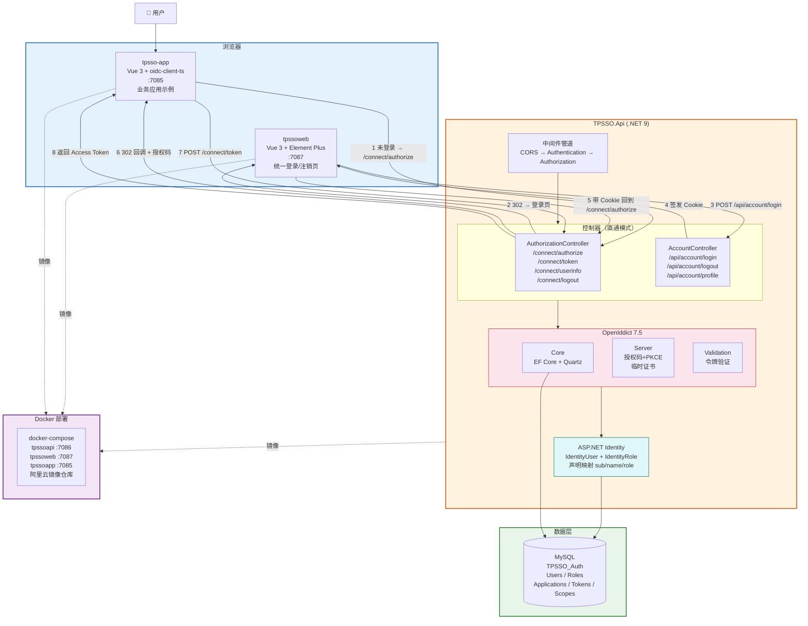
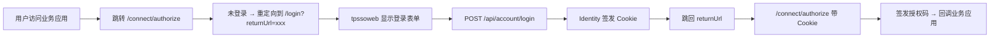
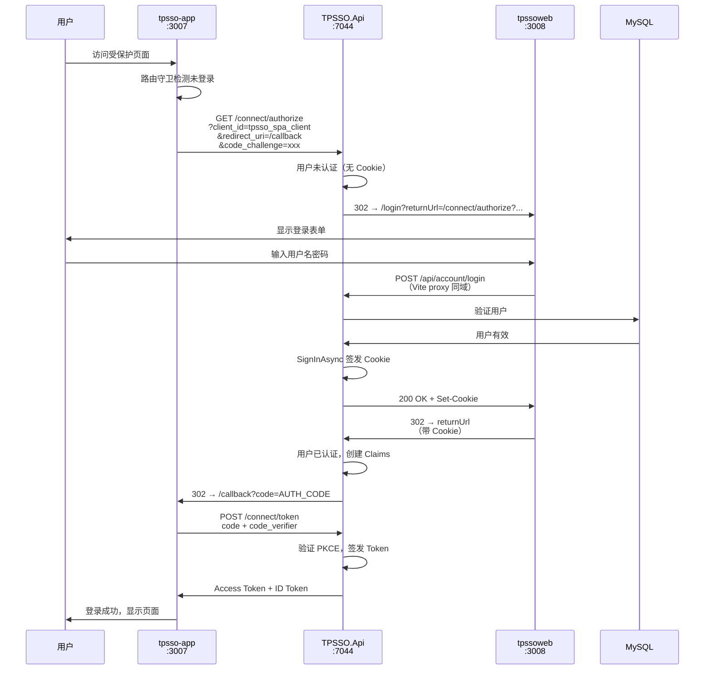

---
layout: TutorialLayout
title: 基于 OpenIddict 实现 SSO 单点登录实战
date: 2026-06-05
category: tech
tags: .NET, OpenIddict, SSO, OAuth2, Vue, Docker
summary: 从零搭建 SSO 认证中心，涵盖 OpenIddict 服务端配置、授权码+PKCE 流程、Vue 前端集成、Docker 部署全链路
---

## 一、项目背景

> 源码地址：`git clone https://github.com/koeltp/tpsso.git`

### 1.1 什么是 SSO

SSO（Single Sign-On，单点登录）让用户只需登录一次，就能访问所有互信的应用系统。核心思路是：**认证集中化**——所有应用不再自己管登录，而是统一交给认证中心。

### 1.2 项目架构

TPSSO 是一个完整的 SSO 解决方案，包含三个子项目：



| 项目 | 技术栈 | 端口 | 职责 |
| --- | --- | --- | --- |
| TPSSO.Api | .NET 9 + OpenIddict 7.5 + Identity + MySQL | 7086 | 认证服务器，处理 OAuth2/OIDC 协议 |
| tpssoweb | Vue 3 + Element Plus + Vite + Axios | 7087 | 统一登录/注销页，Vite 代理避免跨域 |
| tpsso-app | Vue 3 + oidc-client-ts + Vite | 7085 | 业务应用，演示授权码+PKCE 登录流程 |

### 1.3 技术选型

| 选型 | 版本 | 为什么选它 |
| --- | --- | --- |
| OpenIddict | 7.5.0 | 开源免费、协议合规、社区活跃 |
| Identity | 9.0 | .NET 官方用户管理，与 OpenIddict 天然集成 |
| MySQL + Pomelo | 9.0 | 轻量、成熟、Pomelo 是 .NET 社区最主流的 MySQL 驱动 |
| oidc-client-ts | 3.5 | 浏览器端 OIDC 标准库，处理授权码+PKCE 流程 |
| Quartz | — | OpenIddict 内置的令牌清理调度器 |

## 二、认证服务器（TPSSO.Api）

### 2.1 项目结构

```
TPSSO.Api/
├── Controllers/
│   ├── AccountController.cs      # 用户登录/注销 API
│   └── AuthorizationController.cs # OAuth2/OIDC 端点
├── Migrations/                    # EF Core 迁移
├── ApplicationDbContext.cs        # 数据库上下文
├── ClientSeeder.cs                # 客户端种子数据
├── SsoOptions.cs                  # SSO 配置项
├── Program.cs                     # 服务注册与中间件
└── appsettings.json               # 配置文件
```

### 2.2 服务注册

```csharp title="Program.cs"
// 1. SSO 前端地址配置
builder.Services.Configure<SsoOptions>(
    builder.Configuration.GetSection(SsoOptions.SectionName));

// 2. 数据库 - MySQL
var connectionString = builder.Configuration.GetConnectionString("DefaultConnection");
builder.Services.AddDbContext<ApplicationDbContext>(options =>
{
    options.UseMySql(connectionString, ServerVersion.AutoDetect(connectionString));
    options.UseOpenIddict(); // 注册 OpenIddict 存储
});

// 3. Identity 用户管理
builder.Services.AddIdentity<IdentityUser, IdentityRole>()
    .AddEntityFrameworkStores<ApplicationDbContext>()
    .AddDefaultTokenProviders();

// 统一声明类型：让 Identity 的声明与 OpenIddict 标准对齐
builder.Services.Configure<IdentityOptions>(options =>
{
    options.ClaimsIdentity.UserIdClaimType = OpenIddictConstants.Claims.Subject;
    options.ClaimsIdentity.UserNameClaimType = OpenIddictConstants.Claims.Name;
    options.ClaimsIdentity.RoleClaimType = OpenIddictConstants.Claims.Role;
});

// 4. Cookie 配置
builder.Services.ConfigureApplicationCookie(options =>
{
    options.LoginPath = null; // API 不自动重定向，统一返回 401
});

// 5. CORS
builder.Services.AddCors(options =>
{
    options.AddDefaultPolicy(policy =>
    {
        policy.AllowAnyOrigin()
              .AllowAnyHeader()
              .AllowAnyMethod();
    });
});

// 6. OpenIddict 核心
builder.Services.AddOpenIddict()
    .AddCore(options =>
    {
        options.UseEntityFrameworkCore().UseDbContext<ApplicationDbContext>();
        options.UseQuartz(); // 自动清理过期令牌
    })
    .AddServer(options =>
    {
        // 端点
        options.SetAuthorizationEndpointUris("/connect/authorize")
               .SetTokenEndpointUris("/connect/token")
               .SetUserInfoEndpointUris("/connect/userinfo")
               .SetEndSessionEndpointUris("/connect/logout");

        // 授权码 + PKCE
        options.AllowAuthorizationCodeFlow()
               .RequireProofKeyForCodeExchange();

        // 开发证书
        options.AddDevelopmentEncryptionCertificate()
               .AddDevelopmentSigningCertificate();

        // 直通模式：让 Controller 处理请求
        options.UseAspNetCore()
               .EnableAuthorizationEndpointPassthrough()
               .EnableTokenEndpointPassthrough()
               .EnableUserInfoEndpointPassthrough()
               .EnableEndSessionEndpointPassthrough();
    })
    .AddValidation(options =>
    {
        options.UseLocalServer();
        options.UseAspNetCore();
    });
```

> **直通模式（Passthrough）** 是关键配置。默认情况下 OpenIddict 自己处理所有请求，启用直通后请求会进入你的 Controller，让你完全控制授权逻辑。

### 2.3 数据库上下文

```csharp title="ApplicationDbContext.cs"
public class ApplicationDbContext : IdentityDbContext<IdentityUser>
{
    public ApplicationDbContext(DbContextOptions<ApplicationDbContext> options)
        : base(options) { }

    protected override void OnModelCreating(ModelBuilder builder)
    {
        base.OnModelCreating(builder);

        builder.UseOpenIddict();

        // MySQL 索引键长度限制（utf8mb4 最大 3072 bytes）
        builder.Entity<OpenIddictEntityFrameworkCoreToken>(entity =>
        {
            entity.Property(e => e.Subject).HasMaxLength(200);
            entity.Property(e => e.Status).HasMaxLength(50);
            entity.Property(e => e.Type).HasMaxLength(100);
        });

        builder.Entity<OpenIddictEntityFrameworkCoreAuthorization>(entity =>
        {
            entity.Property(e => e.Subject).HasMaxLength(200);
            entity.Property(e => e.Status).HasMaxLength(50);
            entity.Property(e => e.Type).HasMaxLength(50);
        });

        builder.Entity<OpenIddictEntityFrameworkCoreScope>(entity =>
        {
            entity.Property(e => e.Name).HasMaxLength(200);
        });

        builder.Entity<OpenIddictEntityFrameworkCoreApplication>(entity =>
        {
            entity.Property(e => e.ClientId).HasMaxLength(100);
        });
    }
}
```

> **踩坑**：MySQL 的 utf8mb4 编码下，InnoDB 索引键最大 3072 字节。OpenIddict 默认的 `Subject`、`Status` 等字段是 `nvarchar(max)`，会超出限制。必须手动限制长度。

### 2.4 SSO 配置项

```csharp title="SsoOptions.cs"
public class SsoOptions
{
    public const string SectionName = "SsoOptions";

    /// <summary>统一登录页基础地址</summary>
    public string LoginBaseUrl { get; set; } = "http://localhost:3008";

    /// <summary>自定义登录页路径</summary>
    public string LoginPath { get; set; } = "/login";
}
```

这个配置让认证服务器知道登录页在哪。当用户未登录时，授权端点会重定向到这个地址。

### 2.5 客户端种子数据

```csharp title="ClientSeeder.cs"
public class ClientSeeder
{
    private readonly ApplicationDbContext _context;
    private readonly IOpenIddictApplicationManager _manager;
    private readonly IOpenIddictScopeManager _scopeManager;
    private readonly UserManager<IdentityUser> _userManager;

    public async Task SeedAsync()
    {
        // 开发环境：每次重建数据库
        if (Environment.GetEnvironmentVariable("ASPNETCORE_ENVIRONMENT") == "Development")
        {
            await _context.Database.EnsureDeletedAsync();
            await _context.Database.EnsureCreatedAsync();
        }
        else
        {
            await _context.Database.MigrateAsync(); // 生产环境：自动迁移
        }

        // 注册作用域
        if (await _scopeManager.FindByNameAsync("profile") is null)
        {
            await _scopeManager.CreateAsync(new OpenIddictScopeDescriptor
            {
                Name = "profile",
                DisplayName = "Profile information",
                Resources = { "tpsso-api" }
            });
        }

        // 注册 SPA 客户端
        if (await _manager.FindByClientIdAsync("tpsso_spa_client") == null)
        {
            await _manager.CreateAsync(new OpenIddictApplicationDescriptor
            {
                ClientId = "tpsso_spa_client",
                // SPA 是公开客户端，使用 PKCE 而非 client_secret
                ConsentType = OpenIddictConstants.ConsentTypes.Implicit,
                DisplayName = "TPSSO SPA Client",
                RedirectUris = { new Uri("http://localhost:3007/callback") },
                PostLogoutRedirectUris = { new Uri("http://localhost:3007") },
                Permissions =
                {
                    OpenIddictConstants.Permissions.Endpoints.Authorization,
                    OpenIddictConstants.Permissions.Endpoints.Token,
                    OpenIddictConstants.Permissions.Endpoints.EndSession,
                    OpenIddictConstants.Permissions.ResponseTypes.Code,
                    OpenIddictConstants.Permissions.GrantTypes.AuthorizationCode,
                    OpenIddictConstants.Permissions.Scopes.Email,
                    OpenIddictConstants.Permissions.Scopes.Profile
                }
            });
        }

        // 创建测试用户
        if (await _userManager.FindByEmailAsync("tp@taipi.top") == null)
        {
            var user = new IdentityUser { UserName = "tp@taipi.top", Email = "tp@taipi.top" };
            await _userManager.CreateAsync(user, "Admin@123");
        }
    }
}
```

## 三、OAuth2/OIDC 端点实现

### 3.1 授权端点（/connect/authorize）

这是整个 SSO 流程的入口，决定用户是否已登录、是否需要跳转登录页。

```csharp title="AuthorizationController.cs - Authorize"
[HttpGet("authorize")]
[HttpPost("authorize")]
public async Task<IActionResult> Authorize()
{
    var request = HttpContext.GetOpenIddictServerRequest() ??
        throw new InvalidOperationException("无效的 OpenID Connect 请求");

    // 1. 未登录 → 重定向到前端登录页
    if (!User.Identity?.IsAuthenticated == true)
    {
        var returnUrl = $"{Request.Scheme}://{Request.Host}" +
            $"/connect/authorize{HttpContext.Request.QueryString}";
        var loginUrl = $"{_ssoOptions.LoginBaseUrl}{_ssoOptions.LoginPath}" +
            $"?returnUrl={Uri.EscapeDataString(returnUrl)}";
        return Redirect(loginUrl);
    }

    // 2. 已登录 → 验证客户端
    var application = await _applicationManager.FindByClientIdAsync(request.ClientId);
    if (application == null)
        throw new InvalidOperationException("客户端不存在");

    // 3. 获取用户
    var user = await _userManager.GetUserAsync(User);
    if (user == null)
    {
        await _signInManager.SignOutAsync();
        // 重新跳转登录页
        var returnUrl = $"{Request.Scheme}://{Request.Host}" +
            $"/connect/authorize{HttpContext.Request.QueryString}";
        var loginUrl = $"{_ssoOptions.LoginBaseUrl}{_ssoOptions.LoginPath}" +
            $"?returnUrl={Uri.EscapeDataString(returnUrl)}";
        return Redirect(loginUrl);
    }

    // 4. 构建声明
    var identity = new ClaimsIdentity(
        authenticationType: TokenValidationParameters.DefaultAuthenticationType,
        nameType: OpenIddictConstants.Claims.Name,
        roleType: OpenIddictConstants.Claims.Role);

    identity.AddClaim(new Claim(OpenIddictConstants.Claims.Subject,
        await _userManager.GetUserIdAsync(user))
        .SetDestinations(OpenIddictConstants.Destinations.AccessToken,
                         OpenIddictConstants.Destinations.IdentityToken));

    identity.AddClaim(new Claim(OpenIddictConstants.Claims.Name,
        await _userManager.GetUserNameAsync(user))
        .SetDestinations(OpenIddictConstants.Destinations.AccessToken,
                         OpenIddictConstants.Destinations.IdentityToken));

    identity.AddClaim(new Claim(OpenIddictConstants.Claims.Email,
        await _userManager.GetEmailAsync(user))
        .SetDestinations(OpenIddictConstants.Destinations.AccessToken,
                         OpenIddictConstants.Destinations.IdentityToken));

    // 添加角色声明
    var roles = await _userManager.GetRolesAsync(user);
    foreach (var role in roles)
    {
        identity.AddClaim(new Claim(OpenIddictConstants.Claims.Role, role)
            .SetDestinations(OpenIddictConstants.Destinations.AccessToken,
                             OpenIddictConstants.Destinations.IdentityToken));
    }

    // 5. 设置作用域和资源
    var scopes = request.GetScopes();
    identity.SetScopes(scopes);
    identity.SetResources(await _scopeManager.ListResourcesAsync(scopes).ToListAsync());

    // 6. 签发授权码（OpenIddict 自动完成）
    return SignIn(new ClaimsPrincipal(identity),
        OpenIddictServerAspNetCoreDefaults.AuthenticationScheme);
}
```

**关键设计**：登录页面不在认证服务器中，而是重定向到前端应用（tpssoweb）。这样前端团队可以完全控制 UI，后端只负责协议逻辑。

### 3.2 令牌端点（/connect/token）

用授权码换取 Access Token。

```csharp title="AuthorizationController.cs - Exchange"
[HttpPost("token")]
public async Task<IActionResult> Exchange()
{
    var request = HttpContext.GetOpenIddictServerRequest();
    if (request == null)
        return BadRequest(new { error = "invalid_request" });

    if (request.IsAuthorizationCodeGrantType())
    {
        // 从授权码中恢复 ClaimsPrincipal
        var result = await HttpContext.AuthenticateAsync(
            OpenIddictServerAspNetCoreDefaults.AuthenticationScheme);

        if (result?.Principal == null)
            return Forbid(OpenIddictServerAspNetCoreDefaults.AuthenticationScheme);

        // 验证用户是否仍然有效
        var userId = result.Principal.FindFirst(OpenIddictConstants.Claims.Subject)?.Value;
        var user = await _userManager.FindByIdAsync(userId!);
        if (user == null)
            return Forbid(OpenIddictServerAspNetCoreDefaults.AuthenticationScheme);

        // 重建 Principal（确保声明是最新的）
        var identity = new ClaimsIdentity(
            result.Principal.Identities.First().Claims,
            TokenValidationParameters.DefaultAuthenticationType);

        var principal = new ClaimsPrincipal(identity);
        principal.SetScopes(request.GetScopes());
        principal.SetResources(
            await _scopeManager.ListResourcesAsync(request.GetScopes()).ToListAsync());

        return SignIn(principal,
            OpenIddictServerAspNetCoreDefaults.AuthenticationScheme);
    }

    return BadRequest(new { error = "unsupported_grant_type" });
}
```

### 3.3 注销端点（/connect/logout）

```csharp title="AuthorizationController.cs - Logout"
[HttpGet("logout")]
[HttpPost("logout")]
public async Task<IActionResult> Logout()
{
    var request = HttpContext.GetOpenIddictServerRequest();

    await _signInManager.SignOutAsync();

    if (request?.PostLogoutRedirectUri != null)
        return Redirect(request.PostLogoutRedirectUri);

    return Redirect(_ssoOptions.LoginBaseUrl);
}
```

## 四、统一登录页（tpssoweb）

### 4.1 架构设计

tpssoweb 是一个独立的 Vue 3 应用，只负责一件事：**提供登录界面**。



### 4.2 Vite 代理配置

tpssoweb 通过 Vite 的 proxy 将 API 请求代理到认证服务器，避免跨域问题：

```typescript title="vite.config.ts"
export default defineConfig({
  server: {
    port: 3008,
    proxy: {
      '/api': {
        target: 'https://localhost:7044',
        changeOrigin: true,
        secure: false
      },
      '/connect': {
        target: 'https://localhost:7044',
        changeOrigin: true,
        secure: false
      }
    }
  }
})
```

> **为什么用代理而不是 CORS？** Cookie 认证需要 `SameSite` 和 `Secure` 策略配合，跨域 Cookie 配置复杂且容易出错。同域代理是最简单可靠的方案。

### 4.3 登录页面

```vue title="Login.vue（核心逻辑）"
<script setup lang="ts">
import { ref, reactive } from 'vue'
import { useRoute } from 'vue-router'
import axios from 'axios'

const route = useRoute()
const form = reactive({ username: '', password: '' })
const returnUrl = ref((route.query.returnUrl as string) || '/')

const handleSubmit = async () => {
  // 调用认证服务器的登录 API
  await axios.post('/api/account/login', {
    username: form.username,
    password: form.password
  })
  // 登录成功后跳回授权端点（returnUrl）
  window.location.href = returnUrl.value
}
</script>
```

**关键点**：登录成功后用 `window.location.href` 而非 `router.push`，因为 `returnUrl` 指向认证服务器的 `/connect/authorize`，需要完整页面跳转才能带上 Cookie。

### 4.4 登录 API

```csharp title="AccountController.cs"
[HttpPost("login")]
public async Task<IActionResult> Login([FromBody] LoginModel model)
{
    var user = await _userManager.FindByNameAsync(model.Username);
    if (user == null || !await _userManager.CheckPasswordAsync(user, model.Password))
        return Unauthorized(new { error = "无效的用户或密码" });

    // 签发 Identity Cookie
    await _signInManager.SignInAsync(user, isPersistent: model.RememberMe);
    return Ok(new { success = true });
}
```

## 五、业务应用集成（tpsso-app）

### 5.1 OIDC 客户端配置

```typescript title="oidcConfig.ts"
import { UserManager, WebStorageStateStore } from 'oidc-client-ts'

export const userManager = new UserManager({
  authority: import.meta.env.VITE_AUTH_AUTHORITY, // 认证服务器地址
  client_id: import.meta.env.VITE_CLIENT_ID,      // tpsso_spa_client
  redirect_uri: import.meta.env.VITE_REDIRECT_URI, // /callback
  response_type: 'code',                           // 授权码流程
  scope: 'openid profile',                         // 请求的作用域
  post_logout_redirect_uri: import.meta.env.VITE_POST_LOGOUT_REDIRECT_URI,
  userStore: new WebStorageStateStore({ store: window.localStorage }),
  automaticSilentRenew: true,                      // 自动静默续期
  silent_redirect_uri: import.meta.env.VITE_SILENT_REDIRECT_URI
})
```

```bash title=".env.development"
VITE_APP_BASE_URL=http://localhost:3007
VITE_AUTH_AUTHORITY=https://localhost:7044
VITE_CLIENT_ID=tpsso_spa_client
VITE_REDIRECT_URI=${VITE_APP_BASE_URL}/callback
VITE_POST_LOGOUT_REDIRECT_URI=${VITE_APP_BASE_URL}
VITE_SILENT_REDIRECT_URI=${VITE_APP_BASE_URL}/silent-renew.html
```

### 5.2 路由守卫

```typescript title="router/index.ts"
const router = createRouter({
  history: createWebHistory(),
  routes: [
    { path: '/', component: Home, meta: { requiresAuth: true } },
    { path: '/callback', component: Callback },  // 授权码回调
    { path: '/about', component: About, meta: { requiresAuth: true } }
  ]
})

router.beforeEach(async (to) => {
  if (to.path === '/callback') return true // 回调页不需要认证

  const user = await userManager.getUser()
  if (to.meta.requiresAuth && !user) {
    // 未登录 → 跳转认证服务器
    userManager.signinRedirect({ state: to.fullPath })
    return false
  }
  return true
})
```

### 5.3 回调页面

授权码回调后，oidc-client-ts 自动用授权码换取 Token：

```vue title="Callback.vue"
<script setup lang="ts">
import { ref, onMounted } from 'vue'
import { useRouter } from 'vue-router'
import { userManager } from '@/auth/oidcConfig'

const router = useRouter()
const loading = ref(true)
const error = ref<string | null>(null)

onMounted(async () => {
  try {
    // 用授权码换取 Token
    const user = await userManager.signinRedirectCallback()
    localStorage.setItem('access_token', user.access_token ?? '')
    localStorage.setItem('id_token', user.id_token ?? '')

    // 跳转到登录前的页面
    const redirectUrl = typeof user.state === 'string' ? user.state : '/'
    router.push(redirectUrl)
  } catch (err) {
    error.value = String(err)
    setTimeout(() => router.push('/'), 5000)
  }
})
</script>
```

### 5.4 获取用户信息与注销

```vue title="Home.vue"
<script setup lang="ts">
import { ref, onMounted } from 'vue'
import { userManager } from '@/auth/oidcConfig'

const username = ref('')

onMounted(async () => {
  const user = await userManager.getUser()
  if (user) {
    username.value = user.profile?.name || user.profile?.sub || ''
  }
})

const logout = async () => {
  const user = await userManager.getUser()
  await userManager.signoutRedirect({ id_token_hint: user?.id_token })
  localStorage.removeItem('access_token')
  localStorage.removeItem('id_token')
}
</script>
```

## 六、完整 SSO 流程时序



## 七、Docker 部署

### 7.1 docker-compose

```yaml title="docker-compose.yml"
services:
  # .NET API 后端
  tpssoapi:
    image: registry.cn-shenzhen.aliyuncs.com/tmd/sso:tpssoapi
    container_name: tpssoapi
    restart: unless-stopped
    environment:
      ASPNETCORE_ENVIRONMENT: Production
      ASPNETCORE_URLS: http://+:80
    ports:
      - "7086:80"
    volumes:
      - ./config/tpssoapi/appsettings.Production.json:/app/appsettings.Production.json:ro
    networks:
      - tpsso-network

  # 用户前端（登录页）
  tpssoweb:
    image: registry.cn-shenzhen.aliyuncs.com/tmd/sso:tpssoweb
    container_name: tpssoweb
    restart: unless-stopped
    ports:
      - "7087:80"
    depends_on:
      - tpssoapi
    networks:
      - tpsso-network

  # 演示客户端（业务应用）
  tpssoapp:
    image: registry.cn-shenzhen.aliyuncs.com/tmd/sso:tpssoapp
    container_name: tpssoapp
    restart: unless-stopped
    ports:
      - "7085:80"
    depends_on:
      - tpssoapi
    networks:
      - tpsso-network

networks:
  tpsso-network:
```

### 7.2 生产环境配置

```json title="appsettings.Production.json"
{
  "ConnectionStrings": {
    "DefaultConnection": "Server=localhost;Database=TPSSO_Auth;User=root;Password=请修改密码;"
  },
  "SsoOptions": {
    "LoginBaseUrl": "https://tpssoweb.taipi.top",
    "LoginPath": "/login"
  }
}
```

> **生产环境必须做的事**：
> 1. 替换开发证书为正式 SSL 证书
> 2. 修改 `appsettings.Production.json` 中的数据库密码
> 3. 更新客户端的 `RedirectUris` 为生产域名
> 4. 启用 HTTPS

## 八、常见踩坑与解决方案

### 8.1 MySQL 索引键过长

**问题**：`Specified key was too long; max key length is 3072 bytes`

**原因**：MySQL utf8mb4 编码下，InnoDB 索引键最大 3072 字节。OpenIddict 默认的 `nvarchar(max)` 字段超出限制。

**解决**：在 `OnModelCreating` 中手动限制字段长度（见 2.3 节）。

### 8.2 Cookie 跨域丢失

**问题**：tpssoweb 登录后跳回授权端点，Cookie 丢失，又被踢回登录页。

**原因**：Cookie 的 `SameSite` 默认为 `Lax`，跨域 POST 请求不携带 Cookie。

**解决**：tpssoweb 通过 Vite proxy 代理 API 请求，保持同域。生产环境通过 Nginx 反向代理实现同域。

### 8.3 授权码回调 404

**问题**：SPA 的 `/callback` 路由在刷新时返回 404。

**原因**：SPA 是前端路由，Nginx 不知道 `/callback` 应该返回 `index.html`。

**解决**：Nginx 配置 `try_files`：

```nginx title="nginx.conf"
location / {
    try_files $uri $uri/ /index.html;
}
```

### 8.4 PKCE 验证失败

**问题**：`The specified code verifier is invalid`

**原因**：oidc-client-ts 生成的 `code_challenge_method` 默认是 `S256`，但服务端可能未正确配置。

**解决**：确保服务端启用了 `RequireProofKeyForCodeExchange()`，且客户端注册时添加了 `Requirements.Features.ProofKeyForCodeExchange`。

### 8.5 声明不在 Token 中

**问题**：Token 解码后只有 `sub`，缺少 `name`、`email` 等声明。

**原因**：OpenIddict 要求显式设置声明的目的地（Destinations）。

**解决**：每个声明必须调用 `.SetDestinations()` 指定出现在哪种 Token 中：

```csharp
// 声明同时出现在 Access Token 和 ID Token
identity.AddClaim(new Claim(Claims.Name, userName)
    .SetDestinations(Destinations.AccessToken, Destinations.IdentityToken));
```

### 8.6 开发环境 HTTPS 证书信任

**问题**：浏览器拒绝 `https://localhost:7044` 的自签名证书。

**解决**：

```bash title="信任开发证书"
dotnet dev-certs https --trust
```

## 九、扩展方向

| 方向 | 实现思路 |
| --- | --- |
| 多应用 SSO | 注册更多客户端应用，共享同一个认证中心 |
| 刷新令牌 | 启用 `AllowRefreshTokenFlow()`，前端配置 `automaticSilentRenew` |
| 客户端凭证 | 为后端服务注册 `ClientCredentials` 类型的客户端 |
| 外部登录 | 集成 Google/GitHub OAuth，在 AccountController 中处理 |
| 管理后台 | 添加客户端 CRUD、用户管理、令牌审计页面 |
| 多租户 | 在声明中添加 `tenant_id`，资源服务器按租户过滤 |

## 十、总结

TPSSO 的核心设计思路是**关注点分离**：

1. **认证服务器（TPSSO.Api）**：只管协议——OAuth2 端点、令牌签发、PKCE 验证
2. **登录页面（tpssoweb）**：只管 UI——用户交互、表单验证、视觉体验
3. **业务应用（tpsso-app）**：只管业务——oidc-client-ts 处理所有认证细节

这种分离让每个项目职责清晰、独立部署、独立迭代。新增一个业务应用只需要在认证服务器注册一个客户端，前端配置 `oidc-client-ts`，即可接入 SSO。
