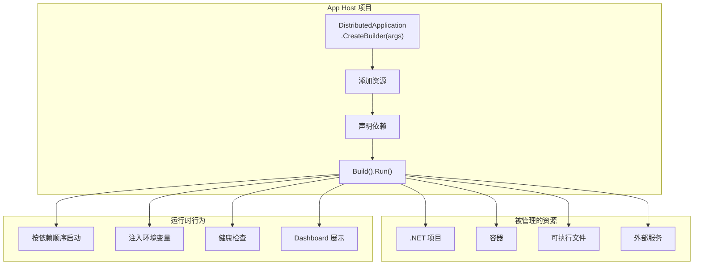
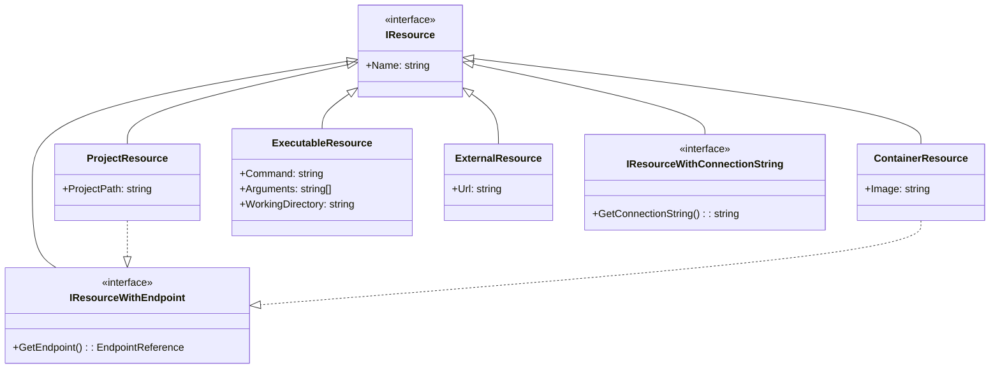
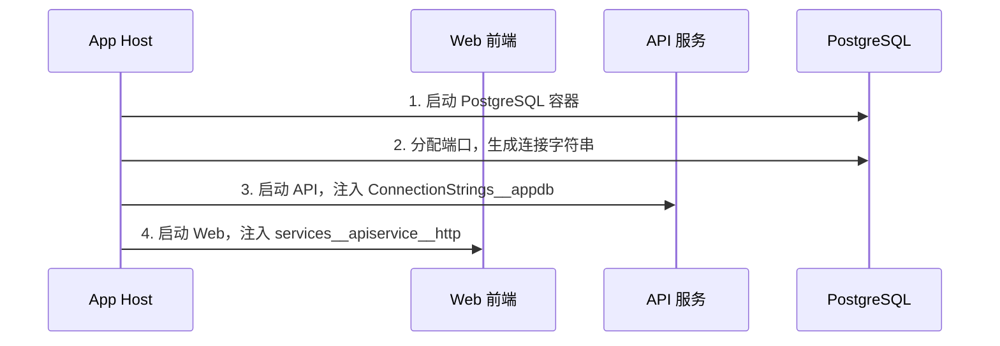
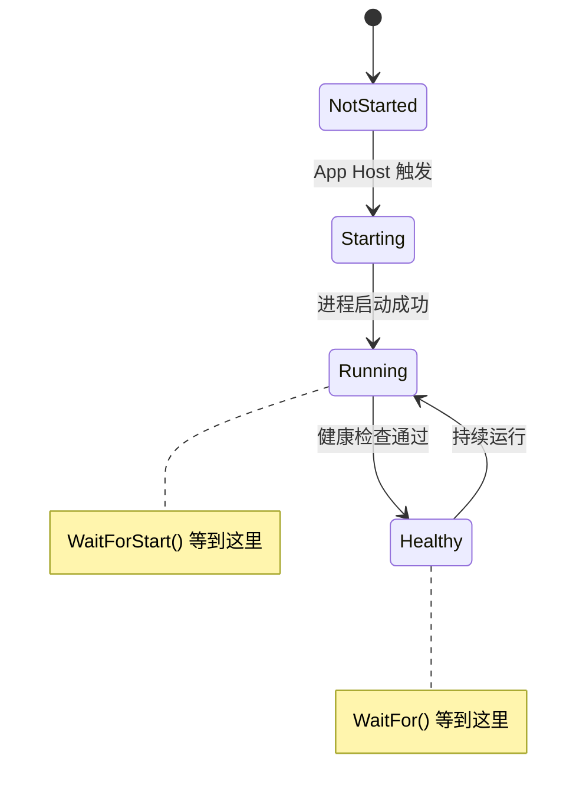
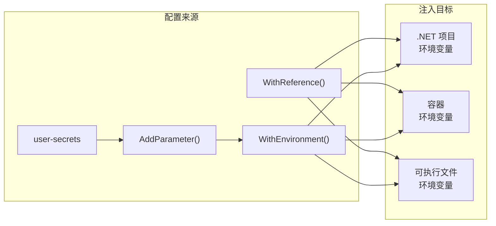
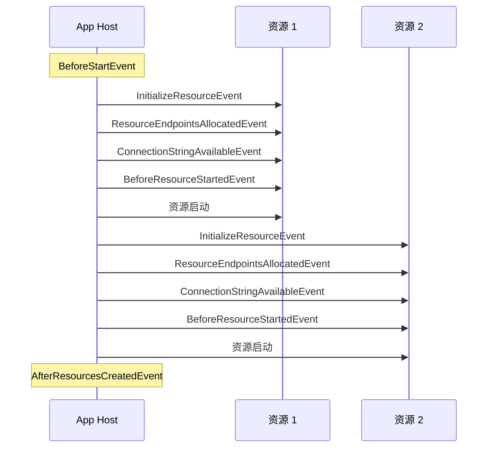

---
layout: TutorialLayout
title: App Host 编排模型
date: 2026-06-06
category: tech
tags: .NET, Aspire, App Host, 编排, 资源模型
summary: 深入理解 Aspire 的编排核心：资源类型体系、依赖声明、生命周期事件、环境变量注入、端点配置、参数管理
---

## 一、App Host 是什么

App Host 是 Aspire 解决方案的编排入口——你用 C# 代码在这里声明"我的应用由哪些资源组成、它们之间如何依赖"。它不是运行时容器，不是服务网格，而是一个**开发时的编排器**，负责：

- 启动和管理所有资源的生命周期
- 自动注入连接字符串和端点信息
- 协调服务间的依赖启动顺序
- 提供统一的 Dashboard 可视化



## 二、资源类型体系

### 2.1 四种内置资源类型



| 资源类型 | 添加方式 | 典型场景 |
| --- | --- | --- |
| **.NET 项目** | `AddProject<T>()` | 你的 API、Web 前端、Worker 服务 |
| **容器** | `AddContainer()` | Redis、PostgreSQL、RabbitMQ 等中间件 |
| **可执行文件** | `AddExecutable()` | Node.js 应用、Python 脚本、CLI 工具 |
| **外部服务** | `AddExternal()` | 第三方 API、SaaS 服务 |

### 2.2 添加 .NET 项目

最常用的资源类型，`AddProject<T>()` 的泛型参数指向项目类型：

```csharp
var builder = DistributedApplication.CreateBuilder(args);

// 添加 API 服务
var apiService = builder.AddProject<Projects.MyApp_ApiService>("apiservice");

// 添加 Web 前端，声明依赖
builder.AddProject<Projects.MyApp_Web>("webfrontend")
    .WithReference(apiService)
    .WaitFor(apiService);

builder.Build().Run();
```

### 2.3 添加容器

`AddContainer()` 指定资源名和镜像名，Aspire 自动拉取并运行：

```csharp
// Redis 缓存
var redis = builder.AddRedis("cache");

// PostgreSQL 数据库
var postgres = builder.AddPostgres("postgres");
var db = postgres.AddDatabase("appdb");

// 自定义容器镜像
var customApp = builder.AddContainer("myapp", "myregistry/myapp:latest")
    .WithHttpEndpoint(port: 8080);
```

> **注意**：`AddRedis`、`AddPostgres` 等是集成包提供的快捷方法，底层还是 `AddContainer()`。需要安装对应的 `Aspire.Hosting.Redis`、`Aspire.Hosting.PostgreSQL` 等 NuGet 包。

### 2.4 添加可执行文件

`AddExecutable()` 用于运行非 .NET 的本地进程：

```csharp
// Node.js 前端开发服务器
var frontend = builder.AddExecutable("frontend", "npm", "../web", "run", "dev");

// Python FastAPI 服务
var pythonApi = builder.AddExecutable("pyapi", "python", ".", "-m", "uvicorn", "main:app");

// 数据库迁移工具
var migrator = builder.AddExecutable("migrate", "dotnet", ".", "ef", "database", "update");
```

### 2.5 添加外部服务

`AddExternal()` 表示不受 Aspire 管理的外部依赖，仅用于声明和文档化：

```csharp
// 第三方支付 API
builder.AddExternal("payment-api", "https://api.payment.com");
```

## 三、依赖声明

### 3.1 WithReference —— 声明引用关系

`WithReference()` 是最核心的依赖声明 API，它会自动将目标资源的连接信息注入到当前资源的环境变量中：



```csharp
var postgres = builder.AddPostgres("postgres");
var db = postgres.AddDatabase("appdb");

var apiService = builder.AddProject<Projects.MyApp_ApiService>("apiservice")
    .WithReference(db);  // 自动注入连接字符串

var webFrontend = builder.AddProject<Projects.MyApp_Web>("webfrontend")
    .WithReference(apiService);  // 自动注入服务端点
```

注入规则：

| 被引用资源类型 | 注入的环境变量 | 示例值 |
| --- | --- | --- |
| 数据库 | `ConnectionStrings__{name}` | `Host=localhost;Port=5432;Database=appdb` |
| .NET 项目 | `services__{name}__{scheme}` | `http://localhost:5000` |
| Redis | `ConnectionStrings__{name}` | `localhost:6379` |

### 3.2 WaitFor —— 等待依赖就绪

`WaitFor()` 确保依赖资源通过健康检查后才启动当前资源：

```csharp
var redis = builder.AddRedis("cache");

builder.AddProject<Projects.MyApp_ApiService>("apiservice")
    .WithReference(redis)
    .WaitFor(redis);  // 等 Redis 健康检查通过后再启动
```

`WaitFor` 系列有三个变体：

| API | 等待条件 | 适用场景 |
| --- | --- | --- |
| `WaitFor()` | 资源 Running + 健康检查通过 | 生产级依赖（数据库、缓存） |
| `WaitForStart()` | 资源进入 Running 状态即可 | 开发时快速启动、不关心健康检查 |
| `WaitForCompletion()` | 资源执行完毕（退出码 0） | 一次性任务（数据库迁移、种子数据） |



### 3.3 WithExplicitStart —— 手动启动

默认所有资源自动启动。`WithExplicitStart()` 让资源等待手动触发：

```csharp
// 数据库迁移只在需要时手动运行
builder.AddProject<Projects.MyApp_Migration>("dbmigration")
    .WithReference(db)
    .WithExplicitStart();  // 不自动启动，从 Dashboard 手动触发
```

### 3.4 完整依赖编排示例

```csharp
var builder = DistributedApplication.CreateBuilder(args);

// 基础设施
var redis = builder.AddRedis("cache");
var postgres = builder.AddPostgres("postgres");
var db = postgres.AddDatabase("appdb");

// 数据库迁移（一次性任务，手动触发）
builder.AddProject<Projects.MyApp_Migration>("migration")
    .WithReference(db)
    .WithExplicitStart();

// API 服务（等待数据库就绪）
var apiService = builder.AddProject<Projects.MyApp_ApiService>("apiservice")
    .WithReference(db)
    .WithReference(redis)
    .WaitFor(db)
    .WaitFor(redis);

// Web 前端（等待 API 就绪）
builder.AddProject<Projects.MyApp_Web>("webfrontend")
    .WithExternalHttpEndpoints()
    .WithReference(apiService)
    .WaitFor(apiService);

builder.Build().Run();
```

对应的启动顺序：

```mermaid
gantt
    title 资源启动时序
    dateFormat X
    axisFormat %s

    section 基础设施
    Redis 容器启动        :a1, 0, 3
    Redis 健康检查通过     :milestone, a2, 3, 0
    PostgreSQL 容器启动    :b1, 0, 4
    PostgreSQL 健康检查通过 :milestone, b2, 4, 0

    section 业务服务
    API 服务启动          :c1, 4, 7
    API 健康检查通过       :milestone, c2, 7, 0
    Web 前端启动          :d1, 7, 9

    section 手动任务
    数据库迁移（手动触发）  :e1, 10, 12
```



## 四、环境变量注入

环境变量是 Aspire 传递配置信息的主要机制。`WithReference()` 会自动注入，你也可以手动控制。

### 4.1 WithEnvironment —— 手动注入

```csharp
// 静态值
builder.AddProject<Projects.MyApp_ApiService>("apiservice")
    .WithEnvironment("ASPNETCORE_ENVIRONMENT", "Development");

// 从配置读取
builder.AddProject<Projects.MyApp_ApiService>("apiservice")
    .WithEnvironment("LOG_LEVEL", builder.Configuration["Logging:Level"]);

// 回调方式（动态值）
var apiService = builder.AddProject<Projects.MyApp_ApiService>("apiservice");
apiService.WithEnvironment("API_URL", apiService.GetEndpoint("http"));
```

### 4.2 AddParameter —— 参数化配置

`AddParameter()` 创建可配置的参数，避免硬编码敏感信息：

```csharp
// 声明参数（值从 user-secrets 或配置中读取）
var dbPassword = builder.AddParameter("db-password");

// 使用参数
var postgres = builder.AddPostgres("postgres", password: dbPassword);
```

参数值的查找顺序：

1. `dotnet user-secrets`（开发环境）
2. 环境变量 `Parameters__{name}`
3. `appsettings.json` 中的 `Parameters` 节
4. 运行时在 Dashboard 中提示输入（`secret: true` 时）

```csharp
// 标记为敏感参数（Dashboard 中会提示输入）
var apiKey = builder.AddParameter("api-key", secret: true);

builder.AddProject<Projects.MyApp_ApiService>("apiservice")
    .WithEnvironment("API_KEY", apiKey);
```

### 4.3 注入机制总结



## 五、端点配置

### 5.1 WithHttpEndpoint / WithHttpsEndpoint

为容器和可执行文件暴露 HTTP 端点：

```csharp
// 暴露 HTTP 端点
var api = builder.AddContainer("myapi", "myapi:latest")
    .WithHttpEndpoint(port: 8080, name: "http");

// 暴露 HTTPS 端点
var secureApi = builder.AddContainer("secureapi", "secureapi:latest")
    .WithHttpsEndpoint(port: 8443, name: "https");

// 代理到宿主机端口
var frontend = builder.AddContainer("web", "nginx:latest")
    .WithHttpEndpoint(targetPort: 80, port: 8080, name: "http");
```

参数说明：

| 参数 | 含义 |
| --- | --- |
| `port` | 宿主机端口（外部访问端口） |
| `targetPort` | 容器内部端口 |
| `name` | 端点名称，用于 `GetEndpoint()` 引用 |

### 5.2 GetEndpoint —— 获取端点引用

```csharp
var api = builder.AddContainer("myapi", "myapi:latest")
    .WithHttpEndpoint(port: 8080, name: "http");

// 将 API 端点注入到前端
builder.AddProject<Projects.MyApp_Web>("webfrontend")
    .WithEnvironment("API_URL", api.GetEndpoint("http"));
```

### 5.3 WithExternalHttpEndpoints

将 .NET 项目的 HTTP 端点标记为外部可访问（在 Dashboard 中显示可点击链接）：

```csharp
builder.AddProject<Projects.MyApp_Web>("webfrontend")
    .WithExternalHttpEndpoints();
```

## 六、生命周期事件

Aspire 提供了细粒度的事件系统，让你在资源生命周期的各个阶段执行自定义逻辑。

### 6.1 App Host 级别事件



### 6.2 订阅事件

```csharp
var builder = DistributedApplication.CreateBuilder(args);

var redis = builder.AddRedis("cache");

// 订阅端点分配事件
builder.Eventing.Subscribe<ResourceEndpointsAllocatedEvent>(
    static (@event, ct) =>
    {
        var logger = @event.Services.GetRequiredService<ILogger<Program>>();
        logger.LogInformation("资源 {Name} 的端点已分配", @event.Resource.Name);
        return Task.CompletedTask;
    });

// 订阅启动前事件
builder.Eventing.Subscribe<BeforeStartEvent>(
    static (@event, ct) =>
    {
        var logger = @event.Services.GetRequiredService<ILogger<Program>>();
        logger.LogInformation("App Host 即将启动");
        return Task.CompletedTask;
    });

builder.Build().Run();
```

### 6.3 资源级别事件

也可以针对特定资源订阅事件：

```csharp
var apiService = builder.AddProject<Projects.MyApp_ApiService>("apiservice");

apiService.OnResourceEndpointsAllocated((resource, ct) =>
{
    // API 端点分配完成后执行
    Console.WriteLine($"API 端点: {resource.GetEndpoint("http")}");
    return Task.CompletedTask;
});
```

### 6.4 事件顺序总结

| 事件 | 触发时机 | 典型用途 |
| --- | --- | --- |
| `BeforeStartEvent` | App Host 启动前 | 全局初始化、配置验证 |
| `InitializeResourceEvent` | 资源初始化 | 资源级别的自定义初始化 |
| `ResourceEndpointsAllocatedEvent` | 端点分配后 | 记录端点、配置代理 |
| `ConnectionStringAvailableEvent` | 连接字符串可用后 | 验证连接、初始化数据库 |
| `BeforeResourceStartedEvent` | 资源启动前 | 最后的配置调整 |
| `AfterResourcesCreatedEvent` | 所有资源创建后 | 通知外部系统、健康检查 |

## 七、资源命名规范

Aspire 资源名称有以下约束：

- 长度 1-64 个字符
- 以 ASCII 字母开头
- 只能包含 ASCII 字母、数字和连字符
- 不能以连字符结尾
- 不能包含连续连字符

```csharp
// 合法命名
builder.AddProject<Projects.Api>("api-service");
builder.AddProject<Projects.Api>("apiService2");

// 非法命名
// builder.AddProject<Projects.Api>("2api");      // 数字开头
// builder.AddProject<Projects.Api>("api--svc");   // 连续连字符
// builder.AddProject<Projects.Api>("api-");        // 连字符结尾
```

> **Azure 部署注意**：Azure Container Apps 的名称限制为 32 字符。如果计划部署到 Azure，资源名称不要超过 32 字符。

## 八、App Host 项目结构

### 8.1 csproj 配置

App Host 项目的 `.csproj` 文件有两个关键配置：

```xml
<Project Sdk="Microsoft.NET.Sdk">
  <!-- Aspire SDK 声明 -->
  <Sdk title="Aspire.AppHost.Sdk" Version="9.2.0" />

  <PropertyGroup>
    <OutputType>Exe</OutputType>
    <TargetFramework>net9.0</TargetFramework>
    <!-- 启用 Aspire 编排 -->
    <IsAspireHost>true</IsAspireHost>
  </PropertyGroup>

  <ItemGroup>
    <!-- 集成包引用 -->
    <PackageReference Include="Aspire.Hosting.Redis" Version="9.2.0" />
    <PackageReference Include="Aspire.Hosting.PostgreSQL" Version="9.2.0" />
    <!-- 项目引用 -->
    <ProjectReference Include="..\MyApp.ApiService\MyApp.ApiService.csproj" />
    <ProjectReference Include="..\MyApp.Web\MyApp.Web.csproj" />
  </ItemGroup>
</Project>
```

### 8.2 launchSettings.json

App Host 的启动配置：

```json
{
  "profiles": {
    "https": {
      "commandName": "Project",
      "dotnetRunMessages": true,
      "launchBrowser": true,
      "applicationUrl": "https://localhost:17179;http://localhost:15179",
      "aspire": {
        "dashboardUrl": "https://localhost:17179"
      }
    }
  }
}
```

## 九、常见模式

### 9.1 仿真器模式（Emulator Pattern）

本地开发使用容器仿真，生产使用真实云服务：

```csharp
var builder = DistributedApplication.CreateBuilder(args);

// 开发环境：本地 Redis 容器
// 生产环境：Azure Cache for Redis
var redis = builder.ExecutionContext.IsPublishMode
    ? builder.AddAzureRedis("cache")
    : builder.AddRedis("cache");
```

### 9.2 现有资源模式（Existing Resource Pattern）

连接已有的外部服务，而非让 Aspire 创建新实例：

```csharp
// 连接已有的 PostgreSQL 实例
var postgres = builder.AddPostgres("postgres")
    .WithHostPort(5432)  // 指定宿主机端口
    .WithPassword("existing-password");  // 使用已有密码
```

### 9.3 初始化任务模式

数据库迁移等一次性任务，使用 `WaitForCompletion` + `WithExplicitStart`：

```csharp
var db = postgres.AddDatabase("appdb");

// 迁移任务
var migration = builder.AddProject<Projects.MyApp_Migration>("migration")
    .WithReference(db)
    .WithExplicitStart();

// API 依赖迁移完成
builder.AddProject<Projects.MyApp_ApiService>("apiservice")
    .WithReference(db)
    .WaitForCompletion(migration);  // 等迁移完成再启动
```

---

> **下一篇**：[服务通信与发现](/docs/aspire/03服务通信与发现.html) —— 深入理解 Aspire 的服务发现机制、HTTP/gRPC 通信、命名端点和健康检查自动注册。
