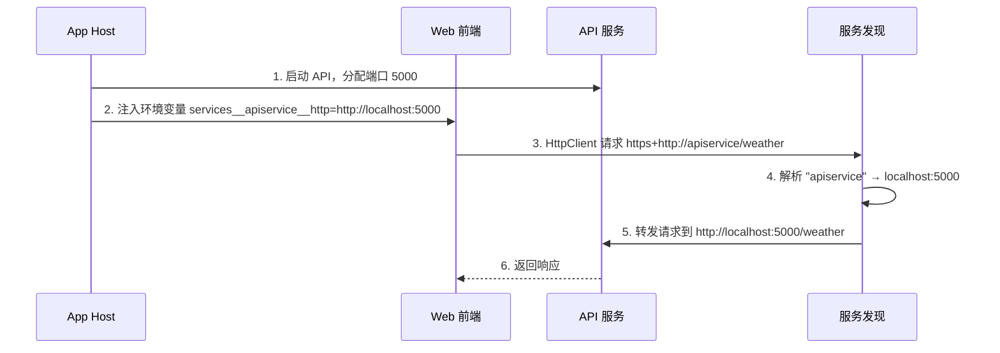
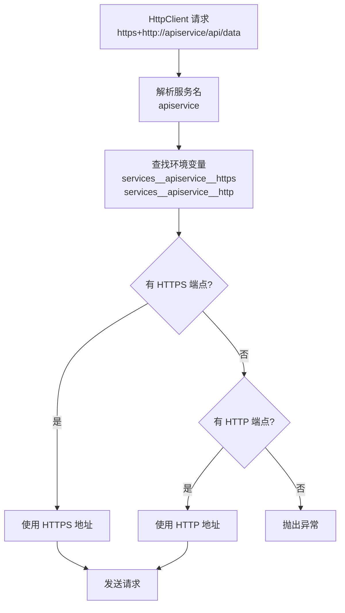
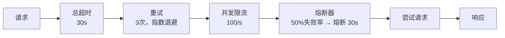
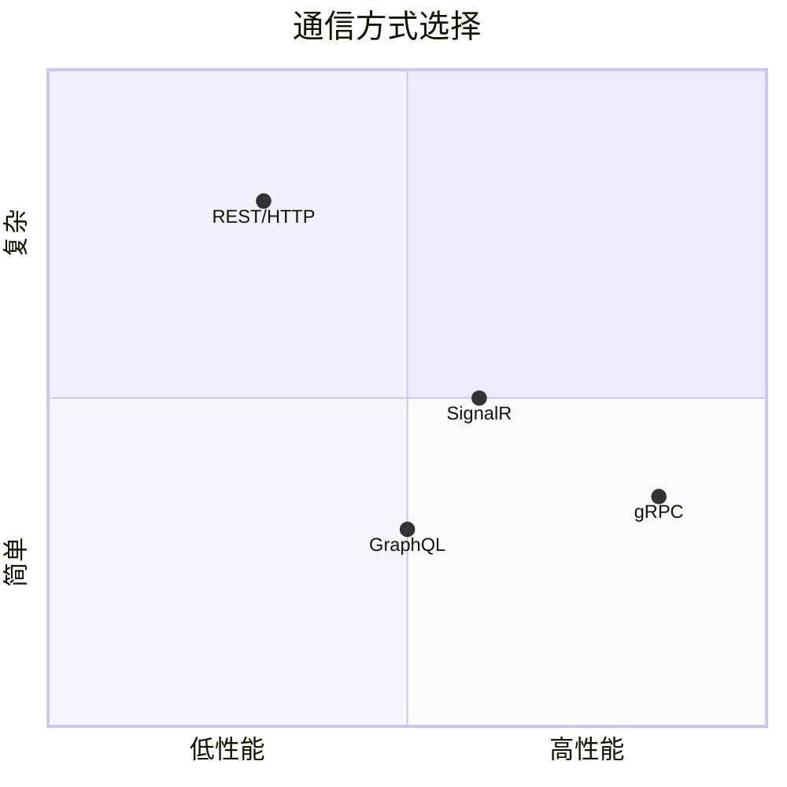
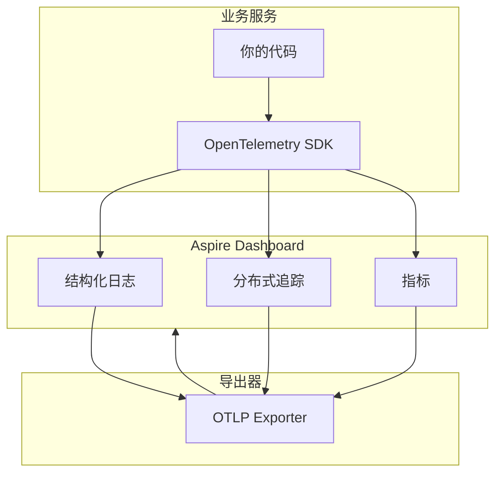
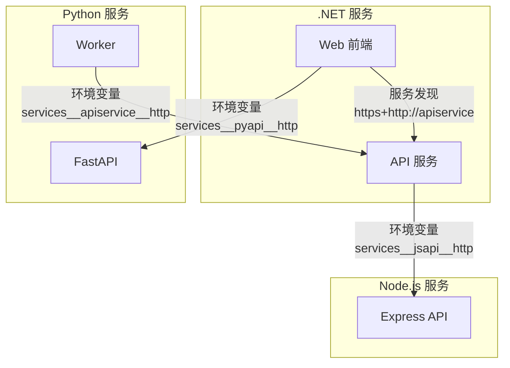

## 一、服务发现的核心问题

在分布式系统中，服务之间需要互相通信。传统方式是在配置文件中硬编码 URL：

```json
// appsettings.json —— 传统方式
{
  "ApiService": {
    "BaseUrl": "http://localhost:5000"
  }
}
```

这种方式的问题：

- 端口动态分配时，URL 会变
- 多实例部署时，需要负载均衡
- 环境切换（开发/测试/生产）时，配置要改

Aspire 的服务发现让这些问题全部消失——**服务名即地址**。

## 二、服务发现机制

### 2.1 工作原理



### 2.2 App Host 端的声明

在 App Host 中，只需用 `WithReference()` 声明依赖关系：

```csharp
var apiService = builder.AddProject<Projects.MyApp_ApiService>("apiservice");

builder.AddProject<Projects.MyApp_Web>("webfrontend")
    .WithReference(apiService);  // 自动注入服务端点信息
```

`WithReference()` 会在 Web 前端中注入以下环境变量：

```
services__apiservice__http=http://localhost:5000
services__apiservice__https=https://localhost:5001
```

### 2.3 业务服务端的使用

在消费端，通过 `AddServiceDiscovery()` 和 `AddServiceDiscovery()` 配置 HttpClient：

```csharp
// Web 前端的 Program.cs
var builder = WebApplication.CreateBuilder(args);

builder.AddServiceDefaults();  // 包含服务发现配置

// 注册带服务发现的 HttpClient
builder.Services.AddHttpClient<WeatherApiClient>(client =>
{
    client.BaseAddress = new Uri("https+http://apiservice");
    //                协议格式 ↑↑↑↑↑↑↑↑↑↑↑↑↑↑↑
    //                https+http 表示优先 HTTPS，回退 HTTP
});

var app = builder.Build();
```

**协议格式说明**：

| URI 格式 | 含义 |
| --- | --- |
| `https+http://apiservice` | 优先 HTTPS，不可用则回退 HTTP |
| `http://apiservice` | 仅 HTTP |
| `https://apiservice` | 仅 HTTPS |

### 2.4 服务发现解析流程



## 三、HTTP 通信

### 3.1 基本 HttpClient 用法

```csharp
// 方式一：命名 HttpClient
builder.Services.AddHttpClient("apiservice", client =>
{
    client.BaseAddress = new Uri("https+http://apiservice");
});

// 方式二：类型化 HttpClient
builder.Services.AddHttpClient<IApiClient, ApiClient>(client =>
{
    client.BaseAddress = new Uri("https+http://apiservice");
});

// 方式三：通过 IHttpClientFactory 获取
public class MyService
{
    private readonly HttpClient _client;

    public MyService(IHttpClientFactory factory)
    {
        _client = factory.CreateClient("apiservice");
    }
}
```

### 3.2 内置弹性策略

Service Defaults 自动为所有 HttpClient 注册标准弹性策略：

```csharp
// Service Defaults 中的配置
builder.Services.ConfigureHttpClientDefaults(http =>
{
    // 标准弹性处理器：重试 + 熔断 + 超时
    http.AddStandardResilienceHandler();
    // 自动服务发现
    http.AddServiceDiscovery();
});
```

`AddStandardResilienceHandler()` 包含的弹性策略：



| 策略 | 默认配置 | 作用 |
| --- | --- | --- |
| 总超时 | 30 秒 | 单个请求的最大耗时 |
| 重试 | 3 次，指数退避 | 瞬时故障自动重试 |
| 并发限流 | 100/秒 | 限制并发请求数 |
| 熔断器 | 50% 失败率熔断 30 秒 | 防止级联故障 |

### 3.3 自定义弹性策略

如果默认策略不满足需求，可以覆盖：

```csharp
builder.Services.AddHttpClient<IApiClient, ApiClient>(client =>
{
    client.BaseAddress = new Uri("https+http://apiservice");
})
.AddStandardResilienceHandler(options =>
{
    // 自定义重试策略
    options.Retry.MaxRetryAttempts = 5;
    options.Retry.Delay = TimeSpan.FromMilliseconds(500);

    // 自定义熔断策略
    options.CircuitBreaker.FailureRatio = 0.3;
    options.CircuitBreaker.SamplingDuration = TimeSpan.FromSeconds(10);
});
```

## 四、gRPC 通信

### 4.1 App Host 配置

gRPC 服务的注册与 HTTP 服务完全一致：

```csharp
var grpcService = builder.AddProject<Projects.MyApp_GrpcService>("grpcservice");

builder.AddProject<Projects.MyApp_Web>("webfrontend")
    .WithReference(grpcService);
```

### 4.2 客户端使用

```csharp
// 注册 gRPC 客户端
builder.Services.AddGrpcClient<WeatherService.WeatherServiceClient>(options =>
{
    options.Address = new Uri("https+http://grpcservice");
});

// 在服务中注入使用
public class WeatherConsumer
{
    private readonly WeatherService.WeatherServiceClient _client;

    public WeatherConsumer(WeatherService.WeatherServiceClient client)
    {
        _client = client;
    }

    public async Task<WeatherReply> GetWeatherAsync(string city)
    {
        return await _client.GetWeatherAsync(new WeatherRequest { City = city });
    }
}
```

### 4.3 HTTP 与 gRPC 对比



| 维度 | HTTP/REST | gRPC |
| --- | --- | --- |
| 协议 | HTTP/1.1 或 HTTP/2 | HTTP/2 |
| 序列化 | JSON（文本） | Protobuf（二进制） |
| 性能 | 中等 | 高 |
| 代码生成 | 无（手写或 Swagger） | 自动生成客户端 |
| 流式传输 | 有限支持 | 双向流 |
| 浏览器支持 | 原生 | 需要 gRPC-Web |
| 适用场景 | 公开 API、简单 CRUD | 内部微服务、高性能场景 |

## 五、命名端点

一个服务可以暴露多个端点，通过名称区分。

### 5.1 定义命名端点

```csharp
// API 服务暴露两个端点
var apiService = builder.AddProject<Projects.MyApp_ApiService>("apiservice")
    .WithHttpEndpoint(name: "internal", port: 5000)   // 内部通信
    .WithHttpEndpoint(name: "admin", port: 5001);      // 管理接口
```

### 5.2 引用特定端点

```csharp
// Web 前端使用 internal 端点
builder.AddProject<Projects.MyApp_Web>("webfrontend")
    .WithReference(apiService.GetEndpoint("internal"));

// 管理服务使用 admin 端点
builder.AddProject<Projects.MyApp_Admin>("admin")
    .WithReference(apiService.GetEndpoint("admin"));
```

### 5.3 容器的命名端点

```csharp
var rabbitmq = builder.AddRabbitMQ("rabbitmq")
    .WithHttpEndpoint(name: "management", port: 15672);  // 管理界面

// 注入管理界面 URL
builder.AddProject<Projects.MyApp_Admin>("admin")
    .WithEnvironment("RABBITMQ_MGMT_URL", rabbitmq.GetEndpoint("management"));
```

## 六、Service Defaults 深入

### 6.1 AddServiceDefaults 做了什么

```csharp
public static IHostApplicationBuilder AddServiceDefaults(
    this IHostApplicationBuilder builder)
{
    // 1. OpenTelemetry 配置
    builder.ConfigureOpenTelemetry();

    // 2. 默认健康检查
    builder.AddDefaultHealthChecks();

    // 3. 服务发现
    builder.Services.AddServiceDiscovery();

    // 4. HttpClient 默认配置
    builder.Services.ConfigureHttpClientDefaults(http =>
    {
        http.AddStandardResilienceHandler();
        http.AddServiceDiscovery();
    });

    return builder;
}
```

### 6.2 ConfigureOpenTelemetry 详解



自动配置的内容：

| 组件 | 配置项 | 默认值 |
| --- | --- | --- |
| 日志 | OTLP 导出 | 启用 |
| 追踪 | OTLP 导出 + ASP.NET Core + HttpClient 追踪 | 启用 |
| 指标 | OTLP 导出 + ASP.NET Core + HttpClient + .NET Runtime 指标 | 启用 |

### 6.3 AddDefaultHealthChecks 详解

```csharp
builder.AddDefaultHealthChecks();
```

等价于：

```csharp
builder.Services.AddHealthChecks()
    .AddCheck("self", () => HealthCheckResult.Healthy(), tags: ["live"]);
```

自动注册的健康检查端点：

| 端点 | 路径 | 用途 |
| --- | --- | --- |
| 存活检查 | `/health` | 服务是否在运行 |
| 就绪检查 | `/health/ready` | 服务是否准备好接收流量 |

自定义健康检查：

```csharp
builder.AddDefaultHealthChecks()
    .AddNpgSql(builder.Configuration.GetConnectionString("appdb")!)
    .AddRedis(builder.Configuration.GetConnectionString("cache")!)
    .AddUrlGroup(new Uri("https+http://apiservice/health"), "api");
```

### 6.4 自定义 Service Defaults

你可以扩展 `Extensions.cs` 来添加项目通用的配置：

```csharp
public static IHostApplicationBuilder AddServiceDefaults(
    this IHostApplicationBuilder builder)
{
    // 原有默认配置
    builder.ConfigureOpenTelemetry();
    builder.AddDefaultHealthChecks();
    builder.Services.AddServiceDiscovery();
    builder.Services.ConfigureHttpClientDefaults(http =>
    {
        http.AddStandardResilienceHandler();
        http.AddServiceDiscovery();
    });

    // 自定义：统一 CORS 策略
    builder.Services.AddCors(options =>
    {
        options.AddDefaultPolicy(policy =>
            policy.AllowAnyOrigin().AllowAnyMethod().AllowAnyHeader());
    });

    // 自定义：统一 JSON 序列化
    builder.Services.ConfigureHttpJsonOptions(options =>
    {
        options.SerializerOptions.PropertyNamingPolicy = JsonNamingPolicy.CamelCase;
    });

    return builder;
}
```

## 七、跨语言服务通信

Aspire 13 支持多语言编排后，.NET 服务和非 .NET 服务之间的通信通过环境变量桥接。

### 7.1 .NET → Python

```csharp
// App Host
var pythonApi = builder.AddPythonApp("pyapi", "../python-api", "main.py")
    .WithHttpEndpoint(port: 8000);

builder.AddProject<Projects.MyApp_Web>("webfrontend")
    .WithReference(pythonApi);  // 注入 services__pyapi__http
```

```csharp
// .NET 消费端
builder.Services.AddHttpClient<IPythonApi, PythonApiClient>(client =>
{
    client.BaseAddress = new Uri("https+http://pyapi");
});
```

### 7.2 Python → .NET

Python 端通过环境变量获取 .NET 服务的地址：

```csharp
// App Host
var apiService = builder.AddProject<Projects.MyApp_ApiService>("apiservice");

var pythonWorker = builder.AddPythonApp("pyworker", "../python-worker", "worker.py")
    .WithReference(apiService);  // 注入 services__apiservice__http
```

```python
# Python 消费端
import os

api_url = os.environ.get("services__apiservice__http", "http://localhost:5000")
response = requests.get(f"{api_url}/api/data")
```

### 7.3 通信方式总结



## 八、常见问题

### 8.1 服务发现不生效

**症状**：HttpClient 请求失败，提示无法解析服务名。

**排查步骤**：

1. 确认 App Host 中使用了 `WithReference()`
2. 确认消费端调用了 `AddServiceDefaults()`
3. 检查环境变量是否正确注入（Dashboard → 资源详情 → 环境变量）
4. 确认 URI 格式使用 `https+http://` 前缀

### 8.2 端口冲突

**症状**：服务启动失败，提示端口已被占用。

**解决方案**：Aspire 默认自动分配端口。如果你手动指定了端口，确保不与其他服务冲突：

```csharp
// 让 Aspire 自动分配端口（推荐）
var api = builder.AddProject<Projects.MyApp_ApiService>("apiservice");

// 手动指定端口（仅在必要时）
var api = builder.AddProject<Projects.MyApp_ApiService>("apiservice")
    .WithHttpEndpoint(port: 5000);
```

### 8.3 健康检查超时

**症状**：`WaitFor()` 等待时间过长。

**解决方案**：自定义健康检查路径和超时：

```csharp
var api = builder.AddProject<Projects.MyApp_ApiService>("apiservice")
    .WithHttpHealthCheck("/health");  // 自定义健康检查路径
```

---

> **下一篇**：[集成外部依赖](/docs/aspire/04集成外部依赖.html) —— 深入理解 Aspire 的 Integration 体系：Hosting 集成 vs Client 集成、Redis/PostgreSQL/RabbitMQ 等常用集成、连接字符串自动注入。
