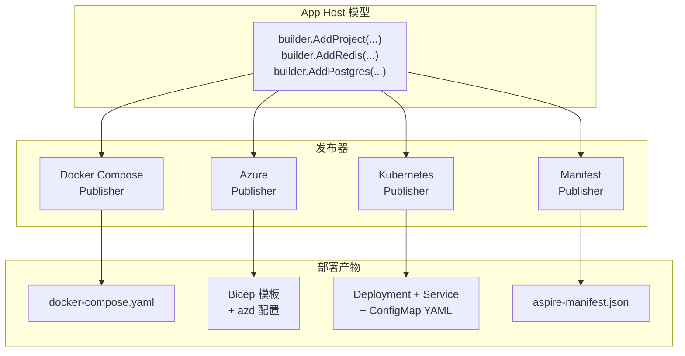
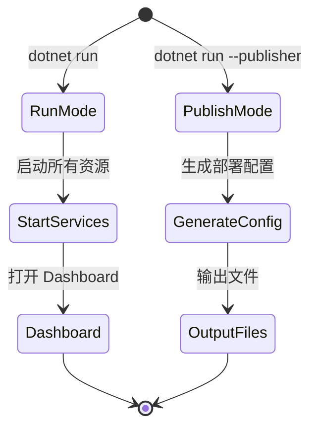
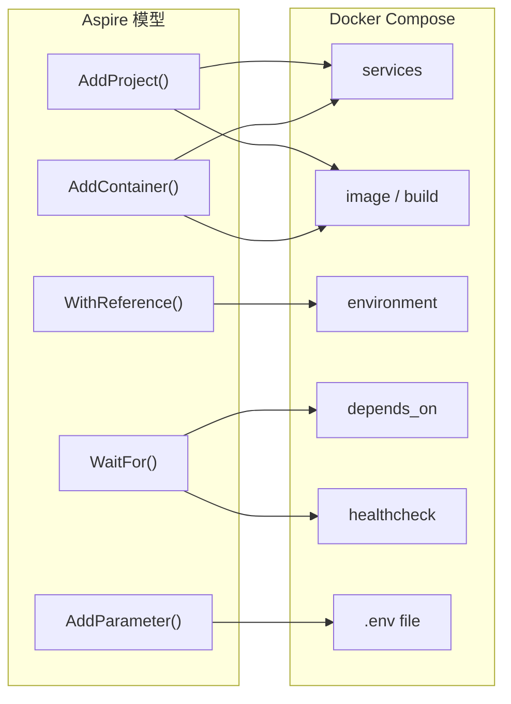
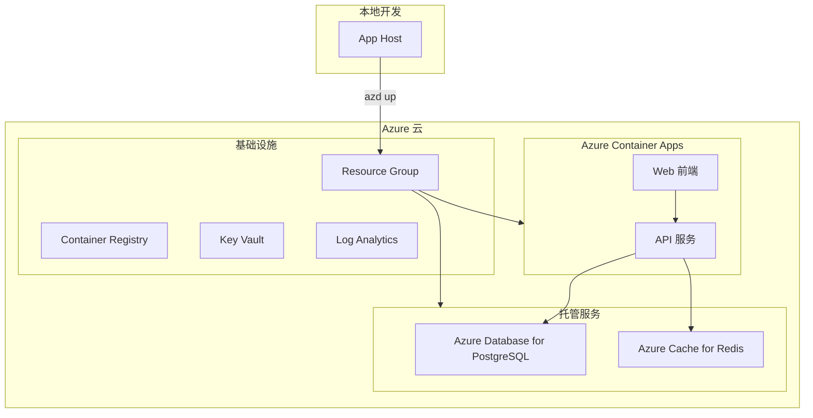
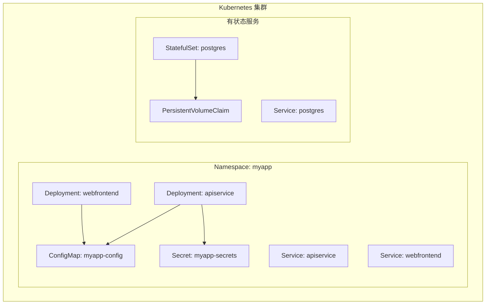
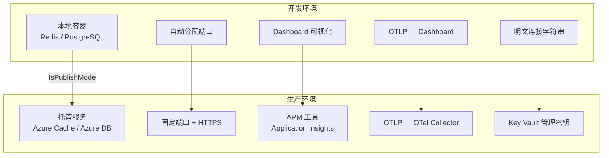

## 一、发布模型概述

Aspire 的核心理念是**一次定义，多处部署**。你在 App Host 中用 C# 定义的应用拓扑，可以通过不同的 Publisher 生成不同平台的部署配置。

### 1.1 模型降低过程



### 1.2 两种运行模式

| 模式 | 命令 | 行为 | 用途 |
| --- | --- | --- | --- |
| **运行模式** | `dotnet run` | 启动所有服务，打开 Dashboard | 本地开发 |
| **发布模式** | `dotnet run --publisher xxx` | 生成部署配置，不启动服务 | 生产部署 |



## 二、Manifest 发布

### 2.1 生成 Manifest

Manifest 是 Aspire 的中间表示（IR），其他发布器基于它工作：

```bash
dotnet run --project MyApp.AppHost --publisher manifest --output-path manifest.json
```

### 2.2 Manifest 结构

```json
{
  "resources": {
    "apiservice": {
      "type": "project.v0",
      "path": "../MyApp.ApiService/MyApp.ApiService.csproj",
      "env": {
        "OTEL_DOTNET_EXPERIMENTAL_OTLP_EMIT_EXCEPTION_LOG_ATTRIBUTES": "true",
        "OTEL_DOTNET_EXPERIMENTAL_OTLP_EMIT_EVENT_LOG_ATTRIBUTES": "true"
      },
      "bindings": {
        "http": { "scheme": "http", "protocol": "tcp", "transport": "http" },
        "https": { "scheme": "https", "protocol": "tcp", "transport": "http" }
      }
    },
    "cache": {
      "type": "container.v0",
      "image": "redis:latest",
      "bindings": {
        "tcp": { "scheme": "tcp", "protocol": "tcp", "transport": "tcp", "containerPort": 6379 }
      }
    },
    "postgres": {
      "type": "container.v0",
      "image": "postgres:latest",
      "env": {
        "POSTGRES_HOST_AUTH_METHOD": "scram-sha-256",
        "POSTGRES_INITDB_ARGS": "--auth-host=scram-sha-256"
      },
      "bindings": {
        "tcp": { "scheme": "tcp", "protocol": "tcp", "transport": "tcp", "containerPort": 5432 }
      }
    }
  }
}
```

## 三、Docker Compose 发布

### 3.1 生成 docker-compose.yaml

```bash
dotnet run --project MyApp.AppHost --publisher docker-compose --output-path ./docker-compose-output
```

生成的文件：

```
docker-compose-output/
├── docker-compose.yaml      # 主配置
└── .env                     # 环境变量
```

### 3.2 生成的 docker-compose.yaml 示例

```yaml
services:
  apiservice:
    image: myapp-apiservice:latest
    build:
      context: ..
      dockerfile: MyApp.ApiService/Dockerfile
    environment:
      - OTEL_DOTNET_EXPERIMENTAL_OTLP_EMIT_EXCEPTION_LOG_ATTRIBUTES=true
      - ConnectionStrings__appdb=Host=postgres;Port=5432;Database=appdb
      - ConnectionStrings__cache=cache:6379
    depends_on:
      postgres:
        condition: service_healthy
      cache:
        condition: service_healthy
    ports:
      - "5000:8080"

  webfrontend:
    image: myapp-webfrontend:latest
    build:
      context: ..
      dockerfile: MyApp.Web/Dockerfile
    environment:
      - services__apiservice__http=http://apiservice:8080
    depends_on:
      apiservice:
        condition: service_healthy
    ports:
      - "5001:8080"

  postgres:
    image: postgres:16-alpine
    environment:
      - POSTGRES_HOST_AUTH_METHOD=scram-sha-256
    volumes:
      - postgres-data:/var/lib/postgresql/data
    healthcheck:
      test: ["CMD-SHELL", "pg_isready -U postgres"]
      interval: 5s
      timeout: 5s
      retries: 5

  cache:
    image: redis:7-alpine
    healthcheck:
      test: ["CMD", "redis-cli", "ping"]
      interval: 5s
      timeout: 5s
      retries: 5

volumes:
  postgres-data:
```

### 3.3 Docker Compose 发布的映射规则



| Aspire 概念 | Docker Compose 映射 |
| --- | --- |
| `AddProject()` | `services.{name}` + `build.dockerfile` |
| `AddContainer()` | `services.{name}` + `image` |
| `WithReference()` | `environment` 中的连接字符串 |
| `WaitFor()` | `depends_on` + `healthcheck` |
| `AddParameter()` | `.env` 文件中的变量 |
| `WithExternalHttpEndpoints()` | `ports` 映射 |

## 四、Azure 部署

### 4.1 使用 Azure Developer CLI (azd)

Aspire 与 `azd` 深度集成，一条命令完成 Azure 部署：

```bash
# 安装 azd
winget install Microsoft.Azd

# 初始化（在 App Host 目录下）
azd init

# 部署到 Azure
azd up
```

### 4.2 Azure 部署架构



### 4.3 仿真器模式切换

App Host 中可以根据运行模式切换本地容器和 Azure 托管服务：

```csharp
var builder = DistributedApplication.CreateBuilder(args);

// 发布模式使用 Azure 托管服务
if (builder.ExecutionContext.IsPublishMode)
{
    var postgres = builder.AddAzurePostgresFlexibleServer("postgres");
    var db = postgres.AddDatabase("appdb");
    var redis = builder.AddAzureRedis("cache");
}
else
{
    // 本地开发使用容器
    var postgres = builder.AddPostgres("postgres");
    var db = postgres.AddDatabase("appdb");
    var redis = builder.AddRedis("cache");
}
```

### 4.4 Azure 集成包

| Azure 服务 | Hosting 包 | 说明 |
| --- | --- | --- |
| Container Apps | `Aspire.Hosting.Azure.AppConfiguration` | 应用配置 |
| PostgreSQL | `Aspire.Hosting.Azure.PostgreSQL` | 托管 PostgreSQL |
| Redis | `Aspire.Hosting.Azure.Redis` | 托管 Redis |
| Service Bus | `Aspire.Hosting.Azure.ServiceBus` | 消息队列 |
| Blob Storage | `Aspire.Hosting.Azure.Storage` | 对象存储 |
| Key Vault | `Aspire.Hosting.Azure.KeyVault` | 密钥管理 |
| Application Insights | `Aspire.Hosting.Azure.ApplicationInsights` | APM |

## 五、Kubernetes 部署

### 5.1 使用 aspire8 部署到 K8s

Aspire 社区提供了 Kubernetes 发布器，可以将 App Host 模型转换为 K8s Manifest：

```bash
dotnet run --project MyApp.AppHost --publisher kubernetes --output-path ./k8s-output
```

### 5.2 生成的 K8s 资源



| Aspire 资源 | K8s 资源 |
| --- | --- |
| `AddProject()` | Deployment + Service |
| `AddContainer()` (有状态) | StatefulSet + Service + PVC |
| `AddContainer()` (无状态) | Deployment + Service |
| `WithReference()` | ConfigMap / Secret 中的环境变量 |
| `AddParameter(secret: true)` | Secret |

## 六、生产环境配置

### 6.1 配置管理

生产环境的配置与开发环境不同，Aspire 通过 `ExecutionContext` 和参数化来管理差异：

```csharp
var builder = DistributedApplication.CreateBuilder(args);

// 通用配置
var dbPassword = builder.AddParameter("db-password", secret: true);

if (builder.ExecutionContext.IsPublishMode)
{
    // 生产环境：Azure 托管 PostgreSQL
    var postgres = builder.AddAzurePostgresFlexibleServer("postgres", password: dbPassword);
    var db = postgres.AddDatabase("appdb");
}
else
{
    // 开发环境：本地容器
    var postgres = builder.AddPostgres("postgres", password: dbPassword);
    var db = postgres.AddDatabase("appdb");
}
```

### 6.2 HTTPS 配置

生产环境必须使用 HTTPS：

```csharp
builder.AddProject<Projects.MyApp_Web>("webfrontend")
    .WithExternalHttpEndpoints()  // 暴露外部端点
    .WithHttpsEndpoint();         // 启用 HTTPS
```

### 6.3 健康检查配置

生产环境的健康检查应该更严格：

```csharp
// App Host
var api = builder.AddProject<Projects.MyApp_ApiService>("apiservice")
    .WithHttpHealthCheck("/health/ready");  // 就绪检查端点

// 业务服务
builder.Services.AddHealthChecks()
    .AddNpgSql(connectionString, name: "database", tags: ["ready"])
    .AddRedis(redisConnectionString, name: "cache", tags: ["ready"])
    .AddCheck("self", () => HealthCheckResult.Healthy(), tags: ["live"]);

app.MapHealthChecks("/health", new HealthCheckOptions
{
    Predicate = check => check.Tags.Contains("live")
});
app.MapHealthChecks("/health/ready", new HealthCheckOptions
{
    Predicate = check => check.Tags.Contains("ready")
});
```

### 6.4 环境差异总结



## 七、CI/CD 集成

### 7.1 GitHub Actions

```yaml
name: Deploy Aspire App

on:
  push:
    branches: [main]

jobs:
  deploy:
    runs-on: ubuntu-latest
    steps:
      - uses: actions/checkout@v4

      - name: Setup .NET
        uses: actions/setup-dotnet@v4
        with:
          dotnet-version: '9.0.x'

      - name: Install azd
        run: pip install azure-developer-cli

      - name: Login to Azure
        run: azd auth login --client-id ${{ secrets.AZURE_CLIENT_ID }} --client-secret ${{ secrets.AZURE_CLIENT_SECRET }} --tenant-id ${{ secrets.AZURE_TENANT_ID }}

      - name: Provision and Deploy
        run: azd up --no-prompt
        env:
          AZURE_SUBSCRIPTION_ID: ${{ secrets.AZURE_SUBSCRIPTION_ID }}
          AZURE_LOCATION: eastasia
```

### 7.2 Docker 构建与推送

```bash
# 生成 Docker Compose 配置
dotnet run --project MyApp.AppHost --publisher docker-compose --output-path ./compose

# 构建并推送镜像
docker compose -f ./compose/docker-compose.yaml build
docker compose -f ./compose/docker-compose.yaml push

# 部署到目标环境
docker compose -f ./compose/docker-compose.yaml up -d
```

## 八、常见问题

### 8.1 发布后服务间无法通信

**原因**：Docker Compose 中服务名作为主机名，但代码中使用了 `localhost`。

**解决**：确保使用服务发现（`https+http://apiservice`）而非硬编码地址。

### 8.2 容器镜像构建失败

**原因**：Dockerfile 不存在或路径不正确。

**解决**：确保每个 .NET 项目根目录有 Dockerfile。Aspire 模板默认生成 Dockerfile，但手动创建的项目需要自行添加：

```dockerfile
FROM mcr.microsoft.com/dotnet/aspnet:9.0 AS base
WORKDIR /app
EXPOSE 8080

FROM mcr.microsoft.com/dotnet/sdk:9.0 AS build
WORKDIR /src
COPY ["MyApp.ApiService/MyApp.ApiService.csproj", "MyApp.ApiService/"]
RUN dotnet restore "MyApp.ApiService/MyApp.ApiService.csproj"
COPY . .
RUN dotnet publish "MyApp.ApiService/MyApp.ApiService.csproj" -c Release -o /app/publish

FROM base AS final
WORKDIR /app
COPY --from=build /app/publish .
ENTRYPOINT ["dotnet", "MyApp.ApiService.dll"]
```

### 8.3 Azure 部署参数缺失

**原因**：`AddParameter()` 声明的参数没有在 `azd` 环境中配置。

**解决**：运行 `azd env set` 配置参数：

```bash
azd env set DB_PASSWORD "your-secure-password"
```

---

> **下一篇**：[多语言编排与测试](/docs/aspire/07多语言编排与测试.html) —— 深入理解 Aspire 13 的 Python/JavaScript 一等公民支持、集成测试框架和常见踩坑。
