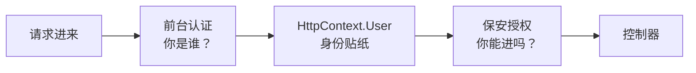
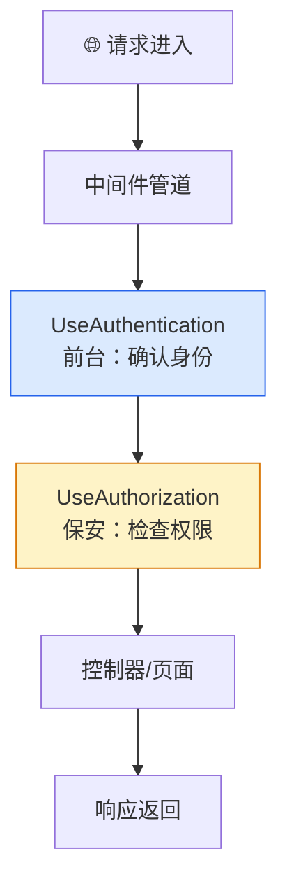
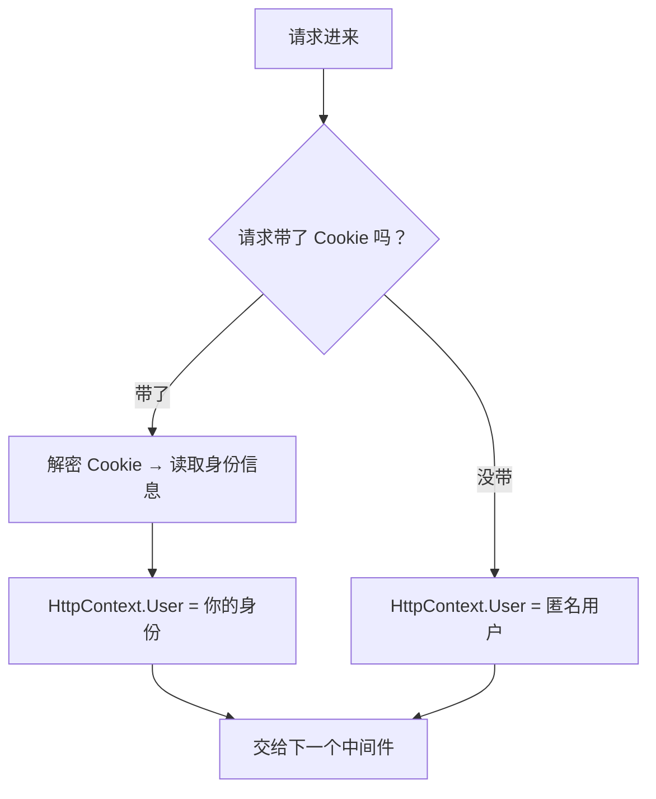
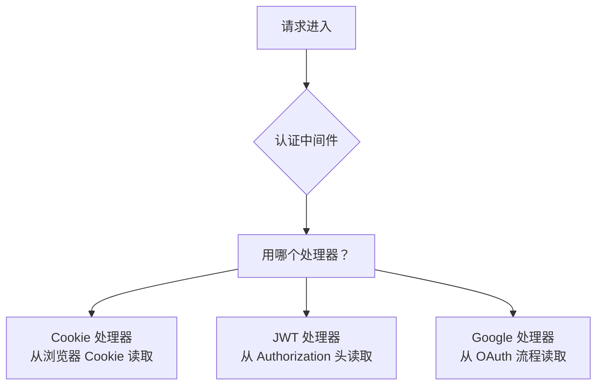
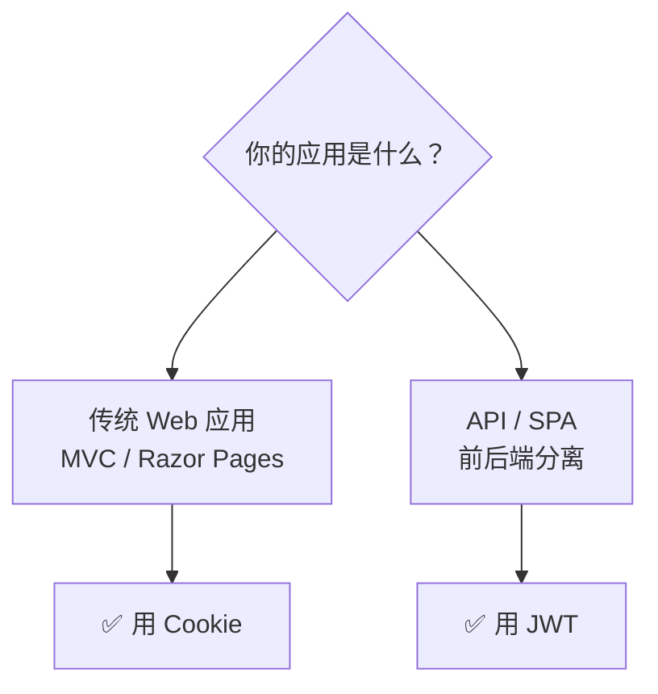
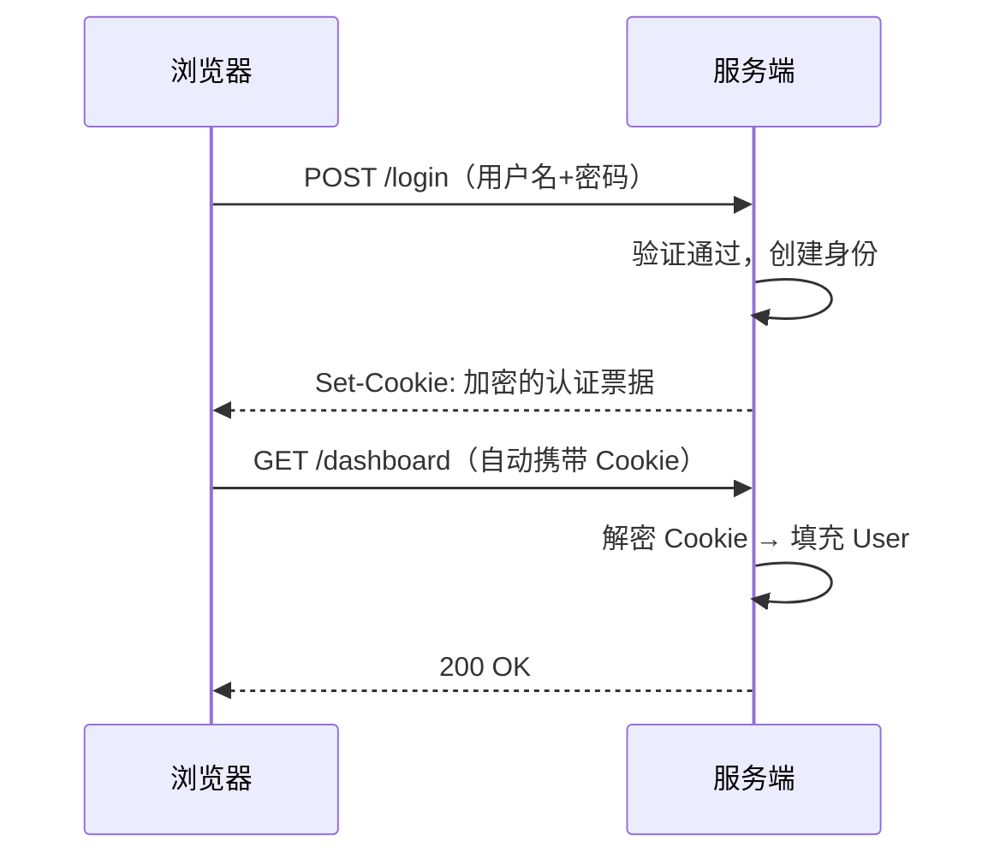
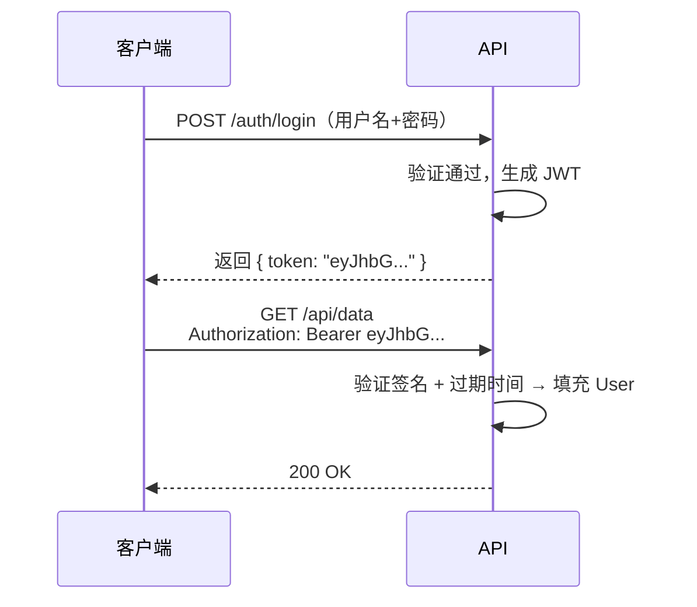
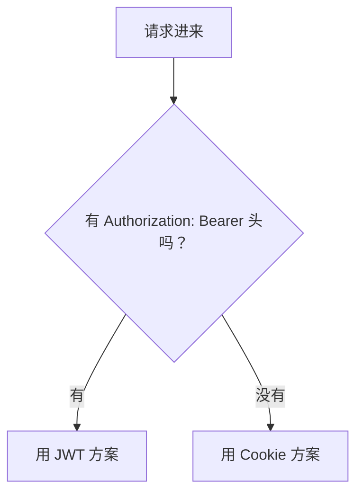
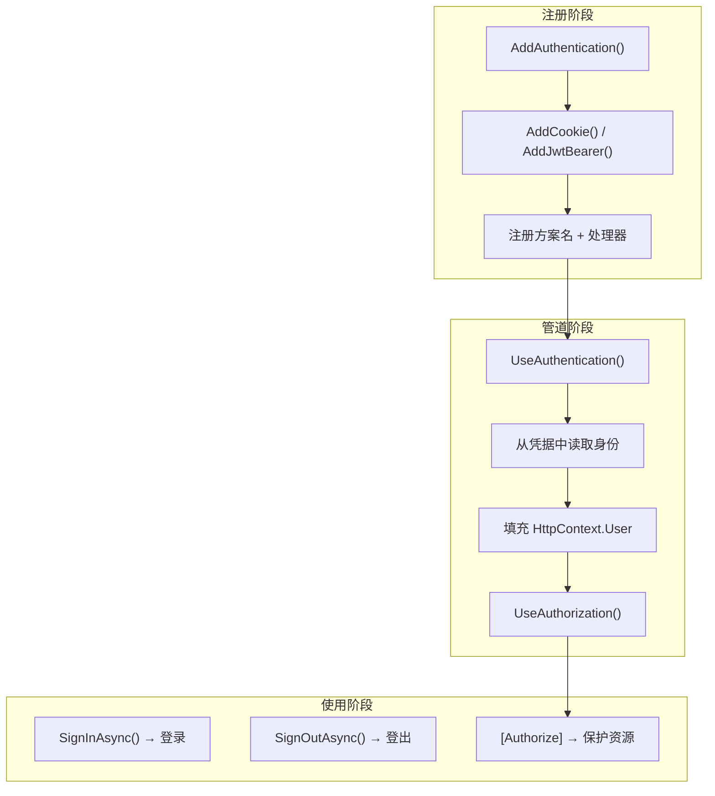

## 一、先建立直觉：认证在干什么

想象你进一栋办公楼：

1. 你走到前台，出示工牌 → **认证**（你是谁？）
2. 前台确认你的身份，给你一张访客贴纸 → **签发票据**
3. 你带着贴纸进入办公区 → **后续请求携带凭据**
4. 到某扇门前，保安看你的贴纸 → **授权**（你能进吗？）

ASP.NET Core 的认证就是"前台"——它只负责**确认你是谁**，不负责**决定你能不能进**。能不能进是授权的事。



**整篇文章就围绕一个核心问题展开：这个"前台"是怎么工作的？**

## 二、宏观大图：一个请求的完整旅程

在深入细节之前，先看清全貌。一个 HTTP 请求进入 ASP.NET Core 应用后，会依次经过这些环节：



关键认知：

- **认证是管道中的一个中间件**，不是什么神秘框架
- 它的位置在授权**之前**，因为保安需要先知道你是谁，才能决定你能不能进
- 它的工作成果就是 `HttpContext.User`——一个装着你身份信息的对象
- 它**不会拒绝请求**，拒绝是授权的事

## 三、5分钟跑通：最简单的认证

别急着理解原理，先让认证跑起来。

### 第一步：注册服务

```csharp
// Program.cs
builder.Services.AddAuthentication(CookieAuthenticationDefaults.AuthenticationScheme)
    .AddCookie();
```

这一行做了两件事：
- `AddAuthentication`：告诉系统"我要用认证"，默认方案是 Cookie
- `AddCookie`：注册 Cookie 认证处理器（具体干活的那个）

### 第二步：挂载中间件

```csharp
app.UseAuthentication(); // 认证：确认你是谁
app.UseAuthorization();  // 授权：决定你能不能进
```

**顺序不能反**——保安得先看你的贴纸，才能决定让不让你进。

### 第三步：登录

```csharp
[HttpPost]
public async Task<IActionResult> Login(string username, string password)
{
    // 验证用户名密码（简化示例）
    if (username != "admin" || password != "123456")
        return View();

    // 创建身份信息
    var claims = new List<Claim>
    {
        new(ClaimTypes.Name, username),
        new(ClaimTypes.Role, "Admin")
    };
    var identity = new ClaimsIdentity(claims, "Cookies");
    var principal = new ClaimsPrincipal(identity);

    // 写入认证 Cookie
    await HttpContext.SignInAsync("Cookies", principal);
    return RedirectToAction("Index", "Home");
}
```

### 第四步：保护页面

```csharp
[Authorize]  // 只要有这个，未登录用户就会被重定向到登录页
public IActionResult Dashboard() => View();
```

**跑起来了！** 这就是一个完整的认证流程：注册 → 登录 → 保护页面。

接下来我们逐步理解每一步背后的原理。

## 四、认证中间件到底做了什么

回头看第二步的 `UseAuthentication()`，它的核心逻辑其实非常简单：



用伪代码表达：

```csharp
// 中间件的核心逻辑（简化）
public async Task Invoke(HttpContext context)
{
    // 尝试从 Cookie 中读取身份
    var result = await context.AuthenticateAsync("Cookies");

    if (result?.Succeeded == true)
        context.User = result.Principal;  // 认证成功，填充身份
    // 否则 User 保持匿名状态

    await _next(context);  // 继续管道
}
```

**就这些。** 中间件只做一件事：尝试读取凭据，成功则填充 `HttpContext.User`，失败则保持匿名。

> 认证结果只有三种：
> - **成功**：凭据有效，`User` 被填充
> - **无凭据**：没带 Cookie，`User` 是匿名用户（不是错误！）
> - **凭据无效**：Cookie 过期或被篡改，`User` 也是匿名用户

## 五、认证方案：为什么需要"命名"

现在回答一个关键问题：**为什么 Cookie 认证要叫 "Cookies"？能不能不叫这个名字？**

因为一个应用可能有**多种认证方式**。比如你的应用既有网页（用 Cookie 登录），又有 API（用 JWT Token），它们需要不同的处理器：



**认证方案 = 名字 + 处理器**。名字让你可以指定"这次用哪种方式认证"。

```csharp
builder.Services.AddAuthentication(options =>
{
    options.DefaultScheme = "Cookies";  // 默认用 Cookie
})
.AddCookie()        // 注册名为 "Cookies" 的处理器
.AddJwtBearer();    // 注册名为 "Bearer" 的处理器
```

### 默认方案的配置

有四个默认方案可以配置，但日常只需要关心两个：

| 配置 | 作用 | 你需要关心吗 |
|------|------|------------|
| `DefaultScheme` | 兜底默认，其他三个没配时用它 | **是**，通常设为 Cookies |
| `DefaultAuthenticateScheme` | 中间件用哪个方案认证 | 通常不用单独配，回退到 DefaultScheme |
| `DefaultChallengeScheme` | 未登录时怎么触发登录 | Cookie 应用不用配（自动重定向）；API 应用设为 Bearer |
| `DefaultForbidScheme` | 无权限时怎么响应 | 通常不用单独配 |

**简单记忆**：Web 应用设 `DefaultScheme = Cookies`，API 应用设 `DefaultScheme = Bearer`，其他配置等你遇到具体问题再调。

## 六、Cookie vs JWT：该用哪个

这是初学者最常问的问题。先给结论：



| 对比 | Cookie | JWT |
|------|--------|-----|
| 适用场景 | 服务端渲染的网页 | API 接口、前后端分离 |
| 凭据存储 | 浏览器自动管理 | 客户端代码手动管理 |
| 状态 | 有状态（服务端可撤销） | 无状态（签发后无法撤销） |
| 安全性 | 自动防 CSRF（SameSite） | 需手动防 XSS（存 Token 的位置） |
| 登录触发 | 自动重定向到登录页 | 返回 401 |

### Cookie 认证配置

```csharp
builder.Services.AddAuthentication("Cookies")
    .AddCookie(options =>
    {
        options.LoginPath = "/Account/Login";        // 未登录 → 跳转这里
        options.AccessDeniedPath = "/Account/AccessDenied"; // 无权限 → 跳转这里
        options.ExpireTimeSpan = TimeSpan.FromDays(7);      // 7天过期
        options.SlidingExpiration = true;           // 活跃时自动续期
    });
```

**Cookie 认证的流程**：



### JWT 认证配置

```csharp
builder.Services.AddAuthentication("Bearer")
    .AddJwtBearer(options =>
    {
        options.TokenValidationParameters = new TokenValidationParameters
        {
            ValidateIssuer = true,
            ValidateAudience = true,
            ValidateLifetime = true,
            ValidateIssuerSigningKey = true,
            ValidIssuer = "https://myapp.com",
            ValidAudience = "https://myapi.com",
            IssuerSigningKey = new SymmetricSecurityKey(
                Encoding.UTF8.GetBytes("密钥至少16个字符"))
        };
    });
```

**JWT 认证的流程**：



### 生成 JWT Token

```csharp
public string GenerateToken(User user)
{
    var claims = new List<Claim>
    {
        new(JwtRegisteredClaimNames.Sub, user.Id),
        new(JwtRegisteredClaimNames.Name, user.UserName),
        new(ClaimTypes.Role, user.Role)
    };

    var key = new SymmetricSecurityKey(Encoding.UTF8.GetBytes("密钥至少16个字符"));
    var token = new JwtSecurityToken(
        issuer: "https://myapp.com",
        audience: "https://myapi.com",
        claims: claims,
        expires: DateTime.UtcNow.AddHours(2),
        signingCredentials: new SigningCredentials(key, SecurityAlgorithms.HmacSha256));

    return new JwtSecurityTokenHandler().WriteToken(token);
}
```

## 七、多方案组合：同时支持网页和 API

很多应用既有网页又有 API，需要同时支持 Cookie 和 JWT。

### 方案一：按控制器指定

最简单的方式——在控制器上明确指定用哪种方案：

```csharp
// 网页控制器 → Cookie
[Authorize(AuthenticationSchemes = "Cookies")]
public class HomeController : Controller { }

// API 控制器 → JWT
[Authorize(AuthenticationSchemes = "Bearer")]
[ApiController]
[Route("api/[controller]")]
public class ProductsController : ControllerBase { }
```

### 方案二：自动选择（PolicyScheme）

更优雅的方式——让系统根据请求特征自动选择：



```csharp
builder.Services.AddAuthentication(options =>
{
    options.DefaultScheme = "SmartScheme";
})
.AddPolicyScheme("SmartScheme", "智能选择", options =>
{
    options.ForwardDefaultSelector = context =>
    {
        var authHeader = context.Request.Headers.Authorization.ToString();
        if (!string.IsNullOrEmpty(authHeader) && authHeader.StartsWith("Bearer "))
            return "Bearer";
        return "Cookies";
    };
})
.AddCookie()
.AddJwtBearer();
```

## 八、常见踩坑

### 中间件顺序反了

```csharp
// ❌ 错误：授权在认证前面，User 还是空的
app.UseAuthorization();
app.UseAuthentication();

// ✅ 正确：先认证，再授权
app.UseAuthentication();
app.UseAuthorization();
```

### API 返回 302 而不是 401

Cookie 认证默认会把未登录用户重定向到登录页（302）。但 API 客户端期望的是 401 状态码。

**解决**：API 控制器明确指定 JWT 方案，或者在 Cookie 事件中判断路径：

```csharp
options.Events = new CookieAuthenticationEvents
{
    OnRedirectToLogin = context =>
    {
        // API 请求返回 401，不重定向
        if (context.Request.Path.StartsWithSegments("/api"))
        {
            context.Response.StatusCode = 401;
            return Task.CompletedTask;
        }
        context.Response.Redirect(context.Options.LoginPath);
        return Task.CompletedTask;
    }
};
```

### JWT 密钥太短

HMAC-SHA256 要求密钥至少 16 字节（128 位），太短会报错：

```csharp
// ❌ 密钥太短
Encoding.UTF8.GetBytes("123")

// ✅ 密钥足够长
Encoding.UTF8.GetBytes("这是一个至少16个字符的安全密钥")
```

## 九、一张图总结



| 概念 | 一句话 |
|------|-------|
| 认证中间件 | 从凭据中读取身份，填充 `HttpContext.User`，不做拒绝 |
| 认证方案 | 名字 + 处理器，让一个应用支持多种认证方式 |
| Cookie 认证 | 网页场景，浏览器自动管理，服务端可撤销 |
| JWT 认证 | API 场景，无状态，客户端手动管理 |
| 多方案组合 | 按控制器指定或 PolicyScheme 自动选择 |

下一篇我们将深入**授权体系**，看看 `[Authorize]` 背后到底发生了什么。
