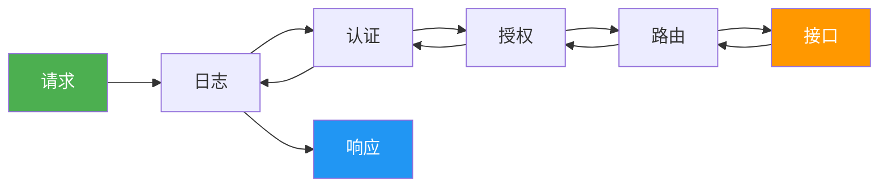
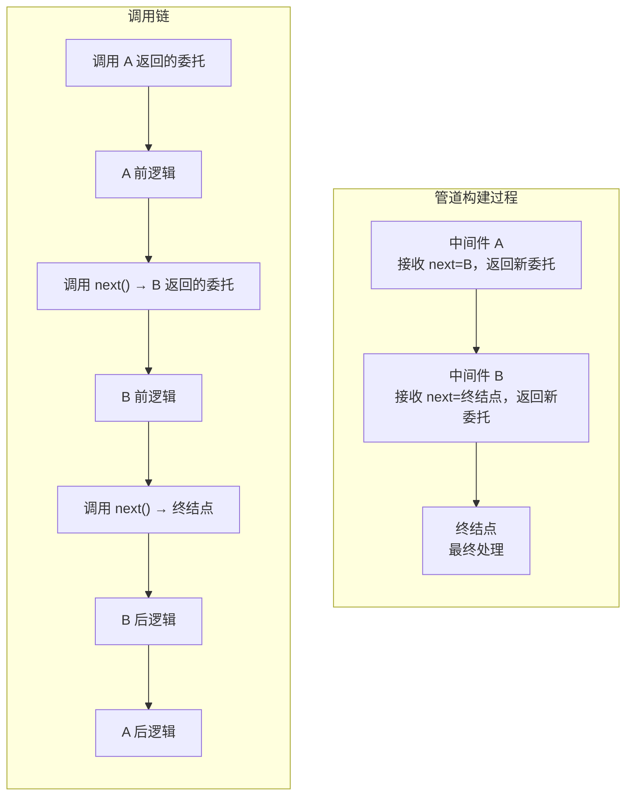
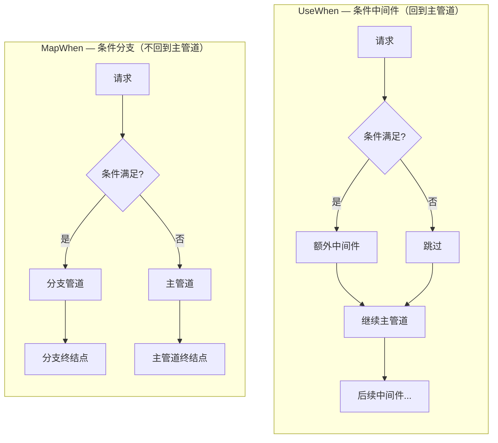
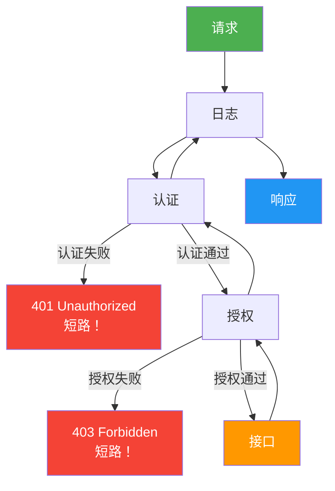
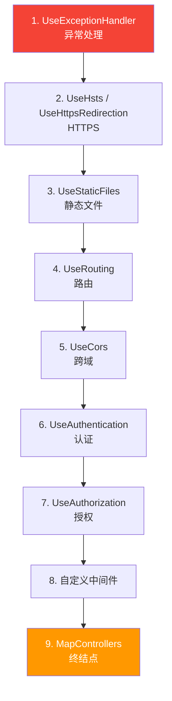
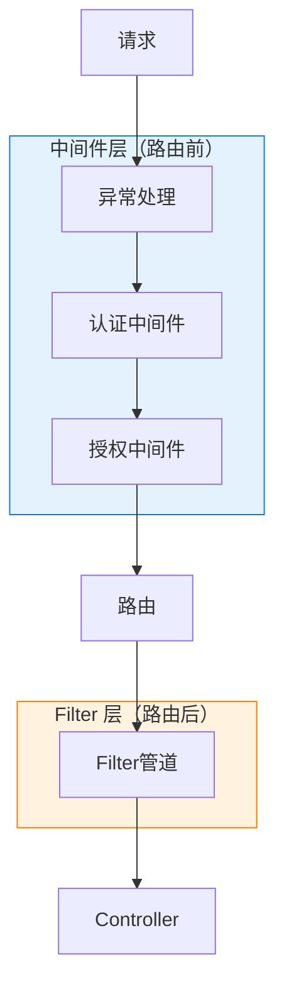

# 中间件管道详解

## 一、先建立直觉：俄罗斯套娃

ASP.NET Core 的请求处理就像一组**俄罗斯套娃**：



- 请求从外层套娃一层层钻进去
- 到达最内层（你的接口）处理后
- 响应再一层层钻出来

每个"套娃"就是一个**中间件**，它决定：
1. **进来时**做什么（前逻辑）
2. 是否**放行**给下一个中间件
3. **出来时**做什么（后逻辑）

## 二、管道的本质：委托链

### 用代码理解管道

抛开框架，管道的核心就是一条委托链：

```csharp
// 最简化的管道模型
var app = new List<Func<RequestDelegate, RequestDelegate>>();

// 添加中间件就是往链上挂处理逻辑
app.Use(async (next) =>
{
    Console.WriteLine("中间件A - 前");
    await next();  // 调用下一个中间件
    Console.WriteLine("中间件A - 后");
});

app.Use(async (next) =>
{
    Console.WriteLine("中间件B - 前");
    await next();
    Console.WriteLine("中间件B - 后");
});

// 终结点（最内层）
app.Run(async (context) =>
{
    Console.WriteLine("处理请求");
});

// 执行顺序：
// 中间件A - 前
// 中间件B - 前
// 处理请求
// 中间件B - 后
// 中间件A - 后
```

### RequestDelegate

```csharp
// RequestDelegate 就是一个异步函数：接收 HttpContext，返回 Task
public delegate Task RequestDelegate(HttpContext context);
```

整个管道就是：每个中间件接收 `RequestDelegate next`，返回一个新的 `RequestDelegate`。最终构建出一棵调用树。



## 三、四种注册方式

### 1. app.Use — 最通用

```csharp
app.Use(async (context, next) =>
{
    // 前逻辑
    var sw = Stopwatch.StartNew();

    await next();  // 放行

    // 后逻辑
    sw.Stop();
    context.Response.Headers.Append("X-Elapsed-Ms", sw.ElapsedMilliseconds.ToString());
});
```

### 2. app.UseWhen — 条件中间件（不分支）

```csharp
// 满足条件时执行额外中间件，但请求仍回到主管道
app.UseWhen(
    context => context.Request.Path.StartsWithSegments("/api"),
    branch =>
    {
        // /api 请求会经过这个中间件，然后继续走主管道
        branch.Use(async (context, next) =>
        {
            Console.WriteLine("API 请求额外处理");
            await next();
        });
    });
```

### 3. app.Map — 路径分支

```csharp
// 匹配路径前缀，创建独立分支管道（不回到主管道）
app.Map("/admin", branch =>
{
    branch.UseAuthentication();
    branch.UseAuthorization();
    // /admin 下的请求走这个分支，不再回到主管道
});
```

### 4. app.MapWhen — 条件分支

```csharp
// 根据条件创建独立分支管道
app.MapWhen(context => context.Request.Headers.ContainsKey("X-Debug"), branch =>
{
    branch.Use(async (context, next) =>
    {
        Console.WriteLine("调试模式");
        await next();
    });
});
```

### UseWhen vs MapWhen



| 特性 | `UseWhen` | `Map` / `MapWhen` |
|------|-----------|-------------------|
| 是否分支 | 否，请求回到主管道 | 是，创建独立管道 |
| 后续中间件 | 继续执行 | 不执行 |
| 典型场景 | 给特定路径加额外处理 | 完全独立的子应用 |

## 四、短路：不调用 next

中间件可以选择**不调用 next()**，直接返回响应——这就是**短路**。



```csharp
// IP 黑名单中间件
app.Use(async (context, next) =>
{
    var ip = context.Connection.RemoteIpAddress?.ToString();
    var blocked = new[] { "192.168.1.100", "10.0.0.50" };

    if (blocked.Contains(ip))
    {
        context.Response.StatusCode = 403;
        await context.Response.WriteAsync("IP 已被封禁");
        return;  // 短路！不调用 next，后续中间件都不执行
    }

    await next();  // 放行
});
```

短路的典型场景：
- 认证失败 → 401
- 授权失败 → 403
- 限流触发 → 429
- 缓存命中 → 304
- IP 黑名单 → 403

## 五、编写自定义中间件

### 方式一：内联委托（简单场景）

```csharp
app.Use(async (context, next) =>
{
    // 前逻辑
    await next();
    // 后逻辑
});
```

### 方式二：约定式类（推荐，可注入依赖）

```csharp
public class RequestLoggingMiddleware
{
    private readonly RequestDelegate _next;
    private readonly ILogger<RequestLoggingMiddleware> _logger;

    // 构造函数注入 Singleton 服务
    public RequestLoggingMiddleware(RequestDelegate next, ILogger<RequestLoggingMiddleware> logger)
    {
        _next = next;
        _logger = logger;
    }

    public async Task InvokeAsync(HttpContext context)
    {
        var sw = Stopwatch.StartNew();
        _logger.LogInformation("→ {Method} {Path}", context.Request.Method, context.Request.Path);

        await _next(context);

        sw.Stop();
        _logger.LogInformation("← {StatusCode} ({ElapsedMs}ms)", context.Response.StatusCode, sw.ElapsedMilliseconds);
    }
}

// 注册
app.UseMiddleware<RequestLoggingMiddleware>();
```

### 方式三：IMiddleware 接口（Scoped 生命周期）

```csharp
public class TenantMiddleware : IMiddleware
{
    private readonly ITenantService _tenantService;

    // 构造函数可以注入 Scoped 服务！
    public TenantMiddleware(ITenantService tenantService)
    {
        _tenantService = tenantService;
    }

    public async Task InvokeAsync(HttpContext context, RequestDelegate next)
    {
        var tenantId = context.Request.Headers["X-Tenant-Id"].FirstOrDefault();
        _tenantService.SetCurrentTenant(tenantId);

        await next(context);
    }
}

// 必须注册为 Scoped 服务
builder.Services.AddScoped<TenantMiddleware>();

// 使用
app.UseMiddleware<TenantMiddleware>();
```

### 方式四：扩展方法封装（推荐的项目实践）

实际项目中，用扩展方法让注册更简洁：

```csharp
// 扩展方法类
public static class RequestLoggingMiddlewareExtensions
{
    public static IApplicationBuilder UseRequestLogging(this IApplicationBuilder app)
    {
        return app.UseMiddleware<RequestLoggingMiddleware>();
    }
}

// Program.cs 中一行搞定
app.UseRequestLogging();
```

### 方式对比

| 特性 | 内联委托 | 约定式类 | IMiddleware | 扩展方法封装 |
|------|---------|---------|-------------|-------------|
| 代码量 | 最少 | 中等 | 中等 | 多一点 |
| 依赖注入 | 仅 Singleton | 仅 Singleton | 支持 Scoped | 取决于内部实现 |
| 可测试性 | 差 | 好 | 好 | 好 |
| 注册简洁度 | 一般 | 一般 | 一般 | 最简洁 |
| 适用场景 | 快速原型 | 通用 | 需要 Scoped 依赖 | 项目标准做法 |

## 六、中间件顺序：至关重要

**顺序错了，功能就废了。** 这是新手最常踩的坑。

### 正确的顺序



```csharp
var app = builder.Build();

// 1. 异常处理（最外层，兜住所有错误）
app.UseExceptionHandler();
app.UseHsts();

// 2. HTTPS 重定向
app.UseHttpsRedirection();

// 3. 静态文件（短路，不走后续管道）
app.UseStaticFiles();

// 4. 路由
app.UseRouting();

// 5. CORS（在认证之前）
app.UseCors();

// 6. 认证（识别是谁）
app.UseAuthentication();

// 7. 授权（决定能不能做）
app.UseAuthorization();

// 8. 自定义中间件
app.UseMiddleware<RequestLoggingMiddleware>();

// 9. 终结点映射（最内层）
app.MapControllers();
```

### 顺序错误的后果

```csharp
// ❌ 错误：授权在认证前面
app.UseAuthorization();   // 还不知道是谁，怎么授权？
app.UseAuthentication();  // 太晚了

// ❌ 错误：异常处理不在最外层
app.UseRouting();
app.UseExceptionHandler();  // 路由阶段抛的异常捕获不到

// ❌ 错误：CORS 在认证后面
app.UseAuthentication();
app.UseCors();  // 浏览器预检请求（无 Cookie）被认证拦截 → 401
```

### 记忆口诀

```
异常重定向，静态先放行
路由找终点，CORS 先放行
认证再授权，自定义居中
终结点最后，顺序记心中
```

## 七、实战：五个常用自定义中间件

### 1. 请求耗时统计

```csharp
public class TimingMiddleware
{
    private readonly RequestDelegate _next;

    public TimingMiddleware(RequestDelegate next) => _next = next;

    public async Task InvokeAsync(HttpContext context)
    {
        var sw = Stopwatch.StartNew();
        await _next(context);
        sw.Stop();

        context.Response.Headers.Append("X-Response-Time", $"{sw.ElapsedMilliseconds}ms");
    }
}
```

### 2. 请求关联 ID（链路追踪）

```csharp
public class CorrelationIdMiddleware
{
    private readonly RequestDelegate _next;
    private const string Header = "X-Correlation-Id";

    public CorrelationIdMiddleware(RequestDelegate next) => _next = next;

    public async Task InvokeAsync(HttpContext context)
    {
        var correlationId = context.Request.Headers[Header].FirstOrDefault()
                         ?? Guid.NewGuid().ToString();

        // 让下游服务也能拿到
        context.Response.Headers.Append(Header, correlationId);
        context.Items[Header] = correlationId;  // 存到 HttpContext.Items

        await _next(context);
    }
}
```

### 3. 接口限流

```csharp
public class RateLimitMiddleware
{
    private readonly RequestDelegate _next;
    private readonly TimeSpan _interval;
    // 用时间窗口计数，而非记录每个请求的时间
    private static readonly Dictionary<string, (DateTime WindowStart, int Count)> _counters = new();

    public RateLimitMiddleware(RequestDelegate next, TimeSpan? interval = null)
    {
        _next = next;
        _interval = interval ?? TimeSpan.FromSeconds(1);
    }

    public async Task InvokeAsync(HttpContext context)
    {
        var key = context.Connection.RemoteIpAddress?.ToString() ?? "unknown";

        lock (_counters)
        {
            var now = DateTime.UtcNow;

            if (_counters.TryGetValue(key, out var counter))
            {
                // 窗口过期，重置
                if (now - counter.WindowStart > _interval)
                {
                    _counters[key] = (now, 1);
                }
                // 窗口内超过限制
                else if (counter.Count >= 10)
                {
                    context.Response.StatusCode = 429;
                    context.Response.Headers.Append("Retry-After",
                        _interval.TotalSeconds.ToString());
                    return;  // 短路
                }
                else
                {
                    _counters[key] = (counter.WindowStart, counter.Count + 1);
                }
            }
            else
            {
                _counters[key] = (now, 1);
            }
        }

        await _next(context);
    }
}
```

> 生产环境推荐用 `AspNetCoreRateLimit` 或 .NET 7+ 内置的 `RateLimiter` 中间件，这里仅演示原理。

### 4. 请求体缓冲（允许多次读取）

```csharp
public class RequestBodyBufferMiddleware
{
    private readonly RequestDelegate _next;

    public RequestBodyBufferMiddleware(RequestDelegate next) => _next = next;

    public async Task InvokeAsync(HttpContext context)
    {
        // 默认 RequestBody 是 Stream，只能读一次
        // EnableBuffering 允许多次 Seek 和 Read
        context.Request.EnableBuffering();
        await _next(context);
    }
}
```

### 5. 响应压缩

```csharp
public class ResponseCompressionMiddleware
{
    private readonly RequestDelegate _next;

    public ResponseCompressionMiddleware(RequestDelegate next) => _next = next;

    public async Task InvokeAsync(HttpContext context)
    {
        var acceptEncoding = context.Request.Headers.AcceptEncoding.ToString();

        if (!acceptEncoding.Contains("gzip"))
        {
            await _next(context);
            return;
        }

        var originalBody = context.Response.Body;
        // 用 MemoryStream 捕获压缩后的数据，确保 GZipStream 正确完成
        using var buffer = new MemoryStream();
        using var gzip = new GZipStream(buffer, CompressionLevel.Fastest, leaveOpen: true);

        context.Response.Body = gzip;
        context.Response.Headers.Append("Content-Encoding", "gzip");

        try
        {
            await _next(context);
        }
        finally
        {
            // 先完成压缩（写出末尾字节），再写回原始流
            await gzip.FlushAsync();
            buffer.Seek(0, SeekOrigin.Begin);
            await buffer.CopyToAsync(originalBody);
            context.Response.Body = originalBody;
        }
    }
}
```

> 生产环境直接用 `builder.Services.AddResponseCompression()` + `app.UseResponseCompression()`。

## 八、中间件与 Filter 的区别

| 特性 | 中间件 | Filter |
|------|--------|--------|
| 作用范围 | 所有请求 | 特定 Controller/Action |
| 执行时机 | 路由之前 | 路由之后 |
| 能否访问路由信息 | `UseRouting` 之后可以 `context.GetEndpoint()` | 能 |
| 能否短路 | 能 | 能 |
| 依赖注入 | 构造函数注入 | 构造函数 + ServiceFilter |
| 典型场景 | 全局横切关注点 | 特定接口的 AOP 逻辑 |



**简单原则**：全局的放中间件，局部的放 Filter。

## 九、HttpContext.Items：中间件间的数据传递

```csharp
// 中间件 A：存数据
app.Use(async (context, next) =>
{
    context.Items["RequestId"] = Guid.NewGuid().ToString();
    context.Items["StartTime"] = DateTime.UtcNow;
    await next();
});

// 中间件 B：取数据
app.Use(async (context, next) =>
{
    var requestId = context.Items["RequestId"] as string;
    Console.WriteLine($"请求 {requestId} 开始处理");
    await next();
});

// 终结点：取数据
app.MapGet("/info", (HttpContext context) =>
{
    var requestId = context.Items["RequestId"] as string;
    var startTime = (DateTime)context.Items["StartTime"]!;
    return Results.Ok(new { requestId, elapsed = (DateTime.UtcNow - startTime).TotalMilliseconds });
});
```

## 十、常见陷阱

### 1. 修改响应时 Response 已经开始发送

```csharp
// ❌ 错误：next() 之后修改响应头
app.Use(async (context, next) =>
{
    await next();
    // 如果响应已经开始发送（已 Flush），这里会抛异常
    context.Response.Headers.Append("X-Custom", "value");
});

// ✅ 正确：在 next() 之前设置，或检查 HasStarted
app.Use(async (context, next) =>
{
    context.Response.Headers.Append("X-Custom", "value");
    await next();
});
```

### 2. 中间件里直接读取请求体

```csharp
// ❌ 错误：读取后流位置在末尾，后续中间件/接口读不到
app.Use(async (context, next) =>
{
    using var reader = new StreamReader(context.Request.Body);
    var body = await reader.ReadToEndAsync();
    // Body 流已读完，后续无法再读
    await next();
});

// ✅ 正确：先 EnableBuffering，读完后重置位置
app.Use(async (context, next) =>
{
    context.Request.EnableBuffering();
    using var reader = new StreamReader(context.Request.Body, leaveOpen: true);
    var body = await reader.ReadToEndAsync();
    context.Request.Body.Position = 0;  // 重置流位置
    await next();
});
```

### 3. 约定式中间件注入 Scoped 服务

```csharp
// ❌ 错误：约定式中间件是 Singleton，不能直接注入 Scoped 服务
public class MyMiddleware
{
    private readonly RequestDelegate _next;
    private readonly IScopedService _service;  // ❌ 俘虏依赖！

    public MyMiddleware(RequestDelegate next, IScopedService service)
    {
        _next = next;
        _service = service;  // Singleton 持有 Scoped → 生命周期错误
    }
}

// ✅ 方案一：在 InvokeAsync 中注入
public async Task InvokeAsync(HttpContext context, IScopedService service)
{
    // 每次请求都会注入新的 Scoped 实例
    service.DoSomething();
    await _next(context);
}

// ✅ 方案二：使用 IMiddleware 接口
public class MyMiddleware : IMiddleware
{
    private readonly IScopedService _service;  // ✅ IMiddleware 本身是 Scoped
    // ...
}
```

### 4. 异常处理中间件的位置

```csharp
// ❌ 错误：异常处理不在最外层
app.UseRouting();
app.UseExceptionHandler("/error");  // 路由阶段之前的异常捕获不到

// ✅ 正确：异常处理在最外层
app.UseExceptionHandler("/error");
app.UseRouting();
```

## 十一、调试技巧

### 用日志追踪请求流转

在管道最外层加一个诊断中间件，观察请求的完整生命周期：

```csharp
// 放在所有中间件之前（UseExceptionHandler 之前）
app.Use(async (context, next) =>
{
    var logger = context.RequestServices.GetRequiredService<ILogger<Program>>();
    logger.LogInformation("→ 进入管道: {Method} {Path}",
        context.Request.Method, context.Request.Path);

    try
    {
        await next();
    }
    catch (Exception ex)
    {
        logger.LogError(ex, "管道异常");
        throw;
    }

    logger.LogInformation("← 离开管道: {StatusCode}", context.Response.StatusCode);
});
```

### 查看终结点信息

`UseRouting` 之后的中间件可以通过 `GetEndpoint()` 查看匹配的路由信息：

```csharp
app.Use(async (context, next) =>
{
    await next();

    var endpoint = context.GetEndpoint();
    if (endpoint != null)
    {
        Console.WriteLine($"匹配终结点: {endpoint.DisplayName}");
    }
});
```

## 小结

| 概念 | 关键点 |
|------|--------|
| 管道模型 | 俄罗斯套娃，请求进去、响应出来 |
| `app.Use` | 通用中间件注册 |
| `app.UseWhen` | 条件中间件，请求回到主管道 |
| `app.Map` / `app.MapWhen` | 路径/条件分支，不回到主管道 |
| 短路 | 不调用 next()，直接返回响应 |
| 顺序 | 异常→重定向→静态→路由→CORS→认证→授权→终结点 |
| 约定式类 | 构造函数注入 Singleton，InvokeAsync 注入 Scoped |
| `IMiddleware` | 支持 Scoped 生命周期 |
| 扩展方法 | `app.UseXxx()` 封装，项目标准做法 |

## 踩坑提示

::: warning 常见错误
1. **中间件顺序错了** — 认证在授权后面、CORS 在认证后面，都会导致功能异常
2. **短路后仍写响应** — 短路后 Response 可能已经开始发送，再写会抛异常
3. **读取请求体后没重置** — 后续中间件/接口读到空 Body
4. **Singleton 中间件持有 Scoped 服务** — 俘虏依赖，用 InvokeAsync 注入或 IMiddleware
5. **异常处理不在最外层** — 部分异常捕获不到
6. **混淆 UseWhen 和 MapWhen** — UseWhen 回到主管道，MapWhen 创建分支不回来
:::

## 练习题

1. 编写一个中间件，在响应头中添加 `X-App-Version: 1.0.0`
2. 编写一个中间件，记录每个请求的方法、路径、状态码和耗时到控制台
3. 解释为什么 `app.UseAuthentication()` 必须在 `app.UseAuthorization()` 之前
4. 编写一个中间件，只允许 `GET` 和 `POST` 请求通过，其他方法返回 405
5. 解释约定式中间件和 `IMiddleware` 的区别，各适合什么场景
6. `UseWhen` 和 `MapWhen` 有什么区别？各举一个适用场景

---

上一篇：[配置体系详解](./配置体系详解.html) | 下一篇：[认证基础与中间件管道](./auth/01认证基础与中间件管道.html)
