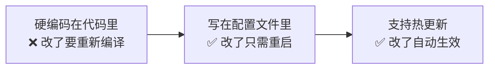
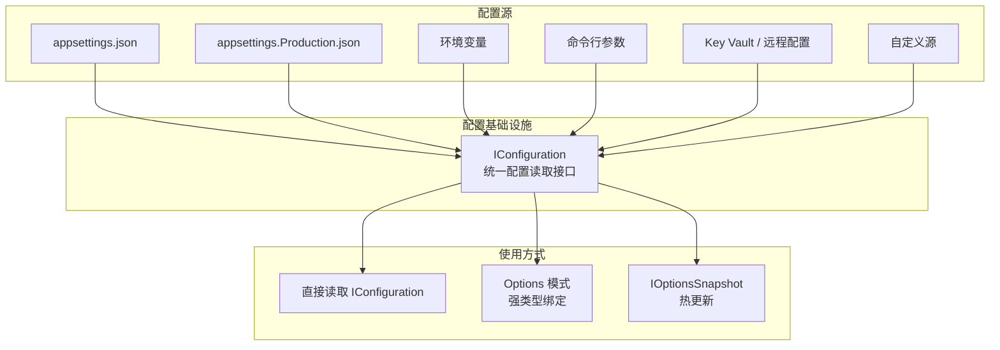
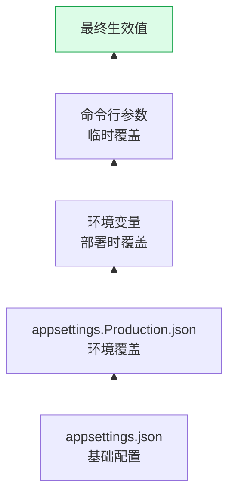
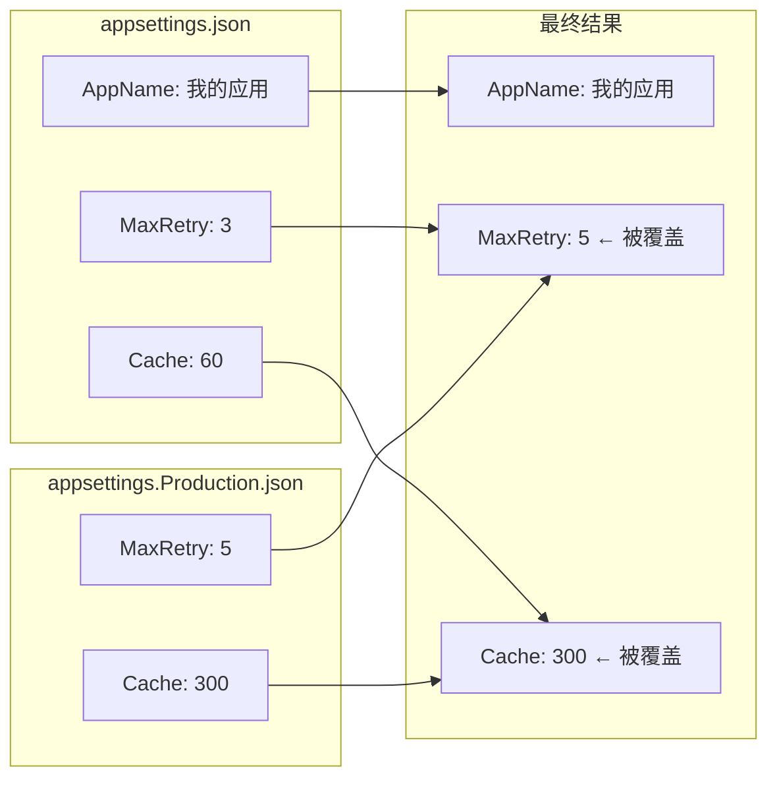
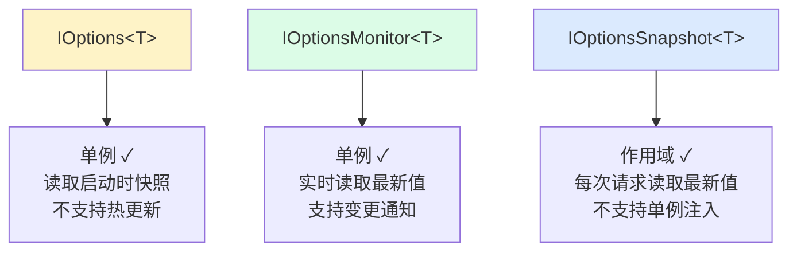
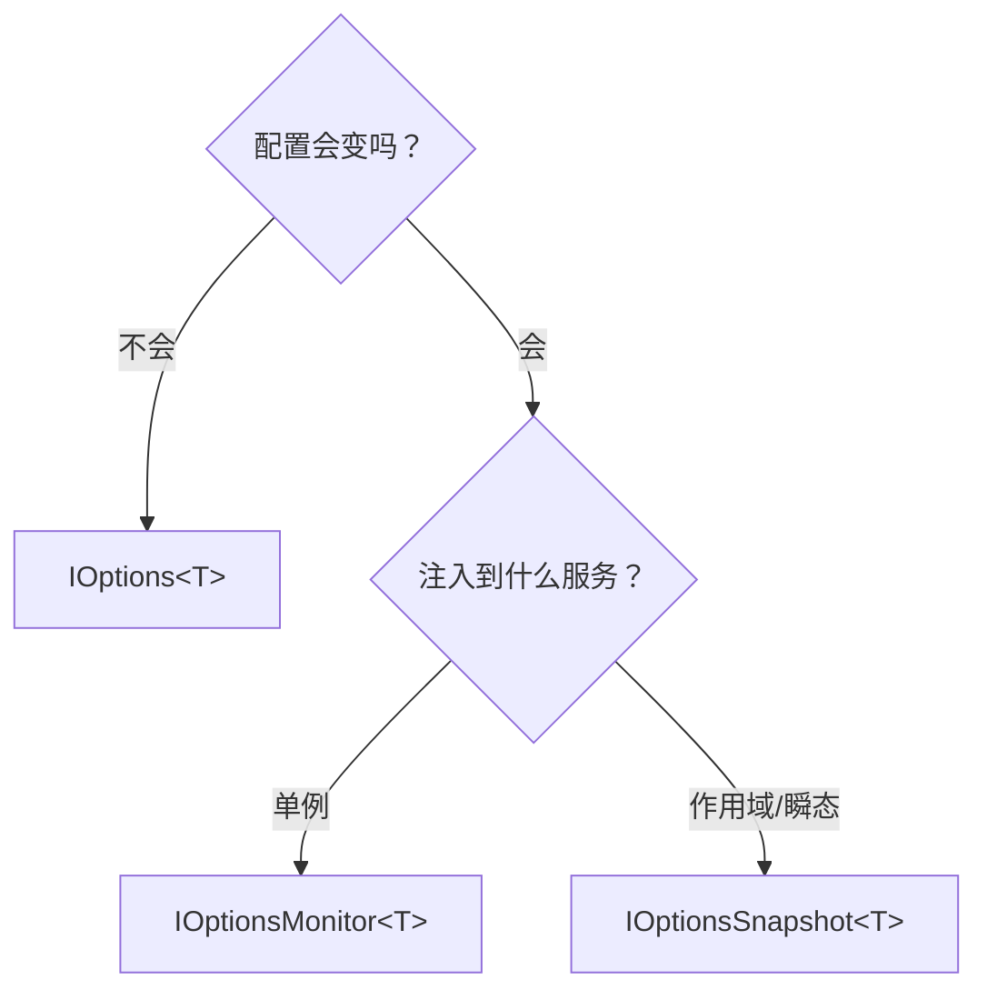
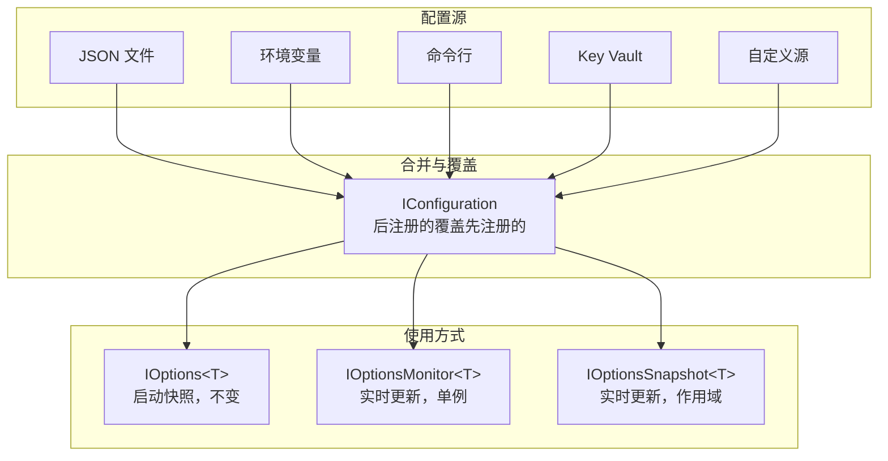

## 一、先建立直觉：配置在解决什么问题

你的应用里到处都是"会变的值"——数据库连接串、API密钥、缓存过期时间、功能开关……这些值有两个特点：

1. **因环境而异**——开发用本地库，生产用云数据库
2. **经常变化**——改个超时时间不该重新编译部署

**配置的本质就是把"会变的值"从代码中抽出来，放到代码之外管理。**



## 二、宏观大图：配置体系全貌



三个层次：
- **配置源**：数据从哪里来
- **IConfiguration**：统一读取接口，屏蔽不同来源的差异
- **Options 模式**：把配置映射成强类型对象，代码更优雅

## 三、5分钟跑通：最简单的配置

### 第一步：写配置文件

```json
// appsettings.json
{
    "AppName": "我的应用",
    "MaxRetryCount": 3,
    "ConnectionStrings": {
        "Default": "Server=localhost;Database=MyDb;TrustedConnection=true"
    }
}
```

### 第二步：读取配置

```csharp
// Program.cs 中直接读取
var appName = builder.Configuration["AppName"];                    // "我的应用"
var maxRetry = builder.Configuration["MaxRetryCount"];             // "3"（字符串！）
var connStr = builder.Configuration["ConnectionStrings:Default"];  // 用 : 分隔层级
```

**跑起来了！** 但这只是最基础的用法，接下来逐步深入。

## 四、多配置源与优先级

.NET 支持同时从多个来源读取配置，后注册的源**覆盖**先注册的：



### 默认注册顺序（ASP.NET Core 模板）

```csharp
// 框架内部大致做了这些（简化）
builder.Configuration
    .SetBasePath(env.ContentRootPath)
    .AddJsonFile("appsettings.json", optional: false, reloadOnChange: true)
    .AddJsonFile($"appsettings.{env.EnvironmentName}.json", optional: true, reloadOnChange: true)
    .AddEnvironmentVariables()
    .AddCommandLine(args);
```

**优先级从低到高**：appsettings.json → 环境专属json → 环境变量 → 命令行

### 环境变量的层级映射

环境变量名用双下划线 `__` 表示层级：

| 环境变量 | 对应配置键 |
|---------|----------|
| `ConnectionStrings__Default` | `ConnectionStrings:Default` |
| `Logging__LogLevel__Default` | `Logging:LogLevel:Default` |
| `MyApp__FeatureX__Enabled` | `MyApp:FeatureX:Enabled` |

> **为什么用 `__` 而不是 `:`**？因为 `:` 在某些系统的环境变量名中不合法（如 Windows），`__` 在所有平台都安全。

### 实战：用环境变量覆盖数据库连接

```json
// appsettings.json（开发环境用 SQLite）
{
    "ConnectionStrings": {
        "Default": "Data Source=local.db"
    }
}
```

```bash
# 生产环境通过环境变量覆盖为 PostgreSQL
set ConnectionStrings__Default="Host=prod-db;Database=MyApp;Username=admin;Password=xxx"
```

**不需要改任何代码，不需要改配置文件，部署时注入环境变量即可。**

## 五、多环境配置

ASP.NET Core 通过 `ASPNETCORE_ENVIRONMENT` 环境变量区分环境：

| 环境变量值 | 加载的配置文件 |
|-----------|-------------|
| Development | appsettings.json + appsettings.Development.json |
| Production | appsettings.json + appsettings.Production.json |
| Staging | appsettings.json + appsettings.Staging.json |

### 合并规则

环境专属配置**覆盖**基础配置，未覆盖的保留基础值：



### launchSettings.json 控制开发环境

```json
// Properties/launchSettings.json
{
    "profiles": {
        "MyApp": {
            "environmentVariables": {
                "ASPNETCORE_ENVIRONMENT": "Development"
            }
        }
    }
}
```

> 开发时环境由 launchSettings.json 控制，部署时由宿主环境（Docker/K8s/IIS）注入。

## 六、Options 模式：强类型配置

直接用 `IConfiguration["Key"]` 读取配置有几个问题：
- 返回的是字符串，需要手动转换类型
- 没有默认值管理
- 没有验证机制
- 分散在代码各处

**Options 模式**把配置映射成强类型对象，解决以上所有问题。

### 第一步：定义配置类

```csharp
public class JwtOptions
{
    public string Issuer { get; set; } = "";
    public string Audience { get; set; } = "";
    public string SecretKey { get; set; } = "";
    public int ExpireHours { get; set; } = 2;  // 默认值
}
```

### 第二步：绑定配置

```json
// appsettings.json
{
    "Jwt": {
        "Issuer": "https://myapp.com",
        "Audience": "https://myapi.com",
        "SecretKey": "your-secret-key-at-least-16-chars",
        "ExpireHours": 4
    }
}
```

```csharp
// Program.cs
builder.Services.Configure<JwtOptions>(builder.Configuration.GetSection("Jwt"));
```

### 第三步：使用配置

```csharp
public class AuthService
{
    private readonly JwtOptions _jwtOptions;

    public AuthService(IOptions<JwtOptions> jwtOptions)
    {
        _jwtOptions = jwtOptions.Value;
    }

    public string GenerateToken()
    {
        // 直接用强类型属性，不用字符串键，不用手动转换
        var key = new SymmetricSecurityKey(
            Encoding.UTF8.GetBytes(_jwtOptions.SecretKey));
        // ...
    }
}
```

## 七、三种 Options 接口的区别

这是初学者最容易混淆的地方：



| 接口 | 生命周期 | 热更新 | 适用场景 |
|------|---------|-------|---------|
| `IOptions<T>` | 单例 | ❌ | 配置不会变的场景（如 JWT 密钥） |
| `IOptionsMonitor<T>` | 单例 | ✅ | 需要热更新且注入到单例服务 |
| `IOptionsSnapshot<T>` | 作用域 | ✅ | 需要热更新且注入到作用域/瞬态服务 |

### 选型决策



### IOptionsMonitor 变更通知

```csharp
public class AuthService
{
    private readonly JwtOptions _currentOptions;

    public AuthService(IOptionsMonitor<JwtOptions> jwtOptionsMonitor)
    {
        // 获取当前值
        _currentOptions = jwtOptionsMonitor.CurrentValue;

        // 监听配置变更
        jwtOptionsMonitor.OnChange(newOptions =>
        {
            // 配置文件改了，自动触发
            Console.WriteLine($"JWT配置已更新，新过期时间: {newOptions.ExpireHours}h");
        });
    }
}
```

## 八、配置验证

错误的配置应该在启动时就暴露，而不是运行时才报错。

### 方式一：DataAnnotations 验证

```csharp
public class JwtOptions
{
    [Required(ErrorMessage = "Issuer 不能为空")]
    public string Issuer { get; set; } = "";

    [Required(ErrorMessage = "SecretKey 不能为空")]
    [MinLength(16, ErrorMessage = "SecretKey 至少16个字符")]
    public string SecretKey { get; set; } = "";

    [Range(1, 72, ErrorMessage = "ExpireHours 必须在1-72之间")]
    public int ExpireHours { get; set; } = 2;
}
```

```csharp
builder.Services.AddOptions<JwtOptions>()
    .Bind(builder.Configuration.GetSection("Jwt"))
    .ValidateDataAnnotations();  // 启动时验证
```

### 方式二：自定义验证逻辑

```csharp
builder.Services.AddOptions<JwtOptions>()
    .Bind(builder.Configuration.GetSection("Jwt"))
    .Validate(options =>
    {
        // 自定义复杂验证
        if (options.SecretKey.Length < 16)
            return false;
        if (!options.Issuer.StartsWith("https://"))
            return false;
        return true;
    }, "JWT 配置验证失败");  // 验证失败时的错误信息
```

### 方式三：启动时立即验证（推荐）

默认情况下，`ValidateDataAnnotations` 是**首次访问时才验证**。加上 `ValidateOnStart` 可以在启动时就验证：

```csharp
builder.Services.AddOptions<JwtOptions>()
    .Bind(builder.Configuration.GetSection("Jwt"))
    .ValidateDataAnnotations()
    .ValidateOnStart();  // 应用启动时立即验证，配置错误直接崩溃
```

> **强烈推荐**：所有关键配置都加 `ValidateOnStart()`。启动时崩溃好过运行时出错。

## 九、自定义配置源

当内置的配置源不够用时，可以实现自己的 `IConfigurationSource` 和 `IConfigurationProvider`。

### 示例：从数据库读取配置

```csharp
public class DatabaseConfigurationSource : IConfigurationSource
{
    private readonly string _connectionString;

    public DatabaseConfigurationSource(string connectionString)
    {
        _connectionString = connectionString;
    }

    public IConfigurationProvider Build(IConfigurationBuilder builder)
    {
        return new DatabaseConfigurationProvider(_connectionString);
    }
}

public class DatabaseConfigurationProvider : ConfigurationProvider
{
    private readonly string _connectionString;

    public DatabaseConfigurationProvider(string connectionString)
    {
        _connectionString = connectionString;
    }

    public override void Load()
    {
        // 从数据库读取配置，填充 Data 字典
        using var conn = new SqlConnection(_connectionString);
        conn.Open();
        using var cmd = new SqlCommand("SELECT [Key], [Value] FROM AppSettings", conn);
        using var reader = cmd.ExecuteReader();

        while (reader.Read())
        {
            var key = reader.GetString(0);
            var value = reader.GetString(1);
            // 用 : 分隔层级，如 "Jwt:Issuer"
            Data[key] = value;
        }
    }
}
```

### 注册自定义配置源

```csharp
builder.Configuration.Add(new DatabaseConfigurationSource(
    builder.Configuration.GetConnectionString("ConfigDb")!));
```

### 常见自定义配置源

| 来源 | NuGet 包 | 说明 |
|------|---------|------|
| Azure Key Vault | `Azure.Extensions.AspNetCore.Configuration.Secrets` | 安全存储密钥 |
| AWS Parameter Store | `Amazon.Extensions.Configuration.SystemsManager` | AWS 参数存储 |
| Consul | `Winton.Extensions.Configuration.Consul` | 集中配置中心 |
| Redis | 自行实现 | 分布式配置 |
| 数据库 | 自行实现 | 动态配置 |

## 十、安全实践

### 敏感信息永远不要明文存储

```json
// ❌ 绝对不要这样做
{
    "ConnectionStrings": {
        "Default": "Server=prod;Password=123456"
    },
    "Jwt": {
        "SecretKey": "my-super-secret-key"
    }
}
```

### 开发环境：Secret Manager

```bash
# 初始化用户密钥存储
dotnet user-secrets init

# 设置密钥（存储在用户目录下，不在项目里）
dotnet user-secrets set "Jwt:SecretKey" "my-real-secret-key"
dotnet user-secrets set "ConnectionStrings:Default" "Server=prod;Password=xxx"
```

```csharp
// 开发环境下自动加载（只在 Development 环境生效）
if (builder.Environment.IsDevelopment())
{
    builder.Configuration.AddUserSecrets<Program>();
}
```

### 生产环境：环境变量或 Key Vault

| 方案 | 适用场景 | 安全等级 |
|------|---------|---------|
| 环境变量 | 容器部署（Docker/K8s） | 中 |
| Azure Key Vault | Azure 云部署 | 高 |
| AWS Secrets Manager | AWS 云部署 | 高 |
| HashiCorp Vault | 自建/多云 | 高 |

### 配置文件安全检查清单

- [ ] `.gitignore` 中排除 `appsettings.Development.json`
- [ ] 敏感值使用 Secret Manager / Key Vault / 环境变量
- [ ] `appsettings.json` 中只放非敏感的默认值
- [ ] 生产配置文件不提交到代码仓库

## 十一、一张图总结



| 概念 | 一句话 |
|------|-------|
| IConfiguration | 统一配置读取接口，屏蔽来源差异 |
| 多配置源 | 后注册的覆盖先注册的，环境变量 > 环境json > 基础json |
| 多环境 | appsettings.{Env}.json 覆盖 appsettings.json |
| Options 模式 | 把配置映射成强类型对象，告别字符串键 |
| 三种接口 | IOptions（不变）/ IOptionsMonitor（单例+热更新）/ IOptionsSnapshot（作用域+热更新） |
| 配置验证 | DataAnnotations + ValidateOnStart，启动时崩溃好过运行时出错 |
| 安全 | 敏感信息用 Secret Manager / Key Vault / 环境变量，永远不提交到代码仓库 |
