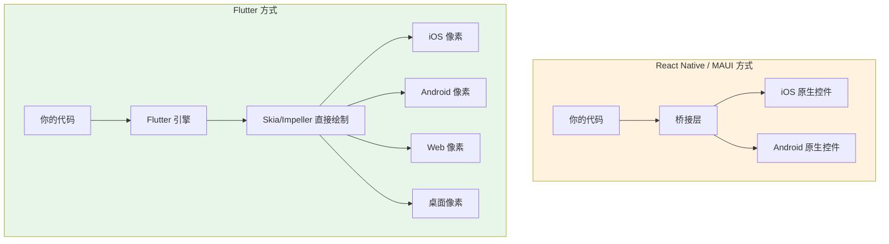
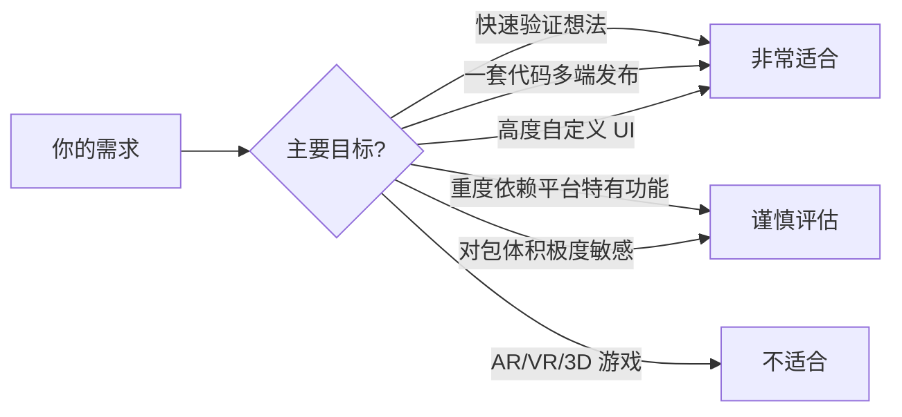

## 一、什么是 Flutter

Flutter 是 Google 推出的开源 UI 工具包，用一套代码同时构建 iOS、Android、Web 和桌面应用。它不是"又一个跨平台框架"，而是用一种完全不同的方式来渲染界面——**自绘引擎**。

### 1.1 自绘引擎：和 RN/MAUI 的根本区别

大多数跨平台框架（React Native、.NET MAUI）的做法是：写一套逻辑代码，然后映射到各平台的原生控件。这意味着你写的按钮，在 iOS 上是 `UIButton`，在 Android 上是 `MaterialButton`。

Flutter 不走这条路。它自带一个高性能的 2D 渲染引擎（Skia/Impeller），**直接在 Canvas 上画像素**。你写的按钮，在所有平台上都是 Flutter 自己画出来的。



**这意味着：**

- **像素级一致** — 同一份代码在所有平台上看起来完全一样，不存在"iOS 上正常但 Android 上样式跑偏"的问题
- **不依赖平台控件** — 不需要等 Apple/Google 更新控件，Flutter 自己就能实现任何 UI 效果
- **无桥接开销** — 不像 RN 需要通过桥接层和原生通信，Flutter 的 UI 渲染全部在引擎内完成

### 1.2 Flutter 不是什么

初学者常有误解，先澄清：

| 误解 | 事实 |
|------|------|
| Flutter 是新语言 | Flutter 是框架，语言是 **Dart**（Google 开发，语法类似 Java/JS 混合体） |
| Flutter 只能做移动端 | 支持 iOS、Android、Web、Windows、macOS、Linux |
| Flutter 性能不如原生 | 绝大多数场景下 60fps，复杂列表和动画接近原生 |
| Flutter 应用看起来不像原生 | Material 和 Cupertino 组件库分别模仿 Android 和 iOS 风格，也可以完全自定义 |
| Flutter 不能调用原生 API | 通过 Platform Channel 可以调用任何原生 API |

### 1.3 适合什么场景



**非常适合：**
- 创业项目 MVP — 一套代码同时上线 iOS 和 Android
- 企业内部应用 — 不需要上架应用商店，跨平台效率优先
- 内容展示类应用 — 电商、新闻、社交、工具类
- 品牌定制 UI — 需要独特视觉风格，不想被平台控件限制

**谨慎评估：**
- 重度依赖平台特有功能（如 iOS 的 ARKit、Android 的 NFC 系统级集成）
- 对包体积极度敏感（Flutter 空项目约 5-10MB，比原生大）

**不适合：**
- 3D 游戏和 AR/VR — 用 Unity/Unreal 更合适
- 需要极致启动速度的系统级应用

## 二、环境搭建

Flutter 的环境搭建比大多数框架多一步——你需要安装 Flutter SDK，而不仅仅是 npm install。但只要搭好了，开发体验非常丝滑。

### 2.1 系统要求

| 平台 | 最低要求 |
|------|---------|
| Windows | Windows 10 64-bit，磁盘空间 2.5GB+ |
| macOS | macOS 10.15+，磁盘空间 2.8GB+ |
| Linux | 64-bit，磁盘空间 2.5GB+ |

### 2.2 安装 Flutter SDK

**方式一：官方安装包（推荐新手）**

1. 访问 [flutter.dev/docs/get-st…](https://docs.flutter.dev/get-started/install)
2. 选择你的操作系统，下载最新稳定版（Stable channel）
3. 解压到你想要的目录（**路径不要有中文和空格**）

> **踩坑提醒**：Windows 用户不要解压到 `C:\Program Files\`，权限问题会让你痛不欲生。推荐 `C:\flutter` 或 `D:\flutter`。

**方式二：Git（推荐有经验的开发者）**

```bash
git clone https://github.com/flutter/flutter.git -b stable
```

好处是以后升级只需 `git pull`，切换版本也方便。

**配置环境变量：**

把 Flutter 的 `bin` 目录加到 PATH：

```bash
# Windows：系统设置 → 环境变量 → Path → 新增
D:\flutter\bin

# macOS/Linux：在 ~/.zshrc 或 ~/.bashrc 中添加
export PATH="$HOME/flutter/bin:$PATH"
```

**验证安装：**

```bash
flutter --version
```

看到版本号输出就说明安装成功。

### 2.3 flutter doctor：你的环境体检医生

Flutter 自带一个环境检查工具，这是你最好的朋友：

```bash
flutter doctor
```

它会检查所有依赖是否就绪，并告诉你缺什么、怎么补。一个健康的输出长这样：

```
Doctor summary (to see all details, run flutter doctor -v):
[✓] Flutter (Channel stable, 3.x.x, on Microsoft Windows)
[✓] Android toolchain - develop for Android devices (Android SDK version 34)
[✓] Chrome - develop for the web
[✓] Visual Studio - develop for Windows (Visual Studio 2022)
[✓] Android Studio (version 2024.1)
[✓] Connected device (3 available)
[✓] Network resources

• No issues found!
```

**常见问题及解决：**

| 问题 | 解决方案 |
|------|---------|
| Android toolchain 不可用 | 安装 Android Studio → SDK Manager → 安装 Android SDK |
| Xcode 不可用（macOS） | `xcode-select --install`，然后 `sudo xcodebuild -license accept` |
| Visual Studio 不可用（Windows 桌面开发） | 安装 Visual Studio，勾选"使用 C++ 的桌面开发" |
| CocoaPods 不可用（macOS） | `brew install cocoapods` 或 `sudo gem install cocoapods` |
| Android licenses 未接受 | `flutter doctor --android-licenses`，一路 y |

> **新手建议**：不要试图跳过 `flutter doctor` 的任何警告。每个 ✗ 都会在后续开发中让你踩坑。花 10 分钟解决，省 10 小时排错。

### 2.4 IDE 选择

| IDE | 推荐度 | 说明 |
|-----|--------|------|
| **Android Studio** | ★★★★★ | 官方推荐，自带 Flutter/Dart 插件、模拟器管理、DevTools |
| **VS Code** | ★★★★☆ | 轻量，装 Flutter 扩展即可，缺少内置模拟器管理 |
| **IntelliJ IDEA** | ★★★☆☆ | 和 Android Studio 同源，功能一样但更重 |

**VS Code 必装扩展：**
- Flutter — 官方扩展，提供调试、热重载、Widget 检查器
- Dart — 语言支持，代码补全、重构
- Flutter Widget Snippets — 快捷代码片段

**Android Studio 必装插件：**
- Flutter — 安装时会自动安装 Dart 插件

### 2.5 模拟器/真机准备

**Android 模拟器：**
1. 打开 Android Studio → More Actions → Virtual Device Manager
2. Create Device → 选 Pixel 7 → 下载系统镜像（推荐 API 34）→ Finish
3. 启动模拟器

**iOS 模拟器（仅 macOS）：**
```bash
open -a Simulator
```

**真机调试：**
- Android：开启开发者模式 + USB 调试，USB 连接电脑
- iOS：需要 Apple 开发者账号 + 信任设备

> **性能提示**：iOS 模拟器是原生 ARM 执行，速度接近真机。Android 模拟器推荐开启 Hardware Acceleration（HAXM on Windows / Hypervisor on Mac），否则慢到怀疑人生。

## 三、第一个 Flutter 项目

环境搭好了，来写第一个项目——这也是我们贯穿整个教程的配套项目 **Flutter Journal** 的起点。

### 3.1 创建项目

```bash
flutter create flutter_journal
cd flutter_journal
```

项目创建后，目录结构如下：

```
flutter_journal/
├── lib/
│   └── main.dart          ← 你的代码在这里
├── test/
│   └── widget_test.dart   ← 测试代码
├── pubspec.yaml            ← 项目配置（类似 package.json）
├── android/                ← Android 平台代码
├── ios/                    ← iOS 平台代码
├── web/                    ← Web 平台代码
├── windows/                ← Windows 平台代码
├── macos/                  ← macOS 平台代码
└── linux/                  ← Linux 平台代码
```

**关键文件说明：**

| 文件 | 作用 |
|------|------|
| `lib/main.dart` | 应用入口，99% 的代码写在这里 |
| `pubspec.yaml` | 项目元数据、依赖声明、资源配置 |
| `android/` `ios/` 等 | 平台特定代码，通常不需要手动改 |

### 3.2 运行项目

```bash
# 查看可用设备
flutter devices

# 在指定设备上运行
flutter run -d chrome        # Web
flutter run -d emulator-5554 # Android 模拟器
flutter run -d "iPhone 15"   # iOS 模拟器
```

首次运行会编译较慢（1-3 分钟），后续有增量编译就快了。看到计数器应用界面就说明一切正常。

### 3.3 热重载：Flutter 最爽的功能

热重载（Hot Reload）是 Flutter 的杀手级功能。修改代码后按 `r`，不到 1 秒就能看到效果，**保留当前状态**。

```
在 flutter run 的终端中：
  r → Hot Reload（热重载，保留状态）
  R → Hot Restart（热重启，重置状态）
  q → 退出
```

**热重载 vs 热重启：**

| 操作 | 速度 | 状态 | 适用场景 |
|------|------|------|---------|
| Hot Reload (`r`) | < 1秒 | 保留 | 改 UI、改逻辑、加 Widget |
| Hot Restart (`R`) | 2-5秒 | 重置 | 改了 main()、改了全局变量、改了依赖 |

**热重载不能生效的情况：**
- 修改了 `main()` 函数
- 修改了全局变量的初始值
- 修改了 `pubspec.yaml` 中的依赖（需要 `flutter pub get` 后 Hot Restart）
- 修改了原生代码（需要完全重新构建）

> **体验一下**：打开 `lib/main.dart`，把 `'You have pushed the button this many times:'` 改成 `'点击次数：'`，按 `r`，看看效果。这就是 Flutter 开发的日常节奏——改代码、按 r、看效果，循环往复。

### 3.4 清空模板，从零开始

计数器模板太复杂了，我们从头开始。把 `lib/main.dart` 替换为：

```dart
import 'package:flutter/material.dart';

void main() {
  runApp(const JournalApp());
}

class JournalApp extends StatelessWidget {
  const JournalApp({super.key});

  @override
  Widget build(BuildContext context) {
    return MaterialApp(
      title: 'Flutter Journal',
      theme: ThemeData(
        colorScheme: ColorScheme.fromSeed(seedColor: Colors.indigo),
        useMaterial3: true,
      ),
      home: const HomePage(),
    );
  }
}

class HomePage extends StatelessWidget {
  const HomePage({super.key});

  @override
  Widget build(BuildContext context) {
    return Scaffold(
      appBar: AppBar(
        title: const Text('我的日记'),
        backgroundColor: Theme.of(context).colorScheme.inversePrimary,
      ),
      body: const Center(
        child: Column(
          mainAxisAlignment: MainAxisAlignment.center,
          children: [
            Icon(Icons.menu_book, size: 64, color: Colors.indigo),
            SizedBox(height: 16),
            Text(
              '还没有日记',
              style: TextStyle(fontSize: 18, color: Colors.grey),
            ),
          ],
        ),
      ),
      floatingActionButton: FloatingActionButton(
        onPressed: () {
          // 后续：跳转到写日记页面
        },
        child: const Icon(Icons.add),
      ),
    );
  }
}
```

Hot Reload 后你会看到一个简洁的日记首页——中间一个书本图标和"还没有日记"的提示，右下角一个加号按钮。这就是我们 Flutter Journal 的起点。

## 四、pubspec.yaml 详解

`pubspec.yaml` 是 Flutter 项目的配置中心，类似 Node.js 的 `package.json`。理解它很重要。

```yaml
name: flutter_journal          # 项目名（小写+下划线）
description: A Flutter journal app  # 项目描述
version: 1.0.0+1              # 版本号+构建号

environment:
  sdk: '>=3.0.0 <4.0.0'       # Dart SDK 版本约束

dependencies:                   # 运行时依赖
  flutter:
    sdk: flutter

dev_dependencies:               # 开发时依赖（不会打包进最终应用）
  flutter_test:
    sdk: flutter
  flutter_lints: ^3.0.0

flutter:                        # Flutter 特定配置
  uses-material-design: true    # 使用 Material 图标字体
  # assets:                     # 静态资源
  #   - images/
  #   - fonts/
```

**添加依赖的流程：**

```bash
# 添加一个包
flutter pub add http

# 添加开发依赖
flutter pub add dev:flutter_lints

# 安装 pubspec.yaml 中声明的所有依赖
flutter pub get
```

> **踩坑提醒**：修改 `pubspec.yaml` 后必须运行 `flutter pub get`，否则 IDE 会报错找不到包。VS Code 和 Android Studio 通常会自动执行，但偶尔需要手动。

## 五、项目结构最佳实践

随着项目增长，把所有代码塞进 `main.dart` 会变得不可维护。推荐的项目结构：

```
lib/
├── main.dart              ← 入口，只做 runApp()
├── app.dart               ← MaterialApp 配置
├── screens/               ← 页面
│   ├── home_screen.dart
│   └── detail_screen.dart
├── widgets/               ← 可复用组件
│   └── journal_card.dart
├── models/                ← 数据模型
│   └── journal.dart
├── services/              ← 网络请求、存储等服务
│   └── journal_service.dart
└── utils/                 ← 工具函数
    └── date_formatter.dart
```

现在项目还小，不需要这么复杂的结构。但记住这个模式，后面的教程会逐步演进到这个结构。

## 六、常见问题 FAQ

**Q：Flutter 和 Dart 是什么关系？**

A：Dart 是编程语言，Flutter 是用 Dart 写的 UI 框架。就像 JavaScript 和 React 的关系——JavaScript 是语言，React 是框架。下一篇我们会专门学习 Dart。

**Q：学 Flutter 之前需要学 Dart 吗？**

A：不需要先系统学完 Dart 再学 Flutter。建议先了解 Dart 基础语法（下一篇的内容），然后边学 Flutter 边深入 Dart。两者交叉学习效果最好。

**Q：Flutter 和 React Native 怎么选？**

A：如果你熟悉 JavaScript/React → RN 上手快；如果你熟悉 Java/C# 或想更精确控制 UI → Flutter 更合适。从长期趋势看，Flutter 的自绘引擎在 UI 一致性和性能上限上更有优势。

**Q：需要 Mac 才能开发 iOS 应用吗？**

A：是的，iOS 应用的编译和模拟器运行必须在 macOS 上。但如果你只有 Windows，可以先在 Android/Web 上开发，等需要 iOS 时再找 Mac 编译。

**Q：Flutter Web 能用来做生产级网站吗？**

A：可以，但要注意：Flutter Web 的 SEO 支持较弱（内容是 Canvas 绘制的，搜索引擎难以索引），首屏加载比传统 Web 慢。适合做后台管理、工具类 Web 应用，不太适合内容展示型网站。

---

下一篇：[Dart 语言速览（上）](/docs/flutter/02Dart语言速览（上）.html)
