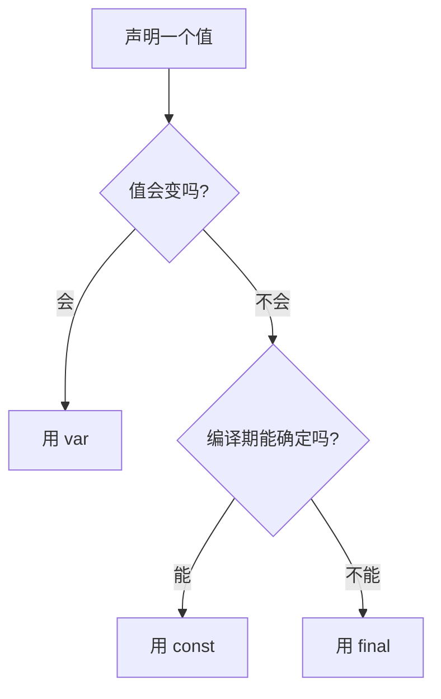
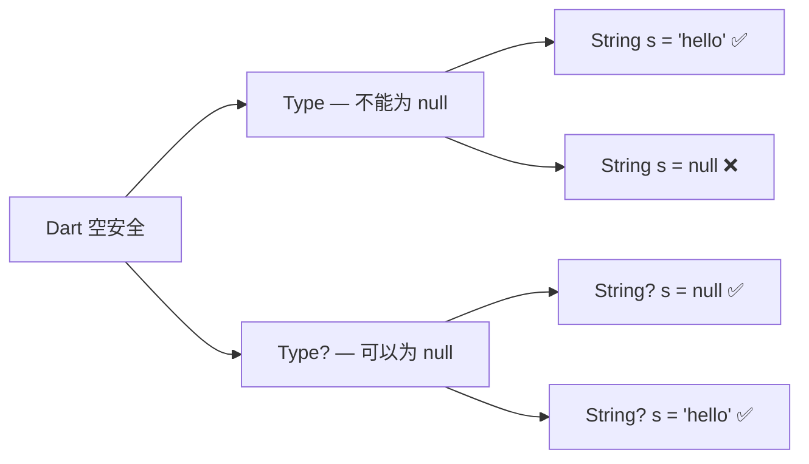

## 一、为什么先学 Dart

Flutter 用 Dart 写代码，这不是偶然选择。Dart 的设计目标就是"让 UI 开发更舒服"——它有 Java 的严谨、JavaScript 的灵活、Kotlin 的现代感。如果你会 Java 或 JavaScript，Dart 上手非常快。

本篇覆盖 Dart 的**基础语法和类型系统**，下一篇覆盖**异步、集合操作符和面向对象进阶**。

> **学习策略**：不需要把 Dart 全部背下来再学 Flutter。掌握本篇内容后，就可以开始写 Flutter 了，遇到不懂的 Dart 语法再回来查。

## 二、类型系统

Dart 是**强类型**语言，但类型推断让你写起来像弱类型一样轻松。

### 2.1 基本类型

```dart
// 数字
int count = 42;              // 整数，64-bit
double price = 9.99;         // 浮点数，64-bit IEEE 754
num value = 10;              // num 是 int 和 double 的父类
num value2 = 10.5;           // num 可以是 int 或 double

// 字符串
String name = 'Flutter';     // 单引号
String msg = "Hello $name";  // 双引号，支持插值
String raw = r'C:\flutter';  // r 前缀：原始字符串，不转义
String multi = '''           // 三引号：多行字符串
  第一行
  第二行
''';

// 布尔
bool isValid = true;
bool isEmpty = false;

// 符号（Symbol，很少用，跳过）
// Runes（Unicode 扩展，后续用到再讲）
```

**字符串插值**是 Dart 的一大特色，比 Java 的字符串拼接优雅太多：

```dart
var app = 'Journal';
var version = 1;

// $变量名 — 直接插入变量值
print('App: $app');                    // App: Journal

// ${表达式} — 插入任意表达式的值
print('Version: v${version + 1}');     // Version: v2
print('Length: ${app.length}');        // Length: 7

// 对比 Java 的写法，高下立判
// Java: "App: " + app + ", Version: v" + (version + 1)
```

### 2.2 类型推断：var、final、const

Dart 能自动推断变量类型，你不需要到处写类型声明：

```dart
// var — 声明变量，类型由初始值推断
var name = 'Flutter';     // 推断为 String
var count = 42;           // 推断为 int
// name = 100;            // ❌ 编译错误！一旦推断类型就不能变

// final — 运行时常量，只能赋值一次
final String appName = 'Journal';
final appVersion = 1;     // 类型推断，等价于 final int appVersion = 1
// appName = 'Diary';     // ❌ 编译错误！final 只能赋值一次

// const — 编译时常量，值必须在编译期就能确定
const pi = 3.14159;
const maxCount = 100;
// const now = DateTime.now();  // ❌ 编译错误！DateTime.now() 是运行时值
final now = DateTime.now();     // ✅ final 可以接收运行时值
```

**var vs final vs const 选择指南：**



> **实战建议**：默认用 `final`，只有需要重新赋值时才用 `var`，编译期常量用 `const`。这和 Kotlin 的习惯一致，能减少意外的变量修改。

### 2.3 集合类型

```dart
// List — 有序集合（类似 Java 的 ArrayList）
var fruits = ['apple', 'banana', 'cherry'];  // List<String>
fruits.add('date');
fruits[0];                    // 'apple'
fruits.length;                // 4

// 创建不可变 List
var fixedFruits = const ['apple', 'banana'];
// fixedFruits.add('cherry'); // ❌ 运行时错误！

// Set — 无序去重集合
var tags = <String>{'flutter', 'dart', 'mobile'};
tags.add('dart');             // 不会重复添加
tags.length;                  // 3

// Map — 键值对
var person = {
  'name': 'Koeltp',
  'age': 25,
  'skills': ['Flutter', 'Dart'],
};
person['name'];               // 'Koeltp'
person['email'] = 'a@b.com';  // 添加新键

// 类型注解写法
List<int> scores = [90, 85, 92];
Set<String> categories = {'tech', 'life'};
Map<String, dynamic> config = {'debug': true, 'version': 1};
```

**集合的 const 构造：**

```dart
// 编译时常量集合
const cities = ['Beijing', 'Shanghai'];
const settings = {'theme': 'dark', 'fontSize': 14};

// 注意：const 集合的元素也必须是编译时常量
// const items = [DateTime.now()];  // ❌ 编译错误
```

## 三、空安全（Sound Null Safety）

空安全是 Dart 2.12 引入的最重要的特性。理解它，是写好 Dart 代码的关键。

### 3.1 核心规则



```dart
// 非 null 类型 — 绝对不会是 null
String name = 'Flutter';
// name = null;              // ❌ 编译错误！

// 可 null 类型 — 用 ? 标记
String? nickname = 'Koeltp';
nickname = null;             // ✅ 没问题

// 使用可 null 类型时要小心
print(nickname.length);      // ❌ 编译错误！nickname 可能是 null
```

### 3.2 处理可 null 值的五种方式

```dart
String? name;

// 方式1：判空后使用（编译器会做类型提升）
if (name != null) {
  print(name.length);       // ✅ 编译器知道这里 name 不是 null
}

// 方式2：空值合并运算符 ??
print(name ?? '匿名');       // 如果 name 是 null，返回 '匿名'
int len = name?.length ?? 0; // 链式使用：name 为 null 时返回 0

// 方式3：安全调用 ?.
print(name?.length);         // name 为 null 时返回 null，不会崩溃

// 方式4：延迟初始化 late
class JournalApp {
  late String title;         // 告诉编译器：我保证在使用前会赋值

  void init(String t) {
    title = t;               // 第一次赋值
  }
}

// 方式5：非空断言 !（谨慎使用）
print(name!.length);         // 我确定 name 不是 null！如果是 null 会抛异常
```

**选择指南：**

| 场景 | 推荐方式 |
|------|---------|
| 有合理的默认值 | `??` 空值合并 |
| null 时不需要执行操作 | `?.` 安全调用 |
| 逻辑上保证不为 null | `if (x != null)` 类型提升 |
| 延迟到运行时才初始化 | `late` |
| 你 100% 确定不为 null | `!` 非空断言（尽量少用） |

> **踩坑提醒**：`!` 非空断言是"我拿人格担保它不是 null"。如果担保失败，运行时直接崩溃。在 Flutter 开发中，能用 `??` 或 `?.` 解决的，就不要用 `!`。

### 3.3 late 详解

`late` 是 Dart 空安全中容易误用的关键字。它的含义是"这个变量稍后会被初始化，我保证在使用前赋值"。

```dart
class JournalDetailPage {
  // late 声明：不需要在构造函数中初始化
  late Journal journal;

  // 常见用法：在 initState 中初始化
  void initState() {
    journal = loadJournal();  // 在使用前赋值
  }
}

// late 也可以用于延迟计算 — 只在第一次访问时执行
late String heavyData = computeExpensiveValue();
```

**late 的风险：**

```dart
late String value;

void main() {
  print(value);  // 💥 运行时错误：LateInitializationError
  // 忘记初始化就使用，编译器不会报错，但运行时会崩溃
}
```

> **原则**：能用构造函数参数初始化的，就不要用 `late`。`late` 只在"初始化时机不在构造函数"时使用（如 Flutter 的 `initState`）。

## 四、运算符

Dart 的运算符大部分和 Java/JS 一样，重点看几个特殊的：

### 4.1 空值相关运算符

```dart
// ?? 空值合并
String? name;
String display = name ?? '默认';   // name 为 null 时用 '默认'

// ??= 空值赋值
int? count;
count ??= 0;                        // count 为 null 时赋值为 0
count ??= 10;                       // count 已经是 0，不再赋值
```

### 4.2 级联运算符 ..

这是 Dart 最优雅的语法糖之一，可以在同一个对象上连续调用多个方法：

```dart
// 不用级联
var journal = Journal();
journal.title = '我的日记';
journal.content = '今天天气不错';
journal.tags.add('生活');
journal.save();

// 用级联 — 更简洁
var journal = Journal()
  ..title = '我的日记'
  ..content = '今天天气不错'
  ..tags.add('生活')
  ..save();

// 在 Flutter 中特别有用
Widget build(BuildContext context) {
  return Scaffold()
    ..appBar = AppBar(title: Text('日记'))
    ..body = Center(child: Text('内容'));
}
```

### 4.3 条件属性访问

```dart
String? name;

// name 为 null 时，整个表达式返回 null，不会崩溃
print(name?.length);        // null
print(name?.toUpperCase()); // null

// 链式使用
String? user;
print(user?.toLowerCase()?.length); // null
```

## 五、控制流

### 5.1 if-else

```dart
var score = 85;

if (score >= 90) {
  print('优秀');
} else if (score >= 60) {
  print('及格');
} else {
  print('不及格');
}
```

**Dart 的 if 不接受非 bool 值：**

```dart
// JavaScript 中常见的写法，在 Dart 中不行
var value = 0;
// if (value) { }        // ❌ 编译错误！Dart 要求条件必须是 bool

if (value != 0) { }      // ✅ 显式比较
if (value > 0) { }       // ✅ 显式比较
```

### 5.2 switch

Dart 3 的 switch 支持模式匹配，比传统 switch 强大很多：

```dart
// 传统 switch
var command = 'open';
switch (command) {
  case 'open':
    print('打开文件');
    break;                    // Dart 传统 switch 需要 break
  case 'close':
    print('关闭文件');
    break;
  default:
    print('未知命令');
}

// Dart 3 模式匹配（推荐）
var value = 42;
var result = switch (value) {
  > 100 => '超大',
  > 50  => '大',
  > 0   => '正常',
  0     => '零',
  _     => '负数',            // _ 是通配符，类似 default
};
print(result);  // '正常'
```

### 5.3 循环

```dart
// for 循环
for (var i = 0; i < 5; i++) {
  print(i);
}

// for-in 循环（遍历集合）
var fruits = ['apple', 'banana', 'cherry'];
for (var fruit in fruits) {
  print(fruit);
}

// while 循环
var count = 0;
while (count < 5) {
  print(count);
  count++;
}

// do-while 循环
var input;
do {
  input = getInput();
} while (input == null);

// break 和 continue — 和其他语言一样
for (var i = 0; i < 10; i++) {
  if (i == 3) continue;    // 跳过 3
  if (i == 7) break;       // 到 7 停止
  print(i);                // 0, 1, 2, 4, 5, 6
}
```

## 六、函数

Dart 中函数是**一等公民**，可以赋值给变量、作为参数传递、作为返回值。

### 6.1 基本语法

```dart
// 标准函数
String greet(String name) {
  return 'Hello, $name!';
}

// 箭头函数（单表达式函数）
String greetShort(String name) => 'Hello, $name!';

// void 返回类型
void printGreeting(String name) {
  print('Hello, $name!');
}
```

### 6.2 可选参数

Dart 有两种可选参数：**命名参数**和**位置参数**。这是 Dart 和 Java 最大的语法差异之一。

```dart
// 命名参数 — 用 {} 包裹，调用时必须写参数名
void createUser({required String name, int age = 0, String? email}) {
  print('Name: $name, Age: $age, Email: $email');
}

createUser(name: 'Koeltp', age: 25);           // email 为 null
createUser(name: 'Flutter');                     // age 为 0，email 为 null
// createUser();                                  // ❌ name 是 required

// 位置参数 — 用 [] 包裹，按位置传递
void createPost(String title, [String? content, int priority = 0]) {
  print('Title: $title, Content: $content, Priority: $priority');
}

createPost('我的日记');                           // content 为 null，priority 为 0
createPost('我的日记', '今天天气不错', 1);         // 全部指定
```

**命名参数 vs 位置参数选择：**

| 场景 | 推荐 |
|------|------|
| 参数多（>2个） | 命名参数，可读性好 |
| 参数有默认值 | 命名参数 |
| 参数语义明显（如 min/max） | 位置参数也可以 |
| Flutter Widget 构造函数 | **必须用命名参数**（Flutter 惯例） |

> **Flutter 惯例**：所有 Widget 的构造函数参数都是命名参数。这是 Flutter 框架的设计约定，因为 Widget 参数通常很多，命名参数可读性更好。

### 6.3 匿名函数与闭包

```dart
// 匿名函数（lambda）
var multiply = (int a, int b) => a * b;
print(multiply(3, 4));  // 12

// 常用于集合操作
var numbers = [1, 2, 3, 4, 5];
var doubled = numbers.map((n) => n * 2).toList();  // [2, 4, 6, 8, 10]
var evens = numbers.where((n) => n % 2 == 0).toList(); // [2, 4]

// 闭包 — 函数可以捕获外部变量
Function makeAdder(int addBy) {
  return (int i) => i + addBy;  // 捕获了 addBy
}

var add2 = makeAdder(2);
var add10 = makeAdder(10);
print(add2(3));   // 5
print(add10(3));  // 13
```

### 6.4 typedef：函数类型别名

当函数作为参数传递时，用 `typedef` 让类型更清晰：

```dart
// 定义函数类型
typedef Callback = void Function(String value);
typedef Validator = String? Function(String? value);

// 使用
void onSubmit(Callback onSuccess, Callback onError) {
  try {
    // ...
    onSuccess('提交成功');
  } catch (e) {
    onError('提交失败: $e');
  }
}

// Flutter 中常见的用法
TextFormField(
  validator: (value) {
    if (value == null || value.isEmpty) {
      return '请输入内容';
    }
    return null;
  },
);
```

## 七、枚举与扩展

### 7.1 枚举

```dart
// 基本枚举
enum JournalStatus {
  draft,       // 草稿
  published,   // 已发布
  archived,    // 已归档
}

// 使用
var status = JournalStatus.draft;
print(status.name);         // 'draft'
print(status.index);        // 0
print(JournalStatus.values); // [JournalStatus.draft, JournalStatus.published, JournalStatus.archived]

// Dart 3 增强枚举 — 可以有属性和方法
enum Mood {
  happy('😊', '开心'),
  sad('😢', '难过'),
  calm('😌', '平静');

  final String emoji;
  final String label;

  const Mood(this.emoji, this.label);

  String get displayText => '$emoji $label';
}

print(Mood.happy.displayText);  // '😊 开心'
```

### 7.2 扩展方法（Extension）

扩展方法是 Dart 最强大的语法特性之一，可以给已有类添加新方法，不需要修改源码：

```dart
// 给 String 添加扩展方法
extension StringExtension on String {
  bool get isValidEmail {
    return contains('@') && contains('.');
  }

  String get capitalized {
    if (isEmpty) return this;
    return this[0].toUpperCase() + substring(1);
  }
}

print('hello'.capitalized);        // 'Hello'
print('test@example.com'.isValidEmail); // true

// 给 int 添加扩展方法
extension IntExtension on int {
  bool get isPositive => this > 0;
  Duration get seconds => Duration(seconds: this);
}

print(5.isPositive);     // true
Future.delayed(2.seconds); // 2 秒后执行
```

> **Flutter 中的实际应用**：很多 Flutter 包都通过扩展方法提供便捷 API，比如 `context` 上的各种扩展。理解扩展方法，阅读 Flutter 代码会更轻松。

## 八、小结

本篇覆盖了 Dart 的基础骨架：

| 概念 | 核心要点 |
|------|---------|
| 类型系统 | 强类型 + 类型推断，var/final/const 区别 |
| 空安全 | `Type` vs `Type?`，五种处理 null 的方式 |
| 运算符 | `??`、`??=`、`?.`、`..` 级联 |
| 控制流 | if 必须是 bool，switch 支持模式匹配 |
| 函数 | 命名参数是 Flutter 惯例，闭包和 typedef |
| 枚举与扩展 | 增强枚举有属性，扩展方法给类加功能 |

下一篇我们继续深入 Dart，学习**异步编程（async/await/Stream）**、**集合操作符（map/where/reduce）**和**面向对象进阶（类、混入、泛型）**。

---

上一篇：[概述与环境搭建](/docs/flutter/01概述与环境搭建.html)

下一篇：[Dart 语言速览（下）](/docs/flutter/02Dart语言速览（下）.html)
