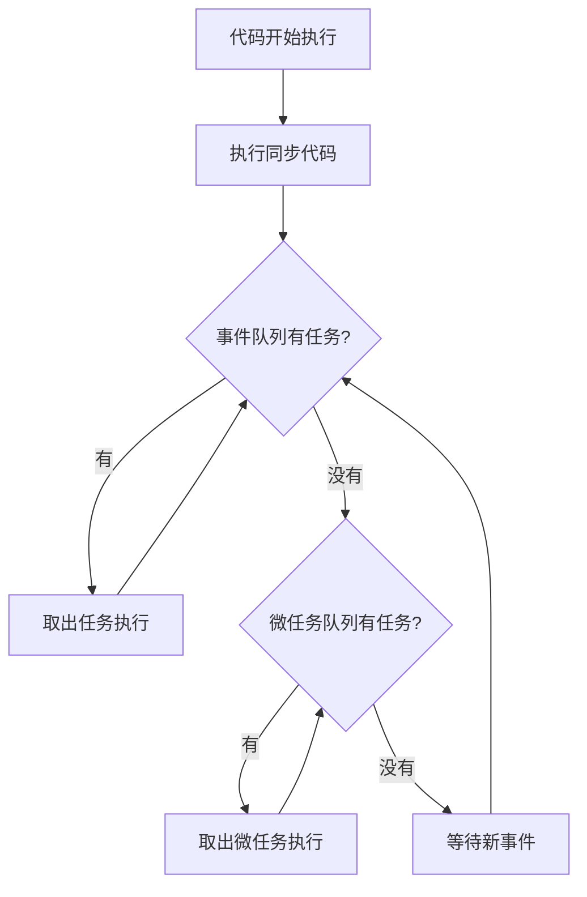
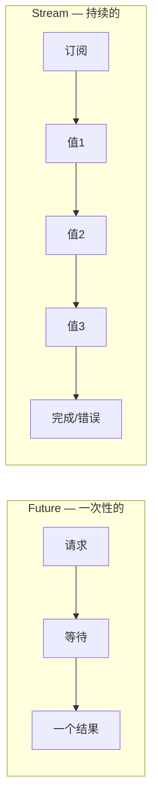
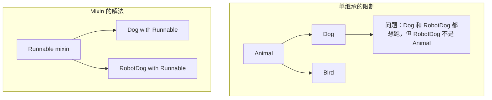

## 一、异步编程

异步是 Flutter 开发的日常——网络请求、文件读写、数据库操作都是异步的。Dart 的异步模型基于事件循环（Event Loop），和 JavaScript 非常相似。

### 1.1 事件循环



Dart 是**单线程**的，通过事件循环实现非阻塞 I/O。这意味着：

- 所有 Dart 代码运行在同一个 isolate（类似线程但更轻量）中
- 长时间的同步操作会阻塞整个应用（UI 卡顿）
- 异步操作通过事件循环调度，不会阻塞

### 1.2 Future：异步操作的结果

`Future` 表示一个"将来才会有的值"，类似 JavaScript 的 `Promise`。

```dart
// 创建 Future
Future<String> fetchUserName() {
  return Future.delayed(
    const Duration(seconds: 2),
    () => 'Koeltp',
  );
}

// 使用 .then() 回调（不推荐，可读性差）
fetchUserName().then((name) {
  print('用户名: $name');
});

// 使用 async/await（推荐，像写同步代码一样写异步）
Future<void> showUserName() async {
  final name = await fetchUserName();
  print('用户名: $name');
}
```

### 1.3 async/await 详解

`async/await` 是 Dart 异步编程的核心语法糖，让异步代码看起来像同步代码：

```dart
// async 标记函数为异步函数，返回值自动包装为 Future
Future<String> loadJournal() async {
  // await 等待 Future 完成，获取结果
  final title = await fetchTitle();
  final content = await fetchContent(title);
  final saved = await saveJournal(content);
  return saved;
}

// 错误处理
Future<void> loadAndShow() async {
  try {
    final journal = await loadJournal();
    print(journal);
  } catch (e) {
    print('加载失败: $e');
  } finally {
    print('加载完成（无论成功失败）');
  }
}
```

**async/await 的坑：**

```dart
// ❌ 常见错误：忘记 await
Future<void> badExample() async {
  loadJournal();  // 忘记 await！这个 Future 的错误不会被捕获
  print('这行会立即执行，不等 loadJournal 完成');
}

// ✅ 正确写法
Future<void> goodExample() async {
  await loadJournal();  // 等待完成
  print('loadJournal 完成后才执行');
}
```

> **规则**：看到 `Future` 返回值，就加 `await`。除非你明确需要"发射后不管"（fire-and-forget）。

### 1.4 并行执行多个 Future

```dart
// 串行执行 — 一个接一个，总耗时 = 2s + 3s = 5s
Future<void> sequential() async {
  final user = await fetchUser();      // 2s
  final posts = await fetchPosts();    // 3s
}

// 并行执行 — 同时发起，总耗时 = max(2s, 3s) = 3s
Future<void> parallel() async {
  final results = await Future.wait([
    fetchUser(),    // 2s
    fetchPosts(),   // 3s
  ]);
  // results[0] 是 fetchUser 的结果
  // results[1] 是 fetchPosts 的结果
}

// 更优雅的写法
Future<void> parallelDestructuring() async {
  final (user, posts) = await (
    fetchUser(),
    fetchPosts(),
  ).wait;  // Dart 3.2+ 的 Record 解构写法
}
```

**什么时候用串行，什么时候用并行？**

| 场景 | 选择 | 原因 |
|------|------|------|
| 后一个依赖前一个的结果 | 串行 | 没得选 |
| 两个请求互不依赖 | 并行 | 节省时间 |
| 需要所有结果才继续 | `Future.wait` | 等所有完成 |
| 只要最快的一个 | `Future.any` | 竞速 |

### 1.5 Stream：异步数据流

`Future` 是"一个异步值"，`Stream` 是"一系列异步值"。可以理解为：Future 是单次请求，Stream 是订阅推送。



```dart
// 创建 Stream
Stream<int> countStream(int max) async* {
  for (var i = 1; i <= max; i++) {
    await Future.delayed(const Duration(seconds: 1));
    yield i;  // yield 产出值，类似 return 但不结束函数
  }
}

// 监听 Stream
void listenCount() {
  countStream(5).listen(
    (value) => print('收到: $value'),   // 每个值
    onError: (e) => print('错误: $e'),   // 错误
    onDone: () => print('完成'),          // 结束
  );
}

// 用 await for 遍历 Stream
Future<void> awaitCount() async {
  await for (final value in countStream(5)) {
    print('收到: $value');
  }
  print('完成');
}
```

**Stream 在 Flutter 中的应用场景：**

| 场景 | 说明 |
|------|------|
| WebSocket 消息 | 持续接收服务器推送 |
| 位置更新 | GPS 持续上报位置 |
| 数据库变更监听 | 数据变化时自动刷新 UI |
| 文件读取 | 大文件分块读取 |
| 动画帧 | 每帧更新 |

### 1.6 StreamController：创建自己的 Stream

```dart
import 'dart:async';

class JournalBloc {
  // StreamController 是 Stream 的"水龙头"，可以往里面灌数据
  final _journalsController = StreamController<List<Journal>>.broadcast();

  // 对外暴露 Stream（只读）
  Stream<List<Journal>> get journalsStream => _journalsController.stream;

  // 往 Stream 里添加数据
  void updateJournals(List<Journal> journals) {
    _journalsController.add(journals);
  }

  // 关闭 Stream（必须调用，否则内存泄漏）
  void dispose() {
    _journalsController.close();
  }
}
```

> **broadcast vs 单订阅**：默认 StreamController 是单订阅的（只能有一个 listener），`.broadcast()` 允许多个 listener。Flutter 中 UI 可能多处监听同一个数据源，通常用 broadcast。

## 二、集合高阶操作符

Dart 的集合操作符和 JavaScript 的 Array 方法非常像，但类型安全。这是 Dart 日常开发中用得最多的语法之一。

### 2.1 核心操作符

```dart
var journals = [
  Journal(title: '日记1', category: '生活', likes: 10),
  Journal(title: '日记2', category: '技术', likes: 25),
  Journal(title: '日记3', category: '生活', likes: 5),
  Journal(title: '日记4', category: '技术', likes: 30),
];

// map — 转换每个元素
var titles = journals.map((j) => j.title).toList();
// ['日记1', '日记2', '日记3', '日记4']

// where — 过滤
var lifeJournals = journals.where((j) => j.category == '生活').toList();
// [日记1, 日记3]

// whereType — 按类型过滤（从混合类型集合中筛选）
var mixed = <dynamic>[1, 'hello', 2.5, 'world', 3];
var strings = mixed.whereType<String>().toList();
// ['hello', 'world']

// reduce — 聚合为一个值
var totalLikes = journals.map((j) => j.likes).reduce((a, b) => a + b);
// 70

// fold — 带初始值的聚合
var totalLikes2 = journals.fold<int>(0, (sum, j) => sum + j.likes);
// 70

// sort — 排序（原地修改）
journals.sort((a, b) => b.likes.compareTo(a.likes));
// 按点赞数降序

// forEach — 遍历（没有返回值）
journals.forEach((j) => print('${j.title}: ${j.likes}'));
```

### 2.2 链式操作

真正的威力在于链式组合：

```dart
// 找出技术类日记中点赞最多的标题
var result = journals
    .where((j) => j.category == '技术')     // 过滤技术类
    .toList()
  ..sort((a, b) => b.likes.compareTo(a.likes))  // 按点赞降序
    .first                                     // 取第一个
    .title;                                    // 取标题
print(result);  // '日记4'

// 更优雅的写法（不修改原列表）
var result2 = journals
    .where((j) => j.category == '技术')
    .reduce((a, b) => a.likes > b.likes ? a : b)
    .title;
```

### 2.3 展开（expand）与去重

```dart
// expand — 一对多展开
var tags = journals.expand((j) => j.tags).toList();
// ['生活', '日常', '技术', 'Flutter', '生活', '旅行', '技术', 'Dart']

// 去重
var uniqueTags = tags.toSet().toList();
// ['生活', '日常', '技术', 'Flutter', '旅行', 'Dart']

// groupBy — 按条件分组（需要 collection 包）
// 或手动实现
var grouped = <String, List<Journal>>{};
for (var j in journals) {
  grouped.putIfAbsent(j.category, () => []).add(j);
}
// {'生活': [日记1, 日记3], '技术': [日记2, 日记4]}
```

### 2.4 集合 if 和 for

Dart 支持在集合字面量中使用 if 和 for，这在 Flutter 构建 Widget 列表时极其好用：

```dart
var showAdmin = true;
var items = [
  '首页',
  '文章',
  if (showAdmin) '管理',     // 条件添加
  '关于',
];
// ['首页', '文章', '管理', '关于']

var categories = ['生活', '技术', '旅行'];
var menuItems = [
  '全部',
  for (var cat in categories) cat,  // 循环展开
  '其他',
];
// ['全部', '生活', '技术', '旅行', '其他']

// Flutter 中的典型用法
Column(
  children: [
    Text('标题'),
    if (isLoading) CircularProgressIndicator(),  // 条件显示
    for (var journal in journals) JournalCard(journal),  // 循环生成
  ],
)
```

## 三、类与继承

### 3.1 类的定义

```dart
class Journal {
  // 属性
  final String title;
  final String content;
  final String category;
  final int likes;
  final DateTime createdAt;

  // 构造函数
  Journal({
    required this.title,
    required this.content,
    this.category = '生活',
    this.likes = 0,
    DateTime? createdAt,
  }) : createdAt = createdAt ?? DateTime.now();

  // 命名构造函数
  Journal.draft({required this.title})
      : content = '',
        category = '草稿',
        likes = 0,
        createdAt = DateTime.now();

  // getter
  bool get isPopular => likes > 100;
  String get summary => content.length > 50
      ? '${content.substring(0, 50)}...'
      : content;

  // 方法
  Journal copyWith({
    String? title,
    String? content,
    String? category,
    int? likes,
  }) {
    return Journal(
      title: title ?? this.title,
      content: content ?? this.content,
      category: category ?? this.category,
      likes: likes ?? this.likes,
      createdAt: createdAt,
    );
  }

  // 重写 toString
  @override
  String toString() => 'Journal($title, $category, ❤$likes)';
}
```

**构造函数要点：**

```dart
// 1. 默认构造函数 — 可以省略，Dart 会生成无参构造函数
class Point {
  double x = 0;
  double y = 0;
}

// 2. 命名参数构造函数 — Flutter 中最常见
class Widget {
  final String key;
  const Widget({required this.key});
}

// 3. 初始化列表 — 在构造函数体执行前初始化 final 字段
class Rectangle {
  final double width;
  final double height;
  final double area;

  Rectangle(this.width, this.height) : area = width * height;
}

// 4. 重定向构造函数
class Person {
  final String name;
  final int age;

  Person(this.name, this.age);
  Person.born(String name) : this(name, 0);  // 重定向到主构造函数
}

// 5. 常量构造函数 — 用 const 创建编译时常量对象
class ImmutablePoint {
  final double x;
  final double y;

  const ImmutablePoint(this.x, this.y);
}

var p1 = const ImmutablePoint(1, 2);
var p2 = const ImmutablePoint(1, 2);
print(identical(p1, p2));  // true！同一个对象
```

### 3.2 继承

```dart
// 基类
class Animal {
  final String name;

  Animal(this.name);

  void speak() => print('$name makes a sound');
}

// 子类
class Dog extends Animal {
  final String breed;

  // 调用父类构造函数
  Dog(String name, this.breed) : super(name);

  @override
  void speak() => print('$name 汪汪！');

  void fetch() => print('$name 捡球');
}
```

**Dart 的继承规则：**

- 单继承 — 只能 extends 一个类
- 所有类都继承自 `Object`
- 子类可以用 `@override` 重写父类方法
- 用 `super` 访问父类

### 3.3 抽象类与接口

Dart 没有 `interface` 关键字。**每个类都可以当作接口使用**：

```dart
// 抽象类 — 不能实例化，可以包含实现
abstract class Repository {
  // 抽象方法 — 子类必须实现
  Future<List<Journal>> getAll();
  Future<Journal?> getById(String id);

  // 具体方法 — 子类可以直接用
  void log(String message) {
    print('[Repository] $message');
  }
}

// 实现抽象类
class LocalRepository extends Repository {
  @override
  Future<List<Journal>> getAll() async {
    log('获取所有日记');
    return [];
  }

  @override
  Future<Journal?> getById(String id) async {
    log('获取日记: $id');
    return null;
  }
}

// 把类当接口用 — implements 表示"我承诺实现这些方法"
// 和 extends 的区别：implements 不继承实现，只继承签名
class MockRepository implements Repository {
  @override
  Future<List<Journal>> getAll() async => [];

  @override
  Future<Journal?> getById(String id) async => null;

  @override
  void log(String message) {
    // 必须自己实现，不继承
  }
}
```

**extends vs implements：**

| | extends | implements |
|---|---------|------------|
| 继承实现 | ✅ 可以复用父类代码 | ❌ 只继承签名 |
| 多个 | ❌ 只能 extends 一个 | ✅ 可以 implements 多个 |
| 使用场景 | "是一个"关系（Dog is Animal） | "能做"关系（MockRepository 能做 Repository 的事） |

## 四、混入（Mixin）

Mixin 是 Dart 最强大的代码复用机制，解决了单继承的限制。**理解 Mixin，是理解 Flutter 框架源码的关键**。

### 4.1 什么是 Mixin



Mixin 是一组可复用的代码，可以被"混入"到任何类中，不需要继承关系：

```dart
// 定义 Mixin
mixin Loggable {
  void log(String message) {
    print('[${runtimeType}] $message');
  }

  void logError(String message, [Object? error]) {
    print('[${runtimeType}] ERROR: $message $error');
  }
}

mixin Timestampable {
  late final DateTime createdAt = DateTime.now();
  late DateTime updatedAt = DateTime.now();

  void touch() {
    updatedAt = DateTime.now();
  }
}

// 使用 Mixin
class Journal with Loggable, Timestampable {
  final String title;
  String content;

  Journal(this.title, this.content);

  void update(String newContent) {
    content = newContent;
    touch();  // 来自 Timestampable mixin
    log('日记已更新: $title');  // 来自 Loggable mixin
  }
}

var journal = Journal('我的日记', '今天天气不错');
journal.update('今天天气很好');
// 输出: [Journal] 日记已更新: 我的日记
print(journal.createdAt);  // 创建时间
print(journal.updatedAt);  // 更新时间
```

### 4.2 Mixin 的约束（on 关键字）

```dart
// on 关键字限制 Mixin 只能用于特定类的子类
mixin Flyable on Bird {
  void fly() => print('$runtimeType 在飞');
  void soar() {
    fly();
    print('翱翔中...');
  }
}

class Bird {
  void layEggs() => print('下蛋');
}

class Eagle extends Bird with Flyable {
  // ✅ Eagle 是 Bird 的子类，可以使用 Flyable
}

// class Airplane with Flyable {}  // ❌ 编译错误！Airplane 不是 Bird 的子类
```

### 4.3 Flutter 中的 Mixin

Flutter 框架大量使用 Mixin，理解它们对阅读源码至关重要：

```dart
// Flutter 框架中的经典 Mixin 用法
class StatefulWidget extends Widget {
  // ...
}

// SingleTickerProviderStateMixin — 提供动画帧回调
class _MyWidgetState extends State<MyWidget>
    with SingleTickerProviderStateMixin {
  late AnimationController _controller;

  @override
  void initState() {
    super.initState();
    // this 可以作为 TickerProvider，因为混入了 SingleTickerProviderStateMixin
    _controller = AnimationController(vsync: this, duration: Duration(seconds: 1));
  }
}

// 其他常用 Mixin：
// - AutomaticKeepAliveClientMixin — 保持页面不被销毁
// - WidgetsBindingObserver — 监听应用生命周期
// - RestorationMixin — 状态保存与恢复
```

## 五、泛型

泛型让你写出的代码可以适用于多种类型，同时保持类型安全。

### 5.1 基本用法

```dart
// 泛型类
class Box<T> {
  final T value;
  Box(this.value);

  T unwrap() => value;
}

var intBox = Box<int>(42);
var strBox = Box<String>('hello');
// var badBox = Box<int>('hello');  // ❌ 编译错误！

// 泛型方法
T firstOrNull<T>(List<T> items) {
  return items.isEmpty ? throw StateError('空列表') : items.first;
}

// 泛型扩展
extension ListFirstOrNull<T> on List<T> {
  T? get firstOrNull => isEmpty ? null : first;
}
```

### 5.2 泛型约束

```dart
// 限制 T 必须是某个类的子类
class Repository<T extends Serializable> {
  final List<T> items = [];

  void save(T item) {
    // 可以调用 Serializable 上的方法
    print(item.serialize());
    items.add(item);
  }
}

abstract class Serializable {
  String serialize();
}

class Journal implements Serializable {
  final String title;
  Journal(this.title);

  @override
  String serialize() => '{"title": "$title"}';
}

var repo = Repository<Journal>();
// var badRepo = Repository<String>();  // ❌ String 不是 Serializable
```

### 5.3 协变与逆变

```dart
// Dart 的泛型默认是不变的（invariant）
// 这意味着 List<Child> 不是 List<Parent> 的子类

class Animal {}
class Dog extends Animal {}

void feedAnimals(List<Animal> animals) {
  animals.forEach((a) => print('喂食'));
}

var dogs = <Dog>[Dog(), Dog()];
// feedAnimals(dogs);  // ❌ 编译错误！List<Dog> 不是 List<Animal>

// 解决方式1：使用 List<Parent> 声明
var animals = <Animal>[Dog(), Dog()];
feedAnimals(animals);  // ✅

// 解决方式2：使用协变
void feedAnimalsCovariant(List<Animal> animals) {
  animals.forEach((a) => print('喂食'));
}

// Dart 3 中可以用类型参数的协变
void feedAnimals2(List<Animal> animals) => feedAnimals(animals);
```

## 六、Record 与 Pattern Matching（Dart 3）

Dart 3 引入了 Record 和 Pattern Matching，这是语言层面的重大升级。

### 6.1 Record — 轻量级数据聚合

```dart
// 位置 Record
var point = (1, 2);
print(point.$1);  // 1
print(point.$2);  // 2

// 命名 Record
var user = (name: 'Koeltp', age: 25);
print(user.name);  // 'Koeltp'
print(user.age);   // 25

// 混合 Record
var mixed = ('hello', count: 42);
print(mixed.$1);      // 'hello'
print(mixed.count);   // 42

// 作为函数返回值（替代自定义类）
(String, int) getUser() => ('Koeltp', 25);

void main() {
  final (name, age) = getUser();  // 解构
  print('$name, $age');
}
```

### 6.2 Pattern Matching

```dart
// 解构赋值
var (name, age) = ('Koeltp', 25);

// List 解构
var [first, second, ...rest] = [1, 2, 3, 4, 5];
print(first);  // 1
print(rest);   // [3, 4, 5]

// Map 解构
var {'name': n, 'age': a} = {'name': 'Koeltp', 'age': 25};

// switch 中的模式匹配
String describe(Object obj) => switch (obj) {
  int i => '整数: $i',
  String s => '字符串: $s',
  List l => '列表，长度 ${l.length}',
  _ => '其他类型',
};

// 守卫条件
String classify(int n) => switch (n) {
  < 0 => '负数',
  0 => '零',
  > 0 && <= 100 => '小正数',
  > 100 => '大正数',
  _ => '不可能',
};

// 对象解构
switch (journal) {
  Journal(title: var t, likes: var l) when l > 100:
    print('热门: $t');
  Journal(title: var t):
    print('普通: $t');
}
```

## 七、小结

本篇覆盖了 Dart 的进阶特性：

| 概念 | 核心要点 |
|------|---------|
| 异步编程 | Future/async/await 是日常，Stream 处理持续数据流 |
| 集合操作符 | map/where/reduce/fold + 链式调用 + 集合 if/for |
| 类与继承 | 命名参数构造函数、extends vs implements |
| Mixin | 代码复用的利器，Flutter 框架大量使用 |
| 泛型 | 类型安全的通用代码，约束用 extends |
| Record & Pattern | Dart 3 新特性，解构和模式匹配让代码更简洁 |

到这里，Dart 语言的核心知识已经够用了。下一篇我们正式进入 Flutter，学习 **Widget——一切皆组件**。

---

上一篇：[Dart 语言速览（上）](/docs/flutter/02Dart语言速览（上）.html)

下一篇：[Widget 一切皆组件](/docs/flutter/03Widget一切皆组件.html)
