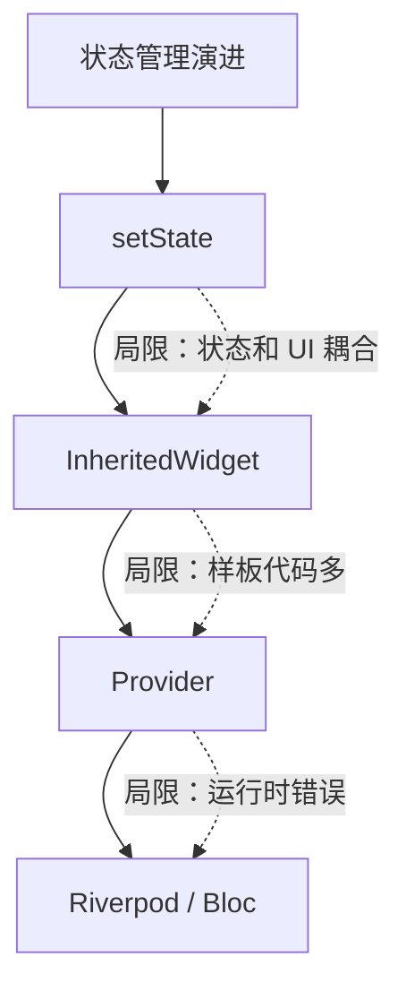
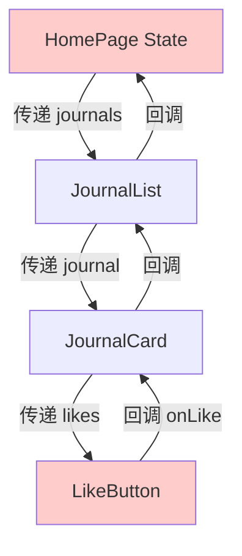
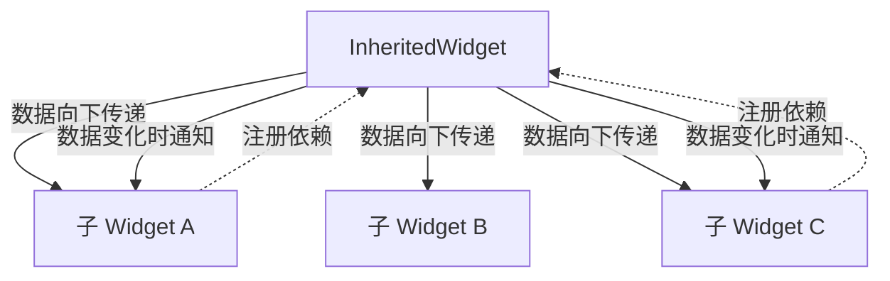

## 一、为什么需要状态管理

"状态"是应用中会随时间变化的数据——用户输入、网络请求结果、UI 切换状态等。管理状态就是回答两个问题：

1. **状态存在哪里？**（数据归属）
2. **状态变化后，谁该更新？**（通知机制）



## 二、setState 的局限

前面我们一直在用 `setState`，它简单直接，但随着应用增长会暴露问题：

```dart
// ❌ 问题1：状态和 UI 耦合
class _HomePageState extends State<HomePage> {
  List<Journal> _journals = [];      // 状态在 State 里
  bool _isLoading = false;
  String? _error;

  void _loadJournals() async {
    setState(() => _isLoading = true);
    try {
      final journals = await fetchJournals();
      setState(() {
        _journals = journals;
        _isLoading = false;
      });
    } catch (e) {
      setState(() {
        _error = e.toString();
        _isLoading = false;
      });
    }
  }

  @override
  Widget build(BuildContext context) {
    // UI 和状态混在一起
  }
}
```

**setState 的三大问题：**

| 问题 | 说明 |
|------|------|
| 状态和 UI 耦合 | 状态存在 State 中，无法跨页面共享 |
| 局部重建 | setState 会重建整个 Widget，无法精确控制 |
| 无法跨组件 | 子组件无法直接访问父组件的状态（除非层层传递） |



这就是**回调地狱**——状态从顶层传到底层，事件又从底层冒泡到顶层，中间每一层都要传递。

## 三、InheritedWidget：Flutter 的状态传递基石

InheritedWidget 是 Flutter 框架内置的状态共享机制。**Provider 本质上就是对 InheritedWidget 的封装**，理解它很重要。

### 3.1 原理



InheritedWidget 的核心机制：
1. 子 Widget 通过 `of(context)` 方法向上查找 InheritedWidget，获取数据
2. 查找时自动注册依赖关系
3. InheritedWidget 数据变化时，通知所有注册了依赖的子 Widget 重建

### 3.2 手写一个 InheritedWidget

```dart
/// 数据模型
class JournalState {
  final List<Journal> journals;
  final bool isLoading;
  final String? error;

  const JournalState({
    this.journals = const [],
    this.isLoading = false,
    this.error,
  });

  JournalState copyWith({
    List<Journal>? journals,
    bool? isLoading,
    String? error,
  }) {
    return JournalState(
      journals: journals ?? this.journals,
      isLoading: isLoading ?? this.isLoading,
      error: error,
    );
  }
}

/// InheritedWidget — 负责向下传递数据
class InheritedJournalContainer extends InheritedWidget {
  final JournalState state;
  final void Function(JournalState) onUpdate;

  const InheritedJournalContainer({
    super.key,
    required this.state,
    required this.onUpdate,
    required super.child,
  });

  // 子 Widget 通过这个方法获取数据
  static InheritedJournalContainer of(BuildContext context) {
    final container = context.dependOnInheritedWidgetOfExactType<InheritedJournalContainer>();
    assert(container != null, 'No InheritedJournalContainer found in context');
    return container!;
  }

  // 决定是否通知子 Widget 重建
  @override
  bool updateShouldNotify(InheritedJournalContainer oldWidget) {
    return state != oldWidget.state;
  }
}

/// StatefulWidget — 负责持有和修改状态
class JournalContainer extends StatefulWidget {
  final Widget child;

  const JournalContainer({super.key, required this.child});

  @override
  State<JournalContainer> createState() => _JournalContainerState();
}

class _JournalContainerState extends State<JournalContainer> {
  JournalState _state = const JournalState();

  void _updateState(JournalState newState) {
    setState(() => _state = newState);
  }

  Future<void> loadJournals() async {
    _updateState(_state.copyWith(isLoading: true));
    try {
      final journals = await fetchJournals();
      _updateState(JournalState(journals: journals));
    } catch (e) {
      _updateState(_state.copyWith(isLoading: false, error: e.toString()));
    }
  }

  @override
  Widget build(BuildContext context) {
    return InheritedJournalContainer(
      state: _state,
      onUpdate: _updateState,
      child: widget.child,
    );
  }
}
```

**子 Widget 使用：**

```dart
class JournalList extends StatelessWidget {
  @override
  Widget build(BuildContext context) {
    // 通过 of(context) 获取数据，自动注册依赖
    final container = InheritedJournalContainer.of(context);
    final journals = container.state.journals;

    if (container.state.isLoading) {
      return const Center(child: CircularProgressIndicator());
    }

    return ListView.builder(
      itemCount: journals.length,
      itemBuilder: (context, index) => JournalCard(journal: journals[index]),
    );
  }
}
```

**InheritedWidget 的问题：** 样板代码太多！每个状态都要写 InheritedWidget + StatefulWidget 两个类。这就是 Provider 存在的意义。

## 四、Provider：InheritedWidget 的最佳封装

Provider 是 Flutter 官方推荐的状态管理方案，它封装了 InheritedWidget 的样板代码，用起来简单很多。

### 4.1 安装

```yaml
dependencies:
  provider: ^6.0.0
```

### 4.2 ChangeNotifier：状态容器

Provider 通常和 `ChangeNotifier` 配合使用——ChangeNotifier 负责持有状态和通知变化：

```dart
import 'package:flutter/material.dart';

/// 日记状态管理器
class JournalProvider extends ChangeNotifier {
  List<Journal> _journals = [];
  bool _isLoading = false;
  String? _error;

  // 只读访问器
  List<Journal> get journals => _journals;
  bool get isLoading => _isLoading;
  String? get error => _error;

  // 修改状态的方法
  Future<void> loadJournals() async {
    _isLoading = true;
    _error = null;
    notifyListeners();  // 通知 UI 更新

    try {
      _journals = await fetchJournals();
      _isLoading = false;
      notifyListeners();
    } catch (e) {
      _error = e.toString();
      _isLoading = false;
      notifyListeners();
    }
  }

  Future<void> addJournal(Journal journal) async {
    await saveJournal(journal);
    _journals.insert(0, journal);
    notifyListeners();
  }

  void likeJournal(String id) {
    final index = _journals.indexWhere((j) => j.id == id);
    if (index >= 0) {
      _journals[index] = _journals[index].copyWith(
        likes: _journals[index].likes + 1,
      );
      notifyListeners();
    }
  }

  void deleteJournal(String id) {
    _journals.removeWhere((j) => j.id == id);
    notifyListeners();
  }
}
```

### 4.3 在应用中注册 Provider

```dart
void main() {
  runApp(
    // ChangeNotifierProvider 在 Widget 树顶部注册
    ChangeNotifierProvider(
      create: (context) => JournalProvider(),
      child: const JournalApp(),
    ),
  );
}
```

**多 Provider 注册：**

```dart
MultiProvider(
  providers: [
    ChangeNotifierProvider(create: (_) => JournalProvider()),
    ChangeNotifierProvider(create: (_) => ThemeProvider()),
    ChangeNotifierProvider(create: (_) => AuthProvider()),
  ],
  child: const JournalApp(),
)
```

### 4.4 在 Widget 中使用 Provider

```dart
class JournalList extends StatelessWidget {
  @override
  Widget build(BuildContext context) {
    // 方式1：context.watch — 监听变化，数据变化时自动重建
    final provider = context.watch<JournalProvider>();

    if (provider.isLoading) {
      return const Center(child: CircularProgressIndicator());
    }

    if (provider.error != null) {
      return Center(child: Text('加载失败: ${provider.error}'));
    }

    return ListView.builder(
      itemCount: provider.journals.length,
      itemBuilder: (context, index) {
        final journal = provider.journals[index];
        return JournalCard(
          key: ValueKey(journal.id),
          journal: journal,
          onTap: () => context.push('/journal/${journal.id}'),
          onLike: () => provider.likeJournal(journal.id),
        );
      },
    );
  }
}
```

### 4.5 watch vs read vs select

```dart
// watch — 监听变化，重建 Widget
final provider = context.watch<JournalProvider>();

// read — 只读一次，不监听变化（适合事件回调中使用）
// 避免在事件回调中用 watch，因为回调里不需要重建
onPressed: () => context.read<JournalProvider>().likeJournal(id),

// select — 精确监听某个属性，只有该属性变化时才重建
final isLoading = context.select<JournalProvider, bool>((p) => p.isLoading);
final journalCount = context.select<JournalProvider, int>((p) => p.journals.length);
```

**选择指南：**

| 场景 | 用哪个 |
|------|--------|
| build 方法中需要数据 | `watch` |
| 事件回调中调用方法 | `read` |
| 只关心某个属性 | `select`（性能最优） |

### 4.6 Consumer 和 Selector

当只想重建 Widget 树的一部分时，用 Consumer 或 Selector：

```dart
// Consumer — 局部重建
Scaffold(
  appBar: AppBar(title: const Text('日记')),  // 不会重建
  body: Consumer<JournalProvider>(             // 只有这部分重建
    builder: (context, provider, child) {
      return ListView.builder(
        itemCount: provider.journals.length,
        itemBuilder: (context, index) => JournalCard(journal: provider.journals[index]),
      );
    },
  ),
)

// Selector — 更精确的局部重建
Selector<JournalProvider, int>(
  selector: (context, provider) => provider.journals.length,
  builder: (context, count, child) {
    return Text('$count 篇日记');
  },
)
```

### 4.7 Provider 的生命周期

```dart
// 懒加载：默认在第一次被访问时创建
// 如果需要立即初始化（如加载数据），在 create 中调用
ChangeNotifierProvider(
  create: (context) => JournalProvider()..loadJournals(),  // 创建后立即加载
  child: const JournalApp(),
)

// 自动释放：当 Provider 从 Widget 树中移除时，自动调用 dispose()
// 如果有需要清理的资源，重写 dispose 方法
class JournalProvider extends ChangeNotifier {
  StreamSubscription? _subscription;

  void init() {
    _subscription = someStream.listen(/* ... */);
  }

  @override
  void dispose() {
    _subscription?.cancel();  // 清理资源
    super.dispose();
  }
}
```

## 五、Flutter Journal 用 Provider 重构

把之前的 setState 版本重构为 Provider 版本：

```dart
// main.dart
void main() {
  runApp(
    MultiProvider(
      providers: [
        ChangeNotifierProvider(create: (_) => JournalProvider()..loadJournals()),
        ChangeNotifierProvider(create: (_) => ThemeProvider()),
      ],
      child: const JournalApp(),
    ),
  );
}

// home_page.dart
class HomePage extends StatelessWidget {
  const HomePage({super.key});

  @override
  Widget build(BuildContext context) {
    return Scaffold(
      appBar: AppBar(
        title: const Text('我的日记'),
        backgroundColor: Theme.of(context).colorScheme.inversePrimary,
      ),
      body: Consumer<JournalProvider>(
        builder: (context, provider, _) {
          if (provider.isLoading) {
            return const Center(child: CircularProgressIndicator());
          }

          if (provider.journals.isEmpty) {
            return Center(
              child: Column(
                mainAxisAlignment: MainAxisAlignment.center,
                children: const [
                  Icon(Icons.menu_book, size: 64, color: Colors.indigo),
                  SizedBox(height: 16),
                  Text('还没有日记', style: TextStyle(fontSize: 18, color: Colors.grey)),
                ],
              ),
            );
          }

          return RefreshIndicator(
            onRefresh: () => context.read<JournalProvider>().loadJournals(),
            child: ListView.builder(
              itemCount: provider.journals.length,
              itemBuilder: (context, index) {
                final journal = provider.journals[index];
                return JournalCard(
                  key: ValueKey(journal.id),
                  journal: journal,
                  onTap: () => context.push('/journal/${journal.id}'),
                  onLike: () => context.read<JournalProvider>().likeJournal(journal.id),
                );
              },
            ),
          );
        },
      ),
      floatingActionButton: FloatingActionButton(
        onPressed: () => context.push('/editor'),
        child: const Icon(Icons.add),
      ),
    );
  }
}
```

**对比 setState 版本的改进：**

| | setState 版本 | Provider 版本 |
|---|-------------|--------------|
| 状态位置 | 在 State 类中 | 在 Provider 中，独立于 UI |
| 跨页面共享 | 需要层层传递 | 任意位置 `context.watch` |
| 重建范围 | 整个 State 重建 | Consumer/Selector 精确重建 |
| 可测试性 | 需要 Widget 测试 | Provider 可以单独单元测试 |

## 六、Provider 的最佳实践

### 6.1 状态不可变

```dart
// ❌ 直接修改可变对象
class JournalProvider extends ChangeNotifier {
  List<Journal> journals = [];  // 可变列表

  void addJournal(Journal j) {
    journals.add(j);  // 直接修改，Provider 可能检测不到变化
    notifyListeners();
  }
}

// ✅ 每次修改都创建新对象
class JournalProvider extends ChangeNotifier {
  List<Journal> _journals = [];

  List<Journal> get journals => List.unmodifiable(_journals);  // 对外不可变

  void addJournal(Journal j) {
    _journals = [..._journals, j];  // 创建新列表
    notifyListeners();
  }
}
```

### 6.2 避免在 build 中调用 read

```dart
// ❌ 每次 build 都调用 read
@override
Widget build(BuildContext context) {
  context.read<JournalProvider>().loadJournals();  // 每次重建都触发加载！
  return ListView(/* ... */);
}

// ✅ 在 initState 或事件回调中调用
class _HomePageState extends State<HomePage> {
  @override
  void initState() {
    super.initState();
    // 使用 addPostFrameCallback 确保 context 可用
    WidgetsBinding.instance.addPostFrameCallback((_) {
      context.read<JournalProvider>().loadJournals();
    });
  }
}
```

### 6.3 拆分 Provider

```dart
// ❌ 一个巨大的 Provider 管理所有状态
class AppProvider extends ChangeNotifier {
  List<Journal> journals = [];
  User? user;
  ThemeMode themeMode = ThemeMode.system;
  Locale locale = const Locale('zh');
  // ... 越来越多
}

// ✅ 按功能拆分
MultiProvider(
  providers: [
    ChangeNotifierProvider(create: (_) => JournalProvider()),
    ChangeNotifierProvider(create: (_) => AuthProvider()),
    ChangeNotifierProvider(create: (_) => ThemeProvider()),
  ],
  child: const App(),
)
```

## 七、小结

| 方案 | 优点 | 缺点 | 适用场景 |
|------|------|------|---------|
| setState | 简单直接 | 状态和 UI 耦合，无法跨组件 | 单页面简单状态 |
| InheritedWidget | 框架内置，跨组件共享 | 样板代码多 | 理解原理，不直接使用 |
| Provider | 简单易用，官方推荐 | 运行时错误（找不到 Provider） | 中小型应用 |

下一篇我们学习 **Riverpod 和 Bloc**——更强大的状态管理方案，解决 Provider 的运行时错误问题，并支持更复杂的场景。

---

上一篇：[路由与导航](/docs/flutter/05路由与导航.html)

下一篇：[状态管理（下）](/docs/flutter/07状态管理（下）.html)
