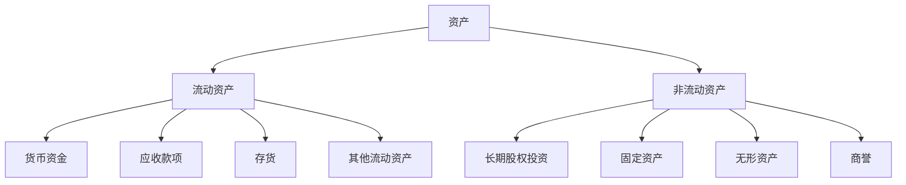
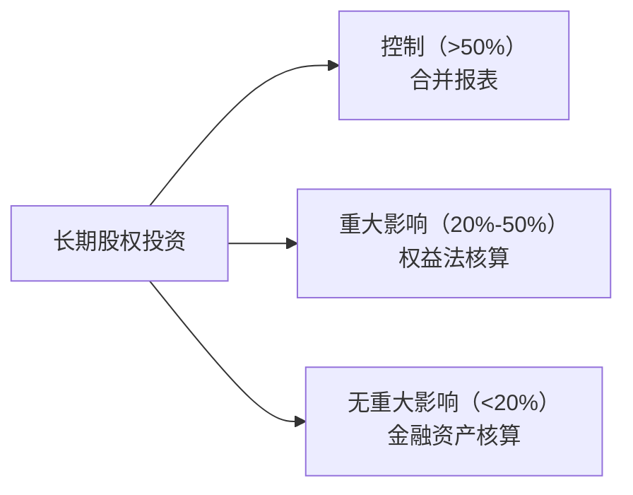

## 一、资产负债表的结构

资产负债表的核心等式：**资产 = 负债 + 所有者权益**

资产按照**流动性**从高到低排列：

> **流动性**：转化为现金的速度和确定性。流动性越高，变现越快、越确定。

## 二、货币资金

货币资金是最"硬"的资产，包括库存现金、银行存款和其他货币资金。

### 关注要点

| 指标 | 健康表现 | 风险信号 |
|------|---------|---------|
| 绝对金额 | 与经营规模匹配 | 远小于短期债务 |
| 占总资产比 | 行业合理区间 | 异常偏高（资金闲置）或偏低（偿债风险） |
| 受限资金 | 占比小 | 大量保证金、冻结资金 |

### 常见陷阱

- **"存贷双高"**：货币资金和短期借款同时很高——钱明明够用为什么还要大量借款？可能存在资金挪用或虚构存款
- **受限资金**：其他货币资金中的保证金、冻结存款并非可自由支配的现金

> **唐朝提醒**：货币资金要与短期债务对比看。如果货币资金远小于短期借款，公司可能面临偿债压力；如果货币资金充裕却大量借债，要警惕"存贷双高"造假。

## 三、应收账款

应收账款是卖了货但还没收到的钱，本质是**客户占用了公司的资金**。

### 核心分析维度

**1. 应收账款占营业收入的比例**

$$应收账款占比 = \frac{应收账款}{营业收入}$$

- 比例上升 → 公司对下游的话语权在减弱
- 比例下降 → 公司竞争力增强，回款能力提升

**2. 账龄分析**

| 账龄 | 风险等级 | 说明 |
|------|---------|------|
| 1年以内 | 低 | 正常商业信用期 |
| 1-2年 | 中 | 回收不确定性增加 |
| 2-3年 | 高 | 大概率成为坏账 |
| 3年以上 | 极高 | 基本可以认定为坏账 |

**3. 坏账准备**

公司必须对应收账款计提坏账准备，计提比例反映管理层对回收可能性的判断：

- 计提比例过低 → 可能虚增利润
- 计提比例突然大幅提高 → 可能"洗大澡"，一次性释放风险

### 应收账款 vs 应收票据

| 对比项 | 应收账款 | 应收票据 |
|-------|---------|---------|
| 性质 | 纯信用，无担保 | 有票据作为支付承诺 |
| 风险 | 较高 | 较低（尤其是银行承兑汇票） |
| 流动性 | 不能贴现 | 可以贴现或背书转让 |

> **唐朝提醒**：应收账款的变化趋势比绝对值更重要。如果一家公司营收增长但应收账款增长更快，说明增长的质量在下降——看似赚了更多钱，实际上更多是"纸面利润"。

## 四、预付账款

预付账款是先付钱后收货，本质是**公司占用了自己的资金给供应商**。

- 预付账款大幅增加 → 可能是供应商强势，也可能是关联方资金占用
- 预付账款长期挂账 → 要警惕是否真实交易

## 五、存货

存货是公司为出售或消耗而持有的资产，包括原材料、在产品、产成品等。

### 核心风险：存货跌价

存货按照**成本与可变现净值孰低**计量。当存货市价下跌时，必须计提跌价准备。

### 关键指标

**1. 存货周转率**

$$存货周转率 = \frac{营业成本}{平均存货}$$

- 周转率越高 → 存货变现越快，运营效率越高
- 周转率持续下降 → 产品滞销，跌价风险增大

**2. 存货结构**

| 类型 | 风险特征 |
|------|---------|
| 原材料 | 受大宗商品价格影响 |
| 在产品 | 生产周期长的企业需特别关注 |
| 产成品 | 最直接反映销售状况，积压即风险 |

### 常见造假手法

- **虚增存货**：通过虚构采购增加存货，同时虚增收入
- **存货减值不充分**：不计提或少量计提跌价准备，虚增资产和利润

> **唐朝提醒**：存货是最容易藏污纳垢的科目之一。对于存货占比高的企业，一定要结合存货周转率和毛利率交叉验证——如果存货越来越多、周转越来越慢、毛利率却异常稳定，大概率有问题。

## 六、长期股权投资

长期股权投资是对其他企业的股权投资，按持股比例和影响力不同，采用不同的核算方法：

### 权益法 vs 成本法

| 核算方法 | 适用场景 | 利润影响 |
|---------|---------|---------|
| 成本法 | 控制（子公司） | 仅在分红时确认投资收益 |
| 权益法 | 重大影响（联营/合营） | 按持股比例确认被投资方净利润 |

### 风险信号

- 长期股权投资金额大但长期不分红 → 可能是"提款机"或利益输送
- 投资收益与现金流严重背离 → 纸面利润，钱没到账
- 频繁买卖股权、确认大额投资收益 → 可能是"炒股"而非经营

> **唐朝提醒**：长期股权投资是关联交易和利益输送的高发区。如果一家公司的利润很大一部分来自"投资收益"，而经营利润平平，要格外小心。
