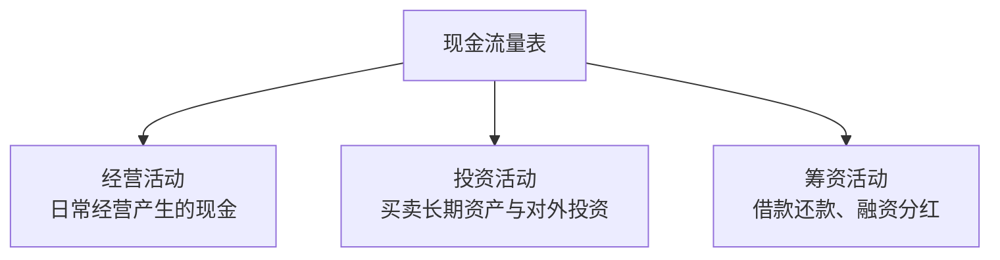

## 一、为什么需要现金流量表

利润表告诉你公司"应该"赚了多少钱，现金流量表告诉你公司"实际"收了多少钱。

**利润可以粉饰，现金流很难造假。**

一个经典的对比：

| 场景 | 利润表 | 现金流量表 |
|------|-------|-----------|
| 赊销100万 | 营业收入+100万 | 经营现金流+0 |
| 收回欠款80万 | 无变化 | 经营现金流+80万 |
| 计提坏账20万 | 资产减值损失+20万 | 无变化 |

> **唐朝心法**：利润是"意见"，现金流是"事实"。一家公司可以长期没有利润，但不能长期没有现金流。

## 二、三大活动

现金流量表将所有现金收支分为三大类：

### 1. 经营活动现金流

经营活动是公司"本职工作"产生的现金，是最核心、最可持续的现金来源。

**关键指标**：

| 指标 | 公式 | 含义 |
|------|------|------|
| 经营活动现金净流量 | 经营流入 - 经营流出 | 公司是否"造血" |
| 经营现金流/净利润 | 经营现金流 ÷ 净利润 | 利润的现金含量 |
| 销售收现比 | 销售商品收到的现金 ÷ 营业收入 | 收入的现金含量 |

**判断标准**：

- 经营现金流 > 0 → 公司在造血
- 经营现金流 < 净利润 → 利润含金量不足
- 经营现金流 < 0 → 公司在失血，靠借钱或变卖资产维持

### 2. 投资活动现金流

投资活动反映公司的资本配置决策：

| 现金流方向 | 含义 |
|-----------|------|
| 投资现金流 < 0（净流出） | 公司在扩张、买入资产 |
| 投资现金流 > 0（净流入） | 公司在收缩、卖出资产 |

**关注要点**：

- 投资流出是否与战略方向一致
- 投资收益的现金回笼情况
- 大额并购的合理性

### 3. 筹资活动现金流

筹资活动反映公司的融资和分配决策：

| 现金流方向 | 含义 |
|-----------|------|
| 筹资现金流 > 0（净流入） | 公司在借钱或融资 |
| 筹资现金流 < 0（净流出） | 公司在还债或分红 |

## 三、三大活动的组合分析

三大活动的正负组合可以判断公司所处的发展阶段：

| 经营 | 投资 | 筹资 | 阶段 | 说明 |
|------|------|------|------|------|
| + | - | + | 成长期 | 自身造血+外部融资，扩大投资 |
| + | - | - | 成熟期 | 自身造血，偿还债务+分红 |
| + | + | - | 衰退前期 | 经营尚可但不再扩张，收缩投资 |
| - | + | + | 困难期 | 经营失血，变卖资产+借钱度日 |
| - | - | + | 危险期 | 经营失血+持续投资，全靠输血 |
| + | + | + | 异常 | 需深入分析原因 |

> **唐朝提醒**：最健康的组合是"经营正、投资负、筹资负"——靠自身经营造血，适度投资扩张，同时有能力还债和分红。

## 四、经营现金流深入分析

### 1. 经营现金流与净利润的关系

$$经营现金流 ÷ 净利润$$

| 比值 | 含义 |
|------|------|
| > 1.2 | 利润质量优秀，现金回笼充分 |
| 0.8-1.2 | 正常范围 |
| 0.5-0.8 | 利润含金量不足，需关注应收和存货 |
| < 0.5 | 利润可能是"纸面利润" |

### 2. 经营现金流的构成

经营现金流主要包括：

| 流入项 | 流出项 |
|-------|-------|
| 销售商品、提供劳务收到的现金 | 购买商品、接受劳务支付的现金 |
| 收到的税费返还 | 支付给职工的现金 |
| 收到其他与经营有关的现金 | 支付的各项税费 |

**最核心的一组数据**：

- **销售商品收到的现金** vs **营业收入**：收现比
- **购买商品支付的现金** vs **营业成本**：付现比

### 3. 现金流造假识别

- **经营现金流为正但主要靠"其他"**：核心经营现金流可能为负
- **经营现金流突然大幅改善**：可能是延迟付款、出售应收账款等非经常性手段
- **经营现金流与净利润长期背离**：利润不可信

## 五、自由现金流

自由现金流是衡量企业"真正可自由支配的现金"的指标：

$$自由现金流 = 经营活动现金净流量 - 资本支出$$

其中，资本支出（CAPEX）是维持经营所必需的长期资产投资。

### 自由现金流的意义

| 自由现金流 | 含义 |
|-----------|------|
| > 0 | 公司创造了超过维持经营所需的现金，可以分红、还债、扩张 |
| < 0 | 公司经营产生的现金不足以覆盖投资需求，需要外部融资 |
| 长期 > 0 | 优秀公司的标志 |
| 长期 < 0 | 公司可能永远需要外部输血 |

> **唐朝心法**：自由现金流是估值的基石。一家公司的内在价值，等于其未来自由现金流的折现值。长期不能产生自由现金流的公司，无论利润多好看，都不值得投资。
