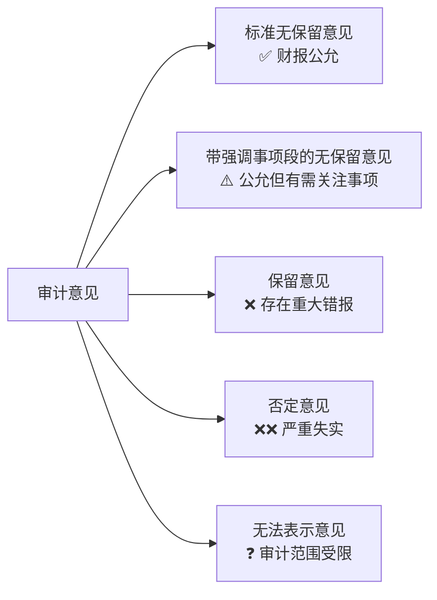

## 一、附注——财报的"说明书"

附注是财务报表不可或缺的组成部分，是对报表数据的详细解释和补充说明。

**不读附注的财报分析，就像只看体检报告的结论页。**

### 附注的主要内容

## 二、会计政策与会计估计

会计政策是公司编制财报时采用的**原则、基础和会计处理方法**。不同的会计政策选择会显著影响报表数据。

### 关键会计政策

| 会计政策 | 选择空间 | 对利润的影响 |
|---------|---------|------------|
| 折旧方法 | 直线法/加速折旧法 | 加速折旧前期利润低 |
| 折旧年限 | 管理层估计 | 年限长→折旧少→利润高 |
| 存货计价 | 先进先出/加权平均 | 影响营业成本和毛利 |
| 收入确认 | 时点/时段 | 影响收入确认节奏 |
| 研发支出 | 费用化/资本化 | 资本化减少当期费用 |

### 会计估计变更

会计估计是管理层对不确定事项的判断，如：

- 坏账准备计提比例
- 存货跌价准备
- 固定资产预计使用寿命
- 预计负债

**会计估计变更的影响**：

- 提高坏账计提比例 → 增加费用、减少利润
- 延长折旧年限 → 减少折旧、增加利润
- 降低存货跌价准备 → 减少损失、增加利润

> **唐朝提醒**：会计政策变更和会计估计变更必须在附注中披露。频繁变更会计政策和估计的公司，往往是在"调节"利润。

## 三、报表项目明细

附注对报表中的每个重要科目都提供了明细说明，这是深入理解报表数据的关键。

### 重点关注的明细

**1. 应收账款明细**

- 按账龄列示的金额和坏账准备
- 前五大欠款方及金额
- 关联方应收账款

**2. 存货明细**

- 原材料、在产品、产成品的金额和占比
- 存货跌价准备及转回情况

**3. 营业收入明细**

- 按产品/地区/客户分类的收入
- 前五大客户收入占比

**4. 投资收益明细**

- 权益法核算的投资收益
- 处置投资的投资收益
- 金融资产公允价值变动

## 四、关联方及关联交易

关联交易是**上市公司与关联方之间的交易**，是利益输送的高发区。

### 常见关联交易类型

| 类型 | 风险点 |
|------|-------|
| 关联采购 | 高价采购→利益输送 |
| 关联销售 | 低价销售→利益输送 |
| 关联担保 | 担保风险 |
| 关联资金往来 | 资金占用 |
| 关联租赁 | 定价不公允 |

### 识别关联交易异常

- 关联交易占比过高
- 关联交易价格与市场价偏离
- 关联方应收/应付款项长期挂账
- 频繁新增关联方

> **唐朝提醒**：关联交易不一定都是坏事，但必须关注定价是否公允。如果一家公司的主要客户或供应商都是关联方，利润的真实性要打折扣。

## 五、或有事项与承诺

或有事项是**过去的交易或事项形成的、结果须由未来事项决定的事项**：

| 类型 | 示例 | 财务影响 |
|------|------|---------|
| 未决诉讼 | 被起诉赔偿 | 可能导致大额支出 |
| 债务担保 | 为关联方担保 | 可能承担连带责任 |
| 产品质量保证 | 售后承诺 | 未来可能发生支出 |
| 承诺事项 | 资本支出承诺 | 未来现金流出 |

**关键判断**：或有事项是否满足**预计负债**的确认条件：

1. 现时义务（已经存在）
2. 经济利益很可能流出（概率 > 50%）
3. 金额能够可靠计量

> 不满足确认条件的或有事项，只在附注中披露，不影响报表数据——但这不代表没有风险！

## 六、资产负债表日后事项

日后事项是资产负债表日（通常为12月31日）到财报批准报出日之间发生的事项：

| 类型 | 处理方式 | 示例 |
|------|---------|------|
| 调整事项 | 调整报表数据 | 诉讼判决、坏账确认 |
| 非调整事项 | 仅在附注披露 | 重大投资、自然灾害 |

## 七、审计意见——财报的"信用评级"

审计意见是注册会计师对财报公允性的专业判断，**是读财报的第一步**。

### 审计意见类型

### 各类意见的含义

| 审计意见 | 含义 | 投资建议 |
|---------|------|---------|
| 标准无保留 | 财报在所有重大方面公允 | 可以继续分析 |
| 带强调事项 | 公允但存在重大不确定性 | 关注强调事项的影响 |
| 保留意见 | 存在重大错报但不具有广泛性 | 高度警惕 |
| 否定意见 | 严重失实 | 直接排除 |
| 无法表示意见 | 无法获取充分审计证据 | 直接排除 |

> **唐朝心法**：非标意见（保留意见、否定意见、无法表示意见）的公司，直接排除，不需要继续分析。财报不可信，任何分析都是空中楼阁。

### 审计报告中的关键信息

即使获得标准无保留意见，也要关注：

1. **关键审计事项**：审计师认为最重要、最需要判断的事项
2. **强调事项段**：不影响意见类型但需要特别提醒的事项
3. **其他信息**：审计师对非财报信息的关注
4. **持续经营假设**：是否存在重大不确定性
5. **审计师变更**：更换审计师的原因
