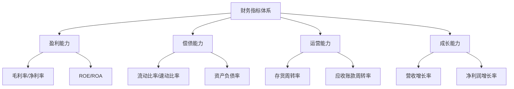
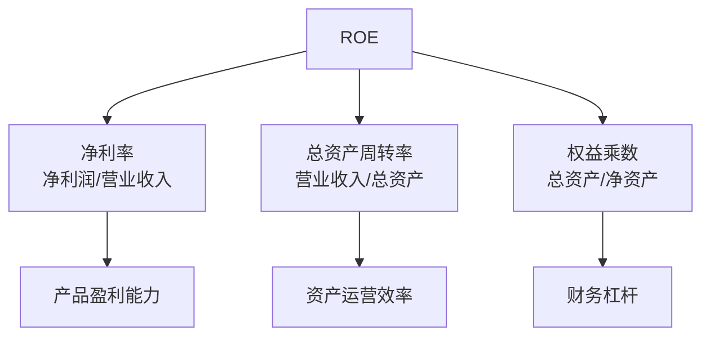

## 一、财务指标体系

财务指标是财报分析的"体检指标"，分为四大类：

## 二、盈利能力指标

### 1. 毛利率

$$毛利率 = \frac{营业收入 - 营业成本}{营业收入} \times 100\%$$

毛利率反映产品的**初始盈利能力**和**定价权**：

- 毛利率高 → 产品有差异化，竞争壁垒高
- 毛利率低 → 同质化竞争，靠规模和成本取胜
- 毛利率持续上升 → 竞争力增强
- 毛利率持续下降 → 竞争加剧或成本失控

### 2. 净利率

$$净利率 = \frac{净利润}{营业收入} \times 100\%$$

净利率反映**最终盈利能力**，是毛利率经过费用、税金层层扣减后的结果。

**毛利率 vs 净利率的差距**反映费用控制能力：

| 毛利率 | 净利率 | 差距 | 说明 |
|-------|-------|------|------|
| 60% | 30% | 30% | 正常，费用合理 |
| 60% | 10% | 50% | 费用过高，侵蚀利润 |
| 20% | 15% | 5% | 费用控制极好（如沃尔玛） |

### 3. ROE——净资产收益率

$$ROE = \frac{净利润}{平均净资产} \times 100\%$$

ROE是衡量**股东投入资本的回报率**，巴菲特最看重的指标：

| ROE水平 | 评价 |
|---------|------|
| > 20% | 优秀 |
| 15%-20% | 良好 |
| 10%-15% | 一般 |
| < 10% | 较差 |

### 4. ROA——总资产收益率

$$ROA = \frac{净利润}{平均总资产} \times 100\%$$

ROA衡量**全部资产的盈利效率**，不受资本结构影响。

## 三、杜邦分析法

杜邦分析法将ROE拆解为三个驱动因素，揭示盈利的来源：

$$ROE = 净利率 \times 总资产周转率 \times 权益乘数$$

### 三种盈利模式

| 模式 | 特征 | 典型行业 | 代表 |
|------|------|---------|------|
| 高净利率驱动 | 产品暴利，周转慢 | 白酒、奢侈品 | 茅台 |
| 高周转率驱动 | 薄利多销，周转快 | 零售、快消 | 沃尔玛 |
| 高杠杆驱动 | 借钱生钱 | 金融、地产 | 银行 |

> **唐朝提醒**：同样是高ROE，来源不同，质量天差地别。高净利率驱动的ROE最可持续，高杠杆驱动的ROE风险最大。杜邦分析帮你分清ROE的"成色"。

### 杜邦分析实战

以某公司为例：

| 年份 | ROE | 净利率 | 周转率 | 权益乘数 |
|------|-----|-------|--------|---------|
| 2023 | 25% | 20% | 0.8 | 1.56 |
| 2024 | 25% | 15% | 0.8 | 2.08 |
| 2025 | 25% | 12% | 0.7 | 2.98 |

ROE三年都是25%，但来源完全不同：
- 2023年：靠产品盈利能力（高净利率）
- 2024年：净利率下降，靠加杠杆维持
- 2025年：净利率和周转率双降，完全靠杠杆撑着

**同样的ROE，质量在恶化！**

## 四、偿债能力指标

### 1. 短期偿债能力

| 指标 | 公式 | 健康值 |
|------|------|-------|
| 流动比率 | 流动资产 / 流动负债 | > 2 |
| 速动比率 | (流动资产 - 存货) / 流动负债 | > 1 |
| 现金比率 | 货币资金 / 流动负债 | > 0.2 |

**注意**：流动比率过高也不一定是好事——可能意味着资金闲置或存货积压。

### 2. 长期偿债能力

| 指标 | 公式 | 健康值 |
|------|------|-------|
| 资产负债率 | 总负债 / 总资产 | < 60% |
| 产权比率 | 总负债 / 净资产 | < 1.5 |
| 利息保障倍数 | EBIT / 利息费用 | > 3 |

### 3. 偿债能力分析要点

- 关注**有息负债**而非总负债（预收账款是好负债）
- 结合行业特征判断（金融业资产负债率天然高）
- 关注**隐性负债**（担保、承诺、经营租赁）

## 五、运营能力指标

运营能力衡量公司资产的使用效率：

| 指标 | 公式 | 含义 |
|------|------|------|
| 存货周转率 | 营业成本 / 平均存货 | 存货变现速度 |
| 应收账款周转率 | 营业收入 / 平均应收账款 | 回款速度 |
| 总资产周转率 | 营业收入 / 平均总资产 | 资产利用效率 |
| 固定资产周转率 | 营业收入 / 平均固定资产 | 固定资产利用效率 |

### 周转天数

$$存货周转天数 = \frac{365}{存货周转率}$$

$$应收账款周转天数 = \frac{365}{应收账款周转率}$$

$$应付账款周转天数 = \frac{365}{应付账款周转率}$$

$$现金循环周期 = 存货周转天数 + 应收周转天数 - 应付周转天数$$

| 现金循环周期 | 含义 |
|-------------|------|
| 短（< 30天） | 资金效率高，运营能力强 |
| 长（> 90天） | 资金被大量占用，运营效率低 |
| 为负 | 先收钱后付款，极度强势（如茅台） |

## 六、成长能力指标

| 指标 | 公式 | 关注点 |
|------|------|-------|
| 营收增长率 | (本期营收 - 上期营收) / 上期营收 | 增长的来源和持续性 |
| 净利润增长率 | (本期净利 - 上期净利) / 上期净利 | 是否与营收同步增长 |
| 经营现金流增长率 | (本期经营现金流 - 上期) / 上期 | 增长是否有现金支撑 |

### 成长的质量

| 高质量增长 | 低质量增长 |
|-----------|-----------|
| 营收和利润同步增长 | 营收增长但利润不增 |
| 经营现金流同步增长 | 利润增长但现金流不增 |
| 毛利率稳定或上升 | 靠降价冲量，毛利率下降 |
| 靠内生动力 | 靠并购并表 |

> **唐朝心法**：指标不是越多越好，抓住核心的几个指标深入分析，比面面俱到但浅尝辄止更有价值。ROE是核心，杜邦分析是工具，三张表交叉验证是方法。
