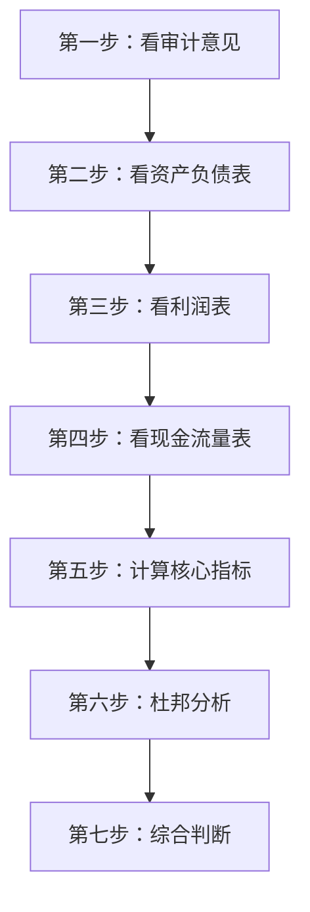
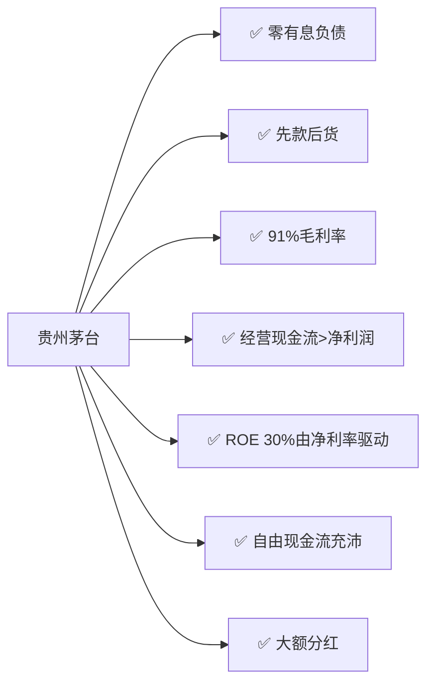

## 一、实战分析方法论

读财报不是从第一页看到最后一页，而是有明确的"路线图"：

### 读财报的顺序

1. **审计意见** → 非标直接排除
2. **资产负债表** → 看家底（资产质量、负债结构）
3. **利润表** → 看赚钱能力（毛利率、净利率、费用率）
4. **现金流量表** → 验证利润（经营现金流、自由现金流）
5. **财务指标** → 量化分析（ROE、周转率、偿债能力）
6. **杜邦分析** → 拆解ROE来源
7. **综合判断** → 排除还是深入研究

## 二、实战案例：贵州茅台

> 以下数据基于茅台年报公开信息整理，仅作教学示例。

### 第一步：审计意见

- 审计机构：立信会计师事务所
- 审计意见：**标准无保留意见** ✅
- 关键审计事项：收入确认、存货估值

**结论**：财报可信，继续分析。

### 第二步：资产负债表

**资产端核心数据**：

| 科目 | 金额（亿元） | 占总资产比 | 分析 |
|------|------------|-----------|------|
| 货币资金 | ~600 | ~30% | 充裕，无存贷双高问题 |
| 应收账款 | ~0 | ~0% | 先款后货，回款极好 |
| 存货 | ~350 | ~18% | 主要是基酒，越存越值钱 |
| 固定资产 | ~100 | ~5% | 轻资产模式 |
| 长期股权投资 | ~0 | ~0% | 专注主业 |

**负债端核心数据**：

| 科目 | 金额（亿元） | 分析 |
|------|------------|------|
| 短期借款 | ~0 | 无有息负债 |
| 应付账款 | ~30 | 对上游有一定话语权 |
| 预收/合同负债 | ~120 | 先收钱后发货，强势 |
| 长期借款 | ~0 | 无长期借款 |

**关键发现**：

1. **零有息负债** → 不需要借钱，自身造血能力极强
2. **应收账款几乎为零** → 先款后货，对下游绝对强势
3. **合同负债大** → 经销商预付款，未来收入有保障
4. **存货特殊** → 白酒存货（基酒）不会贬值，反而增值

### 第三步：利润表

| 指标 | 数据 | 分析 |
|------|------|------|
| 营业收入 | ~1200亿 | 持续增长 |
| 毛利率 | ~91% | 极高，产品定价权极强 |
| 净利率 | ~50% | 费用控制优秀 |
| 期间费用率 | ~15% | 其中销售费用率约3%，品牌力强 |
| 营业利润占比 | > 95% | 利润几乎全部来自主业 |

**关键发现**：

1. **91%的毛利率** → 远超同行，护城河极深
2. **50%的净利率** → 每赚2块钱就有1块钱是净利润
3. **销售费用率极低** → 不需要大量营销，品牌自带流量
4. **利润几乎全来自营业利润** → 利润质量极高

### 第四步：现金流量表

| 指标 | 数据 | 分析 |
|------|------|------|
| 经营现金流 | ~600亿 | 远超净利润 |
| 投资现金流 | -~50亿 | 适度扩产 |
| 筹资现金流 | -~300亿 | 主要是分红 |
| 自由现金流 | ~550亿 | 极其充沛 |

**关键发现**：

1. **经营现金流 > 净利润** → 利润含金量100%+
2. **投资支出小** → 不需要大量资本开支维持经营
3. **大额分红** → 赚的钱真金白银分给股东
4. **自由现金流充沛** → 股东真正可支配的现金极多

### 第五步：核心财务指标

| 指标 | 茅台 | 行业平均 | 评价 |
|------|------|---------|------|
| ROE | ~30% | ~15% | 远超行业 |
| 毛利率 | ~91% | ~60% | 极高 |
| 净利率 | ~50% | ~20% | 极高 |
| 资产负债率 | ~25% | ~40% | 低负债 |
| 存货周转率 | ~0.3次 | ~0.8次 | 周转慢但存货增值 |
| 经营现金流/净利润 | ~1.2 | ~0.8 | 利润含金量极高 |

### 第六步：杜邦分析

$$ROE = 净利率 \times 周转率 \times 权益乘数$$

$$30\% = 50\% \times 0.5 \times 1.2$$

茅台的ROE主要由**超高的净利率**驱动——这是最可持续的ROE来源。

| 驱动因素 | 贡献 | 可持续性 |
|---------|------|---------|
| 净利率（50%） | 主要驱动力 | 品牌护城河支撑，可持续 |
| 周转率（0.5） | 拖累项 | 白酒生产周期长，行业特性 |
| 杠杆（1.2） | 贡献小 | 低杠杆，安全边际高 |

### 第七步：综合判断

**茅台的财务画像**：

**结论**：茅台是典型的"高净利率驱动"型公司，财务表现几乎无可挑剔——产品有极强的定价权，经营不需要外部融资，赚的钱是真金白银，且愿意与股东分享。

## 三、排雷清单

读财报时，以下"红旗"出现任何一个都要高度警惕：

| 红旗 | 含义 |
|------|------|
| 非标审计意见 | 财报不可信 |
| 存贷双高 | 可能虚构存款 |
| 应收账款增速远超营收 | 利润含金量下降 |
| 经营现金流长期为负 | 失血经营 |
| 商誉占净资产>30% | 减值风险大 |
| 频繁变更会计政策 | 调节利润 |
| 关联交易占比过高 | 利益输送风险 |
| 大额其他应收款 | 可能资金占用 |
| 预付账款长期挂账 | 可能虚构交易 |
| 利润与现金流长期背离 | 利润不可信 |

## 四、读财报的终极心法

> **唐朝总结的三条铁律**：
>
> 1. **财报是用来排除企业的**——先排除有问题的，剩下的自然可选
> 2. **利润是意见，现金流是事实**——永远用现金流验证利润
> 3. **看趋势比看绝对值重要**——三年数据才能看出方向

读财报不需要精通所有细节，但必须掌握核心框架：

- **审计意见**决定是否继续
- **三张表**交叉验证
- **ROE**是核心指标
- **杜邦分析**揭示ROE来源
- **现金流**是最终检验

掌握了这些，你已经比90%的投资者更懂财报了。
